# Edge Resolution and Temporal Invalidation

<cite>
**Referenced Files in This Document**
- [invalidate_edges.py](file://graphiti_core/prompts/invalidate_edges.py)
- [temporal_operations.py](file://graphiti_core/utils/maintenance/temporal_operations.py)
- [edge_operations.py](file://graphiti_core/utils/maintenance/edge_operations.py)
- [graphiti.py](file://graphiti_core/graphiti.py)
- [edges.py](file://graphiti_core/edges.py)
- [podcast_runner.py](file://examples/podcast/podcast_runner.py)
- [ecommerce/runner.py](file://examples/ecommerce/runner.py)
- [search_config_recipes.py](file://graphiti_core/search/search_config_recipes.py)
- [search_filters.py](file://graphiti_core/search/search_filters.py)
- [graph_data_operations.py](file://graphiti_core/utils/maintenance/graph_data_operations.py)
</cite>

## Table of Contents
1. [Introduction](#introduction)
2. [Temporal Edge Model Architecture](#temporal-edge-model-architecture)
3. [Edge Resolution Workflow](#edge-resolution-workflow)
4. [Temporal Invalidation Process](#temporal-invalidation-process)
5. [Dynamic Domain Examples](#dynamic-domain-examples)
6. [Performance Considerations](#performance-considerations)
7. [Consistency Guarantees](#consistency-guarantees)
8. [Implementation Details](#implementation-details)
9. [Troubleshooting Guide](#troubleshooting-guide)
10. [Conclusion](#conclusion)

## Introduction

Graphiti implements a sophisticated bi-temporal model for managing relationships in knowledge graphs, where edges possess temporal validity through `valid_at` and `invalid_at` timestamps. This system enables the detection and resolution of conflicting facts through LLM-guided temporal invalidation, maintaining consistency in dynamic domains such as e-commerce pricing and podcast guest relationships.

The edge resolution and temporal invalidation system operates on the principle that relationships evolve over time and may become outdated or contradictory as new information emerges. By leveraging temporal timestamps and machine learning, Graphiti can automatically identify and expire outdated relationships while preserving historical context.

## Temporal Edge Model Architecture

### Bi-Temporal Edge Structure

Graphiti's temporal edge model extends traditional graph relationships with four key temporal dimensions:


**Diagram sources**
- [edges.py](file://graphiti_core/edges.py#L221-L241)
- [temporal_operations.py](file://graphiti_core/utils/maintenance/temporal_operations.py#L33-L108)
- [edge_operations.py](file://graphiti_core/utils/maintenance/edge_operations.py#L240-L402)

### Temporal Timestamp Semantics

Each edge maintains four distinct temporal markers:

| Timestamp | Purpose | Null Behavior |
|-----------|---------|---------------|
| `valid_at` | When edge becomes true/valid | Indicates unknown validity start |
| `invalid_at` | When edge becomes false/invalid | Indicates ongoing validity |
| `expired_at` | When edge is marked as expired | Indicates manual expiration |
| `created_at` | When edge was created | Standard timestamp |

**Section sources**
- [edges.py](file://graphiti_core/edges.py#L229-L237)

## Edge Resolution Workflow

### The _extract_and_resolve_edges Method

The core edge resolution process begins in the `_extract_and_resolve_edges` method, which orchestrates the extraction and validation of newly discovered relationships:


**Diagram sources**
- [graphiti.py](file://graphiti_core/graphiti.py#L377-L410)
- [edge_operations.py](file://graphiti_core/utils/maintenance/edge_operations.py#L240-L402)

### Edge Extraction and Validation

The edge extraction process involves multiple stages of validation and conflict detection:

1. **Fact Extraction**: LLM identifies relationships from episode content
2. **Pointer Resolution**: Maps extracted entities to existing graph nodes
3. **Duplicate Detection**: Identifies exact matches among extracted edges
4. **Conflict Analysis**: Compares new edges against existing relationships
5. **Temporal Validation**: Ensures temporal consistency

**Section sources**
- [edge_operations.py](file://graphiti_core/utils/maintenance/edge_operations.py#L89-L238)

## Temporal Invalidation Process

### LLM-Guided Conflict Resolution

The temporal invalidation system uses specialized prompts to identify contradictory relationships:


**Diagram sources**
- [invalidate_edges.py](file://graphiti_core/prompts/invalidate_edges.py#L41-L98)
- [temporal_operations.py](file://graphiti_core/utils/maintenance/temporal_operations.py#L74-L108)

### Conflict Detection Algorithm

The conflict detection algorithm evaluates temporal overlap between edges:

```python
# Pseudocode for conflict detection logic
def resolve_edge_contradictions(resolved_edge, invalidation_candidates):
    invalidated_edges = []
    for edge in invalidation_candidates:
        # Check temporal overlap conditions
        if ((edge.invalid_at <= resolved_edge.valid_at) or 
            (edge.valid_at <= resolved_edge.invalid_at)):
            continue  # No conflict
        # Mark edge as expired
        edge.invalid_at = resolved_edge.valid_at
        edge.expired_at = utc_now()
        invalidated_edges.append(edge)
    return invalidated_edges
```

**Section sources**
- [edge_operations.py](file://graphiti_core/utils/maintenance/edge_operations.py#L406-L441)

## Dynamic Domain Examples

### E-commerce Pricing Relationships

In e-commerce scenarios, pricing relationships frequently change due to promotions, discounts, or inventory adjustments:

```mermaid
sequenceDiagram
participant Customer as "Customer Inquiry"
participant System as "Graphiti System"
participant Product as "Product Node"
participant Price as "PRICE_FOR Edge"
Customer->>System : "What's the price of this product?"
System->>Price : Query current price (valid_at ≤ now)
Price-->>System : "$99.99 (valid_at : 2024-07-01)"
System-->>Customer : "$99.99"
Note over System : New pricing information arrives
System->>Price : Create new PRICE_FOR edge
Price->>Price : Check for conflicts
Price->>System : Mark old edge as expired
Price->>System : Store new edge
System-->>Customer : "$89.99 (updated pricing)"
```



**Diagram sources**
- [ecommerce/runner.py](file://examples/ecommerce/runner.py#L60-L72)

### Podcast Guest Relationships

Podcast guest relationships demonstrate temporal evolution in media content:


**Diagram sources**
- [podcast_runner.py](file://examples/podcast/podcast_runner.py#L60-L74)

**Section sources**
- [podcast_runner.py](file://examples/podcast/podcast_runner.py#L1-L130)
- [ecommerce/runner.py](file://examples/ecommerce/runner.py#L1-L124)

## Performance Considerations

### Search Optimization Strategies

Graphiti employs multiple search strategies to efficiently locate temporal relationships:

| Search Method | Use Case | Performance |
|---------------|----------|-------------|
| BM25 | Text-based similarity | Good for fact matching |
| Cosine Similarity | Vector embeddings | Excellent for semantic similarity |
| RRF (Reciprocal Rank Fusion) | Hybrid ranking | Balanced precision/recall |
| MMR (Maximal Marginal Relevance) | Diverse results | Prevents redundancy |

**Section sources**
- [search_config_recipes.py](file://graphiti_core/search/search_config_recipes.py#L110-L153)

### Temporal Filtering Efficiency

The search filters system optimizes temporal queries through sophisticated Cypher generation:


**Diagram sources**
- [search_filters.py](file://graphiti_core/search/search_filters.py#L100-L252)

### Memory Management

The system implements several memory optimization strategies:

- **Batch Processing**: Edges processed in batches to prevent memory overflow
- **Lazy Loading**: Temporal data loaded on-demand
- **Connection Pooling**: Efficient database connections
- **Garbage Collection**: Automatic cleanup of temporary objects

**Section sources**
- [graph_data_operations.py](file://graphiti_core/utils/maintenance/graph_data_operations.py#L1-L163)

## Consistency Guarantees

### ACID Compliance

Graphiti ensures transactional consistency through:

1. **Atomicity**: Edge operations occur as atomic units
2. **Consistency**: Temporal constraints maintained throughout operations
3. **Isolation**: Concurrent operations handled safely
4. **Durability**: Temporal state persisted reliably

### Temporal Consistency

The system maintains temporal consistency through:

- **Timestamp Validation**: All temporal operations validated
- **Conflict Resolution**: Automated conflict detection and resolution
- **Historical Preservation**: Expired edges preserved for audit trails
- **Query Isolation**: Queries return consistent snapshots in time

**Section sources**
- [edges.py](file://graphiti_core/edges.py#L221-L241)

## Implementation Details

### Edge Invalidation Workflow

The edge invalidation process follows a multi-stage workflow:


**Diagram sources**
- [edge_operations.py](file://graphiti_core/utils/maintenance/edge_operations.py#L444-L648)

### Database Schema Considerations

The temporal edge model requires specific database schema optimizations:

- **Range Indices**: Optimized for temporal queries
- **Composite Indexes**: Multi-column indexes for edge lookups
- **Full-text Indices**: For fact-based searches
- **Temporal Constraints**: Enforced through triggers or application logic

**Section sources**
- [graph_data_operations.py](file://graphiti_core/utils/maintenance/graph_data_operations.py#L36-L73)

## Troubleshooting Guide

### Common Issues and Solutions

#### Temporal Inconsistency Errors

**Problem**: Edges with conflicting temporal ranges
**Solution**: Review edge creation logic and ensure proper temporal validation

#### Performance Degradation

**Problem**: Slow temporal queries
**Solution**: Verify index configuration and optimize search filters

#### Memory Leaks

**Problem**: Increasing memory usage during edge processing
**Solution**: Implement proper resource cleanup and batch processing

### Debugging Tools

The system provides several debugging capabilities:

- **Tracing**: Distributed tracing for performance analysis
- **Logging**: Comprehensive logging of temporal operations
- **Metrics**: Performance metrics collection
- **Audit Trails**: Historical change tracking

**Section sources**
- [graphiti.py](file://graphiti_core/graphiti.py#L610-L812)

## Conclusion

Graphiti's edge resolution and temporal invalidation system provides a robust foundation for managing evolving relationships in knowledge graphs. Through its bi-temporal model, LLM-guided conflict resolution, and sophisticated search capabilities, it enables organizations to maintain accurate, up-to-date knowledge representations while preserving historical context.

The system's design emphasizes scalability, consistency, and performance, making it suitable for production environments with high-throughput requirements. Its modular architecture allows for easy customization and extension to meet specific domain requirements.

Key benefits include:
- **Automatic Conflict Resolution**: Reduces manual intervention in knowledge graph maintenance
- **Temporal Accuracy**: Maintains precise temporal relationships
- **Scalable Performance**: Optimized for large-scale deployments
- **Flexible Querying**: Sophisticated temporal filtering capabilities
- **Historical Preservation**: Complete audit trail of relationship changes

Future enhancements may include advanced temporal analytics, predictive conflict detection, and enhanced multi-modal relationship modeling.