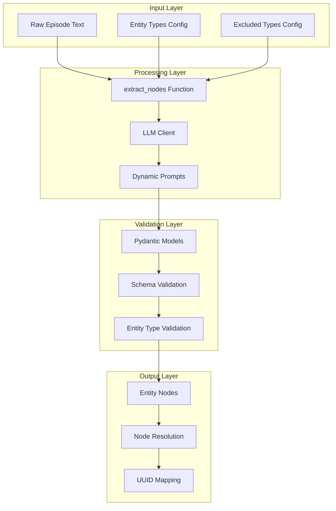
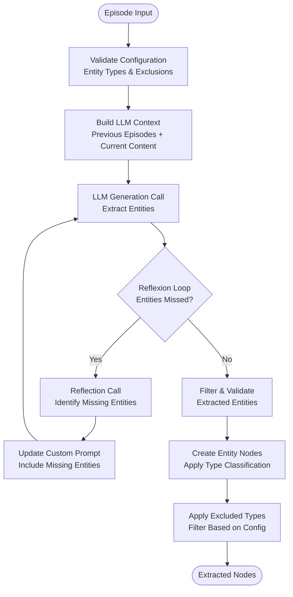
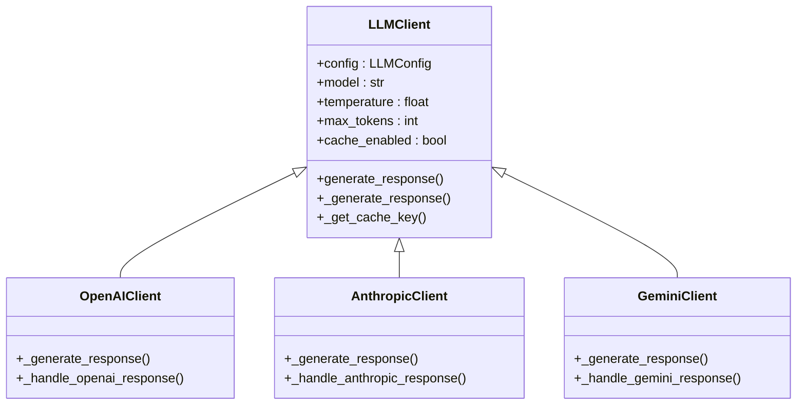
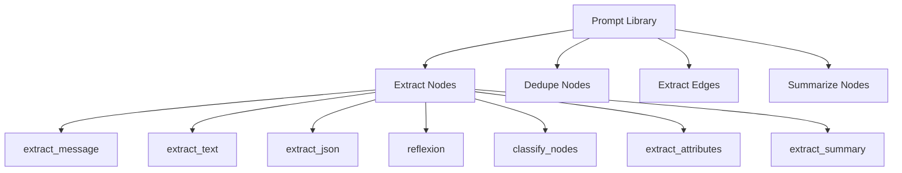

# Node Extraction

<cite>
**Referenced Files in This Document**
- [graphiti.py](file://graphiti_core/graphiti.py)
- [node_operations.py](file://graphiti_core/utils/maintenance/node_operations.py)
- [extract_nodes.py](file://graphiti_core/prompts/extract_nodes.py)
- [client.py](file://graphiti_core/llm_client/client.py)
- [helpers.py](file://graphiti_core/helpers.py)
- [nodes.py](file://graphiti_core/nodes.py)
- [lib.py](file://graphiti_core/prompts/lib.py)
- [bulk_utils.py](file://graphiti_core/utils/bulk_utils.py)
- [entity_types_utils.py](file://graphiti_core/utils/ontology_utils/entity_types_utils.py)
- [podcast_runner.py](file://examples/podcast/podcast_runner.py)
- [runner.py](file://examples/ecommerce/runner.py)
</cite>

## Table of Contents
1. [Introduction](#introduction)
2. [Architecture Overview](#architecture-overview)
3. [Core Components](#core-components)
4. [Node Extraction Process](#node-extraction-process)
5. [LLM Integration](#llm-integration)
6. [Dynamic Prompts System](#dynamic-prompts-system)
7. [Custom Entity Types](#custom-entity-types)
8. [Configuration Options](#configuration-options)
9. [Practical Examples](#practical-examples)
10. [Error Handling and Validation](#error-handling-and-validation)
11. [Performance Considerations](#performance-considerations)
12. [Troubleshooting Guide](#troubleshooting-guide)
13. [Conclusion](#conclusion)

## Introduction

The node extraction process in Graphiti is a sophisticated system that transforms raw episode text into structured knowledge graph entities using Large Language Models (LLMs). This process serves as the foundation for building intelligent knowledge graphs by identifying, classifying, and extracting entities from unstructured text data.

The system leverages Pydantic models for schema validation, dynamic prompts for entity recognition, and configurable entity type definitions to ensure accurate and meaningful entity extraction. Through a multi-stage process involving LLM interaction, reflection loops, and deduplication, Graphiti creates robust, semantically rich nodes that form the backbone of the knowledge graph infrastructure.

## Architecture Overview

The node extraction architecture follows a layered approach with clear separation of concerns:



**Diagram sources**
- [node_operations.py](file://graphiti_core/utils/maintenance/node_operations.py#L88-L208)
- [client.py](file://graphiti_core/llm_client/client.py#L149-L213)

## Core Components

### Graphiti Class Integration

The main `Graphiti` class orchestrates the node extraction process through the `add_episode` method, which internally calls the `extract_nodes` function. This integration ensures seamless workflow from episode ingestion to node creation.

**Section sources**
- [graphiti.py](file://graphiti_core/graphiti.py#L611-L800)

### Node Operations Module

The `node_operations` module contains the core `extract_nodes` function that handles the complete extraction pipeline. This function manages LLM interactions, response processing, and entity node creation.

**Section sources**
- [node_operations.py](file://graphiti_core/utils/maintenance/node_operations.py#L88-L208)

### Entity Node Model

The `EntityNode` class represents the fundamental data structure for extracted entities, extending the base `Node` class with specific attributes for knowledge graph representation.

**Section sources**
- [nodes.py](file://graphiti_core/nodes.py#L435-L508)

## Node Extraction Process

The node extraction process follows a systematic approach with multiple stages:



**Diagram sources**
- [node_operations.py](file://graphiti_core/utils/maintenance/node_operations.py#L88-L177)

### Stage 1: Configuration Validation

The process begins with validating entity types and excluded entity types to ensure configuration integrity. This stage prevents runtime errors and maintains data consistency.

### Stage 2: Context Building

The system constructs a comprehensive context for the LLM by combining:
- Current episode content
- Previous episode history
- Entity type definitions
- Custom prompt instructions

### Stage 3: LLM Generation

The LLM generates extracted entities using specialized prompts tailored to the episode type (message, text, or JSON). The response is validated against Pydantic models to ensure structured output.

### Stage 4: Reflexion Loop

To improve extraction quality, the system implements a reflexion loop that identifies and addresses missing entities through iterative LLM calls.

### Stage 5: Entity Creation

Validated entities are transformed into `EntityNode` instances with proper labeling and metadata.

**Section sources**
- [node_operations.py](file://graphiti_core/utils/maintenance/node_operations.py#L88-L177)

## LLM Integration

### LLM Client Architecture

The LLM integration utilizes a flexible client architecture that supports multiple providers while maintaining consistent interfaces:



**Diagram sources**
- [client.py](file://graphiti_core/llm_client/client.py#L66-L243)

### Response Generation Process

The LLM client handles response generation with built-in retry logic, caching, and error handling:

1. **Input Cleaning**: Removes invalid Unicode and control characters
2. **Cache Check**: Validates cache before making API calls
3. **Retry Logic**: Implements exponential backoff for transient failures
4. **Response Validation**: Ensures structured output using Pydantic models
5. **Caching**: Stores successful responses for future reuse

**Section sources**
- [client.py](file://graphiti_core/llm_client/client.py#L149-L213)

### Concurrency Management

The system implements semaphore-based concurrency control to manage LLM API calls efficiently:

**Section sources**
- [helpers.py](file://graphiti_core/helpers.py#L105-L116)

## Dynamic Prompts System

### Prompt Library Architecture

The dynamic prompts system provides specialized templates for different extraction scenarios:



**Diagram sources**
- [lib.py](file://graphiti_core/prompts/lib.py#L92-L102)

### Extract Nodes Prompts

The `extract_nodes` module provides seven specialized prompts:

| Prompt | Purpose | Input Type |
|--------|---------|------------|
| `extract_message` | Conversation-style entity extraction | Dialogue messages |
| `extract_text` | General text entity extraction | Plain text content |
| `extract_json` | Structured JSON entity extraction | JSON objects |
| `reflexion` | Identify missing entities | Current extraction + context |
| `classify_nodes` | Classify extracted entities | Entities + type definitions |
| `extract_attributes` | Extract entity attributes | Entity + context |
| `extract_summary` | Generate entity summaries | Entity + context |

**Section sources**
- [extract_nodes.py](file://graphiti_core/prompts/extract_nodes.py#L86-L319)

### Context Construction

Each prompt receives a carefully constructed context dictionary containing:
- Episode content and metadata
- Previous episode history
- Entity type definitions
- Custom instructions
- Source descriptions

## Custom Entity Types

### Entity Type Definition

Custom entity types enable domain-specific extraction by defining Pydantic models that describe entity attributes:

```python
class Person(BaseModel):
    """A human person, fictional or nonfictional."""
    first_name: str | None = Field(..., description='First name')
    last_name: str | None = Field(..., description='Last name')
    occupation: str | None = Field(..., description="The person's work occupation")

class City(BaseModel):
    """A city"""
    country: str | None = Field(..., description='The country the city is in')
```

### Type Validation

The system validates custom entity types to prevent conflicts with existing node fields:

**Section sources**
- [entity_types_utils.py](file://graphiti_core/utils/ontology_utils/entity_types_utils.py#L23-L37)

### Entity Classification

During extraction, entities are automatically classified based on their attributes and matched against custom type definitions. The classification process considers:

- Attribute presence and types
- Description matching
- Hierarchical relationships

## Configuration Options

### Entity Types Parameter

The `entity_types` parameter accepts a dictionary mapping entity type names to Pydantic model classes:

```python
entity_types = {
    'Person': Person,
    'Organization': Organization,
    'Location': Location,
    'Event': Event
}
```

### Excluded Entity Types

The `excluded_entity_types` parameter allows filtering out unwanted entity classifications:

```python
excluded_entity_types = ['Organization', 'Location']
```

### Configuration Validation

Both parameters undergo validation to ensure consistency and prevent runtime errors:

**Section sources**
- [helpers.py](file://graphiti_core/helpers.py#L145-L176)

## Practical Examples

### Podcast Scenario

The podcast example demonstrates conversation-based entity extraction:

```python
# Custom entity types for podcast domain
class Person(BaseModel):
    """A human person, fictional or nonfictional."""
    first_name: str | None = Field(..., description='First name')
    last_name: str | None = Field(..., description='Last name')
    occupation: str | None = Field(..., description="The person's work occupation")

class City(BaseModel):
    """A city"""
    country: str | None = Field(..., description='The country the city is in')

# Adding podcast episodes
await client.add_episode(
    name=f'Message {i}',
    episode_body=f'{message.speaker_name} ({message.role}): {message.content}',
    reference_time=message.actual_timestamp,
    source_description='Podcast Transcript',
    group_id=group_id,
    entity_types={'Person': Person, 'City': City},
    edge_types={'IS_PRESIDENT_OF': IsPresidentOf},
    edge_type_map={('Person', 'Entity'): ['IS_PRESIDENT_OF']},
)
```

**Section sources**
- [podcast_runner.py](file://examples/podcast/podcast_runner.py#L60-L126)

### E-commerce Scenario

The e-commerce example showcases product and conversation-based extraction:

```python
# Shoe conversation extraction
shoe_conversation = [
    "SalesBot: Hi, I'm Allbirds Assistant! How can I help you today?",
    "John: Hi, I'm looking for a new pair of shoes.",
    'SalesBot: Of course! What kind of material are you looking for?',
    "John: I'm looking for shoes made out of wool",
    # ... additional conversation
]

# Product data extraction from JSON
with open(json_file_path) as file:
    products = json.load(file)['products']

episodes = [
    RawEpisode(
        name=f'Product {i}',
        content=str(product),
        source_description='Allbirds products',
        source=EpisodeType.json,
        reference_time=datetime.now(timezone.utc),
    )
    for i, product in enumerate(products)
]
```

**Section sources**
- [runner.py](file://examples/ecommerce/runner.py#L60-L123)

## Error Handling and Validation

### Input Validation

The system implements comprehensive input validation at multiple levels:

1. **Group ID Validation**: Ensures ASCII alphanumeric characters
2. **Entity Type Validation**: Prevents field conflicts with node models
3. **Excluded Type Validation**: Verifies exclusion requests against available types
4. **LLM Response Validation**: Uses Pydantic models for structured output

### Error Recovery

The reflexion loop provides automatic error recovery by identifying and addressing missing entities:

**Section sources**
- [node_operations.py](file://graphiti_core/utils/maintenance/node_operations.py#L63-L85)

### Retry Mechanisms

The LLM client implements robust retry mechanisms with exponential backoff:

**Section sources**
- [client.py](file://graphiti_core/llm_client/client.py#L110-L132)

## Performance Considerations

### Concurrency Limits

The system implements semaphore-based concurrency control to manage resource usage:

**Section sources**
- [helpers.py](file://graphiti_core/helpers.py#L35-L36)

### Caching Strategy

LLM responses are cached to reduce API costs and improve performance:

**Section sources**
- [client.py](file://graphiti_core/llm_client/client.py#L144-L156)

### Batch Processing

The bulk processing capabilities enable efficient handling of multiple episodes:

**Section sources**
- [bulk_utils.py](file://graphiti_core/utils/bulk_utils.py#L256-L286)

### Memory Management

The system optimizes memory usage through:
- Lazy loading of embeddings
- Efficient UUID mapping
- Streaming processing for large datasets

## Troubleshooting Guide

### Common Issues

1. **Invalid Entity Types**: Ensure custom types don't conflict with node fields
2. **Missing Entities**: Adjust reflexion iterations or refine prompts
3. **Rate Limiting**: Implement proper retry logic and rate limiting
4. **Memory Issues**: Monitor batch sizes and use streaming for large datasets

### Debugging Strategies

1. Enable detailed logging for LLM interactions
2. Validate entity type definitions before processing
3. Test prompts with small datasets first
4. Monitor cache effectiveness and adjust TTL

### Performance Optimization

1. Tune semaphore limits based on API quotas
2. Optimize prompt length for cost and speed
3. Use appropriate batch sizes for memory constraints
4. Implement proper error handling and retry logic

## Conclusion

The node extraction process in Graphiti represents a sophisticated approach to knowledge graph construction, combining advanced LLM capabilities with robust validation and error handling. Through its modular architecture, dynamic prompts system, and flexible configuration options, the system enables accurate and scalable entity extraction across diverse domains.

The integration of custom entity types, comprehensive validation, and performance optimizations makes Graphiti suitable for production-scale knowledge graph applications. The reflexion loop mechanism ensures high-quality extraction results, while the caching and concurrency controls optimize resource utilization.

Future enhancements could include support for additional LLM providers, expanded prompt customization options, and advanced entity linking capabilities to further improve extraction accuracy and system performance.