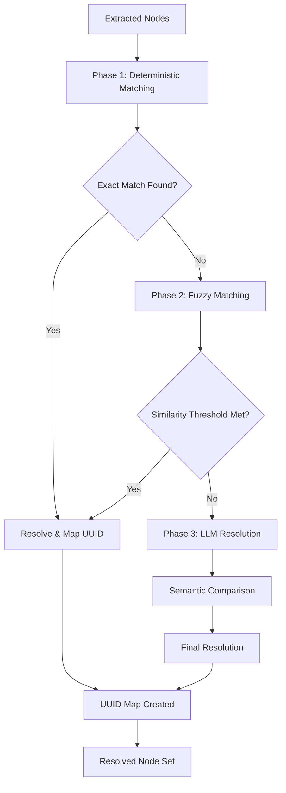
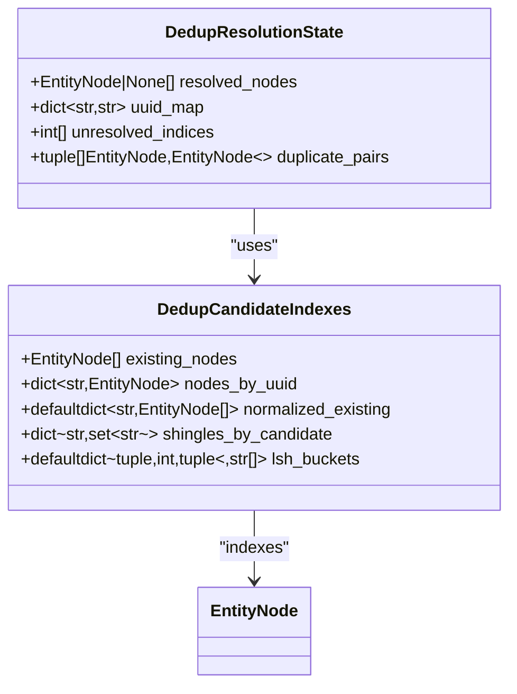
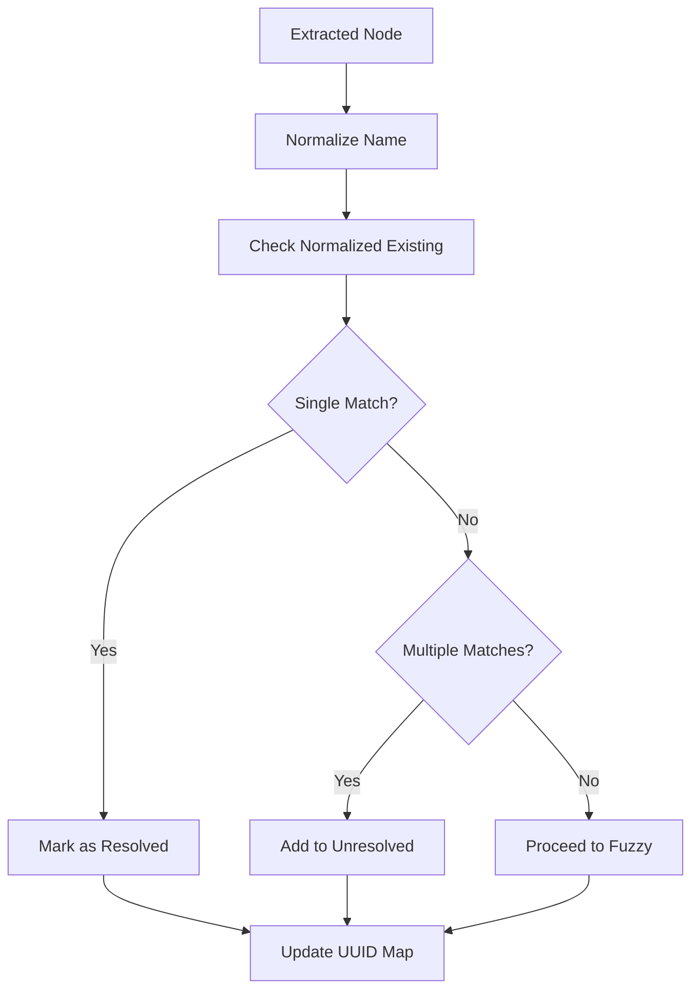
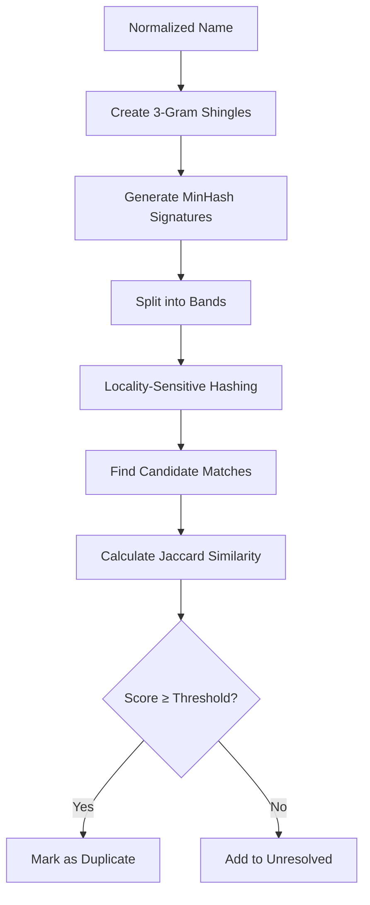
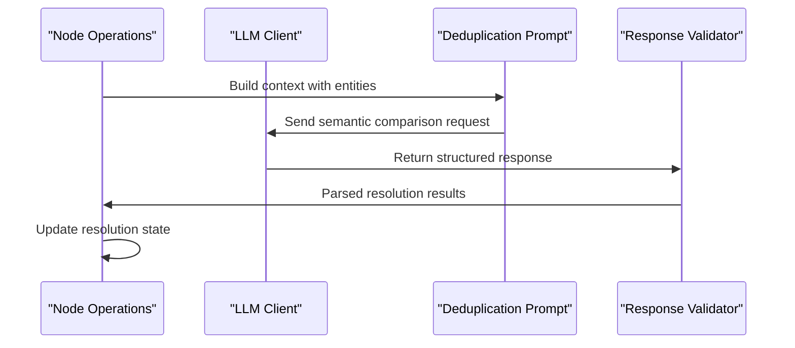
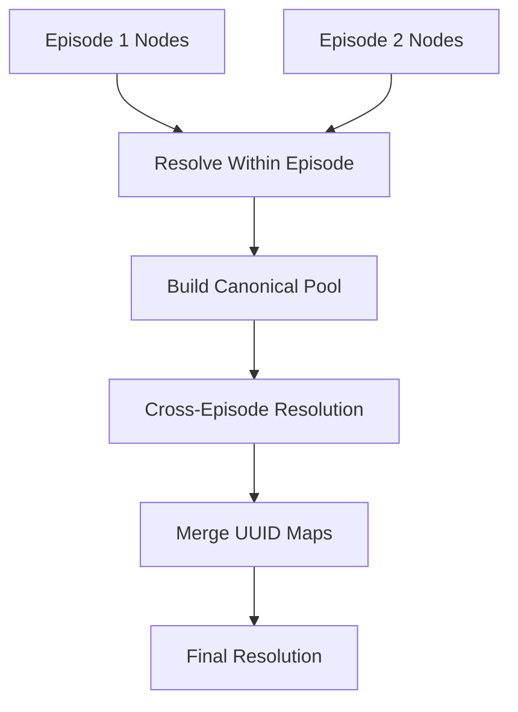
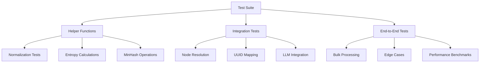

# Node Resolution and Deduplication

<cite>
**Referenced Files in This Document**
- [dedup_helpers.py](file://graphiti_core/utils/maintenance/dedup_helpers.py)
- [node_operations.py](file://graphiti_core/utils/maintenance/node_operations.py)
- [dedupe_nodes.py](file://graphiti_core/prompts/dedupe_nodes.py)
- [test_node_operations.py](file://tests/utils/maintenance/test_node_operations.py)
- [test_node_int.py](file://tests/test_node_int.py)
- [bulk_utils.py](file://graphiti_core/utils/bulk_utils.py)
- [nodes.py](file://graphiti_core/nodes.py)
- [search_config.py](file://graphiti_core/search/search_config.py)
- [text_utils.py](file://graphiti_core/utils/text_utils.py)
</cite>

## Table of Contents
1. [Introduction](#introduction)
2. [System Architecture](#system-architecture)
3. [Core Components](#core-components)
4. [Deterministic Matching Strategy](#deterministic-matching-strategy)
5. [Fuzzy Matching with MinHash](#fuzzy-matching-with-minhash)
6. [LLM-Based Resolution](#llm-based-resolution)
7. [UUID Mapping and Tracking](#uuid-mapping-and-tracking)
8. [Configuration and Sensitivity](#configuration-and-sensitivity)
9. [Performance Optimization](#performance-optimization)
10. [Testing and Validation](#testing-and-validation)
11. [Challenges and Solutions](#challenges-and-solutions)
12. [Best Practices](#best-practices)

## Introduction

Graphiti's node resolution and deduplication system prevents duplicate entities from being created in the graph by intelligently matching newly extracted nodes against existing ones. The system employs a multi-layered approach combining deterministic exact matching, fuzzy similarity detection using MinHash locality-sensitive hashing, and LLM-powered semantic resolution when necessary.

The core challenge addressed by this system is identifying when two nodes represent the same real-world entity despite potential variations in naming, formatting, or representation. This is crucial for maintaining graph integrity and preventing fragmentation of related information across multiple node instances.

## System Architecture

The node resolution system follows a three-phase approach that balances performance, accuracy, and determinism:



**Diagram sources**
- [node_operations.py](file://graphiti_core/utils/maintenance/node_operations.py#L394-L449)
- [dedup_helpers.py](file://graphiti_core/utils/maintenance/dedup_helpers.py#L198-L247)

**Section sources**
- [node_operations.py](file://graphiti_core/utils/maintenance/node_operations.py#L394-L449)

## Core Components

### Resolve Extracted Nodes Function

The [`resolve_extracted_nodes`](file://graphiti_core/utils/maintenance/node_operations.py#L394-L449) function serves as the primary orchestrator for the entire resolution process. It coordinates between deterministic matching, fuzzy similarity detection, and LLM-based resolution.

Key responsibilities include:
- Collecting candidate nodes from the graph
- Building precomputed indexes for efficient matching
- Managing the resolution state across phases
- Handling fallback scenarios when LLM resolution fails

### Deduplication Helper Functions

The [`dedup_helpers.py`](file://graphiti_core/utils/maintenance/dedup_helpers.py) module provides the core algorithms for fuzzy matching:

#### Data Structures



**Diagram sources**
- [dedup_helpers.py](file://graphiti_core/utils/maintenance/dedup_helpers.py#L149-L168)

**Section sources**
- [dedup_helpers.py](file://graphiti_core/utils/maintenance/dedup_helpers.py#L149-L168)

## Deterministic Matching Strategy

### Exact Name Matching

The system begins with exact string matching as the fastest and most reliable method:



**Diagram sources**
- [dedup_helpers.py](file://graphiti_core/utils/maintenance/dedup_helpers.py#L204-L222)

The normalization process ensures consistent comparison by:
- Converting to lowercase
- Collapsing whitespace sequences
- Stripping leading/trailing spaces

**Section sources**
- [dedup_helpers.py](file://graphiti_core/utils/maintenance/dedup_helpers.py#L39-L42)

### Entropy-Based Filtering

To avoid false positives with low-quality names, the system applies entropy filtering:

| Parameter | Value | Purpose |
|-----------|-------|---------|
| `_NAME_ENTROPY_THRESHOLD` | 1.5 | Minimum entropy for fuzzy matching |
| `_MIN_NAME_LENGTH` | 6 | Minimum character length |
| `_MIN_TOKEN_COUNT` | 2 | Minimum word count |

High entropy indicates a more distinctive name that is less likely to produce false matches, while low entropy suggests a generic term that should be handled by the LLM.

**Section sources**
- [dedup_helpers.py](file://graphiti_core/utils/maintenance/dedup_helpers.py#L52-L85)

## Fuzzy Matching with MinHash

### MinHash Algorithm Implementation

For names that pass entropy filtering, the system employs MinHash locality-sensitive hashing for efficient approximate string matching:



**Diagram sources**
- [dedup_helpers.py](file://graphiti_core/utils/maintenance/dedup_helpers.py#L88-L141)

### Configuration Parameters

| Parameter | Value | Impact |
|-----------|-------|--------|
| `_MINHASH_PERMUTATIONS` | 32 | Higher values increase accuracy but memory usage |
| `_MINHASH_BAND_SIZE` | 4 | Band width affects recall vs precision |
| `_FUZZY_JACCARD_THRESHOLD` | 0.9 | Minimum similarity for automatic resolution |

### Shingle Generation and Hashing

The MinHash process involves several steps:

1. **Shingle Creation**: Generate 3-gram character sequences from normalized names
2. **Hash Computation**: Apply Blake2b hashing with seeded permutations
3. **Signature Generation**: Compute minimum hash values across permutations
4. **Band Division**: Split signatures into fixed-width bands
5. **Candidate Selection**: Retrieve nodes sharing the same band hashes

**Section sources**
- [dedup_helpers.py](file://graphiti_core/utils/maintenance/dedup_helpers.py#L88-L141)

## LLM-Based Resolution

### Semantic Comparison Process

When deterministic and fuzzy methods fail to resolve conflicts, the system escalates to LLM-powered semantic comparison:



**Diagram sources**
- [node_operations.py](file://graphiti_core/utils/maintenance/node_operations.py#L246-L391)
- [dedupe_nodes.py](file://graphiti_core/prompts/dedupe_nodes.py#L117-L185)

### Prompt Engineering

The LLM prompt includes comprehensive context to enable accurate resolution:

- **Previous Messages**: Historical conversation context
- **Current Message**: The episode containing the extracted entities
- **Extracted Entities**: New entities with their attributes
- **Existing Entities**: Known entities with their complete profiles

### Response Validation

The system implements robust validation to handle LLM errors gracefully:

- **ID Range Validation**: Ensures resolution IDs fall within expected bounds
- **Duplicate Detection**: Prevents processing the same resolution twice
- **Fallback Mechanisms**: Defaults to preserving the extracted node when LLM fails

**Section sources**
- [node_operations.py](file://graphiti_core/utils/maintenance/node_operations.py#L246-L391)
- [dedupe_nodes.py](file://graphiti_core/prompts/dedupe_nodes.py#L117-L185)

## UUID Mapping and Tracking

### Resolution State Management

The [`DedupResolutionState`](file://graphiti_core/utils/maintenance/dedup_helpers.py#L161-L168) maintains critical tracking information:

```python
# Key components of the resolution state
state = DedupResolutionState(
    resolved_nodes=[None] * len(extracted_nodes),  # Final resolved nodes
    uuid_map={},                                   # Original → Canonical UUID mapping
    unresolved_indices=[],                         # Indices requiring LLM resolution
    duplicate_pairs=[]                             # Conflicting node pairs
)
```

### Bulk Processing Support

For batch operations, the system maintains episode-level UUID maps:



**Diagram sources**
- [bulk_utils.py](file://graphiti_core/utils/bulk_utils.py#L318-L378)

**Section sources**
- [dedup_helpers.py](file://graphiti_core/utils/maintenance/dedup_helpers.py#L161-L168)
- [bulk_utils.py](file://graphiti_core/utils/bulk_utils.py#L318-L378)

## Configuration and Sensitivity

### Tunable Parameters

The system provides several configuration points for balancing accuracy and performance:

| Parameter | Default | Range | Impact |
|-----------|---------|-------|--------|
| `_NAME_ENTROPY_THRESHOLD` | 1.5 | 0.5-3.0 | Lower values increase false positives |
| `_FUZZY_JACCARD_THRESHOLD` | 0.9 | 0.7-0.95 | Higher values reduce false positives |
| `_MIN_NAME_LENGTH` | 6 | 3-10 | Shorter names may require LLM |
| `_MIN_TOKEN_COUNT` | 2 | 1-4 | Fewer tokens may trigger LLM fallback |

### Performance Trade-offs

Different configuration choices affect system behavior:

- **Higher Entropy Threshold**: Reduces LLM calls but may miss legitimate matches
- **Lower Jaccard Threshold**: Increases recall but may introduce false positives
- **More MinHash Permutations**: Better accuracy but higher computational cost

**Section sources**
- [dedup_helpers.py](file://graphiti_core/utils/maintenance/dedup_helpers.py#L31-L36)

## Performance Optimization

### Precomputation Strategies

The system optimizes performance through strategic precomputation:

1. **Cached Shingles**: LRU-cached n-gram sets prevent redundant computation
2. **Indexed Structures**: Pre-built lookup tables accelerate matching
3. **Batch Processing**: Parallel candidate collection reduces latency

### Memory Management

Efficient memory usage is achieved through:

- **Lazy Evaluation**: Shingle computation occurs only when needed
- **Weak References**: Prevent memory leaks in long-running processes
- **Streaming Processing**: Large datasets processed in chunks

**Section sources**
- [dedup_helpers.py](file://graphiti_core/utils/maintenance/dedup_helpers.py#L143-L147)

## Testing and Validation

### Unit Test Coverage

The system includes comprehensive testing across all components:



**Diagram sources**
- [test_node_operations.py](file://tests/utils/maintenance/test_node_operations.py#L1-L200)
- [test_node_int.py](file://tests/test_node_int.py#L1-L230)

### Test Scenarios

Key test categories include:

- **Exact Match Scenarios**: Verify deterministic resolution works correctly
- **Fuzzy Match Scenarios**: Test MinHash accuracy with various name variations
- **LLM Resolution Scenarios**: Validate semantic comparison capabilities
- **Edge Case Handling**: Test behavior with empty inputs, malformed data, etc.
- **Performance Scenarios**: Measure scalability with large datasets

**Section sources**
- [test_node_operations.py](file://tests/utils/maintenance/test_node_operations.py#L66-L134)

## Challenges and Solutions

### Fuzzy Matching Limitations

**Challenge**: Some legitimate entities may have similar names (e.g., "John Smith" vs "Jonathan Smith")

**Solution**: 
- Combine fuzzy matching with semantic context from conversations
- Use entity type information to constrain matches
- Implement confidence scoring for ambiguous cases

### LLM Reliability Issues

**Challenge**: LLM responses may be inconsistent or incorrect

**Solution**:
- Implement response validation and error handling
- Provide fallback mechanisms for failed resolutions
- Log problematic cases for manual review

### Scalability Concerns

**Challenge**: Performance degradation with large graphs

**Solution**:
- Use indexed structures for fast candidate retrieval
- Implement pagination for large result sets
- Cache frequently accessed data structures

### Ambiguity Resolution

**Challenge**: Multiple plausible matches for a given entity

**Solution**:
- Rank candidates by similarity scores
- Use temporal context to favor recent matches
- Implement voting mechanisms for consensus decisions

## Best Practices

### Configuration Guidelines

1. **Start Conservative**: Begin with lower thresholds and adjust based on results
2. **Monitor Performance**: Track resolution rates and LLM call frequency
3. **Context-Aware Tuning**: Adjust parameters based on domain characteristics
4. **Gradual Rollout**: Test changes incrementally in production

### Implementation Recommendations

1. **Index Optimization**: Ensure proper indexing on node names and attributes
2. **Caching Strategy**: Implement appropriate caching for frequently accessed data
3. **Error Handling**: Design robust fallback mechanisms for all failure modes
4. **Monitoring**: Track resolution metrics and system performance

### Maintenance Procedures

1. **Regular Review**: Periodically audit resolved duplicates and false positives
2. **Model Updates**: Keep LLM models current with domain-specific training
3. **Parameter Tuning**: Adjust thresholds based on evolving data characteristics
4. **Documentation**: Maintain clear documentation of resolution logic and configurations

The node resolution and deduplication system in Graphiti provides a sophisticated, multi-layered approach to entity resolution that balances accuracy, performance, and reliability. By combining deterministic matching, fuzzy similarity detection, and semantic comparison, it effectively prevents duplicate entities while maintaining the flexibility needed for diverse use cases.