# Data Retrieval

<cite>
**Referenced Files in This Document**
- [search.py](file://graphiti_core/search/search.py)
- [search_config.py](file://graphiti_core/search/search_config.py)
- [search_config_recipes.py](file://graphiti_core/search/search_config_recipes.py)
- [search_filters.py](file://graphiti_core/search/search_filters.py)
- [search_helpers.py](file://graphiti_core/search/search_helpers.py)
- [search_utils.py](file://graphiti_core/search/search_utils.py)
- [client.py](file://graphiti_core/cross_encoder/client.py)
- [bge_reranker_client.py](file://graphiti_core/cross_encoder/bge_reranker_client.py)
- [gemini_reranker_client.py](file://graphiti_core/cross_encoder/gemini_reranker_client.py)
- [quickstart_falkordb.py](file://examples/quickstart/quickstart_falkordb.py)
- [quickstart_neptune.py](file://examples/quickstart/quickstart_neptune.py)
</cite>

## Table of Contents
1. [Introduction](#introduction)
2. [Multi-Strategy Search Architecture](#multi-strategy-search-architecture)
3. [Search Configuration System](#search-configuration-system)
4. [Search Recipes and Predefined Configurations](#search-recipes-and-predefined-configurations)
5. [Center Node Search and Contextual Reasoning](#center-node-search-and-contextual-reasoning)
6. [Reranking Mechanisms](#reranking-mechanisms)
7. [Result Aggregation and Scoring](#result-aggregation-and-scoring)
8. [Performance Optimization](#performance-optimization)
9. [Implementation Examples](#implementation-examples)
10. [Best Practices](#best-practices)

## Introduction

Graphiti's data retrieval system implements a sophisticated hybrid search architecture that combines multiple search strategies to deliver highly relevant and contextually appropriate results. The system intelligently leverages semantic search, keyword (BM25) search, and graph traversal to provide comprehensive knowledge graph queries while maintaining exceptional performance characteristics.

The retrieval engine operates across four primary node types: Entities, Edges, Episodes, and Communities, each with specialized search methods and reranking strategies. This multi-faceted approach ensures that users receive the most relevant information regardless of how it's represented in the knowledge graph.

## Multi-Strategy Search Architecture

Graphiti's hybrid search architecture employs a multi-strategy approach that combines three fundamental search paradigms:

### Semantic Search (Cosine Similarity)
Semantic search utilizes vector embeddings to find semantically similar content. The system computes cosine similarity between query vectors and stored embeddings to identify conceptually related information.

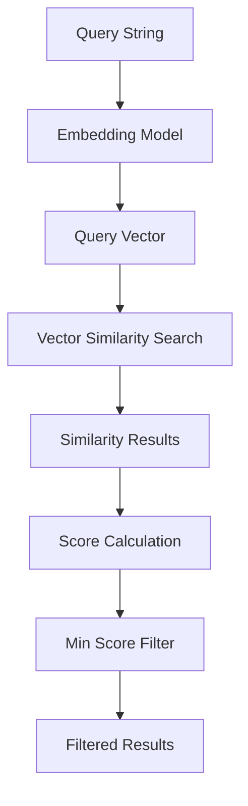

**Diagram sources**
- [search.py](file://graphiti_core/search/search.py#L102-L108)
- [search_utils.py](file://graphiti_core/search/search_utils.py#L70-L82)

### Keyword (BM25) Search
Keyword search leverages BM25 (Best Matching 25) algorithm for full-text retrieval. This method excels at finding exact matches and phrase-based queries, complementing semantic search by capturing literal matches that semantic methods might miss.

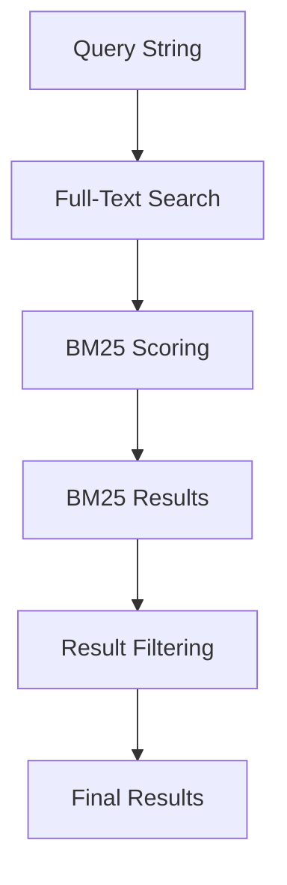

**Diagram sources**
- [search_utils.py](file://graphiti_core/search/search_utils.py#L84-L110)

### Graph Traversal (BFS)
Graph traversal uses breadth-first search to explore connected nodes in the knowledge graph. This approach is particularly valuable for understanding relationships and context within the graph structure.

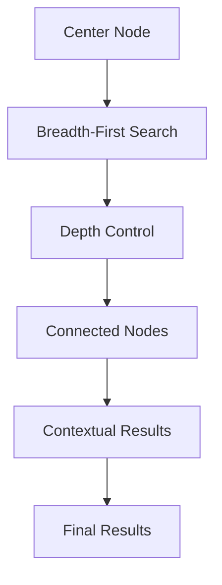

**Diagram sources**
- [search_utils.py](file://graphiti_core/search/search_utils.py#L767-L852)

**Section sources**
- [search.py](file://graphiti_core/search/search.py#L185-L519)
- [search_config.py](file://graphiti_core/search/search_config.py#L32-L51)

## Search Configuration System

The search configuration system provides fine-grained control over search behavior through the `SearchConfig` class and its specialized components for each node type.

### Core Configuration Structure

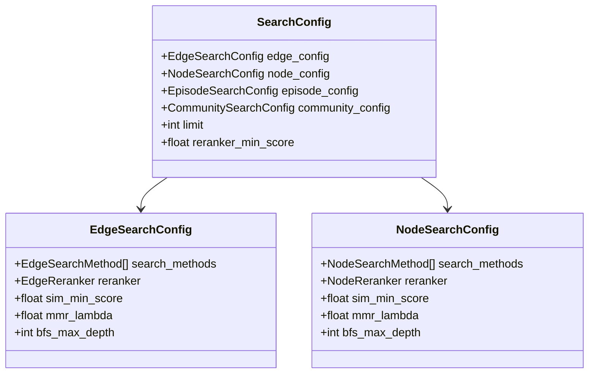

**Diagram sources**
- [search_config.py](file://graphiti_core/search/search_config.py#L112-L129)

### Search Methods Configuration

Each search method serves specific use cases:

| Method | Description | Use Case |
|--------|-------------|----------|
| `cosine_similarity` | Vector similarity search | Semantic matching, concept discovery |
| `bm25` | Full-text search | Exact matches, keyword queries |
| `bfs` | Breadth-first traversal | Relationship exploration, context building |

### Reranking Strategies

The reranking system applies sophisticated algorithms to optimize result quality:

| Reranker | Algorithm | Best For |
|----------|-----------|----------|
| `rrf` | Reciprocal Rank Fusion | Balanced results from multiple sources |
| `mmr` | Maximal Marginal Relevance | Diverse, representative results |
| `cross_encoder` | Cross-attention model | High-quality, context-aware ranking |
| `node_distance` | Graph distance calculation | Contextual relevance |
| `episode_mentions` | Mention frequency counting | Popularity-based ranking |

**Section sources**
- [search_config.py](file://graphiti_core/search/search_config.py#L1-L130)

## Search Recipes and Predefined Configurations

Graphiti provides a comprehensive set of predefined search recipes that encapsulate common query patterns and optimal configurations for various use cases.

### Available Search Recipes

The `search_config_recipes` module offers several pre-configured search strategies:

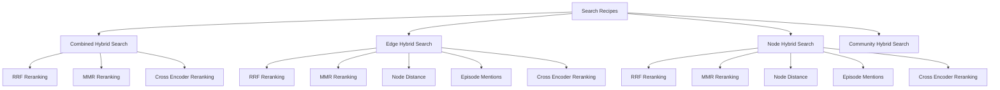

**Diagram sources**
- [search_config_recipes.py](file://graphiti_core/search/search_config_recipes.py#L33-L224)

### Recipe Categories

#### Combined Hybrid Search
Combines multiple search methods across all node types for comprehensive coverage:

- **RRF Configuration**: Uses Reciprocal Rank Fusion for balanced result aggregation
- **MMR Configuration**: Employs Maximal Marginal Relevance for diverse results  
- **Cross Encoder Configuration**: Leverages advanced cross-attention models

#### Specialized Search Recipes
Focused configurations for specific node types:

- **Edge-Specific**: Optimized for relationship discovery and fact verification
- **Node-Specific**: Tailored for entity identification and classification
- **Community-Specific**: Designed for topic clustering and thematic discovery

**Section sources**
- [search_config_recipes.py](file://graphiti_core/search/search_config_recipes.py#L1-L224)

## Center Node Search and Contextual Reasoning

Center node search represents a sophisticated approach to contextual reasoning that leverages graph topology to enhance result relevance.

### Implementation Architecture

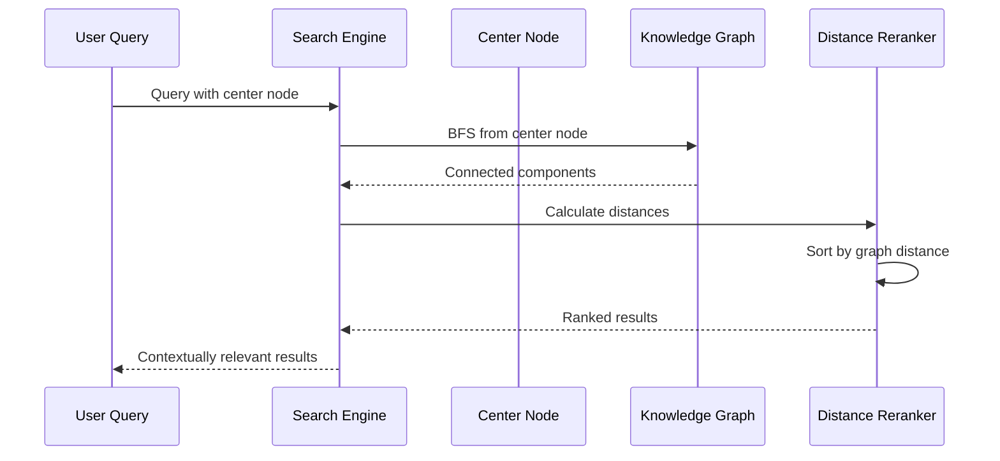

**Diagram sources**
- [search.py](file://graphiti_core/search/search.py#L275-L299)
- [search_utils.py](file://graphiti_core/search/search_utils.py#L767-L852)

### Contextual Reasoning Benefits

Center node search provides several advantages:

1. **Graph Distance Optimization**: Results are ranked based on proximity to the center node, ensuring contextual relevance
2. **Relationship Discovery**: Uncovers hidden connections between the center node and other graph elements
3. **Hierarchical Exploration**: Enables systematic exploration of knowledge graph neighborhoods
4. **Bias Reduction**: Minimizes irrelevant results by focusing on the most relevant neighborhood

### Practical Applications

Common use cases for center node search include:

- **Entity Context Building**: Understanding an entity's relationships and context
- **Relationship Exploration**: Discovering connections between related entities
- **Knowledge Graph Navigation**: Systematic exploration of graph regions
- **Fact Verification**: Contextual validation of claims against related information

**Section sources**
- [search.py](file://graphiti_core/search/search.py#L275-L299)
- [quickstart_falkordb.py](file://examples/quickstart/quickstart_falkordb.py#L168-L214)

## Reranking Mechanisms

Graphiti implements multiple sophisticated reranking algorithms to optimize result quality and relevance.

### Reciprocal Rank Fusion (RRF)

RRF combines results from multiple search methods by calculating reciprocal ranks:

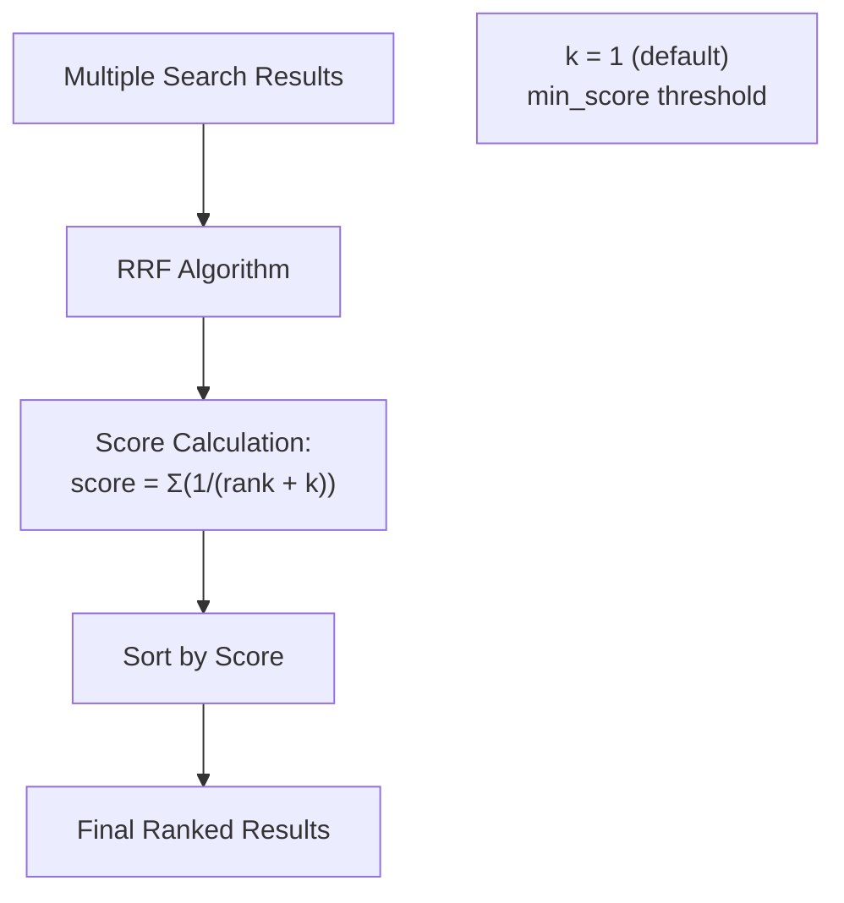

**Diagram sources**
- [search_utils.py](file://graphiti_core/search/search_utils.py#L1732-L1748)

### Maximal Marginal Relevance (MMR)

MMR balances relevance to the query with diversity among results:

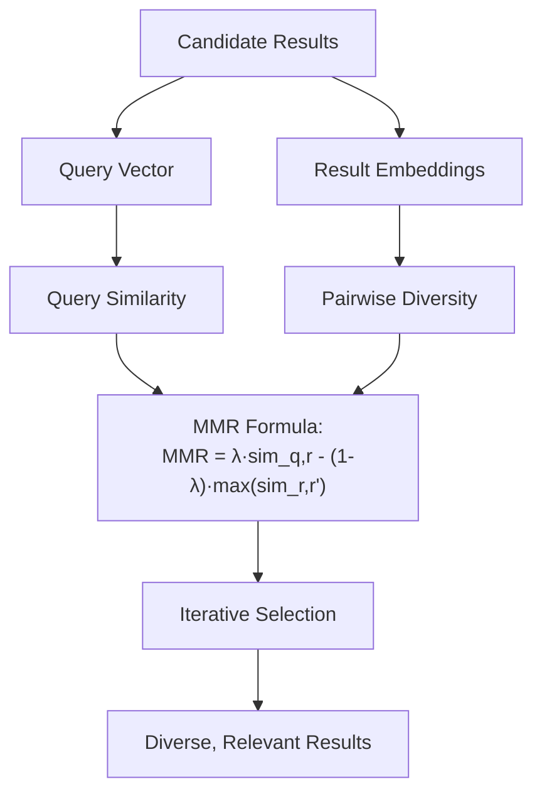

**Diagram sources**
- [search_utils.py](file://graphiti_core/search/search_utils.py#L1838-L1861)

### Cross-Encoder Reranking

Cross-encoder models provide state-of-the-art ranking using transformer architectures:

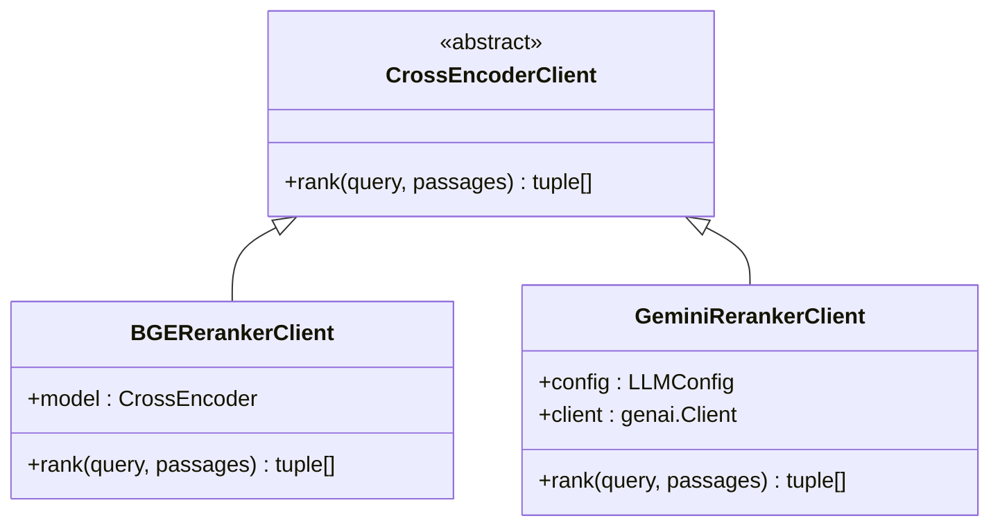

**Diagram sources**
- [client.py](file://graphiti_core/cross_encoder/client.py#L20-L41)
- [bge_reranker_client.py](file://graphiti_core/cross_encoder/bge_reranker_client.py#L34-L55)
- [gemini_reranker_client.py](file://graphiti_core/cross_encoder/gemini_reranker_client.py#L43-L162)

### Reranking Performance Comparison

| Reranker | Quality | Speed | Use Case |
|----------|---------|-------|----------|
| RRF | Medium | Fast | Balanced results |
| MMR | High | Medium | Diverse results |
| Cross Encoder | Highest | Slow | Premium quality |
| Node Distance | Medium | Fast | Contextual relevance |
| Episode Mentions | Medium | Fast | Popularity-based |

**Section sources**
- [search_utils.py](file://graphiti_core/search/search_utils.py#L1732-L1861)
- [client.py](file://graphiti_core/cross_encoder/client.py#L1-L41)
- [bge_reranker_client.py](file://graphiti_core/cross_encoder/bge_reranker_client.py#L1-L55)

## Result Aggregation and Scoring

The result aggregation system combines multiple search results into unified, ranked outputs while preserving metadata and provenance information.

### Aggregation Architecture

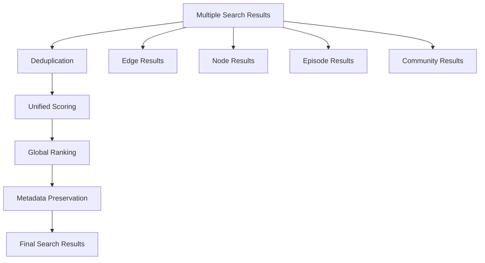

**Diagram sources**
- [search.py](file://graphiti_core/search/search.py#L167-L176)
- [search_helpers.py](file://graphiti_core/search/search_helpers.py#L27-L73)

### Search Results Structure

The `SearchResults` class encapsulates results from all search types:

| Component | Purpose | Structure |
|-----------|---------|-----------|
| `edges` | Fact and relationship data | List of EntityEdge objects |
| `nodes` | Entity and concept data | List of EntityNode objects |
| `episodes` | Temporal event data | List of EpisodicNode objects |
| `communities` | Topic and theme clusters | List of CommunityNode objects |

### Context String Generation

The system generates formatted context strings for LLM consumption:

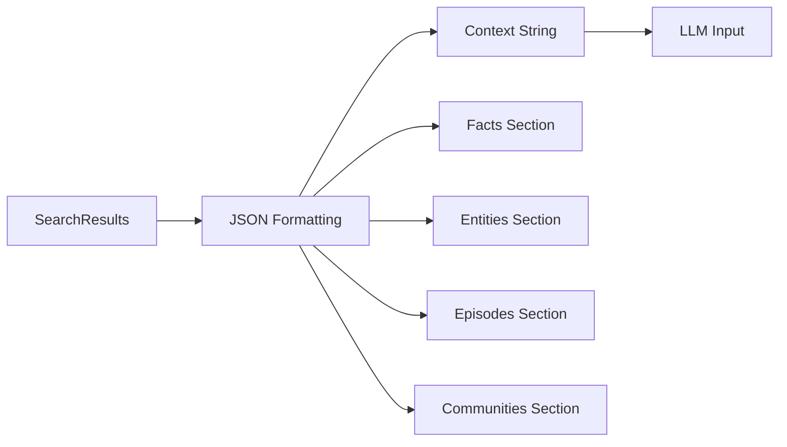

**Diagram sources**
- [search_helpers.py](file://graphiti_core/search/search_helpers.py#L27-L73)

**Section sources**
- [search.py](file://graphiti_core/search/search.py#L167-L176)
- [search_helpers.py](file://graphiti_core/search/search_helpers.py#L1-L73)

## Performance Optimization

Graphiti implements several optimization strategies to ensure efficient operation at scale.

### Parallel Processing

The search system leverages concurrent execution for improved performance:

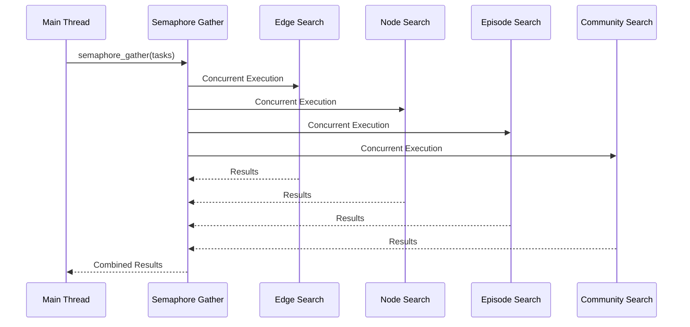

**Diagram sources**
- [search.py](file://graphiti_core/search/search.py#L117-L165)

### Query Optimization Strategies

#### Limit Management
- **Default Limits**: 10 results per search method
- **Amplification Factor**: 2x limits during search to ensure quality
- **Final Filtering**: Results trimmed to configured limits

#### Caching and Indexing
- **Vector Indexing**: Optimized vector storage and retrieval
- **Full-Text Indexing**: Efficient BM25 index utilization
- **Graph Indexing**: Optimized traversal paths

#### Resource Management
- **Connection Pooling**: Efficient database connection management
- **Memory Optimization**: Streaming and batching for large datasets
- **Timeout Handling**: Graceful degradation under load

### Large Graph Optimization

For large-scale deployments, Graphiti provides several optimization techniques:

1. **Batch Processing**: Grouped operations for reduced overhead
2. **Incremental Updates**: Efficient delta processing
3. **Index Partitioning**: Sharded indices for scalability
4. **Query Planning**: Intelligent query optimization

**Section sources**
- [search.py](file://graphiti_core/search/search.py#L117-L165)
- [search_utils.py](file://graphiti_core/search/search_utils.py#L63-L68)

## Implementation Examples

### Basic Hybrid Search

```python
# Using predefined recipes for comprehensive search
from graphiti_core.search.search_config_recipes import COMBINED_HYBRID_SEARCH_RRF

results = await graphiti.search(
    "What are the key developments in renewable energy?",
    config=COMBINED_HYBRID_SEARCH_RRF
)
```

### Center Node Search Example

```python
# Using center node for contextual relevance
center_node_uuid = results[0].source_node_uuid

contextual_results = await graphiti.search(
    "How does this relate to climate change?",
    center_node_uuid=center_node_uuid
)
```

### Custom Configuration Example

```python
from graphiti_core.search.search_config import (
    SearchConfig, EdgeSearchConfig, NodeSearchConfig,
    EdgeReranker, NodeReranker
)

custom_config = SearchConfig(
    edge_config=EdgeSearchConfig(
        search_methods=[EdgeSearchMethod.bm25, EdgeSearchMethod.cosine_similarity],
        reranker=EdgeReranker.cross_encoder
    ),
    node_config=NodeSearchConfig(
        search_methods=[NodeSearchMethod.bm25, NodeSearchMethod.cosine_similarity],
        reranker=NodeReranker.mmr,
        mmr_lambda=0.7
    ),
    limit=15
)
```

### Advanced Filtering Example

```python
from graphiti_core.search.search_filters import SearchFilters, ComparisonOperator

filters = SearchFilters(
    node_labels=['Person', 'Organization'],
    valid_at=[[{
        'date': datetime.now(),
        'comparison_operator': ComparisonOperator.greater_than_equal
    }]],
    created_at=[[{
        'date': datetime(2023, 1, 1),
        'comparison_operator': ComparisonOperator.greater_than_equal
    }]]
)

results = await graphiti.search(
    "Recent developments in technology",
    search_filter=filters
)
```

**Section sources**
- [quickstart_falkordb.py](file://examples/quickstart/quickstart_falkordb.py#L168-L214)
- [quickstart_neptune.py](file://examples/quickstart/quickstart_neptune.py#L169-L198)

## Best Practices

### Search Configuration Guidelines

1. **Choose Appropriate Rerankers**
   - Use RRF for balanced results
   - Use MMR for diverse coverage
   - Use Cross Encoder for premium quality
   - Use Node Distance for contextual relevance

2. **Optimize Search Methods**
   - Combine BM25 and cosine_similarity for comprehensive coverage
   - Use BFS for relationship discovery
   - Configure appropriate depths for BFS

3. **Set Reasonable Limits**
   - Start with default limits (10)
   - Increase for comprehensive searches
   - Consider reranking overhead

### Performance Considerations

1. **Parallel Execution**
   - Leverage concurrent search methods
   - Use semaphore_gather for efficient parallelism
   - Monitor resource utilization

2. **Caching Strategies**
   - Cache embeddings for repeated queries
   - Implement result caching for common searches
   - Use appropriate TTL for cached results

3. **Resource Management**
   - Monitor memory usage during large searches
   - Implement timeout controls
   - Use connection pooling for database access

### Quality Optimization

1. **Threshold Tuning**
   - Adjust similarity thresholds based on domain
   - Use reranker_min_score for quality filtering
   - Experiment with different lambda values for MMR

2. **Contextual Enhancement**
   - Use center node search for related queries
   - Implement feedback loops for result improvement
   - Consider temporal filters for time-sensitive queries

3. **Monitoring and Evaluation**
   - Track search performance metrics
   - Monitor result relevance through user feedback
   - Regular evaluation of reranking effectiveness

### Scalability Patterns

1. **Index Optimization**
   - Maintain up-to-date vector indices
   - Implement incremental index updates
   - Use appropriate indexing strategies

2. **Query Optimization**
   - Implement query planning for complex searches
   - Use appropriate filters to reduce search space
   - Consider query decomposition for large datasets

3. **Infrastructure Scaling**
   - Use horizontal scaling for high-volume queries
   - Implement load balancing for distributed systems
   - Monitor and optimize database performance