# Hybrid Search Strategies

<cite>
**Referenced Files in This Document**
- [search.py](file://graphiti_core/search/search.py)
- [search_config.py](file://graphiti_core/search/search_config.py)
- [search_config_recipes.py](file://graphiti_core/search/search_config_recipes.py)
- [search_utils.py](file://graphiti_core/search/search_utils.py)
- [search_helpers.py](file://graphiti_core/search/search_helpers.py)
- [client.py](file://graphiti_core/embedder/client.py)
- [client.py](file://graphiti_core/cross_encoder/client.py)
- [search_utils_test.py](file://tests/utils/search/search_utils_test.py)
</cite>

## Table of Contents
1. [Introduction](#introduction)
2. [Search Strategy Overview](#search-strategy-overview)
3. [Core Search Methods](#core-search-methods)
4. [SearchConfig Architecture](#searchconfig-architecture)
5. [Hybrid Search Implementation](#hybrid-search-implementation)
6. [Query Vector Generation](#query-vector-generation)
7. [Conditional Execution Patterns](#conditional-execution-patterns)
8. [Performance Optimization](#performance-optimization)
9. [Error Handling and Edge Cases](#error-handling-and-edge-cases)
10. [Practical Usage Examples](#practical-usage-examples)
11. [Best Practices](#best-practices)
12. [Troubleshooting Guide](#troubleshooting-guide)

## Introduction

Graphiti's hybrid search strategies represent a sophisticated approach to knowledge graph retrieval that combines multiple search methodologies to achieve optimal results. The system integrates semantic similarity (cosine similarity), keyword-based BM25, and graph traversal (BFS) methods through configurable SearchConfig objects, enabling flexible and powerful search capabilities across edges, nodes, episodes, and communities.

The hybrid approach leverages the strengths of each search method while mitigating their individual weaknesses, providing a robust foundation for intelligent knowledge discovery and retrieval in complex graph structures.

## Search Strategy Overview

Graphiti implements a multi-layered search architecture that supports three primary search strategies:


**Diagram sources**
- [search.py](file://graphiti_core/search/search.py#L68-L183)
- [search_config.py](file://graphiti_core/search/search_config.py#L32-L129)

Each search strategy serves distinct purposes:

- **Semantic Search**: Captures meaning and context through vector embeddings
- **Keyword Search**: Provides precise term matching and relevance scoring
- **Graph Traversal**: Explores relationships and connectivity patterns

## Core Search Methods

### Semantic Search (Cosine Similarity)

Semantic search utilizes vector embeddings to measure semantic similarity between queries and stored content. This method excels at capturing contextual relationships and understanding the meaning behind text.

**Key Characteristics:**
- Uses pre-computed embeddings for efficient computation
- Supports multiple embedding dimensions (default: 1024)
- Implements configurable minimum similarity thresholds
- Compatible with various embedding providers (OpenAI, Azure OpenAI, Gemini, Voyage)

**Implementation Details:**
- Vector dimension validation ensures compatibility
- L2 normalization prevents bias in similarity calculations
- Configurable similarity thresholds prevent irrelevant matches

### Keyword Search (BM25)

BM25 search provides traditional keyword-based retrieval with statistical relevance scoring, ideal for precise term matching and exact phrase searches.

**Key Characteristics:**
- Lucene-compatible query syntax support
- Statistical relevance scoring based on term frequency
- Group ID filtering for multi-tenant scenarios
- Query length sanitization prevents malformed queries

**Implementation Details:**
- Query sanitization prevents injection attacks
- Maximum query length limits prevent performance issues
- Provider-specific optimizations for different graph databases

### Graph Traversal (BFS)

Breadth-first search explores the graph structure systematically, revealing relationships and connectivity patterns that may not be apparent through text-based searches alone.

**Key Characteristics:**
- Hierarchical exploration of graph connections
- Configurable maximum depth limits
- Origin node specification for targeted exploration
- Automatic origin node derivation from search results

**Implementation Details:**
- Depth-limited exploration prevents infinite loops
- Multi-origin support for comprehensive coverage
- Provider-specific optimizations for different graph structures

**Section sources**
- [search_config.py](file://graphiti_core/search/search_config.py#L32-L51)
- [search_utils.py](file://graphiti_core/search/search_utils.py#L70-L110)

## SearchConfig Architecture

The SearchConfig system provides fine-grained control over search behavior through specialized configuration objects for each graph element type.


**Diagram sources**
- [search_config.py](file://graphiti_core/search/search_config.py#L112-L129)

### Configuration Components

Each SearchConfig object contains:

**Search Methods Array**: Defines which search strategies to employ
- **EdgeSearchMethod**: cosine_similarity, bm25, breadth_first_search
- **NodeSearchMethod**: cosine_similarity, bm25, breadth_first_search  
- **CommunitySearchMethod**: cosine_similarity, bm25
- **EpisodeSearchMethod**: bm25 only

**Reranker Selection**: Determines how search results are ranked and combined
- **Reciprocal Rank Fusion (RRF)**: Harmonic mean ranking for balanced results
- **Maximal Marginal Relevance (MMR)**: Diversity-aware reranking
- **Cross-Encoder**: Model-based relevance scoring
- **Node Distance**: Graph-theoretic distance-based ranking
- **Episode Mentions**: Frequency-based reranking

**Quality Thresholds**: Controls result quality and performance
- **sim_min_score**: Minimum similarity threshold for vector searches
- **reranker_min_score**: Minimum score for final result inclusion

**Depth and Lambda Parameters**: Fine-tunes advanced reranking algorithms
- **bfs_max_depth**: Maximum traversal depth for graph searches
- **mmr_lambda**: Diversity coefficient for MMR reranking

**Section sources**
- [search_config.py](file://graphiti_core/search/search_config.py#L80-L109)

## Hybrid Search Implementation

Graphiti's hybrid search implementation orchestrates multiple search strategies through a sophisticated execution pipeline that maximizes result quality while maintaining performance.

### Search Coordination Flow


**Diagram sources**
- [search.py](file://graphiti_core/search/search.py#L68-L183)

### Concurrent Task Execution

The search engine employs concurrent execution patterns to maximize performance:

**Semaphore-Gather Pattern**: Utilizes semaphore-gather for controlled concurrency
- Limits concurrent tasks to prevent resource exhaustion
- Enables parallel execution of independent search operations
- Maintains result ordering through structured coordination

**Conditional Task Creation**: Creates search tasks only when configured
- Skips disabled search methods to optimize performance
- Dynamically adjusts task count based on configuration
- Reduces overhead for simplified search scenarios

**Automatic Origin Derivation**: Intelligently derives BFS origins when unspecified
- Extracts origin nodes from initial search results
- Ensures comprehensive graph exploration
- Maintains search completeness without manual intervention

### Result Combination Strategies

Different reranking strategies serve specific use cases:

**Reciprocal Rank Fusion (RRF)**: Balances diverse search results
- Harmonic mean calculation preserves ranking diversity
- Prevents dominance by any single search method
- Provides stable, predictable result ordering

**Maximal Marginal Relevance (MMR)**: Optimizes result diversity
- Incorporates query relevance and inter-document similarity
- Lambda parameter controls diversity vs. relevance trade-off
- Effective for comprehensive result sets

**Cross-Encoder Reranking**: Leverages model-based relevance
- Fine-tuned model predictions for superior accuracy
- Requires batch processing for efficiency
- Provides highest precision for critical applications

**Section sources**
- [search.py](file://graphiti_core/search/search.py#L117-L166)

## Query Vector Generation

Query vector generation forms the foundation of semantic search capabilities, transforming natural language queries into high-dimensional vector representations.

### Embedding Pipeline


**Diagram sources**
- [search.py](file://graphiti_core/search/search.py#L84-L108)

### Vector Dimension Management

The system handles vector dimension compatibility through several mechanisms:

**Dynamic Dimension Detection**: Automatically detects embedding dimensions
- Reads EMBEDDING_DIM from environment variables
- Validates vector compatibility across search methods
- Handles mismatched dimensions gracefully

**Fallback Mechanisms**: Provides graceful degradation
- Zero vector generation when embeddings unavailable
- Continues search with non-semantic methods
- Maintains functionality across different embedding providers

**Memory Efficiency**: Optimizes vector storage and reuse
- Single query vector shared across search methods
- Efficient memory management for large-scale operations
- Minimal overhead for repeated queries

### Embedding Provider Integration

Support for multiple embedding providers ensures flexibility:

**OpenAI Integration**: High-quality embeddings with broad coverage
- Configurable model selection (text-embedding-ada-002, etc.)
- Batch processing for improved throughput
- Cost-effective pricing tiers

**Azure OpenAI**: Enterprise-grade embedding service
- Regional deployment options
- Enhanced security and compliance
- Scalable enterprise features

**Gemini Integration**: Google's embedding technology
- Multilingual support
- Advanced contextual understanding
- Competitive pricing

**Voyage AI**: Specialized embedding models
- Domain-specific optimizations
- High-performance inference
- Specialized use case support

**Section sources**
- [client.py](file://graphiti_core/embedder/client.py#L23-L39)
- [search.py](file://graphiti_core/search/search.py#L102-L108)

## Conditional Execution Patterns

Graphiti implements sophisticated conditional logic to optimize search performance and relevance based on configuration and runtime conditions.

### Query Validation and Early Termination

```mermaid
flowchart TD
A[Search Request] --> B[Validate Query]
B --> C{Empty Query?}
C --> |Yes| D[Return Empty Results]
C --> |No| E[Check Embedding Requirements]
E --> F{Semantic Search Needed?}
F --> |No| G[Skip Embedding Generation]
F --> |Yes| H[Generate Embeddings]
G --> I[Execute Non-Semantic Searches]
H --> I
I --> J[Process Results]
```



**Diagram sources**
- [search.py](file://graphiti_core/search/search.py#L84-L108)

### Dynamic Search Method Selection

The system dynamically selects search methods based on configuration:

**Method Availability Checking**: Validates search method support
- Database provider compatibility verification
- Feature availability assessment
- Graceful fallback implementation

**Task Pruning**: Removes unnecessary search operations
- Disabled methods excluded from execution
- Resource optimization through selective execution
- Reduced latency for simplified queries

**Automatic Configuration Adjustment**: Adapts to runtime conditions
- Origin node derivation for BFS searches
- Query vector generation based on requirements
- Result limit adjustments for performance

### Provider-Specific Optimizations

Different graph database providers receive tailored optimizations:

**Neo4j/AWS Neptune**: Native vector similarity support
- Direct vector operations without conversion
- Optimized similarity calculations
- Provider-specific query optimizations

**FalkorDB**: Specialized full-text search capabilities
- Native BM25 scoring implementation
- Optimized index utilization
- Provider-specific query syntax

**Kuzu**: Lightweight graph database optimizations
- Simplified query structures
- Memory-efficient operations
- Optimized for analytical workloads

**Section sources**
- [search.py](file://graphiti_core/search/search.py#L185-L305)
- [search.py](file://graphiti_core/search/search.py#L308-L415)

## Performance Optimization

Graphiti implements multiple performance optimization strategies to ensure efficient search operations at scale.

### Concurrency Management

**Semaphore-Based Throttling**: Controls concurrent task execution
- Configurable concurrency limits prevent resource exhaustion
- Fair scheduling ensures equitable resource distribution
- Adaptive throttling responds to system load

**Parallel Task Execution**: Maximizes throughput through parallelism
- Independent search operations executed concurrently
- Result aggregation occurs after completion
- Minimal synchronization overhead

**Batch Processing**: Optimizes database interactions
- Combined queries reduce round-trip latency
- Efficient result set processing
- Memory-efficient streaming for large datasets

### Memory Management

**Result Deduplication**: Eliminates redundant entries
- UUID-based deduplication maintains uniqueness
- Efficient hash-based lookups minimize memory usage
- Streaming processing for large result sets

**Lazy Loading**: Defers expensive operations
- Embedding generation occurs only when needed
- Result processing deferred until final aggregation
- On-demand graph traversal for BFS operations

**Resource Pooling**: Reuses expensive resources
- Embedding client instances pooled for efficiency
- Database connections managed through connection pools
- Vector normalization cached for repeated use

### Query Optimization

**Index Utilization**: Leverages database indexing
- Full-text index utilization for BM25 searches
- Vector index optimization for similarity searches
- Composite index usage for filtered queries

**Query Planning**: Optimizes execution plans
- Dynamic query construction based on requirements
- Selective index usage for optimal performance
- Query simplification for reduced complexity

**Caching Strategies**: Reduces computational overhead
- Embedding cache for repeated queries
- Result cache for identical searches
- Query result transformation caching

**Section sources**
- [search.py](file://graphiti_core/search/search.py#L117-L166)
- [search_utils.py](file://graphiti_core/search/search_utils.py#L113-L159)

## Error Handling and Edge Cases

Graphiti implements comprehensive error handling to ensure robust operation across various failure scenarios.

### Empty Query Handling

**Early Termination**: Immediate response to empty queries
- Zero-length query detection prevents unnecessary processing
- Empty result set returned promptly
- Minimal resource consumption for invalid requests

**Graceful Degradation**: Continues operation despite partial failures
- Individual search method failures don't terminate entire search
- Alternative search methods activated automatically
- Partial results returned when possible

### Vector Dimension Mismatches

**Dimension Validation**: Ensures vector compatibility
- Automatic dimension detection and validation
- Type checking prevents runtime errors
- Graceful handling of dimension mismatches

**Fallback Mechanisms**: Provides alternative approaches
- Zero vector generation when embeddings unavailable
- Semantic search disabled with non-semantic alternatives
- Error reporting for debugging and monitoring

### Timeout and Resource Management

**Concurrent Task Timeouts**: Prevents hanging operations
- Configurable timeout values for individual tasks
- Task cancellation on timeout expiration
- Resource cleanup on timeout events

**Resource Exhaustion Protection**: Prevents system overload
- Connection pool limits prevent resource exhaustion
- Query length limits prevent malformed queries
- Result set size limits prevent memory issues

**Error Propagation**: Maintains error context
- Structured error reporting with context information
- Logging integration for debugging and monitoring
- Exception handling for external service failures

### Database Provider Issues

**Provider Compatibility**: Handles provider-specific limitations
- Graceful degradation for unsupported features
- Provider-specific error handling and recovery
- Feature availability detection and adaptation

**Connection Management**: Handles network and database issues
- Connection retry logic for transient failures
- Circuit breaker patterns for persistent failures
- Health checks for database connectivity

**Section sources**
- [search.py](file://graphiti_core/search/search.py#L84-L108)
- [search_utils_test.py](file://tests/utils/search/search_utils_test.py#L46-L61)

## Practical Usage Examples

### Basic Hybrid Search Configuration

```python
# Configure hybrid search with semantic and keyword methods
from graphiti_core.search.search_config_recipes import EDGE_HYBRID_SEARCH_RRF

# Create custom configuration with adjusted limits
custom_config = EDGE_HYBRID_SEARCH_RRF.model_copy(deep=True)
custom_config.limit = 15  # Increase result limit
custom_config.edge_config.sim_min_score = 0.7  # Higher similarity threshold
```

### Advanced Multi-Method Search

```python
# Configure comprehensive search with all methods
from graphiti_core.search.search_config import SearchConfig, EdgeSearchConfig, EdgeSearchMethod, EdgeReranker

advanced_config = SearchConfig(
    edge_config=EdgeSearchConfig(
        search_methods=[
            EdgeSearchMethod.bm25,
            EdgeSearchMethod.cosine_similarity, 
            EdgeSearchMethod.bfs
        ],
        reranker=EdgeReranker.cross_encoder,
        bfs_max_depth=2
    ),
    node_config=NodeSearchConfig(
        search_methods=[
            NodeSearchMethod.bm25,
            NodeSearchMethod.cosine_similarity,
            NodeSearchMethod.bfs
        ],
        reranker=NodeReranker.mmr,
        mmr_lambda=0.8
    ),
    limit=20,
    reranker_min_score=0.5
)
```

### Graph-Aware Search with Center Nodes

```python
# Perform initial search to identify center nodes
initial_results = await graphiti.search("machine learning algorithms")

if initial_results.edges:
    center_node_uuid = initial_results.edges[0].source_node_uuid
    
    # Rerank results based on graph distance from center node
    reranked_results = await graphiti.search(
        "machine learning algorithms",
        center_node_uuid=center_node_uuid
    )
```

### Community-Focused Search

```python
# Focus on community-based search for topic clustering
from graphiti_core.search.search_config_recipes import COMMUNITY_HYBRID_SEARCH_MMR

community_config = COMMUNITY_HYBRID_SEARCH_MMR.model_copy(deep=True)
community_config.limit = 5  # Fewer communities for focused results

results = await graphiti.search(
    "artificial intelligence research trends",
    config=community_config
)
```

### Episode-Based Search

```python
# Search specifically for episodic content
from graphiti_core.search.search_config import EpisodeSearchConfig, EpisodeSearchMethod, EpisodeReranker

episode_config = EpisodeSearchConfig(
    search_methods=[EpisodeSearchMethod.bm25],
    reranker=EpisodeReranker.cross_encoder
)

results = await graphiti.search(
    "recent developments in quantum computing",
    config=episode_config
)
```

**Section sources**
- [search_config_recipes.py](file://graphiti_core/search/search_config_recipes.py#L33-L224)
- [quickstart_neo4j.py](file://examples/quickstart/quickstart_neo4j.py#L163-L221)

## Best Practices

### Search Method Selection Guidelines

**Semantic Search (Cosine Similarity)**:
- Use when understanding context and meaning is crucial
- Ideal for open-ended queries and concept-based searches
- Recommended for multilingual content and nuanced queries
- Consider embedding quality and computational cost

**Keyword Search (BM25)**:
- Optimal for precise term matching and factual queries
- Essential for exact phrase searches and boolean combinations
- Provides predictable, reproducible results
- Suitable for structured data and technical content

**Graph Traversal (BFS)**:
- Critical for relationship discovery and connectivity analysis
- Perfect for exploring connected knowledge and cascading effects
- Essential for recommendation systems and network analysis
- Configure depth appropriately to balance comprehensiveness and performance

### Configuration Optimization Strategies

**Balanced Hybrid Configurations**:
- Combine semantic and keyword methods for comprehensive coverage
- Use RRF reranking for balanced result diversity
- Set appropriate similarity thresholds based on content quality
- Monitor and adjust based on search quality metrics

**Performance-Oriented Configurations**:
- Reduce result limits for faster response times
- Disable computationally expensive reranking methods when unnecessary
- Use BFS with shallow depths for large graphs
- Implement result caching for frequently accessed queries

**Quality-Focused Configurations**:
- Enable cross-encoder reranking for highest precision
- Use MMR with higher lambda values for diverse results
- Set conservative similarity thresholds to reduce noise
- Implement post-processing filters for quality assurance

### Monitoring and Evaluation

**Performance Metrics**:
- Response time measurements for different search configurations
- Result quality assessments through relevance scoring
- Resource utilization monitoring for optimization
- User satisfaction tracking for continuous improvement

**A/B Testing Approaches**:
- Compare different reranking strategies statistically
- Test configuration changes with controlled experiments
- Monitor impact on user engagement and satisfaction
- Implement gradual rollouts for configuration changes

**Continuous Optimization**:
- Regular evaluation of search quality and performance
- Feedback loop integration for configuration refinement
- Automated monitoring for performance regression detection
- Proactive optimization based on usage patterns

## Troubleshooting Guide

### Common Configuration Issues

**Empty Search Results**:
- Verify query length and content validity
- Check embedding provider connectivity and configuration
- Review similarity thresholds and adjust if necessary
- Ensure search methods are properly configured

**Poor Search Quality**:
- Evaluate embedding quality and model selection
- Adjust similarity thresholds based on content characteristics
- Consider reranking method suitability for use case
- Review search filters for unintended exclusions

**Performance Problems**:
- Monitor concurrent task limits and adjust as needed
- Check database connection pooling and timeouts
- Review query complexity and optimization opportunities
- Analyze resource utilization patterns

### Embedding-Related Issues

**Vector Dimension Mismatches**:
- Verify embedding provider configuration
- Check vector dimension consistency across components
- Implement fallback mechanisms for dimension mismatches
- Monitor embedding generation success rates

**Timeout and Resource Issues**:
- Adjust embedding generation timeouts
- Implement retry logic for transient failures
- Monitor memory usage during embedding operations
- Consider batch processing for large queries

### Database Provider Specific Issues

**Neo4j/AWS Neptune**:
- Verify vector index creation and maintenance
- Check query execution plans for optimization opportunities
- Monitor database resource utilization
- Review connection pool configuration

**FalkorDB**:
- Ensure full-text index availability
- Verify query syntax compatibility
- Monitor memory usage for large result sets
- Review query optimization strategies

**Kuzu**:
- Check embedding support and compatibility
- Verify query syntax and feature availability
- Monitor performance characteristics
- Review migration strategies for feature gaps

### Debugging and Diagnostics

**Logging and Monitoring**:
- Enable detailed logging for search operations
- Monitor search performance metrics and patterns
- Track error rates and failure modes
- Implement alerting for performance degradation

**Testing and Validation**:
- Create comprehensive test suites for search configurations
- Validate results against known ground truth
- Test edge cases and boundary conditions
- Implement automated regression testing

**Section sources**
- [search.py](file://graphiti_core/search/search.py#L84-L108)
- [search_utils_test.py](file://tests/utils/search/search_utils_test.py#L1-164)