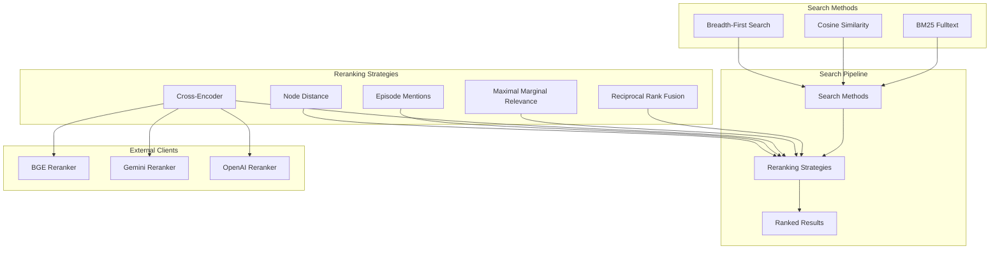
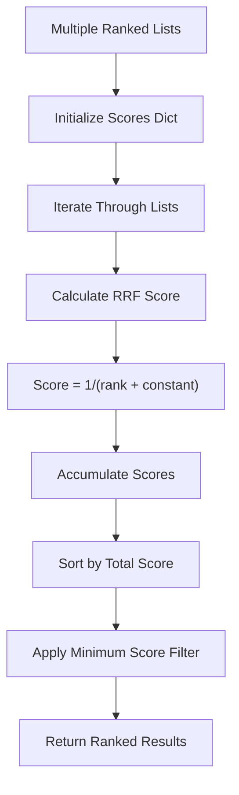
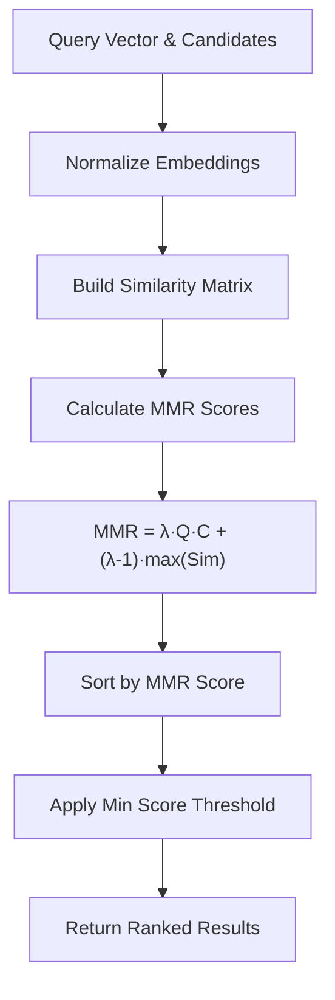
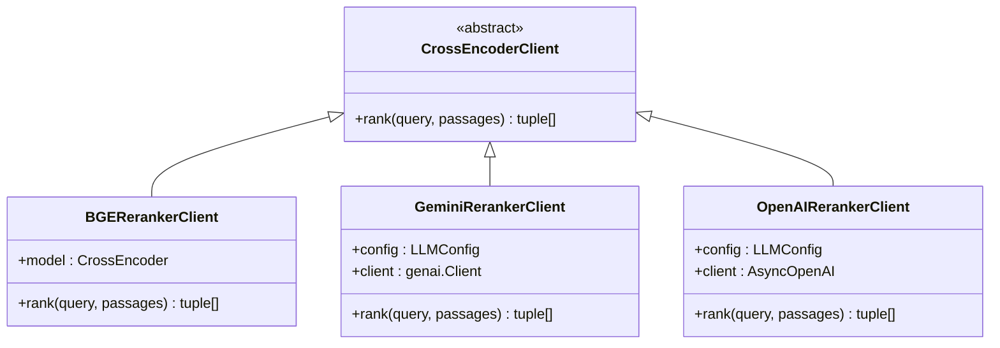
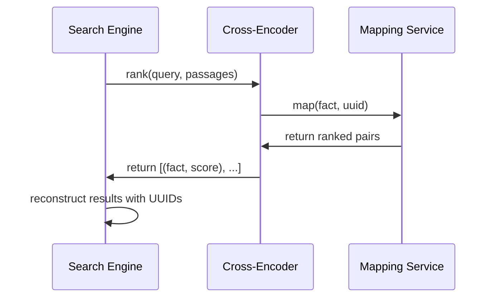
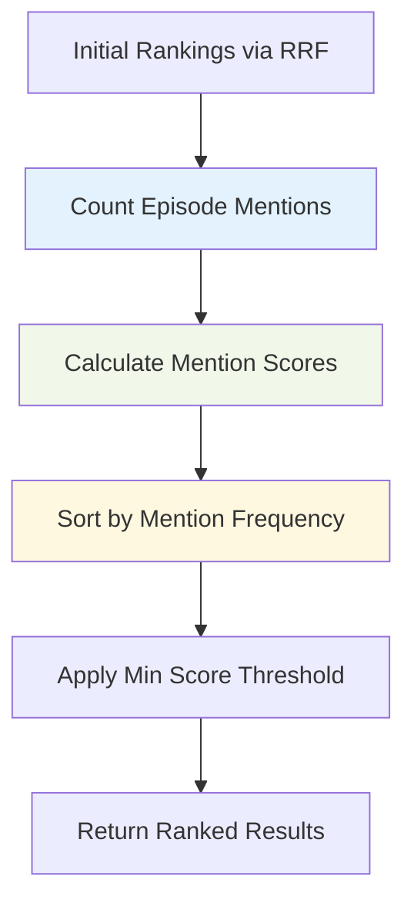
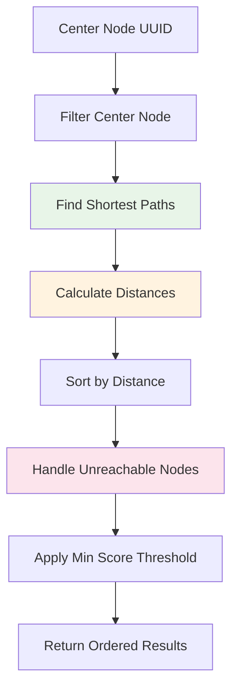
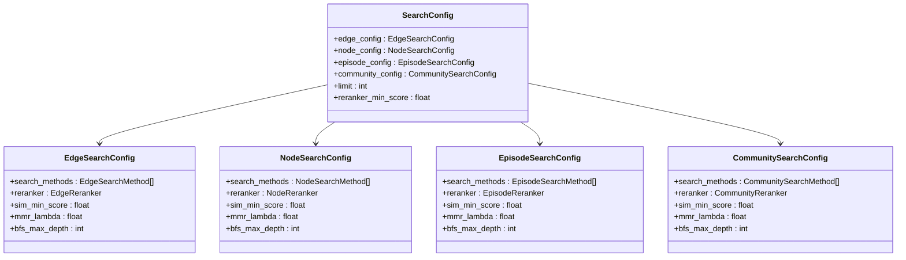
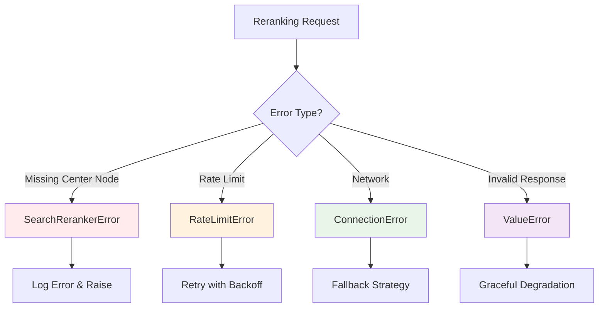

# Reranking Strategies

<cite>
**Referenced Files in This Document**
- [search.py](file://graphiti_core/search/search.py)
- [search_config.py](file://graphiti_core/search/search_config.py)
- [search_config_recipes.py](file://graphiti_core/search/search_config_recipes.py)
- [search_utils.py](file://graphiti_core/search/search_utils.py)
- [client.py](file://graphiti_core/cross_encoder/client.py)
- [bge_reranker_client.py](file://graphiti_core/cross_encoder/bge_reranker_client.py)
- [gemini_reranker_client.py](file://graphiti_core/cross_encoder/gemini_reranker_client.py)
- [openai_reranker_client.py](file://graphiti_core/cross_encoder/openai_reranker_client.py)
- [test_bge_reranker_client_int.py](file://tests/cross_encoder/test_bge_reranker_client_int.py)
- [test_gemini_reranker_client.py](file://tests/cross_encoder/test_gemini_reranker_client.py)
</cite>

## Table of Contents
1. [Introduction](#introduction)
2. [Reranking Architecture Overview](#reranking-architecture-overview)
3. [Reciprocal Rank Fusion (RRF)](#reciprocal-rank-fusion-rrf)
4. [Maximal Marginal Relevance (MMR)](#maximal-marginal-relevance-mmr)
5. [Cross-Encoder Models](#cross-encoder-models)
6. [Episode Mentions Reranking](#episode-mentions-reranking)
7. [Node Distance Reranking](#node-distance-reranking)
8. [SearchConfig Integration](#searchconfig-integration)
9. [Error Conditions and Handling](#error-conditions-and-handling)
10. [Performance Considerations](#performance-considerations)
11. [Best Practices and Use Cases](#best-practices-and-use-cases)
12. [Conclusion](#conclusion)

## Introduction

Graphiti's reranking system enhances search result relevance through sophisticated algorithms that reorder initial search results based on different criteria. The system supports multiple reranking strategies, each optimized for specific use cases and providing different trade-offs between accuracy and performance. This comprehensive guide explores the implementation, algorithms, and practical applications of Graphiti's reranking capabilities.

The reranking system operates as a post-processing step after initial search results are generated through various search methods (BM25, cosine similarity, breadth-first search). Each reranking strategy employs distinct mathematical approaches to improve result quality while maintaining computational efficiency.

## Reranking Architecture Overview

Graphiti's reranking system follows a modular architecture that separates concerns between search methods and reranking strategies. The system integrates seamlessly with different graph drivers and supports multiple reranking algorithms simultaneously across different entity types.



**Diagram sources**
- [search.py](file://graphiti_core/search/search.py#L68-L183)
- [search_config.py](file://graphiti_core/search/search_config.py#L32-L78)

The architecture supports parallel execution of multiple search methods, with reranking strategies applied independently to each entity type (nodes, edges, episodes, communities). This design enables fine-grained control over ranking behavior for different types of graph entities.

**Section sources**
- [search.py](file://graphiti_core/search/search.py#L68-L183)
- [search_config.py](file://graphiti_core/search/search_config.py#L32-L78)

## Reciprocal Rank Fusion (RRF)

Reciprocal Rank Fusion (RRF) is Graphiti's default reranking strategy, implemented as a robust and efficient method for combining multiple ranked lists into a unified ranking. RRF excels in scenarios where multiple search methods produce complementary results.

### Algorithm Implementation

The RRF algorithm combines results from multiple search methods using a harmonic mean approach that emphasizes early-ranked items while still considering lower-ranked results:



**Diagram sources**
- [search_utils.py](file://graphiti_core/search/search_utils.py#L1732-L1748)

### Mathematical Foundation

The RRF formula calculates the combined score for each item using the reciprocal rank method:

```
RRF_score(item) = Σ(1 / (rank(item, list) + k))
```

Where:
- `k` is the rank constant (default: 1)
- `rank(item, list)` is the position of the item in a specific ranked list
- The summation is over all ranked lists containing the item

### Implementation Details

The RRF implementation in Graphiti handles multiple input lists efficiently and applies configurable minimum score thresholds to filter low-quality results. The algorithm maintains O(n log n) complexity where n is the total number of unique items across all input lists.

### Use Cases and Benefits

RRF is particularly effective when:
- Multiple search methods produce complementary results
- Early ranks from different methods contain valuable information
- Computational resources are limited compared to cross-encoder models
- Consistent ranking behavior across different search contexts is required

**Section sources**
- [search_utils.py](file://graphiti_core/search/search_utils.py#L1732-L1748)
- [search_config_recipes.py](file://graphiti_core/search/search_config_recipes.py#L33-L53)

## Maximal Marginal Relevance (MMR)

Maximal Marginal Relevance (MMR) balances relevance to the query with diversity among selected items, making it ideal for scenarios requiring representative result sets. MMR ensures that reranked results are both relevant to the query and diverse from each other.

### Algorithm Implementation

The MMR algorithm computes scores that balance query relevance and intra-set diversity:



**Diagram sources**
- [search_utils.py](file://graphiti_core/search/search_utils.py#L1837-L1876)

### Mathematical Foundation

The MMR score for each candidate is calculated as:

```
MMR_score(c) = λ · cos_sim(Q, C) - (1-λ) · max(cos_sim(C, C_i))
```

Where:
- `λ` (lambda) is the diversity-weighting parameter (default: 0.5)
- `Q` is the query vector
- `C` is the candidate vector
- `C_i` represents all other candidates in the result set

### Diversity Calculation

The diversity term `(1-λ) · max(cos_sim(C, C_i))` encourages selection of candidates that are dissimilar to already-selected items, preventing redundancy in the result set.

### Parameter Tuning

The `mmr_lambda` parameter controls the balance between relevance and diversity:
- `λ = 1`: Pure relevance maximization
- `λ = 0`: Pure diversity maximization  
- `λ = 0.5`: Balanced approach (default)

### Use Cases and Benefits

MMR is optimal for:
- Document summarization tasks
- Recommendation systems requiring diverse suggestions
- Information retrieval where redundancy reduction is important
- Scenarios where representative sampling is desired

**Section sources**
- [search_utils.py](file://graphiti_core/search/search_utils.py#L1837-L1876)
- [search_config.py](file://graphiti_core/search/search_config.py#L84-L84)

## Cross-Encoder Models

Cross-encoder models provide the highest accuracy for reranking by evaluating each candidate against the query in a single forward pass. Graphiti supports multiple cross-encoder implementations, each with different strengths and deployment requirements.

### Supported Cross-Encoder Clients

Graphiti integrates with three primary cross-encoder implementations:



**Diagram sources**
- [client.py](file://graphiti_core/cross_encoder/client.py#L20-L41)
- [bge_reranker_client.py](file://graphiti_core/cross_encoder/bge_reranker_client.py#L34-L55)
- [gemini_reranker_client.py](file://graphiti_core/cross_encoder/gemini_reranker_client.py#L43-L162)
- [openai_reranker_client.py](file://graphiti_core/cross_encoder/openai_reranker_client.py#L34-L124)

### BGE Reranker Client

The BGE (BAAI/bge-reranker-v2-m3) model provides excellent performance with local deployment capabilities:

#### Implementation Features
- Uses Sentence Transformers library for local inference
- Supports batch processing for improved throughput
- Implements proper normalization of scores
- Handles empty input gracefully

#### Performance Characteristics
- Latency: ~10-50ms per passage (local deployment)
- Throughput: High batch processing capability
- Resource requirements: Moderate GPU/CPU memory

### Gemini Reranker Client

The Gemini reranker leverages Google's generative AI capabilities for direct relevance scoring:

#### Implementation Features
- Direct relevance scoring on 0-100 scale
- Concurrent processing of multiple passages
- Built-in rate limiting and error handling
- Configurable temperature and model selection

#### Performance Characteristics
- Latency: ~100-300ms per passage (API calls)
- Throughput: Limited by API rate limits
- Resource requirements: Minimal local resources

### OpenAI Reranker Client

The OpenAI reranker uses GPT models for binary relevance classification:

#### Implementation Features
- Boolean classification with log probability extraction
- Configurable model selection (GPT-4.1-nano default)
- Logit bias for consistent token interpretation
- Concurrent processing with semaphore control

#### Performance Characteristics
- Latency: ~200-500ms per passage (API calls)
- Throughput: Limited by API quotas
- Resource requirements: Minimal local resources

### Fact-to-UUID Mapping

Cross-encoder reranking requires mapping between textual passages and their corresponding UUIDs for proper result reconstruction:



**Diagram sources**
- [search.py](file://graphiti_core/search/search.py#L269-L274)
- [search.py](file://graphiti_core/search/search.py#L389-L398)

**Section sources**
- [client.py](file://graphiti_core/cross_encoder/client.py#L20-L41)
- [bge_reranker_client.py](file://graphiti_core/cross_encoder/bge_reranker_client.py#L34-L55)
- [gemini_reranker_client.py](file://graphiti_core/cross_encoder/gemini_reranker_client.py#L43-L162)
- [openai_reranker_client.py](file://graphiti_core/cross_encoder/openai_reranker_client.py#L34-L124)

## Episode Mentions Reranking

Episode mentions reranking prioritizes entities based on their association with episodic content, making it particularly useful for temporal knowledge graphs where recent or frequently mentioned information is more relevant.

### Algorithm Implementation

The episode mentions reranking algorithm combines RRF as a preliminary ranking with episode frequency analysis:



**Diagram sources**
- [search_utils.py](file://graphiti_core/search/search_utils.py#L1804-L1835)

### Implementation Details

The algorithm first applies RRF to establish an initial ranking, then refines this ranking based on the number of episodes mentioning each entity. This two-stage approach ensures that entities with higher temporal relevance appear at the top of results.

### Use Cases and Benefits

Episode mentions reranking is particularly effective for:
- Temporal knowledge graphs with evolving information
- Scenarios where recent mentions indicate relevance
- Applications requiring temporal awareness in search results
- Systems with episodic memory components

**Section sources**
- [search_utils.py](file://graphiti_core/search/search_utils.py#L1804-L1835)
- [search.py](file://graphiti_core/search/search.py#L302-L304)

## Node Distance Reranking

Node distance reranking orders results based on graph-theoretic distance from a specified center node, making it ideal for navigation and exploration tasks within knowledge graphs.

### Algorithm Implementation

The node distance reranking algorithm calculates shortest path distances from a center node to all other nodes:



**Diagram sources**
- [search_utils.py](file://graphiti_core/search/search_utils.py#L1750-L1802)

### Mathematical Foundation

The distance score is calculated as `1/distance`, where:
- Distance = 0 for the center node itself
- Distance = 1 for directly connected nodes
- Distance = ∞ for unreachable nodes

This inverse relationship ensures that closer nodes receive higher scores.

### Error Conditions

Node distance reranking requires a center node UUID and raises `SearchRerankerError` when this parameter is missing. The algorithm handles unreachable nodes by assigning them infinite distance scores.

### Use Cases and Benefits

Node distance reranking excels in:
- Navigation and exploration interfaces
- Finding related entities near a focal point
- Community detection and clustering tasks
- Hierarchical information organization

**Section sources**
- [search_utils.py](file://graphiti_core/search/search_utils.py#L1750-L1802)
- [search.py](file://graphiti_core/search/search.py#L276-L277)
- [search.py](file://graphiti_core/search/search.py#L404-L405)

## SearchConfig Integration

Graphiti's reranking system integrates seamlessly with SearchConfig objects, allowing fine-grained control over reranking behavior for different entity types and search scenarios.

### Configuration Structure

Each entity type (nodes, edges, episodes, communities) has dedicated configuration objects with specific reranking options:



**Diagram sources**
- [search_config.py](file://graphiti_core/search/search_config.py#L112-L119)
- [search_config.py](file://graphiti_core/search/search_config.py#L80-L109)

### Predefined Configuration Recipes

Graphiti provides several predefined configuration recipes for common use cases:

| Recipe | Description | Use Case |
|--------|-------------|----------|
| `COMBINED_HYBRID_SEARCH_RRF` | Hybrid search with RRF reranking | General-purpose search |
| `COMBINED_HYBRID_SEARCH_MMR` | Hybrid search with MMR reranking | Diverse result sets |
| `COMBINED_HYBRID_SEARCH_CROSS_ENCODER` | Cross-encoder reranking | Highest accuracy required |
| `EDGE_HYBRID_SEARCH_NODE_DISTANCE` | Node distance reranking for edges | Navigation tasks |

### Score Threshold Filtering

The `reranker_min_score` parameter enables filtering of low-quality results across all reranking strategies. This threshold prevents poor-quality matches from appearing in final results while maintaining computational efficiency.

**Section sources**
- [search_config.py](file://graphiti_core/search/search_config.py#L112-L119)
- [search_config_recipes.py](file://graphiti_core/search/search_config_recipes.py#L33-L224)

## Error Conditions and Handling

Graphiti's reranking system implements comprehensive error handling to ensure robust operation across different scenarios and external service failures.

### Node Distance Reranking Errors

The most critical error condition occurs in node distance reranking when no center node is provided:

```python
# Error condition in edge_search
if config.reranker == EdgeReranker.node_distance:
    if center_node_uuid is None:
        raise SearchRerankerError('No center node provided for Node Distance reranker')
```

### Cross-Encoder Client Errors

Different cross-encoder clients handle errors differently:

#### Gemini Reranker Errors
- Rate limit errors (429, quota exceeded, resource exhausted)
- API connectivity issues
- Invalid response formats

#### OpenAI Reranker Errors
- Rate limit errors
- API key authentication failures
- Model availability issues

### Error Handling Strategies



**Diagram sources**
- [search.py](file://graphiti_core/search/search.py#L276-L277)
- [gemini_reranker_client.py](file://graphiti_core/cross_encoder/gemini_reranker_client.py#L149-L162)

### Graceful Degradation

When cross-encoder clients encounter errors, the system falls back to simpler reranking strategies like RRF, ensuring search functionality remains available even when external services are unavailable.

**Section sources**
- [search.py](file://graphiti_core/search/search.py#L276-L277)
- [gemini_reranker_client.py](file://graphiti_core/cross_encoder/gemini_reranker_client.py#L149-L162)
- [openai_reranker_client.py](file://graphiti_core/cross_encoder/openai_reranker_client.py#L119-L124)

## Performance Considerations

Understanding the performance characteristics of different reranking strategies is crucial for selecting appropriate approaches based on application requirements.

### Latency Trade-offs

| Reranking Strategy | Latency Range | Complexity | Best Use Case |
|-------------------|---------------|------------|---------------|
| RRF | 1-10ms | O(n log n) | General purpose |
| MMR | 10-100ms | O(n²) | Balanced relevance/diversity |
| Cross-Encoder (BGE) | 10-50ms | O(n) | Local deployment |
| Cross-Encoder (Gemini) | 100-300ms | O(n) | Cloud-based |
| Cross-Encoder (OpenAI) | 200-500ms | O(n) | High accuracy required |
| Episode Mentions | 5-20ms | O(n) | Temporal focus |
| Node Distance | 50-200ms | O(V+E) | Graph navigation |

### Throughput Considerations

Different strategies exhibit varying throughput characteristics:

- **RRF**: Excellent throughput due to linear complexity
- **MMR**: Good throughput for small to medium result sets
- **Cross-Encoders**: Limited by API rate limits or local processing capacity
- **Episode Mentions**: Good throughput with database queries
- **Node Distance**: Variable throughput depending on graph density

### Memory Usage Patterns

Memory consumption varies significantly across strategies:

- **RRF**: Minimal memory overhead
- **MMR**: Higher memory usage due to similarity matrix storage
- **Cross-Encoders**: Model loading and inference memory requirements
- **Episode Mentions**: Database query result caching
- **Node Distance**: Graph traversal state management

### Optimization Strategies

1. **Batch Processing**: Cross-encoders benefit from batch processing
2. **Caching**: Store reranking results for repeated queries
3. **Early Termination**: Apply `reranker_min_score` to reduce computation
4. **Parallel Execution**: Leverage concurrent processing for multiple strategies

**Section sources**
- [search_utils.py](file://graphiti_core/search/search_utils.py#L1869-L1872)
- [search.py](file://graphiti_core/search/search.py#L178-L182)

## Best Practices and Use Cases

Selecting the appropriate reranking strategy depends on specific application requirements, available resources, and desired outcomes.

### Strategy Selection Guidelines

#### When to Use RRF
- General-purpose search applications
- Multiple search methods producing complementary results
- Performance-critical applications requiring fast reranking
- Scenarios where simplicity and consistency are valued

#### When to Use MMR
- Recommendation systems requiring diverse suggestions
- Document summarization tasks
- Information retrieval with redundancy constraints
- Applications benefiting from balanced relevance/diversity

#### When to Use Cross-Encoder Models
- Highest accuracy required regardless of latency
- Local deployment preferred over API dependencies
- Batch processing scenarios
- Research and development environments

#### When to Use Episode Mentions
- Temporal knowledge graphs with episodic data
- Applications requiring recent or frequently mentioned information
- Historical analysis and trend identification
- Content recommendation based on popularity

#### When to Use Node Distance
- Navigation and exploration interfaces
- Community detection and clustering
- Hierarchical information organization
- Graph-based recommendation systems

### Configuration Recommendations

#### High-Accuracy Applications
```python
# Example configuration for maximum accuracy
config = SearchConfig(
    edge_config=EdgeSearchConfig(
        search_methods=[EdgeSearchMethod.bm25, EdgeSearchMethod.cosine_similarity, EdgeSearchMethod.bfs],
        reranker=EdgeReranker.cross_encoder,
    ),
    node_config=NodeSearchConfig(
        search_methods=[NodeSearchMethod.bm25, NodeSearchMethod.cosine_similarity, NodeSearchMethod.bfs],
        reranker=NodeReranker.cross_encoder,
    ),
    reranker_min_score=0.3,  # Higher threshold for quality
)
```

#### Performance-Critical Applications
```python
# Example configuration for optimal performance
config = SearchConfig(
    edge_config=EdgeSearchConfig(
        search_methods=[EdgeSearchMethod.bm25, EdgeSearchMethod.cosine_similarity],
        reranker=EdgeReranker.rrf,
    ),
    node_config=NodeSearchConfig(
        search_methods=[NodeSearchMethod.bm25, NodeSearchMethod.cosine_similarity],
        reranker=NodeReranker.rrf,
    ),
    reranker_min_score=0.1,  # Lower threshold for inclusivity
)
```

### Monitoring and Evaluation

Implement monitoring for:
- Reranking strategy performance metrics
- Latency distributions across strategies
- Quality assessment through human evaluation
- Resource utilization tracking
- Error rate monitoring

**Section sources**
- [search_config_recipes.py](file://graphiti_core/search/search_config_recipes.py#L33-L224)
- [search_config.py](file://graphiti_core/search/search_config.py#L112-L119)

## Conclusion

Graphiti's reranking system provides a comprehensive suite of algorithms optimized for different search scenarios and requirements. The modular architecture enables flexible combination of strategies across different entity types while maintaining computational efficiency.

Key advantages of Graphiti's approach include:

- **Flexibility**: Multiple reranking strategies for different use cases
- **Integration**: Seamless integration with existing search infrastructure
- **Performance**: Optimized implementations with configurable trade-offs
- **Reliability**: Comprehensive error handling and graceful degradation
- **Extensibility**: Pluggable architecture supporting custom reranking strategies

The choice of reranking strategy should be guided by specific application requirements, available resources, and desired balance between accuracy and performance. By understanding the characteristics and optimal use cases for each strategy, developers can configure Graphiti's reranking system to achieve optimal results for their specific scenarios.

Future enhancements may include additional reranking strategies, improved caching mechanisms, and enhanced monitoring capabilities to further optimize the reranking experience.