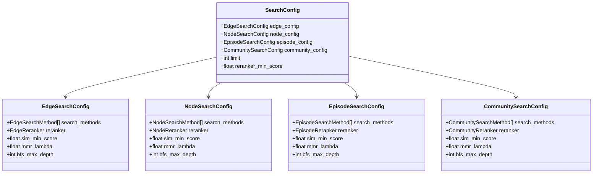
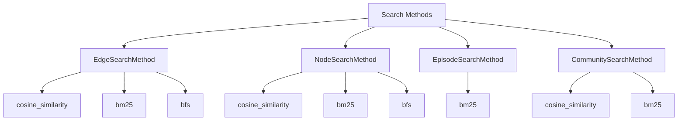
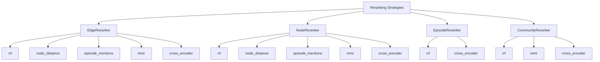
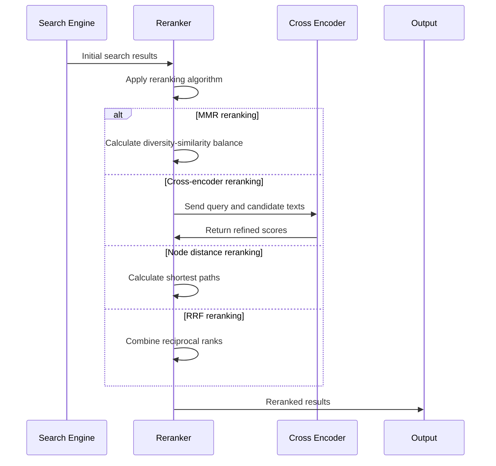
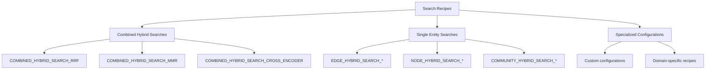
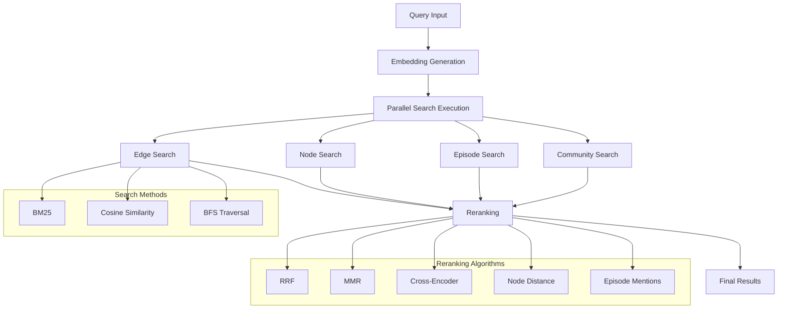

# Search Configuration

<cite>
**Referenced Files in This Document**
- [search_config.py](file://graphiti_core/search/search_config.py)
- [search_config_recipes.py](file://graphiti_core/search/search_config_recipes.py)
- [search_utils.py](file://graphiti_core/search/search_utils.py)
- [search.py](file://graphiti_core/search/search.py)
- [search_filters.py](file://graphiti_core/search/search_filters.py)
</cite>

## Table of Contents
1. [Introduction](#introduction)
2. [Core Configuration Classes](#core-configuration-classes)
3. [Search Method Types](#search-method-types)
4. [Reranking Strategies](#reranking-strategies)
5. [Default Constants](#default-constants)
6. [Predefined Search Recipes](#predefined-search-recipes)
7. [Configuration Usage Patterns](#configuration-usage-patterns)
8. [Parameter Tuning Guidelines](#parameter-tuning-guidelines)
9. [Execution Flow](#execution-flow)
10. [Best Practices](#best-practices)

## Introduction

Graphiti's search configuration system provides a flexible and type-safe framework for configuring search behavior across different graph entities (edges, nodes, episodes, communities). The system is built around Pydantic models that enable validation, serialization, and intuitive configuration management. This documentation covers the complete search configuration ecosystem, including the core configuration classes, search methods, reranking strategies, and practical usage patterns.

The search configuration system enables fine-grained control over:
- Search algorithms (BM25, cosine similarity, BFS)
- Reranking strategies (RRF, MMR, cross-encoder)
- Scoring thresholds and limits
- Depth limitations for graph traversal
- Filtering and grouping capabilities

## Core Configuration Classes

### SearchConfig

The central configuration class orchestrates search behavior across all graph entities. It serves as the primary interface for configuring search operations.



**Diagram sources**
- [search_config.py](file://graphiti_core/search/search_config.py#L80-L119)

#### Key Fields

| Field | Type | Default | Description |
|-------|------|---------|-------------|
| `edge_config` | `EdgeSearchConfig \| None` | `None` | Configuration for edge entity searches |
| `node_config` | `NodeSearchConfig \| None` | `None` | Configuration for node entity searches |
| `episode_config` | `EpisodeSearchConfig \| None` | `None` | Configuration for episode entity searches |
| `community_config` | `CommunitySearchConfig \| None` | `None` | Configuration for community entity searches |
| `limit` | `int` | `10` | Maximum number of results to return |
| `reranker_min_score` | `float` | `0` | Minimum score threshold for reranked results |

### Individual Entity Configurations

Each entity type has its dedicated configuration class with entity-specific parameters:

#### EdgeSearchConfig
- **Purpose**: Configures search behavior for relationship edges
- **Fields**: Inherits from base configuration with edge-specific defaults
- **Use Cases**: Fact extraction, relationship discovery, temporal edge searches

#### NodeSearchConfig  
- **Purpose**: Configures search behavior for entity nodes
- **Fields**: Inherits from base configuration with node-specific defaults
- **Use Cases**: Entity discovery, concept searches, named entity recognition

#### EpisodeSearchConfig
- **Purpose**: Configures search behavior for episodic content
- **Fields**: Inherits from base configuration with episode-specific defaults
- **Use Cases**: Content retrieval, timeline searches, historical context

#### CommunitySearchConfig
- **Purpose**: Configures search behavior for community clusters
- **Fields**: Inherits from base configuration with community-specific defaults
- **Use Cases**: Topic discovery, cluster analysis, thematic searches

**Section sources**
- [search_config.py](file://graphiti_core/search/search_config.py#L80-L119)

## Search Method Types

Graphiti supports multiple search algorithms, each optimized for different use cases and data characteristics.

### Available Search Methods



**Diagram sources**
- [search_config.py](file://graphiti_core/search/search_config.py#L32-L51)

### Method Descriptions

| Method | Description | Best For | Performance Characteristics |
|--------|-------------|----------|---------------------------|
| `cosine_similarity` | Vector similarity search using embeddings | Semantic similarity, concept matching | High precision, moderate recall |
| `bm25` | Full-text search with BM25 ranking | Keyword matching, exact phrases | High recall, good precision |
| `bfs` | Breadth-first search traversal | Graph connectivity, shortest paths | Complete coverage, configurable depth |

### Hybrid Search Strategies

Multiple search methods can be combined for enhanced performance:

- **Hybrid BM25 + Cosine Similarity**: Leverages both semantic and lexical matching
- **BM25 + Cosine + BFS**: Comprehensive coverage combining keyword, semantic, and structural search
- **BFS Only**: Pure graph traversal for connectivity analysis

**Section sources**
- [search_config.py](file://graphiti_core/search/search_config.py#L32-L51)

## Reranking Strategies

Reranking improves search quality by reordering initial search results using sophisticated algorithms.

### Available Rerankers



**Diagram sources**
- [search_config.py](file://graphiti_core/search/search_config.py#L53-L77)

### Reranking Algorithm Details

| Reranker | Algorithm | Purpose | Use Case |
|----------|-----------|---------|----------|
| `rrf` | Reciprocal Rank Fusion | Combine multiple result lists | General-purpose hybrid search |
| `mmr` | Maximal Marginal Relevance | Diversity + Relevance | Document retrieval, recommendation |
| `node_distance` | Graph distance | Proximity to center node | Graph-aware reranking |
| `episode_mentions` | Mention frequency | Content relevance | Episode-centric searches |
| `cross_encoder` | Neural reranking | Semantic refinement | High-quality ranking |

### Reranking Implementation Flow



**Diagram sources**
- [search.py](file://graphiti_core/search/search.py#L240-L305)

**Section sources**
- [search_config.py](file://graphiti_core/search/search_config.py#L53-L77)

## Default Constants

Graphiti defines several important constants that control search behavior:

### Core Constants

| Constant | Value | Purpose | Impact |
|----------|-------|---------|--------|
| `DEFAULT_SEARCH_LIMIT` | `10` | Default maximum results | Controls result set size |
| `DEFAULT_MIN_SCORE` | `0.6` | Default similarity threshold | Filters low-quality matches |
| `DEFAULT_MMR_LAMBDA` | `0.5` | Default diversity weight | Balances relevance/diversity |
| `MAX_SEARCH_DEPTH` | `3` | Maximum BFS traversal depth | Controls graph exploration |

### Constant Usage Patterns

These constants serve as sensible defaults while allowing customization:

- **Score Thresholds**: Prevent low-quality results from polluting search outcomes
- **Limit Controls**: Balance result quality with performance
- **Depth Limits**: Control computational complexity in graph traversal
- **Lambda Values**: Fine-tune the relevance-diversity trade-off

**Section sources**
- [search_config.py](file://graphiti_core/search/search_config.py#L29-L30)
- [search_utils.py](file://graphiti_core/search/search_utils.py#L64-L66)

## Predefined Search Recipes

Graphiti provides curated search configurations optimized for common use cases through the `search_config_recipes` module.

### Recipe Categories



**Diagram sources**
- [search_config_recipes.py](file://graphiti_core/search/search_config_recipes.py#L33-L224)

### Popular Recipe Examples

#### Combined Hybrid Search (RRF)
- **Components**: Edge, node, episode, community hybrid searches
- **Reranker**: RRF for balanced combination
- **Use Case**: Comprehensive knowledge discovery
- **Best For**: General-purpose search across all entity types

#### Edge Hybrid Search with MMR
- **Components**: BM25 + Cosine similarity edge search
- **Reranker**: MMR with lambda=1 for maximum diversity
- **Use Case**: Fact extraction with diverse results
- **Best For**: Information extraction scenarios

#### Cross-Encoder Enhanced Search
- **Components**: Full hybrid with BFS + cross-encoder reranking
- **Reranker**: Cross-encoder for semantic refinement
- **Use Case**: High-quality result ranking
- **Best For**: Applications requiring top-tier relevance

### Recipe Customization

Recipes can be modified by copying and adjusting individual parameters:

```python
# Example: Customize a recipe
custom_config = NODE_HYBRID_SEARCH_RRF.model_copy(deep=True)
custom_config.limit = 15
custom_config.node_config.sim_min_score = 0.7
```

**Section sources**
- [search_config_recipes.py](file://graphiti_core/search/search_config_recipes.py#L33-L224)

## Configuration Usage Patterns

### Basic Configuration Setup

```python
# Simple edge search configuration
edge_config = EdgeSearchConfig(
    search_methods=[EdgeSearchMethod.bm25, EdgeSearchMethod.cosine_similarity],
    reranker=EdgeReranker.mmr,
    mmr_lambda=0.7
)

# Complete search configuration
search_config = SearchConfig(
    edge_config=edge_config,
    limit=20,
    reranker_min_score=0.5
)
```

### Dynamic Configuration Building

```python
# Programmatic configuration construction
def build_custom_search_config(entity_type: str, complexity: str) -> SearchConfig:
    configs = {
        'simple': SearchConfig(
            edge_config=EdgeSearchConfig(
                search_methods=[EdgeSearchMethod.bm25],
                reranker=EdgeReranker.rrf
            )
        ),
        'hybrid': SearchConfig(
            edge_config=EdgeSearchConfig(
                search_methods=[EdgeSearchMethod.bm25, EdgeSearchMethod.cosine_similarity],
                reranker=EdgeReranker.mmr,
                mmr_lambda=0.5
            )
        ),
        'advanced': SearchConfig(
            edge_config=EdgeSearchConfig(
                search_methods=[EdgeSearchMethod.bm25, EdgeSearchMethod.cosine_similarity, EdgeSearchMethod.bfs],
                reranker=EdgeReranker.cross_encoder
            )
        )
    }
    return configs[complexity]
```

### Configuration Validation

Pydantic models automatically validate configurations:

```python
try:
    config = SearchConfig(
        edge_config=EdgeSearchConfig(
            search_methods=["invalid_method"],  # Will raise ValidationError
            reranker="invalid_reranker"         # Will raise ValidationError
        )
    )
except ValidationError as e:
    print(f"Configuration error: {e}")
```

**Section sources**
- [search_config.py](file://graphiti_core/search/search_config.py#L80-L119)

## Parameter Tuning Guidelines

### Score Threshold Tuning

| Scenario | Recommended Range | Rationale |
|----------|------------------|-----------|
| High precision required | `0.7-0.9` | Filter out irrelevant results |
| Balanced precision/recall | `0.5-0.7` | Trade-off between quality and quantity |
| Maximum recall needed | `0.3-0.5` | Capture all potentially relevant results |

### Lambda Parameter Optimization

MMR lambda controls the relevance-diversity balance:

- **Low lambda (0.1-0.3)**: Focus on relevance, may produce duplicates
- **Medium lambda (0.5)**: Balanced approach, good default
- **High lambda (0.7-0.9)**: Emphasize diversity, reduce redundancy

### Depth Limit Considerations

BFS max depth affects graph traversal:

- **Shallow searches (depth 1-2)**: Fast, focused on immediate neighbors
- **Medium searches (depth 2-3)**: Good balance of speed and coverage
- **Deep searches (depth 4+)**: Comprehensive coverage, slower performance

### Limit Adjustments

Result limits should consider:

- **Query complexity**: More complex queries may benefit from higher limits
- **Processing overhead**: Higher limits increase memory and computation costs
- **User experience**: Too many results can overwhelm users

### Data Scale Adaptations

| Data Size | Recommended Settings | Notes |
|-----------|---------------------|-------|
| Small (< 1K entities) | Lower limits, simpler reranking | Fast response times |
| Medium (1K-100K entities) | Standard limits, hybrid reranking | Balanced performance |
| Large (> 100K entities) | Higher limits, cross-encoder reranking | Quality over speed |

## Execution Flow

### Search Pipeline Overview



**Diagram sources**
- [search.py](file://graphiti_core/search/search.py#L68-L182)

### Configuration Impact on Execution

Different configuration choices affect the search pipeline:

1. **Method Selection**: Determines which search functions are executed
2. **Reranker Choice**: Affects post-processing and result ordering
3. **Parameter Values**: Influence scoring, filtering, and result limits
4. **Entity Scope**: Controls which graph entities are searched

### Performance Considerations

Configuration choices impact performance:

- **Multiple search methods**: Increase computational load linearly
- **High limits**: Increase memory usage and processing time
- **Cross-encoder reranking**: Adds significant computational overhead
- **Deep BFS**: Exponential growth in result sets with depth

**Section sources**
- [search.py](file://graphiti_core/search/search.py#L68-L182)

## Best Practices

### Configuration Design Principles

1. **Start Simple**: Begin with basic configurations and add complexity gradually
2. **Measure Impact**: Test configuration changes with representative queries
3. **Balance Quality vs. Speed**: Choose appropriate trade-offs for your use case
4. **Validate Results**: Regularly assess search quality against ground truth

### Common Configuration Patterns

#### For Information Extraction
```python
info_extraction_config = EdgeSearchConfig(
    search_methods=[EdgeSearchMethod.bm25, EdgeSearchMethod.cosine_similarity],
    reranker=EdgeReranker.mmr,
    mmr_lambda=0.8,  # Emphasize diversity
    sim_min_score=0.6
)
```

#### For Knowledge Discovery
```python
knowledge_discovery_config = SearchConfig(
    edge_config=EdgeSearchConfig(
        search_methods=[EdgeSearchMethod.bm25, EdgeSearchMethod.cosine_similarity, EdgeSearchMethod.bfs],
        reranker=EdgeReranker.rrf
    ),
    node_config=NodeSearchConfig(
        search_methods=[NodeSearchMethod.bm25, NodeSearchMethod.cosine_similarity],
        reranker=EdgeReranker.rrf
    ),
    limit=30  # Allow comprehensive exploration
)
```

#### For Production Systems
```python
production_config = SearchConfig(
    edge_config=EdgeSearchConfig(
        search_methods=[EdgeSearchMethod.bm25],
        reranker=EdgeReranker.rrf,
        sim_min_score=0.7  # Higher threshold for production
    ),
    limit=10,
    reranker_min_score=0.5
)
```

### Monitoring and Optimization

1. **Track Performance Metrics**: Monitor response times and result quality
2. **A/B Testing**: Compare different configurations with real users
3. **Adaptive Configuration**: Adjust parameters based on query patterns
4. **Resource Monitoring**: Watch for memory and CPU usage spikes

### Error Handling

```python
def robust_search_config(config: SearchConfig) -> SearchConfig:
    """Ensure configuration safety with reasonable defaults."""
    safe_config = config.model_copy(deep=True)
    
    # Validate and sanitize parameters
    if safe_config.limit <= 0:
        safe_config.limit = DEFAULT_SEARCH_LIMIT
    if safe_config.reranker_min_score < 0:
        safe_config.reranker_min_score = 0
    
    return safe_config
```

### Integration Patterns

For web applications, consider caching frequently used configurations:

```python
from functools import lru_cache

@lru_cache(maxsize=100)
def get_cached_search_config(query_type: str) -> SearchConfig:
    """Retrieve pre-configured search settings for common query types."""
    configs = {
        'fact_extraction': EDGE_HYBRID_SEARCH_MMR,
        'entity_discovery': NODE_HYBRID_SEARCH_RRF,
        'content_search': EPISODE_HYBRID_SEARCH_CROSS_ENCODER
    }
    return configs.get(query_type, COMBINED_HYBRID_SEARCH_RRF)
```