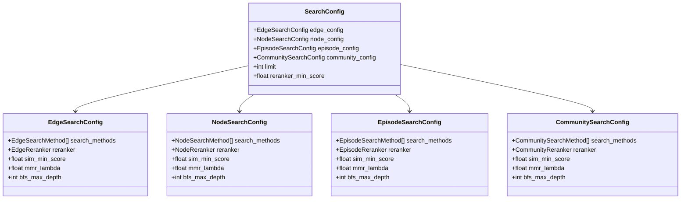

# Search Recipes

<cite>
**Referenced Files in This Document**
- [search_config_recipes.py](file://graphiti_core/search/search_config_recipes.py)
- [search_config.py](file://graphiti_core/search/search_config.py)
- [search.py](file://graphiti_core/search/search.py)
- [search_utils.py](file://graphiti_core/search/search_utils.py)
- [search_helpers.py](file://graphiti_core/search/search_helpers.py)
- [quickstart_falkordb.py](file://examples/quickstart/quickstart_falkordb.py)
- [quickstart_neo4j.py](file://examples/quickstart/quickstart_neo4j.py)
- [quickstart_neptune.py](file://examples/quickstart/quickstart_neptune.py)
- [graphiti.py](file://graphiti_core/graphiti.py)
</cite>

## Table of Contents
1. [Introduction](#introduction)
2. [Understanding Search Recipes](#understanding-search-recipes)
3. [Available Search Recipe Constants](#available-search-recipe-constants)
4. [Search Configuration Architecture](#search-configuration-architecture)
5. [Detailed Recipe Analysis](#detailed-recipe-analysis)
6. [Usage Examples](#usage-examples)
7. [Creating Custom Recipes](#creating-custom-recipes)
8. [Performance Characteristics](#performance-characteristics)
9. [Best Practices](#best-practices)
10. [Troubleshooting](#troubleshooting)

## Introduction

Graphiti's search recipes system provides pre-configured SearchConfig objects that simplify complex search configuration for common use cases. These recipes encapsulate optimal combinations of search methods, reranking strategies, and parameters specifically tuned for different types of graph data and retrieval scenarios.

Search recipes eliminate the complexity of manually configuring hybrid search strategies by providing ready-to-use templates that developers can apply immediately or customize for their specific needs. Each recipe represents a proven combination of search techniques that deliver the best balance of relevance, performance, and accuracy for particular use cases.

## Understanding Search Recipes

### Purpose and Benefits

Search recipes serve several critical purposes in the Graphiti ecosystem:

**Simplified Configuration**: Instead of manually configuring multiple search methods and reranking strategies, developers can simply import and use pre-built recipes.

**Optimized Performance**: Recipes are carefully tuned with optimal parameter values based on extensive testing and real-world usage patterns.

**Consistency**: Using standardized recipes ensures consistent search behavior across different parts of an application.

**Time Savings**: Eliminates the need for trial-and-error configuration of search parameters.

**Best Practices**: Recipes embody industry best practices for knowledge graph search, incorporating lessons learned from production deployments.

### Core Concepts

Each search recipe consists of:

- **Search Methods**: Combinations of BM25 full-text search, cosine similarity vector search, and breadth-first search (BFS)
- **Reranking Strategies**: Techniques like Reciprocal Rank Fusion (RRF), Maximal Marginal Relevance (MMR), and cross-encoder reranking
- **Parameter Tuning**: Optimized values for minimum scores, lambda parameters, and search limits
- **Context Awareness**: Specialized configurations for nodes, edges, episodes, and communities

## Available Search Recipe Constants

Graphiti provides a comprehensive set of search recipe constants organized by data type and search strategy:

### Combined Search Recipes

These recipes perform hybrid searches across all graph components (nodes, edges, episodes, communities):

| Recipe Constant | Description | Use Case |
|----------------|-------------|----------|
| `COMBINED_HYBRID_SEARCH_RRF` | Hybrid search with RRF reranking across all components | General-purpose comprehensive search |
| `COMBINED_HYBRID_SEARCH_MMR` | Hybrid search with MMR reranking across all components | Diverse result diversity with relevance |
| `COMBINED_HYBRID_SEARCH_CROSS_ENCODER` | Full-text, similarity, and BFS with cross-encoder reranking | Maximum accuracy with computational cost |

### Edge-Specific Recipes

Recipes focused exclusively on edge (relationship) search:

| Recipe Constant | Description | Use Case |
|----------------|-------------|----------|
| `EDGE_HYBRID_SEARCH_RRF` | Edge search with RRF reranking | Balanced edge retrieval |
| `EDGE_HYBRID_SEARCH_MMR` | Edge search with MMR reranking | Diverse edge selection |
| `EDGE_HYBRID_SEARCH_NODE_DISTANCE` | Edge search with graph distance reranking | Context-aware edge ranking |
| `EDGE_HYBRID_SEARCH_EPISODE_MENTIONS` | Edge search with episode mention counting | Frequency-based edge ranking |
| `EDGE_HYBRID_SEARCH_CROSS_ENCODER` | Edge search with cross-encoder reranking | Highest accuracy edge retrieval |

### Node-Specific Recipes

Recipes focused exclusively on node (entity) search:

| Recipe Constant | Description | Use Case |
|----------------|-------------|----------|
| `NODE_HYBRID_SEARCH_RRF` | Node search with RRF reranking | Balanced node retrieval |
| `NODE_HYBRID_SEARCH_MMR` | Node search with MMR reranking | Diverse node selection |
| `NODE_HYBRID_SEARCH_NODE_DISTANCE` | Node search with graph distance reranking | Context-aware node ranking |
| `NODE_HYBRID_SEARCH_EPISODE_MENTIONS` | Node search with episode mention counting | Frequency-based node ranking |
| `NODE_HYBRID_SEARCH_CROSS_ENCODER` | Node search with cross-encoder reranking | Highest accuracy node retrieval |

### Community-Specific Recipes

Recipes focused exclusively on community search:

| Recipe Constant | Description | Use Case |
|----------------|-------------|----------|
| `COMMUNITY_HYBRID_SEARCH_RRF` | Community search with RRF reranking | Balanced community retrieval |
| `COMMUNITY_HYBRID_SEARCH_MMR` | Community search with MMR reranking | Diverse community selection |
| `COMMUNITY_HYBRID_SEARCH_CROSS_ENCODER` | Community search with cross-encoder reranking | Highest accuracy community retrieval |

## Search Configuration Architecture

### SearchConfig Structure

The search configuration system is built around a hierarchical structure that mirrors the graph data model:



**Diagram sources**
- [search_config.py](file://graphiti_core/search/search_config.py#L80-L110)

### Search Methods

Each search configuration supports multiple search methods that can be combined:

| Method | Description | Use Case |
|--------|-------------|----------|
| `bm25` | Full-text BM25 search for keyword matching | Text-based fact discovery |
| `cosine_similarity` | Vector similarity search using embeddings | Semantic fact matching |
| `bfs` | Breadth-first search from seed nodes | Graph traversal and context expansion |

### Reranking Strategies

Different reranking strategies optimize search results for various priorities:

| Reranker | Description | Best For |
|----------|-------------|----------|
| `rrf` | Reciprocal Rank Fusion | Balanced relevance and diversity |
| `mmr` | Maximal Marginal Relevance | Diverse but relevant results |
| `cross_encoder` | Cross-encoder model reranking | Maximum accuracy |
| `node_distance` | Graph distance from center node | Context-aware ranking |
| `episode_mentions` | Frequency of episode mentions | Popularity-based ranking |

**Section sources**
- [search_config.py](file://graphiti_core/search/search_config.py#L32-L110)

## Detailed Recipe Analysis

### COMBINED_HYBRID_SEARCH_RRF

**Configuration**: Hybrid search across all graph components using RRF reranking

**Search Methods**:
- Edges: BM25 + Cosine Similarity
- Nodes: BM25 + Cosine Similarity  
- Episodes: BM25 only
- Communities: BM25 + Cosine Similarity

**Reranking**: Reciprocal Rank Fusion (RRF) for balanced relevance and diversity

**Performance**: Good balance of speed and accuracy, suitable for most general-purpose searches

### COMBINED_HYBRID_SEARCH_MMR

**Configuration**: Hybrid search across all graph components using MMR reranking

**Search Methods**: Same as RRF recipe

**Reranking**: Maximal Marginal Relevance with λ=1.0 for maximum diversity

**Performance**: Higher computational cost but better result diversity, ideal for exploratory searches

### COMBINED_HYBRID_SEARCH_CROSS_ENCODER

**Configuration**: Comprehensive search with cross-encoder reranking

**Search Methods**:
- Edges: BM25 + Cosine Similarity + BFS
- Nodes: BM25 + Cosine Similarity + BFS
- Episodes: BM25 only
- Communities: BM25 + Cosine Similarity

**Reranking**: Cross-encoder model for highest accuracy

**Performance**: Highest accuracy but slower due to cross-encoder processing, best for quality-critical applications

### EDGE_HYBRID_SEARCH_NODE_DISTANCE

**Configuration**: Edge search with graph distance reranking

**Search Methods**: BM25 + Cosine Similarity

**Reranking**: Node distance from center node for context-aware ranking

**Performance**: Requires center node UUID, provides contextually relevant edge ranking

### NODE_HYBRID_SEARCH_CROSS_ENCODER

**Configuration**: Node search with cross-encoder reranking

**Search Methods**: BM25 + Cosine Similarity + BFS

**Reranking**: Cross-encoder for maximum accuracy

**Limit**: 10 results by default

**Performance**: Highest accuracy for node retrieval, moderate computational cost

### COMMUNITY_HYBRID_SEARCH_CROSS_ENCODER

**Configuration**: Community search with cross-encoder reranking

**Search Methods**: BM25 + Cosine Similarity

**Reranking**: Cross-encoder for maximum accuracy

**Limit**: 3 results by default

**Performance**: Optimized for community retrieval with minimal results

**Section sources**
- [search_config_recipes.py](file://graphiti_core/search/search_config_recipes.py#L33-L224)

## Usage Examples

### Basic Recipe Usage

#### Direct Library Usage

```python
from graphiti_core.search.search_config_recipes import NODE_HYBRID_SEARCH_RRF

# Use predefined recipe with custom limit
config = NODE_HYBRID_SEARCH_RRF.model_copy(deep=True)
config.limit = 5

results = await graphiti.search("California Governor", config=config)
```

#### Advanced Search Scenarios

```python
from graphiti_core.search.search_config_recipes import COMBINED_HYBRID_SEARCH_CROSS_ENCODER

# Use comprehensive recipe for detailed search
config = COMBINED_HYBRID_SEARCH_CROSS_ENCODER
config.limit = 15

results = await graphiti.search_(
    query="What happened in California politics?",
    config=config,
    center_node_uuid=central_node_uuid
)
```

### Center Node Search with Recipes

```python
# Get initial search results to use as center node
initial_results = await graphiti.search("California Attorney General")

if initial_results and len(initial_results) > 0:
    # Use top result as center node for reranking
    center_node_uuid = initial_results[0].source_node_uuid
    
    # Apply node distance reranking
    config = EDGE_HYBRID_SEARCH_NODE_DISTANCE
    config.limit = 10
    
    reranked_results = await graphiti.search(
        "Related political events",
        center_node_uuid=center_node_uuid,
        config=config
    )
```

### Node Search Using Recipes

```python
# Example from quickstart - node search with recipe
from graphiti_core.search.search_config_recipes import NODE_HYBRID_SEARCH_RRF

# Use predefined recipe and modify parameters
node_search_config = NODE_HYBRID_SEARCH_RRF.model_copy(deep=True)
node_search_config.limit = 5

node_search_results = await graphiti._search(
    query='California Governor',
    config=node_search_config,
)
```

**Section sources**
- [quickstart_neo4j.py](file://examples/quickstart/quickstart_neo4j.py#L193-L221)
- [quickstart_falkordb.py](file://examples/quickstart/quickstart_falkordb.py#L200-L214)
- [quickstart_neptune.py](file://examples\quickstart\quickstart_neptune.py#L200-L227)

## Creating Custom Recipes

### Modifying Existing Configurations

Custom recipes can be created by modifying existing recipe configurations:

```python
from graphiti_core.search.search_config_recipes import NODE_HYBRID_SEARCH_RRF
from graphiti_core.search.search_config import (
    NodeSearchConfig, 
    NodeSearchMethod, 
    NodeReranker
)

# Create custom recipe by modifying existing one
custom_recipe = NODE_HYBRID_SEARCH_RRF.model_copy(deep=True)

# Modify search methods
custom_recipe.node_config.search_methods = [
    NodeSearchMethod.bm25, 
    NodeSearchMethod.cosine_similarity,
    NodeSearchMethod.bfs  # Add BFS for graph traversal
]

# Change reranker
custom_recipe.node_config.reranker = NodeReranker.mmr
custom_recipe.node_config.mmr_lambda = 0.7  # Adjust diversity parameter

# Customize limits
custom_recipe.limit = 8
```

### Building New Recipes from Scratch

```python
from graphiti_core.search.search_config import (
    SearchConfig, NodeSearchConfig, EdgeSearchConfig,
    NodeSearchMethod, EdgeSearchMethod, NodeReranker,
    EdgeReranker
)

# Create a custom recipe for specialized use case
custom_recipe = SearchConfig(
    node_config=NodeSearchConfig(
        search_methods=[NodeSearchMethod.bm25],
        reranker=NodeReranker.rrf,
        sim_min_score=0.7,  # Higher threshold for quality
    ),
    edge_config=EdgeSearchConfig(
        search_methods=[EdgeSearchMethod.cosine_similarity],
        reranker=EdgeReranker.episode_mentions,
        sim_min_score=0.6,
    ),
    limit=12,
    reranker_min_score=0.5,
)
```

### Parameter Tuning Guidelines

When creating custom recipes, consider these parameter tuning guidelines:

**Search Limits**: 
- General searches: 10-20 results
- Focused searches: 5-10 results
- Cross-encoder searches: 3-15 results (depending on computational budget)

**Minimum Scores**:
- BM25/BFS: 0.0-0.3 (higher for quality)
- Cosine similarity: 0.6-0.9 (context-dependent)
- Cross-encoder: 0.0-1.0 (model-dependent)

**MMR Lambda Values**:
- 0.0: Pure relevance
- 0.5: Balanced relevance/diversity
- 1.0: Pure diversity

**BFS Depth**:
- 1-2: Local context
- 3-4: Broader exploration
- 5+: Extensive graph traversal (expensive)

## Performance Characteristics

### Computational Complexity

Different recipes have varying computational requirements:

| Recipe Type | CPU Usage | Memory Usage | Latency | Throughput |
|-------------|-----------|--------------|---------|------------|
| RRF Recipes | Low-Medium | Low | Fast (<100ms) | High |
| MMR Recipes | Medium-High | Medium | Medium (100-500ms) | Medium |
| Cross-Encoder | High | Medium-High | Slow (500ms-2s) | Low |
| BFS + RRF | Medium | Medium | Medium | Medium |

### Recommended Contexts

**Fast Response Required**:
- Use RRF recipes (NODE_HYBRID_SEARCH_RRF, EDGE_HYBRID_SEARCH_RRF)
- Consider reducing search limits
- Avoid cross-encoder reranking

**Quality Over Speed**:
- Use cross-encoder recipes (CROSS_ENCODER variants)
- Increase search limits
- Combine multiple search methods

**Exploratory Searches**:
- Use MMR recipes (COMBINED_HYBRID_SEARCH_MMR)
- Higher MMR lambda values for diversity
- Larger result sets

**Context-Aware Searches**:
- Use node distance reranking
- Provide center node UUID
- Focus on graph-local results

### Scaling Considerations

**Large Datasets**:
- Reduce search limits
- Use RRF reranking for scalability
- Consider filtering by group_ids

**High-Concurrency Environments**:
- Use simpler recipes (RRF over MMR)
- Implement result caching
- Monitor cross-encoder queue depth

**Memory-Constrained Systems**:
- Reduce result limits
- Use fewer search methods
- Consider streaming results

## Best Practices

### Recipe Selection Guidelines

**Choose Based on Use Case**:
- **General Information Retrieval**: COMBINED_HYBRID_SEARCH_RRF
- **Exploratory Discovery**: COMBINED_HYBRID_SEARCH_MMR
- **Highest Accuracy**: COMBINED_HYBRID_SEARCH_CROSS_ENCODER
- **Node-Focused Queries**: NODE_* variants
- **Relationship-Focused Queries**: EDGE_* variants
- **Community Analysis**: COMMUNITY_* variants

**Consider Computational Budget**:
- Evaluate response time requirements
- Monitor resource utilization
- Test with representative query loads

**Balance Quality and Performance**:
- Start with simpler recipes
- Gradually increase complexity
- Profile and optimize based on usage patterns

### Configuration Management

**Environment-Specific Configurations**:
```python
# Production: High accuracy
production_config = COMBINED_HYBRID_SEARCH_CROSS_ENCODER

# Development: Fast iteration
dev_config = NODE_HYBRID_SEARCH_RRF

# Testing: Consistent results
test_config = NODE_HYBRID_SEARCH_RRF
test_config.limit = 3
```

**Dynamic Configuration**:
```python
def get_search_config(query_type: str, user_preference: str) -> SearchConfig:
    if query_type == "exploration":
        return COMBINED_HYBRID_SEARCH_MMR
    elif query_type == "accuracy":
        return COMBINED_HYBRID_SEARCH_CROSS_ENCODER
    elif user_preference == "fast":
        return NODE_HYBRID_SEARCH_RRF
    else:
        return NODE_HYBRID_SEARCH_CROSS_ENCODER
```

### Monitoring and Optimization

**Track Performance Metrics**:
- Search latency per recipe type
- Result quality scores
- Resource utilization
- User satisfaction metrics

**A/B Testing**:
- Compare different recipes for specific use cases
- Measure impact on user engagement
- Gather qualitative feedback

**Continuous Improvement**:
- Regular performance reviews
- User feedback incorporation
- Recipe refinement based on usage patterns

## Troubleshooting

### Common Issues and Solutions

**Poor Search Quality**:
- **Symptom**: Irrelevant or low-quality results
- **Solution**: Try cross-encoder recipes or adjust minimum scores
- **Example**: Switch from RRF to CROSS_ENCODER variant

**Slow Response Times**:
- **Symptom**: Search queries taking too long
- **Solution**: Use RRF recipes or reduce result limits
- **Example**: Set `config.limit = 5` for faster responses

**Memory Issues**:
- **Symptom**: Out of memory errors during search
- **Solution**: Reduce result limits or use simpler rerankers
- **Example**: Use NODE_HYBRID_SEARCH_RRF instead of CROSS_ENCODER

**Missing Results**:
- **Symptom**: Expected results not appearing
- **Solution**: Lower minimum score thresholds or add BFS search method
- **Example**: Increase `sim_min_score` from 0.6 to 0.4

### Debugging Search Configurations

**Enable Logging**:
```python
import logging
logging.getLogger('graphiti_core.search').setLevel(logging.DEBUG)
```

**Inspect Search Results**:
```python
results = await graphiti.search("query", config=config)
print(f"Found {len(results.edges)} edges, {len(results.nodes)} nodes")
print(f"Edge scores: {results.edge_reranker_scores}")
print(f"Node scores: {results.node_reranker_scores}")
```

**Test Individual Components**:
```python
# Test BM25 search only
config.edge_config.search_methods = [EdgeSearchMethod.bm25]
results_bm25 = await graphiti.search("query", config=config)

# Test similarity search only  
config.edge_config.search_methods = [EdgeSearchMethod.cosine_similarity]
results_sim = await graphiti.search("query", config=config)
```

### Performance Optimization Tips

**Query Optimization**:
- Use specific search filters to reduce scope
- Provide group_ids for targeted searches
- Consider query preprocessing and sanitization

**Resource Management**:
- Implement result caching for common queries
- Use connection pooling for database access
- Monitor and limit concurrent search requests

**Recipe Selection**:
- Profile different recipes with representative queries
- Consider user preference and context
- Implement fallback strategies for failed searches

**Section sources**
- [search.py](file://graphiti_core/search/search.py#L68-L183)
- [search_utils.py](file://graphiti_core/search/search_utils.py#L1818-L1861)