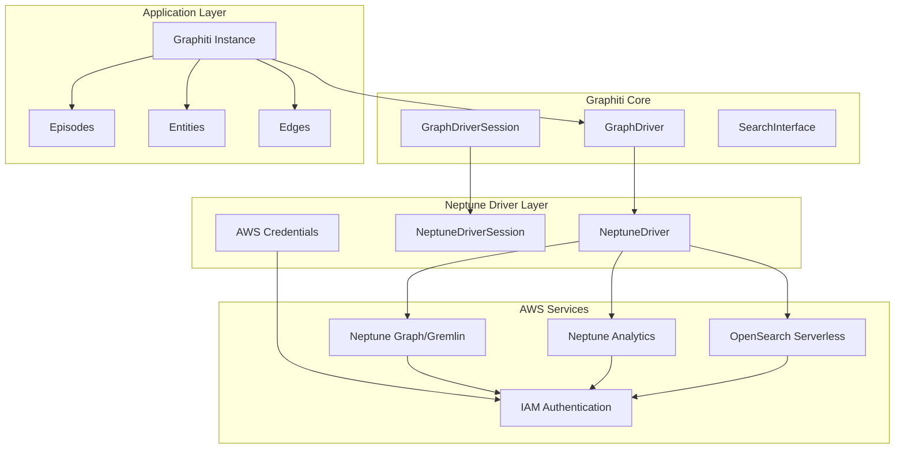
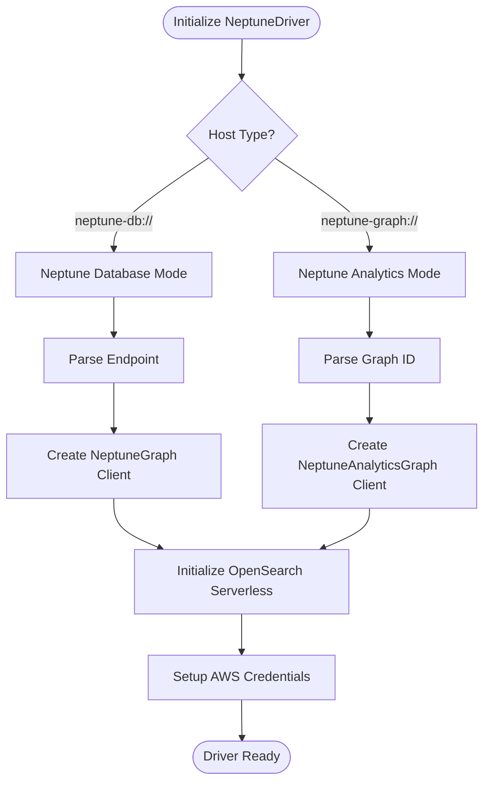
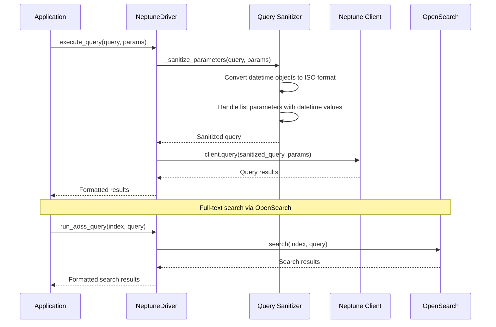
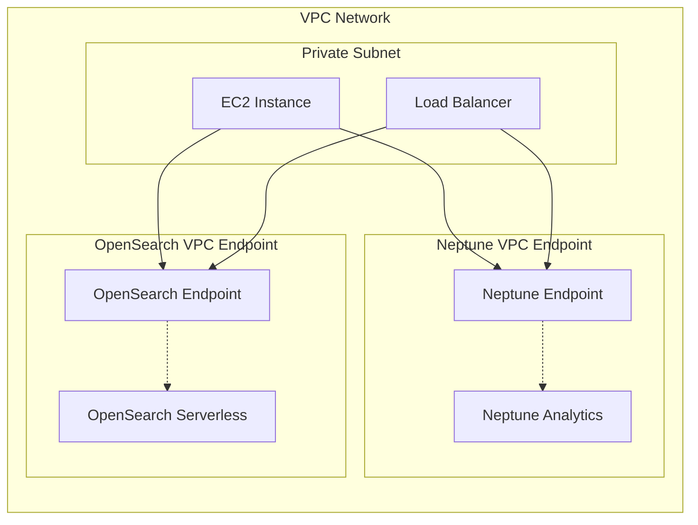
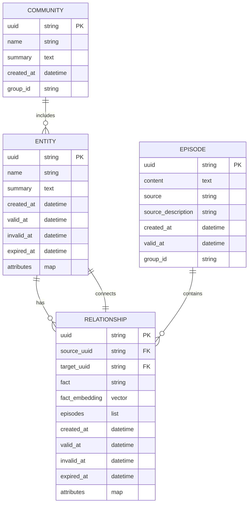
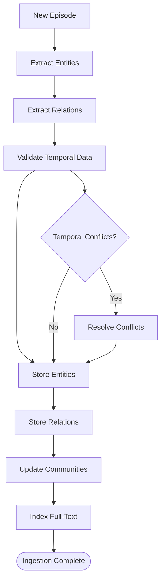
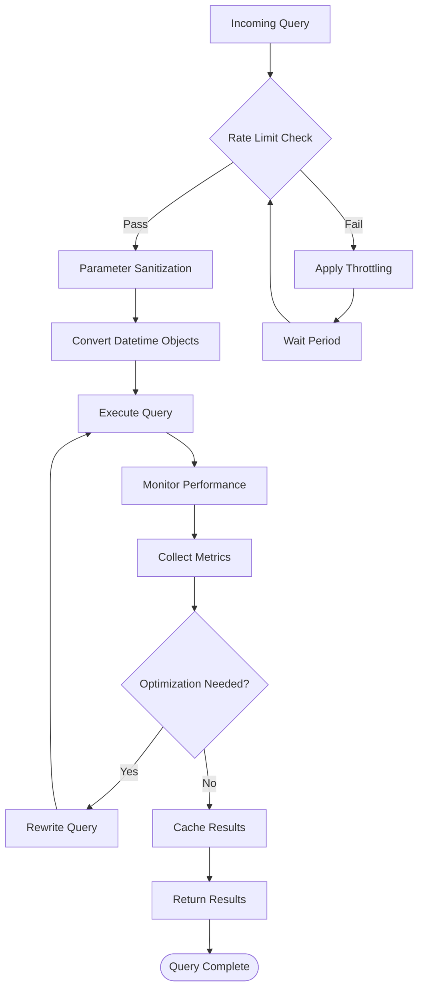
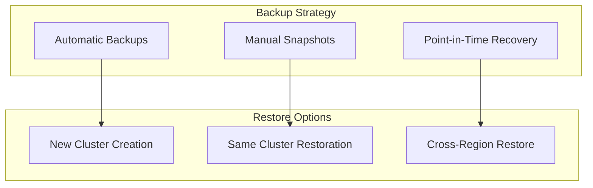
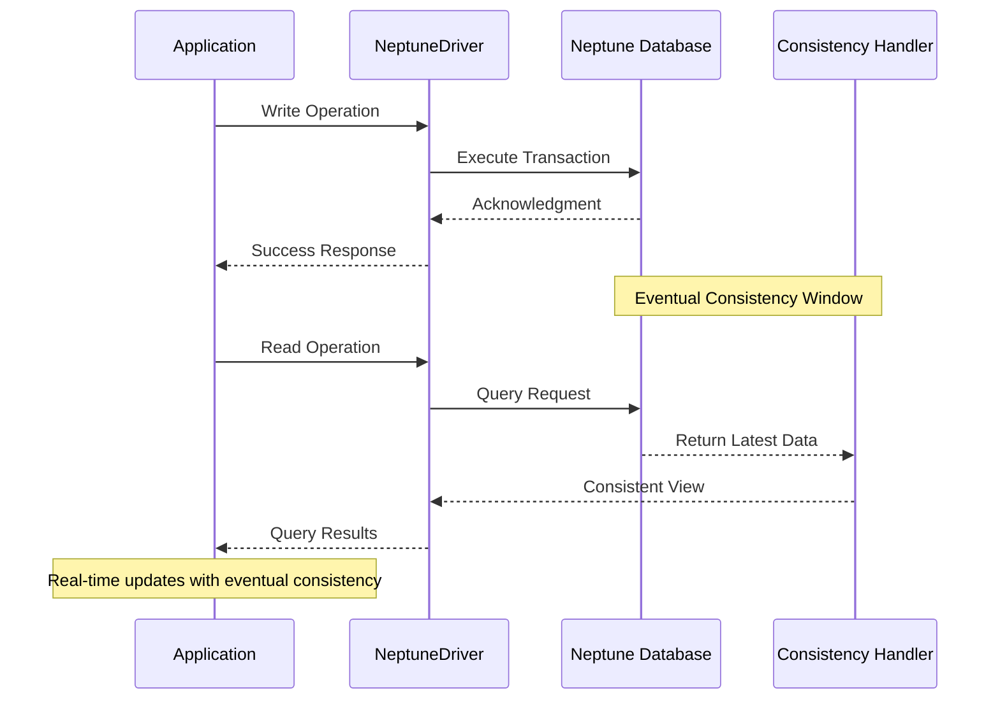
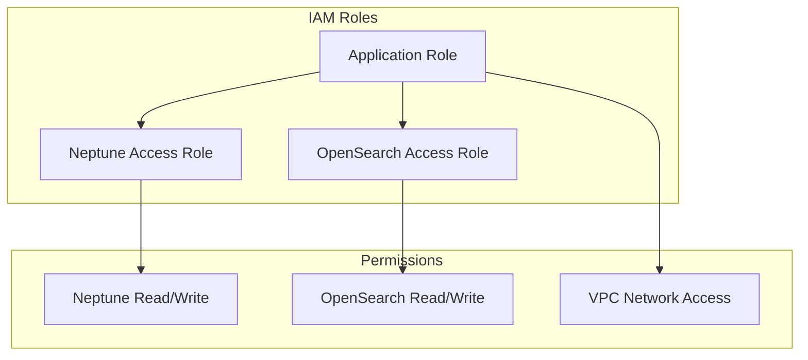

# Amazon Neptune Integration

<cite>
**Referenced Files in This Document**
- [neptune_driver.py](file://graphiti_core/driver/neptune_driver.py)
- [quickstart_neptune.py](file://examples/quickstart/quickstart_neptune.py)
- [driver.py](file://graphiti_core/driver/driver.py)
- [search_interface.py](file://graphiti_core/driver/search_interface/search_interface.py)
- [graphiti_types.py](file://graphiti_core/graphiti_types.py)
- [temporal_operations.py](file://graphiti_core/utils/maintenance/temporal_operations.py)
- [README.md](file://README.md)
</cite>

## Table of Contents
1. [Introduction](#introduction)
2. [Architecture Overview](#architecture-overview)
3. [NeptuneDriver Implementation](#nepthedriver-implementation)
4. [AWS-Specific Configuration](#aws-specific-configuration)
5. [Bi-Temporal Data Storage Patterns](#bi-temporal-data-storage-patterns)
6. [Performance Considerations](#performance-considerations)
7. [Monitoring and Observability](#monitoring-and-observability)
8. [Eventual Consistency Handling](#eventual-consistency-handling)
9. [Security and Authentication](#security-and-authentication)
10. [Best Practices and Guidelines](#best-practices-and-guidelines)
11. [Troubleshooting](#troubleshooting)

## Introduction

The Amazon Neptune driver implementation in Graphiti provides seamless integration with AWS Neptune for building scalable, distributed knowledge graphs. This driver enables secure, production-ready connections to both Neptune Database Clusters and Neptune Analytics Graphs, leveraging AWS's managed graph database services with advanced features like IAM authentication, VPC endpoints, and SSL encryption.

Graphiti's Neptune driver supports both Gremlin and openCypher query languages, making it compatible with the full spectrum of Neptune's capabilities. The implementation includes sophisticated bi-temporal data storage patterns that align perfectly with Neptune's distributed architecture, enabling real-time knowledge graph updates while maintaining historical accuracy.

## Architecture Overview

The Neptune driver follows Graphiti's unified driver architecture, providing consistent interfaces across different graph database backends while leveraging Neptune-specific optimizations.

**Diagram sources**
- [neptune_driver.py](file://graphiti_core/driver/neptune_driver.py#L109-L300)
- [driver.py](file://graphiti_core/driver/driver.py#L73-L116)

**Section sources**
- [neptune_driver.py](file://graphiti_core/driver/neptune_driver.py#L109-L300)
- [driver.py](file://graphiti_core/driver/driver.py#L73-L116)

## NeptuneDriver Implementation

The `NeptuneDriver` class serves as the primary interface for connecting to AWS Neptune, supporting both Neptune Database and Neptune Analytics deployments.

### Core Initialization

The driver supports two connection modes:

**Diagram sources**
- [neptune_driver.py](file://graphiti_core/driver/neptune_driver.py#L124-L137)

### Connection Management

The driver establishes connections to both Neptune graph databases and OpenSearch Serverless for full-text search capabilities:

| Component | Purpose | Configuration |
|-----------|---------|---------------|
| Neptune Client | Graph database operations | Gremlin or openCypher queries |
| OpenSearch Client | Full-text search | Vector similarity and BM25 search |
| AWS Session | Authentication | IAM credentials and region |

**Section sources**
- [neptune_driver.py](file://graphiti_core/driver/neptune_driver.py#L112-L152)

### Query Execution Pipeline

The query execution process includes parameter sanitization, datetime conversion, and error handling:

**Diagram sources**
- [neptune_driver.py](file://graphiti_core/driver/neptune_driver.py#L154-L212)

**Section sources**
- [neptune_driver.py](file://graphiti_core/driver/neptune_driver.py#L154-L212)

## AWS-Specific Configuration

### IAM Authentication Setup

The driver automatically configures AWS IAM authentication using the boto3 session:

| Configuration Element | Description | Security Level |
|----------------------|-------------|----------------|
| AWS Credentials | Automatic credential discovery | IAM roles, profiles, env vars |
| Region Detection | Auto-detect AWS region | Based on session configuration |
| Service Signer | AWS V4 signer for 'aoss' service | Cryptographic signature |
| SSL Verification | Certificate validation | Production-ready HTTPS |

### VPC Endpoint Configuration

For optimal security and performance, configure VPC endpoints:

### SSL/TLS Configuration

The driver enforces secure communication:

- **SSL Enabled**: All connections use TLS encryption
- **Certificate Verification**: Production-grade certificate validation
- **Connection Pooling**: Optimized connection management with pool size of 20
- **HTTP/HTTPS**: Automatic protocol selection based on configuration

**Section sources**
- [neptune_driver.py](file://graphiti_core/driver/neptune_driver.py#L142-L152)

### Proxy Configuration

While not explicitly configured in the driver, proxy support can be achieved through boto3 configuration:

| Proxy Type | Configuration Method | Use Case |
|------------|---------------------|----------|
| HTTP Proxy | boto3 session config | Corporate networks |
| SOCKS Proxy | Environment variables | Secure tunneling |
| Custom Headers | Request middleware | API gateways |

## Bi-Temporal Data Storage Patterns

Graphiti's Neptune driver implements sophisticated bi-temporal data storage patterns that leverage Neptune's distributed architecture for real-time knowledge graph operations.

### Temporal Data Model

The bi-temporal model tracks both event occurrence time and ingestion time:

**Diagram sources**
- [temporal_operations.py](file://graphiti_core/utils/maintenance/temporal_operations.py#L33-L108)

### Temporal Query Patterns

The driver supports various temporal query patterns optimized for Neptune's distributed nature:

| Query Pattern | Use Case | Performance Characteristics |
|---------------|----------|---------------------------|
| Point-in-Time Queries | Historical accuracy | Linear scaling with graph size |
| Time Range Queries | Temporal analysis | Efficient indexing support |
| Event Occurrence Queries | Real-time updates | Near real-time consistency |
| Ingestion Time Queries | Audit trails | Built-in temporal indexing |

### Data Ingestion Patterns

The driver implements efficient data ingestion patterns for bi-temporal data:

**Section sources**
- [temporal_operations.py](file://graphiti_core/utils/maintenance/temporal_operations.py#L33-L108)

## Performance Considerations

### Read Replica Utilization

While the current driver doesn't explicitly support read replicas, Neptune's architecture naturally supports read scaling:

| Scaling Option | Benefit | Implementation |
|----------------|---------|----------------|
| Reader Instances | Read workload distribution | Neptune cluster configuration |
| Query Parallelization | Concurrent query execution | Driver-level batching |
| Connection Pooling | Resource optimization | Built-in pool_maxsize=20 |
| Query Optimization | Reduced latency | Index-aware query patterns |

### Query Throttling and Rate Limiting

The driver implements several mechanisms for managing query performance:

### Large Result Set Handling

The driver implements pagination and streaming for large result sets:

| Strategy | Use Case | Implementation |
|----------|----------|----------------|
| Pagination | Known result counts | LIMIT/OFFSET patterns |
| Streaming | Unbounded results | Generator patterns |
| Batching | Bulk operations | UNWIND operations |
| Caching | Frequently accessed data | OpenSearch indexing |

**Section sources**
- [neptune_driver.py](file://graphiti_core/driver/neptune_driver.py#L154-L212)

## Monitoring and Observability

### CloudWatch Integration

The driver logs comprehensive metrics and events for CloudWatch monitoring:

| Log Level | Information Captured | Use Case |
|-----------|---------------------|----------|
| DEBUG | Query execution details | Development debugging |
| INFO | Connection status | Operational monitoring |
| ERROR | Query failures and exceptions | Incident investigation |

### Backup and Restore Procedures

Neptune provides built-in backup capabilities:

### Cross-Region Replication

For disaster recovery and global distribution:

| Replication Type | Use Case | Configuration |
|------------------|----------|---------------|
| Global Clusters | Multi-region availability | AWS Console/CLI |
| Cross-Region Snapshots | Geographic distribution | Automated scripts |
| Read Replicas | Regional read scaling | Cluster configuration |

## Eventual Consistency Handling

### Real-Time Knowledge Graph Updates

The driver handles Neptune's eventual consistency model for real-time updates:

### Conflict Resolution Strategies

The driver implements conflict resolution for concurrent updates:

| Conflict Type | Resolution Strategy | Implementation |
|---------------|-------------------|----------------|
| Temporal Conflicts | Timestamp-based ordering | Bi-temporal timestamps |
| Structural Conflicts | Merge operations | Graph merge semantics |
| Content Conflicts | LLM-based resolution | AI-powered conflict detection |

**Section sources**
- [temporal_operations.py](file://graphiti_core/utils/maintenance/temporal_operations.py#L74-L108)

## Security and Authentication

### IAM Role Configuration

Proper IAM role setup is crucial for secure access:

### Network Security

Network-level security measures:

| Security Layer | Implementation | Benefit |
|----------------|----------------|---------|
| VPC Isolation | Private subnets | Network segmentation |
| Security Groups | Port-based filtering | Traffic control |
| TLS Encryption | End-to-end encryption | Data protection |
| IAM Policies | Fine-grained permissions | Principle of least privilege |

**Section sources**
- [neptune_driver.py](file://graphiti_core/driver/neptune_driver.py#L142-L152)

## Best Practices and Guidelines

### Connection Management

1. **Connection Pooling**: Use the built-in pool_maxsize of 20 for optimal performance
2. **Session Management**: Properly close sessions to prevent resource leaks
3. **Error Handling**: Implement comprehensive error handling for network issues
4. **Retry Logic**: Configure appropriate retry policies for transient failures

### Query Optimization

1. **Parameter Binding**: Use parameterized queries for security and performance
2. **Index Usage**: Leverage Neptune's automatic indexing capabilities
3. **Batch Operations**: Group related operations for efficiency
4. **Pagination**: Implement proper pagination for large result sets

### Data Modeling

1. **Temporal Design**: Structure data for efficient temporal queries
2. **Index Strategy**: Design indexes based on query patterns
3. **Partitioning**: Consider data partitioning for large datasets
4. **Schema Evolution**: Plan for schema changes over time

### Monitoring and Maintenance

1. **Performance Metrics**: Track query latency and throughput
2. **Resource Usage**: Monitor CPU and memory consumption
3. **Error Rates**: Track and investigate failure patterns
4. **Capacity Planning**: Plan for growth and scaling needs

**Section sources**
- [quickstart_neptune.py](file://examples/quickstart/quickstart_neptune.py#L60-L80)

## Troubleshooting

### Common Issues and Solutions

| Issue | Symptoms | Solution |
|-------|----------|----------|
| Authentication Failures | AWS credential errors | Verify IAM role and permissions |
| Connection Timeouts | Network connectivity issues | Check VPC configuration and security groups |
| Query Performance | Slow response times | Optimize queries and indexes |
| Memory Issues | Out of memory errors | Implement pagination and batch processing |

### Debugging Techniques

1. **Enable Debug Logging**: Set log level to DEBUG for detailed information
2. **Query Analysis**: Use EXPLAIN plans for query optimization
3. **Network Diagnostics**: Test connectivity to Neptune endpoints
4. **Resource Monitoring**: Monitor system resources during operation

### Performance Tuning

1. **Query Optimization**: Analyze and optimize slow queries
2. **Index Management**: Create appropriate indexes for query patterns
3. **Connection Tuning**: Adjust pool sizes and timeouts
4. **Batch Processing**: Implement efficient batch operations

**Section sources**
- [neptune_driver.py](file://graphiti_core/driver/neptune_driver.py#L204-L211)