# Core Graph Operations

<cite>
**Referenced Files in This Document**   
- [graph_operations.py](file://graphiti_core/driver/graph_operations/graph_operations.py)
- [search_interface.py](file://graphiti_core/driver/search_interface/search_interface.py)
- [driver.py](file://graphiti_core/driver/driver.py)
- [neo4j_driver.py](file://graphiti_core/driver/neo4j_driver.py)
- [falkordb_driver.py](file://graphiti_core/driver/falkordb_driver.py)
- [neptune_driver.py](file://graphiti_core/driver/neptune_driver.py)
- [kuzu_driver.py](file://graphiti_core/driver/kuzu_driver.py)
- [node_db_queries.py](file://graphiti_core/models/nodes/node_db_queries.py)
- [edge_db_queries.py](file://graphiti_core/models/edges/edge_db_queries.py)
- [edges.py](file://graphiti_core/edges.py)
- [test_edge_int.py](file://tests/test_edge_int.py)
- [invalidate_edges.py](file://graphiti_core/prompts/invalidate_edges.py)
- [extract_edge_dates.py](file://graphiti_core/prompts/extract_edge_dates.py)
- [temporal_operations.py](file://graphiti_core/utils/maintenance/temporal_operations.py)
- [edge_operations.py](file://graphiti_core/utils/maintenance/edge_operations.py)
</cite>

## Table of Contents
1. [Introduction](#introduction)
2. [Graph Operations Interface](#graph-operations-interface)
3. [Search Interface](#search-interface)
4. [Driver Architecture](#driver-architecture)
5. [Node Operations](#node-operations)
6. [Edge Operations](#edge-operations)
7. [Temporal Indexing and Entity Resolution](#temporal-indexing-and-entity-resolution)
8. [Relationship Invalidation](#relationship-invalidation)
9. [Database-Specific Implementations](#database-specific-implementations)
10. [Error Handling and Transaction Management](#error-handling-and-transaction-management)
11. [Idempotency Guarantees](#idempotency-guarantees)
12. [Conclusion](#conclusion)

## Introduction

Graphiti provides a unified graph operations layer that abstracts database-specific implementations behind standardized interfaces. This architecture enables database-agnostic development while ensuring consistent behavior across different backend systems. The core of this abstraction lies in two primary interfaces: `GraphOperationsInterface` and `SearchInterface`, which define standardized methods for graph mutation, querying, and search operations. These interfaces allow Graphiti to support multiple graph databases including Neo4j, FalkorDB, Kuzu, and Amazon Neptune through concrete driver implementations that translate the abstract operations into native queries.

The unified operations layer provides several key benefits:
- **Database Agnosticism**: Applications can switch between different graph databases without changing business logic
- **Consistent Behavior**: Standardized method signatures and return types ensure predictable behavior across backends
- **Extensibility**: New database drivers can be added by implementing the defined interfaces
- **Simplified Development**: Developers work with a consistent API regardless of the underlying database technology

This document details the abstract interfaces, method signatures, parameter definitions, and expected return types that constitute Graphiti's unified graph operations layer.

**Section sources**
- [graph_operations.py](file://graphiti_core/driver/graph_operations/graph_operations.py)
- [search_interface.py](file://graphiti_core/driver/search_interface/search_interface.py)

## Graph Operations Interface

The `GraphOperationsInterface` serves as the foundation for all graph mutation operations in Graphiti. This interface defines standardized methods for creating, updating, and deleting nodes and edges across different database backends. By implementing this interface, concrete drivers ensure consistent behavior regardless of the underlying database technology.

The interface is organized into logical sections based on operation type and entity category:

### Node Operations

The node operations section defines methods for persisting and retrieving node data:

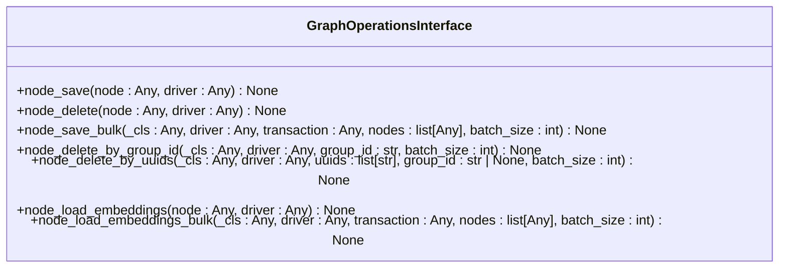

**Diagram sources**
- [graph_operations.py](file://graphiti_core/driver/graph_operations/graph_operations.py#L31-L89)

### Episodic Node Operations

Specialized methods for handling episodic nodes, which represent time-based events or episodes in the knowledge graph:

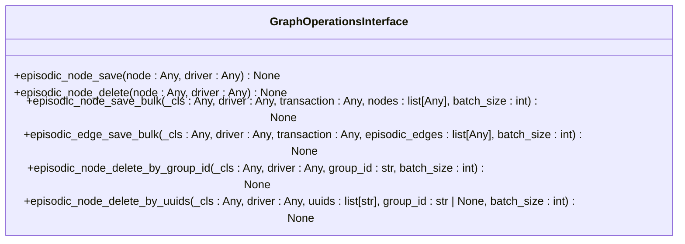

**Diagram sources**
- [graph_operations.py](file://graphiti_core/driver/graph_operations/graph_operations.py#L95-L141)

### Edge Operations

Methods for managing relationships between nodes in the graph:

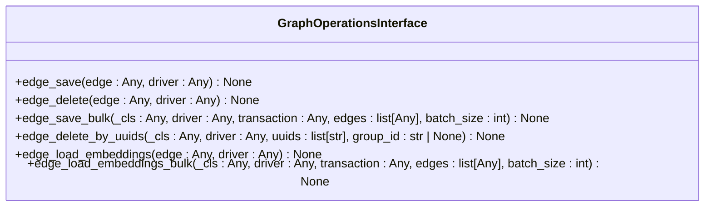

**Diagram sources**
- [graph_operations.py](file://graphiti_core/driver/graph_operations/graph_operations.py#L147-L195)

## Search Interface

The `SearchInterface` defines standardized methods for executing various types of searches against the graph database. This interface ensures consistent search capabilities across different backend systems, supporting both full-text and vector-based similarity searches.

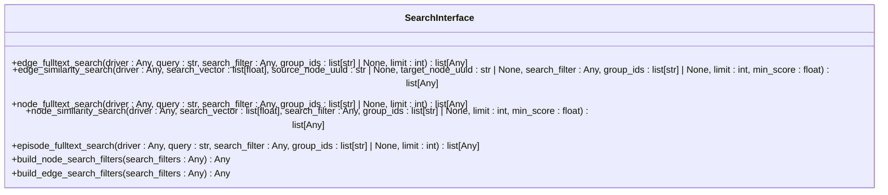

**Diagram sources**
- [search_interface.py](file://graphiti_core/driver/search_interface/search_interface.py#L27-L87)

The search interface supports several key search types:

### Full-Text Search Methods
- **edge_fulltext_search**: Searches for edges using text-based queries
- **node_fulltext_search**: Searches for nodes using text-based queries  
- **episode_fulltext_search**: Searches for episodic nodes using text-based queries

### Similarity Search Methods
- **edge_similarity_search**: Finds edges similar to a given embedding vector
- **node_similarity_search**: Finds nodes similar to a given embedding vector

### Search Filter Methods
- **build_node_search_filters**: Constructs filter conditions for node searches
- **build_edge_search_filters**: Constructs filter conditions for edge searches

All search methods support optional filtering by `group_id` and result limiting through the `limit` parameter. Similarity searches include a `min_score` parameter to filter results by relevance threshold.

**Section sources**
- [search_interface.py](file://graphiti_core/driver/search_interface/search_interface.py)

## Driver Architecture

Graphiti's driver architecture provides a consistent abstraction layer over different graph database technologies. The core components include the `GraphDriver` base class and database-specific implementations that handle the translation of abstract operations into native queries.

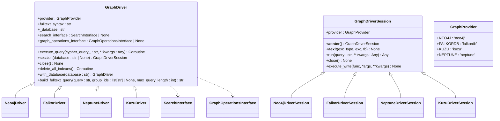

**Diagram sources**
- [driver.py](file://graphiti_core/driver/driver.py#L42-L116)
- [neo4j_driver.py](file://graphiti_core/driver/neo4j_driver.py)
- [falkordb_driver.py](file://graphiti_core/driver/falkordb_driver.py)
- [neptune_driver.py](file://graphiti_core/driver/neptune_driver.py)
- [kuzu_driver.py](file://graphiti_core/driver/kuzu_driver.py)

The architecture follows these key principles:

### Provider Enumeration
The `GraphProvider` enum defines the supported database backends:
- **NEO4J**: Neo4j graph database
- **FALKORDB**: FalkorDB graph database
- **KUZU**: Kuzu graph database
- **NEPTUNE**: Amazon Neptune graph database

### Core Driver Components
- **GraphDriver**: Abstract base class defining the common interface for all drivers
- **GraphDriverSession**: Manages database sessions and transactions
- **execute_query**: Executes Cypher or equivalent queries against the database
- **session**: Creates a new database session
- **close**: Closes the database connection
- **delete_all_indexes**: Removes all indexes from the database

### Interface Composition
Each driver can be configured with optional interfaces:
- **search_interface**: Implements custom search logic
- **graph_operations_interface**: Overrides default graph mutation behavior

This composition pattern allows for flexible extension and customization of driver behavior.

**Section sources**
- [driver.py](file://graphiti_core/driver/driver.py)

## Node Operations

Node operations in Graphiti follow a standardized pattern across all database backends, with concrete implementations translating the abstract operations into database-specific queries. The operations are designed to be idempotent and support both individual and bulk operations.

### Node Creation and Update

The `node_save` and `node_save_bulk` methods handle the creation and updating of nodes in the graph. These operations use MERGE semantics to ensure idempotency - if a node with the given UUID exists, it is updated; otherwise, it is created.

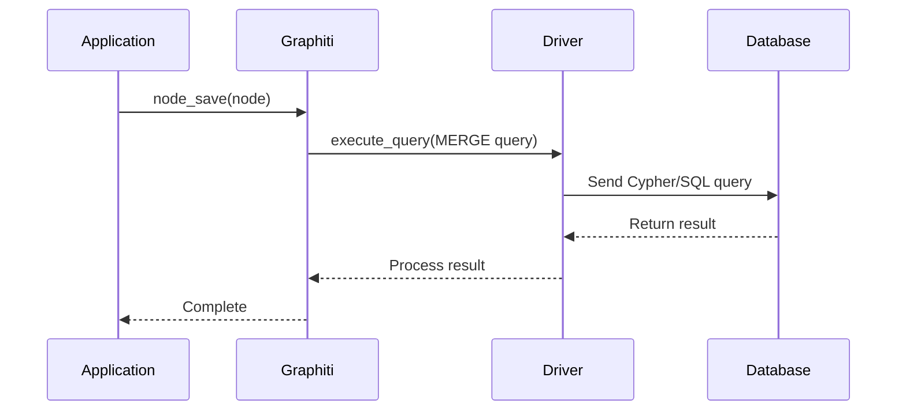

**Diagram sources**
- [graph_operations.py](file://graphiti_core/driver/graph_operations/graph_operations.py#L31-L47)
- [node_db_queries.py](file://graphiti_core/models/nodes/node_db_queries.py)

The node creation process varies slightly between database providers:

#### Neo4j Implementation
Uses standard Cypher MERGE statements with property assignment:
```cypher
MERGE (n:Entity {uuid: $entity_data.uuid})
SET n:{labels}
SET n = $entity_data
RETURN n.uuid AS uuid
```

#### FalkorDB Implementation
Similar to Neo4j but with vector property handling:
```cypher
MERGE (n:Entity {uuid: $entity_data.uuid})
SET n:{labels}
SET n = $entity_data
SET n.name_embedding = vecf32($entity_data.name_embedding)
RETURN n.uuid AS uuid
```

#### Neptune Implementation
Requires special handling for arrays and vector properties:
```cypher
MERGE (n:Entity {uuid: $entity_data.uuid})
SET n:{labels}
SET n = removeKeyFromMap(removeKeyFromMap($entity_data, "labels"), "name_embedding")
SET n.name_embedding = join([x IN coalesce($entity_data.name_embedding, []) | toString(x) ], ",")
RETURN n.uuid AS uuid
```

#### Kuzu Implementation
Uses explicit property setting due to schema requirements:
```cypher
MERGE (n:Entity {uuid: $uuid})
SET
    n.name = $name,
    n.group_id = $group_id,
    n.labels = $labels,
    n.created_at = $created_at,
    n.name_embedding = $name_embedding,
    n.summary = $summary,
    n.attributes = $attributes
RETURN n.uuid AS uuid
```

**Section sources**
- [node_db_queries.py](file://graphiti_core/models/nodes/node_db_queries.py)
- [falkordb_driver.py](file://graphiti_core/driver/falkordb_driver.py#L149-L180)
- [neo4j_driver.py](file://graphiti_core/driver/neo4j_driver.py#L48-L62)

## Edge Operations

Edge operations in Graphiti manage the relationships between nodes in the knowledge graph. These operations follow the same standardized interface across all database backends, with provider-specific implementations handling the translation to native query languages.

### Edge Creation and Update

The `edge_save` and `edge_save_bulk` methods handle the creation and updating of relationships between nodes. Like node operations, these use MERGE semantics for idempotency.

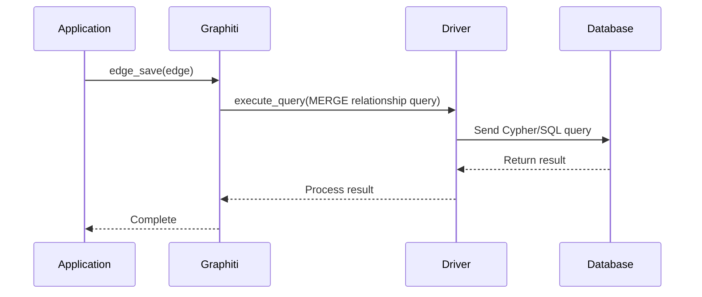

**Diagram sources**
- [graph_operations.py](file://graphiti_core/driver/graph_operations/graph_operations.py#L147-L163)
- [edge_db_queries.py](file://graphiti_core/models/edges/edge_db_queries.py)

The edge creation process varies by database provider:

#### Neo4j Implementation
Standard Cypher pattern with vector property handling:
```cypher
MATCH (source:Entity {uuid: $edge_data.source_uuid})
MATCH (target:Entity {uuid: $edge_data.target_uuid})
MERGE (source)-[e:RELATES_TO {uuid: $edge_data.uuid}]->(target)
SET e = $edge_data
WITH e CALL db.create.setRelationshipVectorProperty(e, "fact_embedding", $edge_data.fact_embedding)
RETURN e.uuid AS uuid
```

#### FalkorDB Implementation
Similar to Neo4j with vector type casting:
```cypher
MATCH (source:Entity {uuid: $edge_data.source_uuid})
MATCH (target:Entity {uuid: $edge_data.target_uuid})
MERGE (source)-[e:RELATES_TO {uuid: $edge_data.uuid}]->(target)
SET e = $edge_data
SET e.fact_embedding = vecf32($edge_data.fact_embedding)
RETURN e.uuid AS uuid
```

#### Neptune Implementation
Special handling for arrays and vector properties:
```cypher
MATCH (source:Entity {uuid: $edge_data.source_uuid})
MATCH (target:Entity {uuid: $edge_data.target_uuid})
MERGE (source)-[e:RELATES_TO {uuid: $edge_data.uuid}]->(target)
SET e = removeKeyFromMap(removeKeyFromMap($edge_data, "fact_embedding"), "episodes")
SET e.fact_embedding = join([x IN coalesce($edge_data.fact_embedding, []) | toString(x) ], ",")
SET e.episodes = join($edge_data.episodes, ",")
RETURN $edge_data.uuid AS uuid
```

#### Kuzu Implementation
Uses a node-based approach for relationships due to schema constraints:
```cypher
MATCH (source:Entity {uuid: $source_uuid})
MATCH (target:Entity {uuid: $target_uuid})
MERGE (source)-[:RELATES_TO]->(e:RelatesToNode_ {uuid: $uuid})-[:RELATES_TO]->(target)
SET
    e.group_id = $group_id,
    e.created_at = $created_at,
    e.name = $name,
    e.fact = $fact,
    e.fact_embedding = $fact_embedding,
    e.episodes = $episodes,
    e.expired_at = $expired_at,
    e.valid_at = $valid_at,
    e.invalid_at = $invalid_at,
    e.attributes = $attributes
RETURN e.uuid AS uuid
```

**Section sources**
- [edge_db_queries.py](file://graphiti_core/models/edges/edge_db_queries.py)
- [edges.py](file://graphiti_core/edges.py#L55-L79)
- [test_edge_int.py](file://tests/test_edge_int.py#L248-L254)

## Temporal Indexing and Entity Resolution

Graphiti provides sophisticated temporal indexing and entity resolution capabilities through standardized interfaces and provider-specific implementations. These features enable the system to handle time-based relationships and resolve entity identities across different contexts.

### Temporal Indexing

Temporal indexing allows relationships to be associated with specific time periods through `valid_at` and `invalid_at` timestamps. This enables historical querying and temporal reasoning within the knowledge graph.

The temporal indexing system follows these principles:

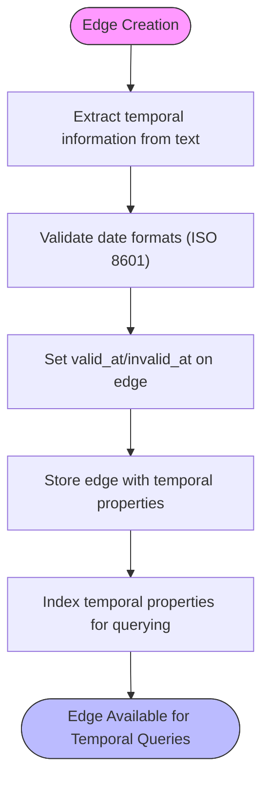

**Diagram sources**
- [extract_edge_dates.py](file://graphiti_core/prompts/extract_edge_dates.py#L68-L83)
- [edge_db_queries.py](file://graphiti_core/models/edges/edge_db_queries.py)

Key temporal indexing features:

- **valid_at**: The date and time when the relationship became true
- **invalid_at**: The date and time when the relationship stopped being true
- **expired_at**: When the relationship was marked as expired
- **created_at**: When the relationship was created in the system

Temporal queries can filter relationships based on these timestamps, enabling queries like "show all relationships that were valid during 2023" or "find relationships that became invalid after January 1, 2024".

### Entity Resolution

Entity resolution in Graphiti ensures that references to the same real-world entity are properly linked, even when mentioned with different names or contexts. This is achieved through:

1. **UUID-based identity**: Each entity has a unique UUID that serves as its primary identifier
2. **Name normalization**: Entity names are normalized and indexed for fuzzy matching
3. **Embedding similarity**: Vector embeddings enable semantic matching of entity references
4. **Contextual resolution**: Surrounding text and relationships provide context for disambiguation

The entity resolution process is integrated with the search functionality, allowing the system to find and link entities based on both exact matches and semantic similarity.

**Section sources**
- [extract_edge_dates.py](file://graphiti_core/prompts/extract_edge_dates.py)
- [edge_operations.py](file://graphiti_core/utils/maintenance/edge_operations.py)
- [temporal_operations.py](file://graphiti_core/utils/maintenance/temporal_operations.py)

## Relationship Invalidation

Graphiti provides a sophisticated relationship invalidation system that automatically identifies and manages contradictory or outdated relationships in the knowledge graph. This ensures data consistency and accuracy over time.

### Invalidation Workflow

The relationship invalidation process follows a structured workflow:

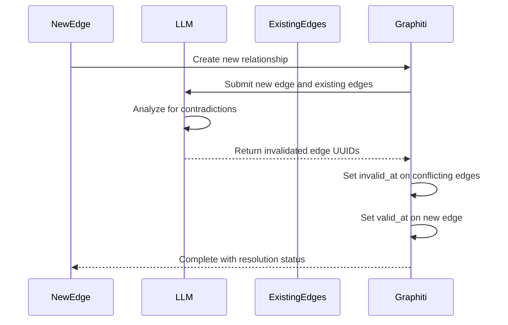

**Diagram sources**
- [invalidate_edges.py](file://graphiti_core/prompts/invalidate_edges.py#L39-L64)
- [temporal_operations.py](file://graphiti_core/utils/maintenance/temporal_operations.py#L74-L107)

### Invalidation Logic

The invalidation logic is implemented through several key components:

#### Contradiction Detection
Uses LLM analysis to identify explicit contradictions between relationships:
- "Alice works for Company X" vs. "Alice left Company X"
- "Bob is married to Carol" vs. "Bob divorced Carol"

#### Temporal Resolution
Applies temporal logic to resolve conflicts based on timing:
- Newer information takes precedence over older information
- Explicit end dates invalidate ongoing relationships
- Overlapping time periods are resolved based on context

#### Resolution Strategies
- **Expiration**: Mark conflicting edges with `invalid_at` timestamp
- **Superseding**: New relationships replace old ones when appropriate
- **Coexistence**: Allow multiple relationships when they represent different aspects

The invalidation system ensures that the knowledge graph maintains temporal consistency and resolves conflicts in a predictable manner.

**Section sources**
- [invalidate_edges.py](file://graphiti_core/prompts/invalidate_edges.py)
- [temporal_operations.py](file://graphiti_core/utils/maintenance/temporal_operations.py)
- [edge_operations.py](file://graphiti_core/utils/maintenance/edge_operations.py)

## Database-Specific Implementations

Graphiti's architecture supports multiple graph database backends through specialized driver implementations. Each driver translates the abstract operations into database-specific queries while maintaining consistent behavior.

### Neo4j Driver

The Neo4j driver implements the Graphiti interfaces using Cypher query language:

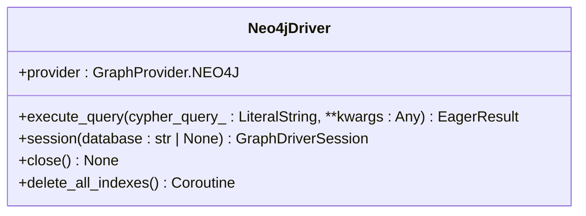

**Diagram sources**
- [neo4j_driver.py](file://graphiti_core/driver/neo4j_driver.py)

Key features:
- Uses Neo4j's async driver for non-blocking operations
- Implements vector property handling through Neo4j procedures
- Supports full-text indexing through Neo4j's built-in capabilities

### FalkorDB Driver

The FalkorDB driver adapts Graphiti operations for the Redis-based graph database:

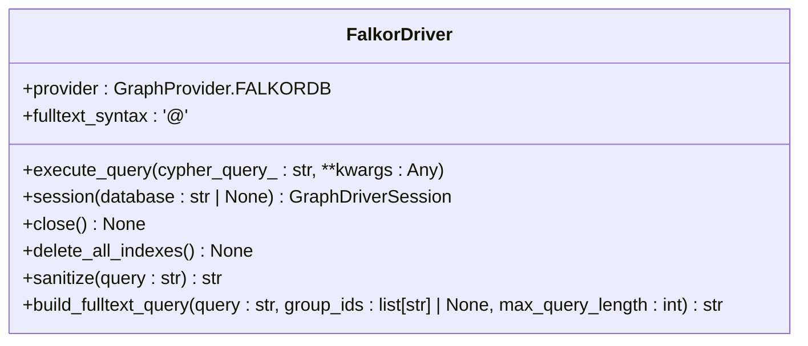

**Diagram sources**
- [falkordb_driver.py](file://graphiti_core/driver/falkordb_driver.py)

Key features:
- Implements RedisSearch-like syntax for full-text queries
- Provides query sanitization to handle special characters
- Manages connection pooling and database isolation

### Amazon Neptune Driver

The Neptune driver integrates with AWS's graph database service:

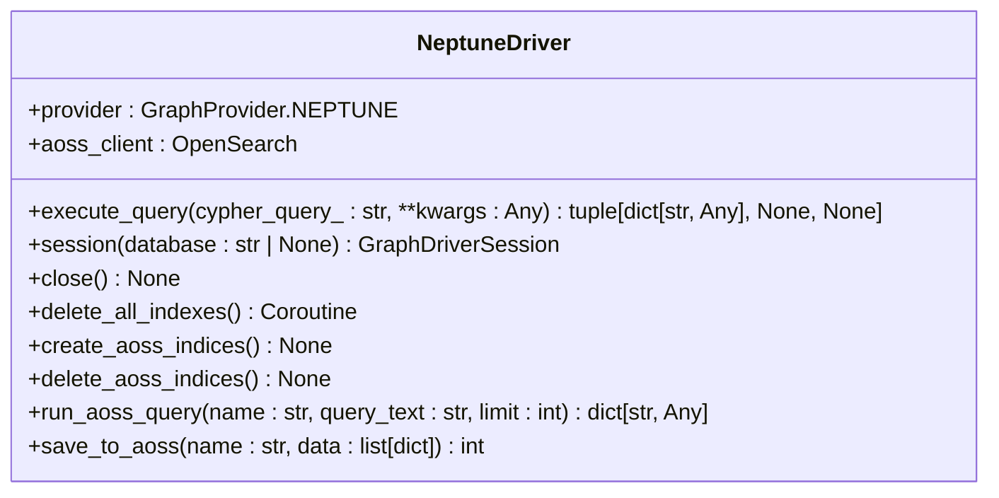

**Diagram sources**
- [neptune_driver.py](file://graphiti_core/driver/neptune_driver.py)

Key features:
- Integrates with Amazon OpenSearch Service for enhanced search
- Implements custom index management for AOSS integration
- Handles Neptune-specific data type conversions

### Kuzu Driver

The Kuzu driver adapts Graphiti operations for the lightweight, embeddable graph database:

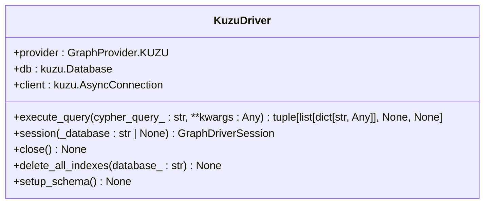

**Diagram sources**
- [kuzu_driver.py](file://graphiti_core/driver/kuzu_driver.py)

Key features:
- Implements explicit schema definition for Kuzu's schema-required model
- Uses node-based relationships to work around edge property limitations
- Manages in-memory and file-based database instances

Each driver implementation ensures that the same Graphiti API produces consistent results across different database technologies, enabling true database-agnostic development.

**Section sources**
- [neo4j_driver.py](file://graphiti_core/driver/neo4j_driver.py)
- [falkordb_driver.py](file://graphiti_core/driver/falkordb_driver.py)
- [neptune_driver.py](file://graphiti_core/driver/neptune_driver.py)
- [kuzu_driver.py](file://graphiti_core/driver/kuzu_driver.py)

## Error Handling and Transaction Management

Graphiti implements consistent error handling and transaction management patterns across all database drivers, ensuring reliable operation and data integrity.

### Error Handling

The error handling system follows these principles:

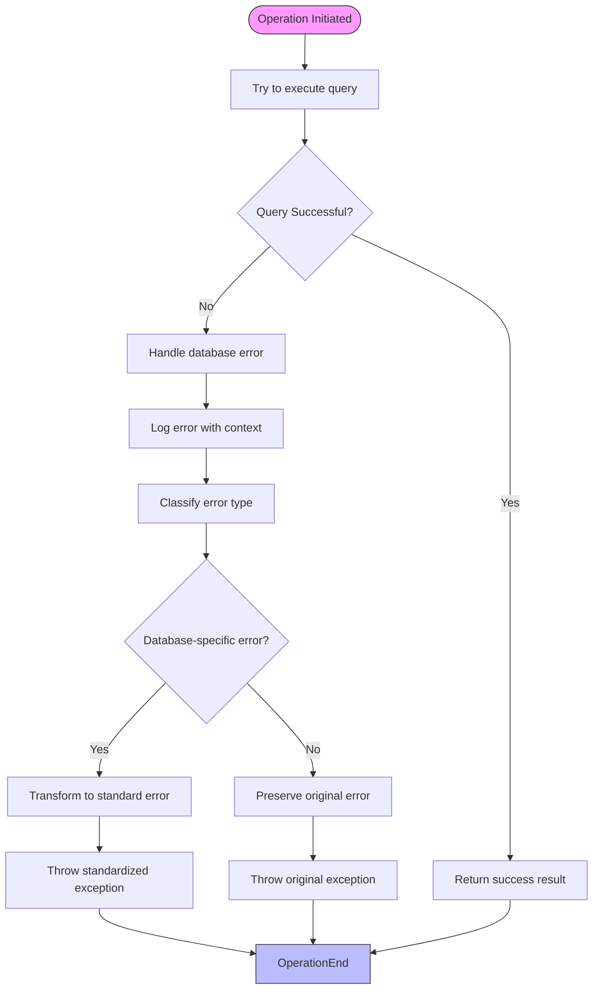

**Diagram sources**
- [neo4j_driver.py](file://graphiti_core/driver/neo4j_driver.py#L58-L60)
- [falkordb_driver.py](file://graphiti_core/driver/falkordb_driver.py#L157-L163)
- [kuzu_driver.py](file://graphiti_core/driver/kuzu_driver.py#L119-L122)

Key error handling features:
- **Consistent logging**: All database errors are logged with query and parameter context
- **Error transformation**: Database-specific errors are transformed into standard exceptions when possible
- **Context preservation**: Original error information is preserved for debugging
- **Graceful degradation**: Non-critical errors (like index already exists) are handled gracefully

### Transaction Management

Transaction management in Graphiti provides consistent patterns across different database systems:

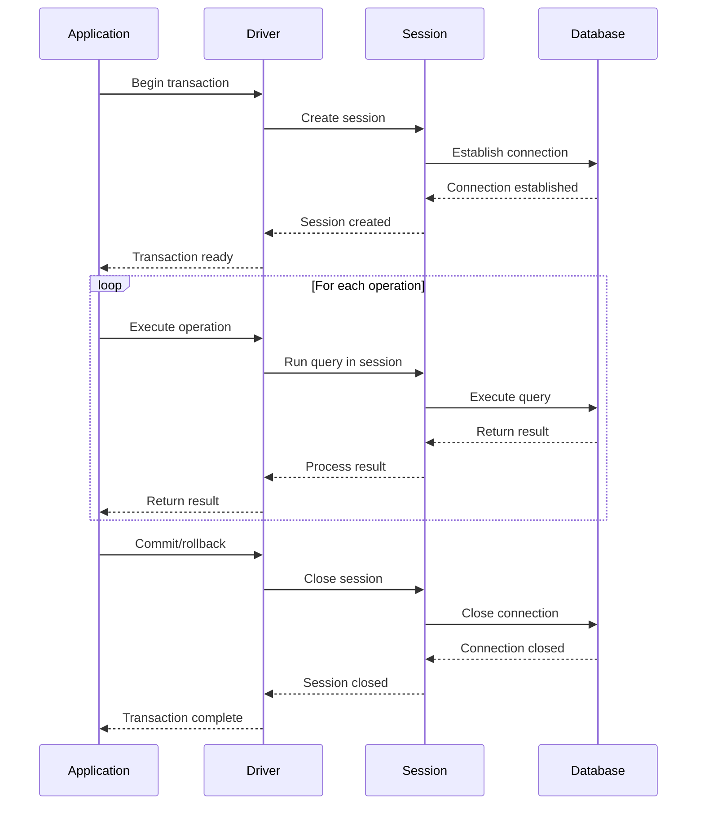

**Diagram sources**
- [driver.py](file://graphiti_core/driver/driver.py#L49-L71)
- [falkordb_driver.py](file://graphiti_core/driver/falkordb_driver.py#L77-L109)

Transaction features:
- **Session-based**: Uses database sessions to manage transaction boundaries
- **Async context managers**: Supports async with statements for automatic cleanup
- **Write execution**: Provides execute_write method for transactional operations
- **Consistent interface**: Same transaction patterns across all database backends

The transaction system ensures data consistency and provides predictable behavior regardless of the underlying database technology.

**Section sources**
- [driver.py](file://graphiti_core/driver/driver.py)
- [neo4j_driver.py](file://graphiti_core/driver/neo4j_driver.py)
- [falkordb_driver.py](file://graphiti_core/driver/falkordb_driver.py)
- [kuzu_driver.py](file://graphiti_core/driver/kuzu_driver.py)

## Idempotency Guarantees

Graphiti provides strong idempotency guarantees for all graph operations, ensuring that repeated operations produce the same result without unintended side effects. This is critical for reliable distributed systems and retry scenarios.

### Idempotency Mechanisms

The idempotency system is implemented through several key mechanisms:

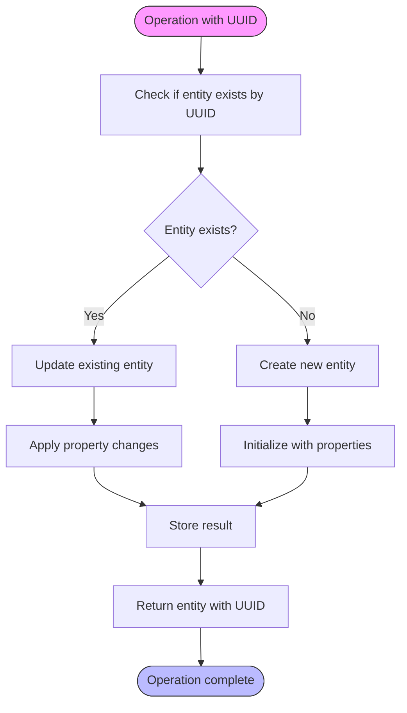

**Diagram sources**
- [node_db_queries.py](file://graphiti_core/models/nodes/node_db_queries.py)
- [edge_db_queries.py](file://graphiti_core/models/edges/edge_db_queries.py)

### Key Idempotency Features

#### UUID-Based Identity
- Every node and edge has a UUID property that serves as its primary identifier
- Operations use MERGE semantics based on UUID to ensure idempotency
- Repeated operations with the same UUID update the existing entity rather than creating duplicates

#### Merge Semantics
- Node operations use MERGE statements that create or update based on UUID
- Edge operations use MERGE relationships that create or update based on UUID
- Property assignment updates all properties, replacing the entire entity state

#### Bulk Operation Idempotency
- Bulk operations process entities in batches while maintaining idempotency
- Each entity in a batch is processed independently with its own UUID check
- Batch size is configurable to balance performance and memory usage

#### Conflict Resolution
- When conflicts occur, newer data takes precedence
- Timestamps (created_at, valid_at) help resolve temporal conflicts
- The system preserves historical data through invalidation rather than deletion

These idempotency guarantees ensure that Graphiti operations are safe to retry and produce consistent results, making the system reliable for distributed applications and failure recovery scenarios.

**Section sources**
- [graph_operations.py](file://graphiti_core/driver/graph_operations/graph_operations.py)
- [node_db_queries.py](file://graphiti_core/models/nodes/node_db_queries.py)
- [edge_db_queries.py](file://graphiti_core/models/edges/edge_db_queries.py)

## Conclusion

Graphiti's unified graph operations layer provides a robust, database-agnostic interface for managing knowledge graphs. Through the `GraphOperationsInterface` and `SearchInterface`, the system abstracts away database-specific details while ensuring consistent behavior across different backend technologies.

The key benefits of this architecture include:

- **Database Agnosticism**: Applications can switch between Neo4j, FalkorDB, Kuzu, and Amazon Neptune without changing business logic
- **Consistent APIs**: Standardized method signatures and return types ensure predictable behavior
- **Extensibility**: New database drivers can be added by implementing the defined interfaces
- **Reliability**: Idempotent operations, consistent error handling, and proper transaction management ensure data integrity
- **Advanced Features**: Temporal indexing, entity resolution, and relationship invalidation provide sophisticated knowledge graph capabilities

The implementation demonstrates careful attention to detail in handling database-specific nuances while maintaining a consistent abstraction layer. Each driver translates the abstract operations into optimized native queries, taking advantage of each database's strengths while hiding their complexities from the application layer.

This unified approach enables developers to focus on building intelligent applications rather than managing database-specific intricacies, while still providing the flexibility to choose the most appropriate database technology for their specific use case.

**Section sources**
- [graph_operations.py](file://graphiti_core/driver/graph_operations/graph_operations.py)
- [search_interface.py](file://graphiti_core/driver/search_interface/search_interface.py)
- [driver.py](file://graphiti_core/driver/driver.py)