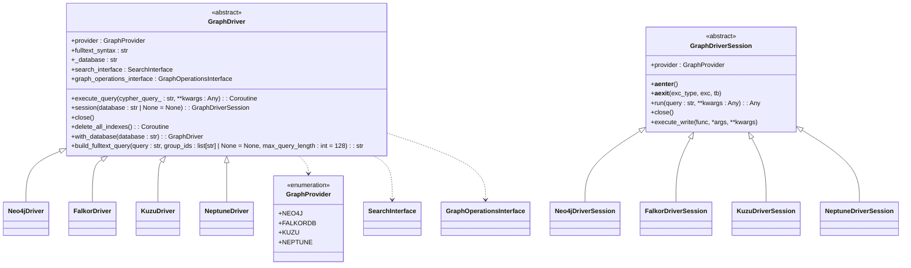
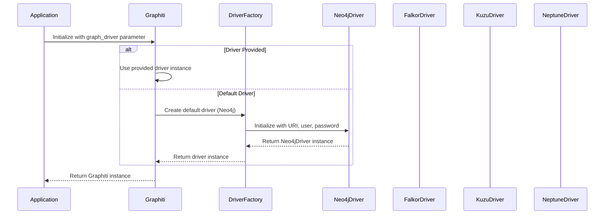
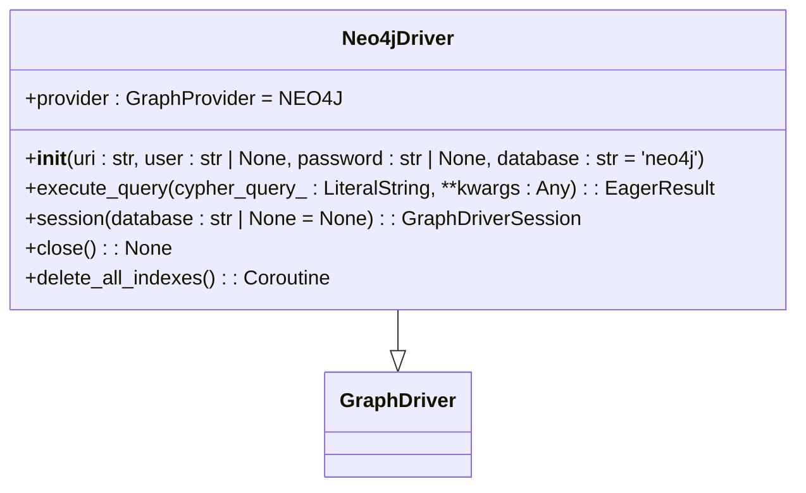
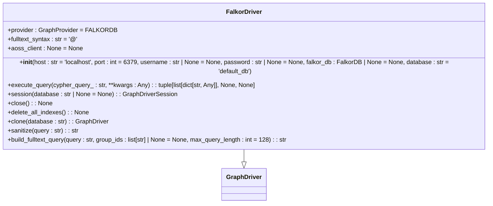
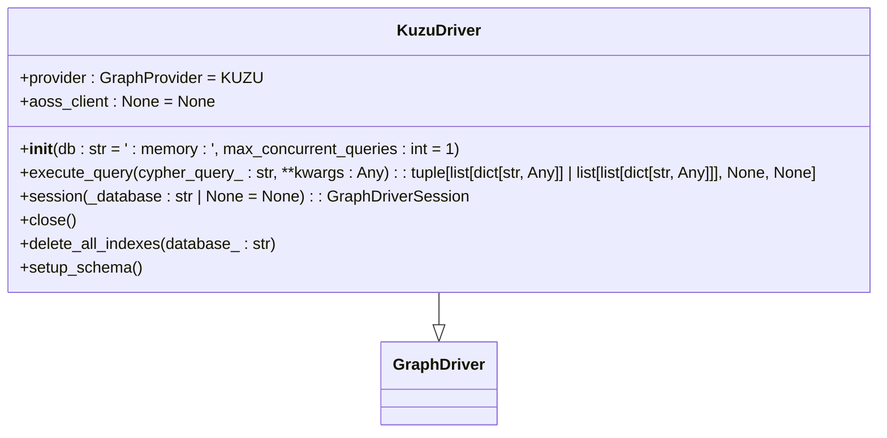
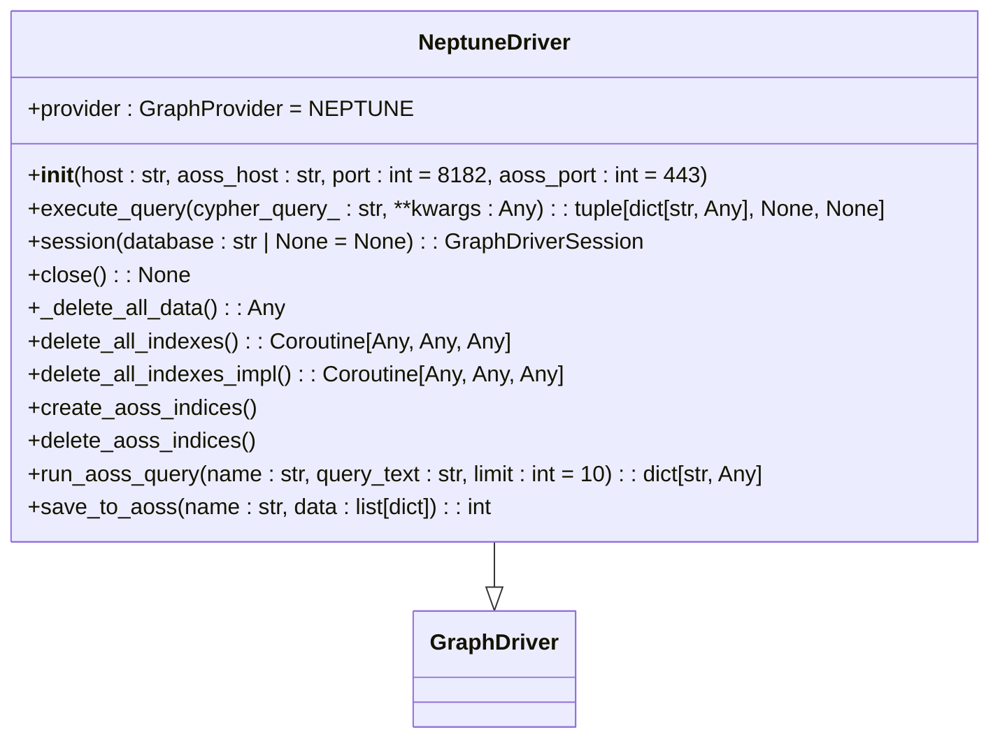
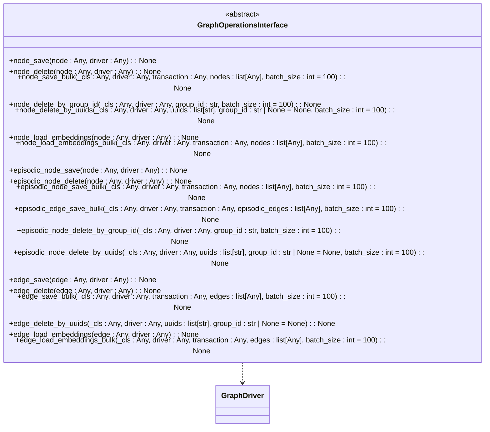
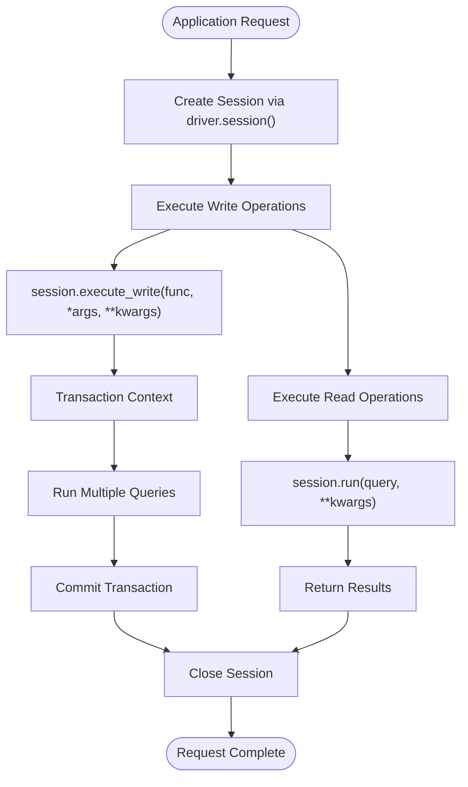
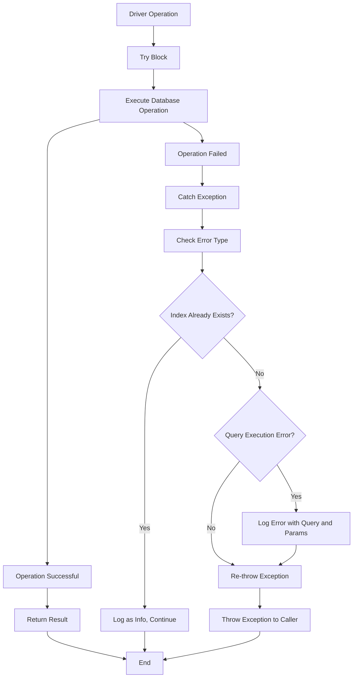
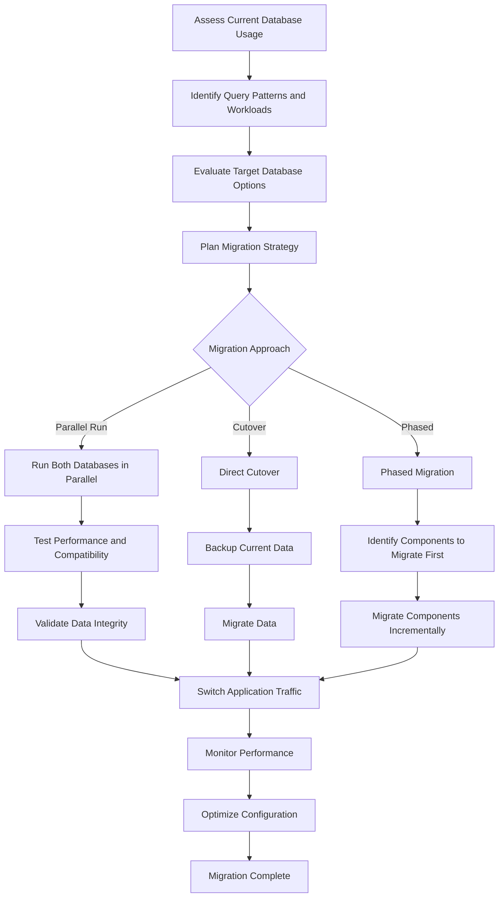

# Database Integration

<cite>
**Referenced Files in This Document**   
- [driver.py](file://graphiti_core/driver/driver.py)
- [falkordb_driver.py](file://graphiti_core/driver/falkordb_driver.py)
- [kuzu_driver.py](file://graphiti_core/driver/kuzu_driver.py)
- [neo4j_driver.py](file://graphiti_core/driver/neo4j_driver.py)
- [neptune_driver.py](file://graphiti_core/driver/neptune_driver.py)
- [graph_operations.py](file://graphiti_core/driver/graph_operations/graph_operations.py)
- [search_interface.py](file://graphiti_core/driver/search_interface/search_interface.py)
- [graphiti.py](file://graphiti_core/graphiti.py)
</cite>

## Table of Contents
1. [Introduction](#introduction)
2. [Driver Abstraction Layer](#driver-abstraction-layer)
3. [Factory Pattern Implementation](#factory-pattern-implementation)
4. [Supported Database Drivers](#supported-database-drivers)
5. [Common Graph Operations Interface](#common-graph-operations-interface)
6. [Connection Pooling and Transaction Management](#connection-pooling-and-transaction-management)
7. [Error Handling Strategies](#error-handling-strategies)
8. [Database Selection Guidance](#database-selection-guidance)
9. [Migration Considerations](#migration-considerations)

## Introduction
Graphiti provides a multi-database support system that enables seamless integration with various graph databases through a unified interface. This documentation details the architecture of the database integration layer, focusing on the driver abstraction, factory pattern implementation, and support for multiple database backends including Neo4j, FalkorDB, Kuzu, and Neptune. The system is designed to provide database-agnostic development capabilities while maintaining optimal performance characteristics for each supported database.

## Driver Abstraction Layer
The driver abstraction layer in Graphiti provides a unified interface across different graph databases through a well-defined class hierarchy. At the core of this abstraction is the `GraphDriver` abstract base class, which defines the common interface for all database drivers.

**Diagram sources**
- [driver.py](file://graphiti_core/driver/driver.py#L42-L115)

**Section sources**
- [driver.py](file://graphiti_core/driver/driver.py#L42-L115)

## Factory Pattern Implementation
Graphiti implements a factory pattern that allows for pluggable database backends through the `Graphiti` class constructor. The factory pattern is implemented by accepting a `graph_driver` parameter that can be any implementation of the `GraphDriver` interface.

**Diagram sources**
- [graphiti.py](file://graphiti_core/graphiti.py#L128-L200)

**Section sources**
- [graphiti.py](file://graphiti_core/graphiti.py#L128-L200)

## Supported Database Drivers
Graphiti supports four major graph database backends, each implemented as a concrete class extending the `GraphDriver` abstract base class. Each driver provides specific configuration options, performance characteristics, and deployment considerations.

### Neo4j Driver
The Neo4j driver provides integration with the Neo4j graph database, supporting both local and remote instances through the Bolt protocol.

**Configuration Options**
- `uri`: Connection URI (e.g., bolt://localhost:7687)
- `user`: Authentication username
- `password`: Authentication password
- `database`: Target database name (default: 'neo4j')

**Performance Characteristics**
- Optimized for complex graph traversals
- Strong ACID compliance
- Excellent for deep relationship queries

**Deployment Considerations**
- Requires Neo4j server installation
- Supports both single-instance and clustered deployments
- Enterprise edition provides advanced clustering and high availability

**Section sources**
- [neo4j_driver.py](file://graphiti_core/driver/neo4j_driver.py#L29-L75)

### FalkorDB Driver
The FalkorDB driver integrates with the Redis-based graph database, providing high-performance capabilities for real-time applications.

**Configuration Options**
- `host`: Server hostname (default: 'localhost')
- `port`: Server port (default: 6379)
- `username`: Authentication username (optional)
- `password`: Authentication password (optional)
- `database`: Database name (default: 'default_db')

**Performance Characteristics**
- In-memory performance with Redis backend
- Low latency for read operations
- High throughput for write operations

**Deployment Considerations**
- Can run as standalone server or integrated with Redis
- Supports on-premises and cloud deployments
- Multi-tenant architecture allows multiple graphs in single instance

**Section sources**
- [falkordb_driver.py](file://graphiti_core/driver/falkordb_driver.py#L112-L309)

### Kuzu Driver
The Kuzu driver provides integration with the lightweight, embeddable Kuzu graph database, designed for applications requiring a compact footprint.

**Configuration Options**
- `db`: Database path (':memory:' for in-memory, file path for persistent)
- `max_concurrent_queries`: Maximum concurrent queries (default: 1)

**Performance Characteristics**
- Optimized for single-threaded performance
- Efficient memory usage
- Fast startup time

**Deployment Considerations**
- Embeddable design suitable for edge applications
- Single-file deployment
- No external dependencies

**Section sources**
- [kuzu_driver.py](file://graphiti_core/driver/kuzu_driver.py#L93-L177)

### Neptune Driver
The Neptune driver integrates with Amazon Neptune, providing cloud-native graph database capabilities with integrated OpenSearch for full-text search.

**Configuration Options**
- `host`: Neptune endpoint (neptune-db://<endpoint> or neptune-graph://<graphid>)
- `aoss_host`: OpenSearch serverless host
- `port`: Neptune port (default: 8182)
- `aoss_port`: OpenSearch port (default: 443)

**Performance Characteristics**
- Auto-scaling cloud infrastructure
- Integrated full-text search with OpenSearch
- High availability and durability

**Deployment Considerations**
- Fully managed AWS service
- Requires IAM authentication
- Integrated with AWS security and monitoring tools

**Section sources**
- [neptune_driver.py](file://graphiti_core/driver/neptune_driver.py#L109-L300)

## Common Graph Operations Interface
Graphiti provides a common interface for graph operations through the `GraphOperationsInterface` class, enabling database-agnostic development of graph mutation behaviors.

**Diagram sources**
- [graph_operations.py](file://graphiti_core/driver/graph_operations/graph_operations.py#L22-L196)

**Section sources**
- [graph_operations.py](file://graphiti_core/driver/graph_operations/graph_operations.py#L22-L196)

## Connection Pooling and Transaction Management
Graphiti's driver architecture includes comprehensive connection pooling and transaction management capabilities. Each driver implementation handles connection lifecycle management through the `session()` method, which returns a `GraphDriverSession` instance.

The `execute_write` method provides a transactional context for write operations, ensuring atomicity and consistency. Connection pooling is handled internally by each driver implementation, with connection reuse across sessions when possible.

**Section sources**
- [driver.py](file://graphiti_core/driver/driver.py#L49-L71)
- [falkordb_driver.py](file://graphiti_core/driver/falkordb_driver.py#L94-L97)
- [kuzu_driver.py](file://graphiti_core/driver/kuzu_driver.py#L166-L168)
- [neptune_driver.py](file://graphiti_core/driver/neptune_driver.py#L288-L290)

## Error Handling Strategies
Graphiti implements a comprehensive error handling strategy across all database drivers, with consistent patterns for exception management and recovery.

Each driver implementation includes specific error handling for database-specific conditions, such as the FalkorDB driver's handling of "already indexed" errors, which are treated as non-fatal conditions. All query execution errors are logged with the complete query and parameters for debugging purposes.

**Section sources**
- [falkordb_driver.py](file://graphiti_core/driver/falkordb_driver.py#L157-L163)
- [kuzu_driver.py](file://graphiti_core/driver/kuzu_driver.py#L119-L122)
- [neo4j_driver.py](file://graphiti_core/driver/neo4j_driver.py#L58-L60)
- [neptune_driver.py](file://graphiti_core/driver/neptune_driver.py#L207-L210)

## Database Selection Guidance
Choosing the right database backend for Graphiti depends on specific use case requirements, including performance needs, deployment environment, and scalability requirements.

### Comparison Table

| Database | Use Case | Performance | Deployment | Scalability | Cost |
|----------|---------|-------------|------------|-------------|------|
| Neo4j | Complex graph traversals, enterprise applications | High for deep queries | On-premises, cloud, managed | Horizontal scaling (Enterprise) | Commercial, open source available |
| FalkorDB | Real-time applications, high throughput | Very high (in-memory) | On-premises, cloud, Redis integration | Vertical scaling | Open source, commercial support |
| Kuzu | Embedded applications, edge computing | Optimized for single-threaded | Embedded, lightweight | Limited (single instance) | Open source |
| Neptune | Cloud-native applications, large-scale | Auto-scaling, managed service | AWS cloud only | Automatic horizontal scaling | Pay-per-use, AWS pricing |

### Selection Criteria

**Choose Neo4j when:**
- You need advanced graph algorithms and complex traversals
- Enterprise features like role-based access control are required
- You have existing Neo4j expertise or infrastructure
- ACID compliance is critical for your use case

**Choose FalkorDB when:**
- Low latency and high throughput are primary requirements
- You already use Redis in your technology stack
- Real-time applications require sub-millisecond response times
- You need a multi-tenant architecture

**Choose Kuzu when:**
- You need an embeddable, lightweight solution
- Your application runs on edge devices or has limited resources
- You want a simple, single-file deployment
- Your dataset size is moderate and fits in memory

**Choose Neptune when:**
- You are already invested in the AWS ecosystem
- You need automatic scaling and high availability
- Your application requires integration with other AWS services
- You want a fully managed database service

**Section sources**
- [neo4j_driver.py](file://graphiti_core/driver/neo4j_driver.py)
- [falkordb_driver.py](file://graphiti_core/driver/falkordb_driver.py)
- [kuzu_driver.py](file://graphiti_core/driver/kuzu_driver.py)
- [neptune_driver.py](file://graphiti_core/driver/neptune_driver.py)

## Migration Considerations
Migrating between different graph databases in Graphiti requires careful planning due to differences in configuration, performance characteristics, and deployment models.

### Migration Strategy

### Key Migration Considerations

**Data Model Compatibility:**
- Ensure that the data model is compatible with the target database
- Verify that all required indexes and constraints can be created
- Test complex queries to ensure equivalent performance

**Configuration Changes:**
- Update connection parameters in application configuration
- Adjust batch sizes and concurrency settings based on target database capabilities
- Configure appropriate timeout values for network operations

**Performance Testing:**
- Conduct thorough performance testing with production-like workloads
- Compare query execution times for critical operations
- Monitor resource utilization (CPU, memory, I/O)

**Rollback Plan:**
- Prepare a rollback strategy in case of migration issues
- Maintain backups of the original database
- Test the rollback procedure before starting migration

**Section sources**
- [driver.py](file://graphiti_core/driver/driver.py)
- [graphiti.py](file://graphiti_core/graphiti.py)