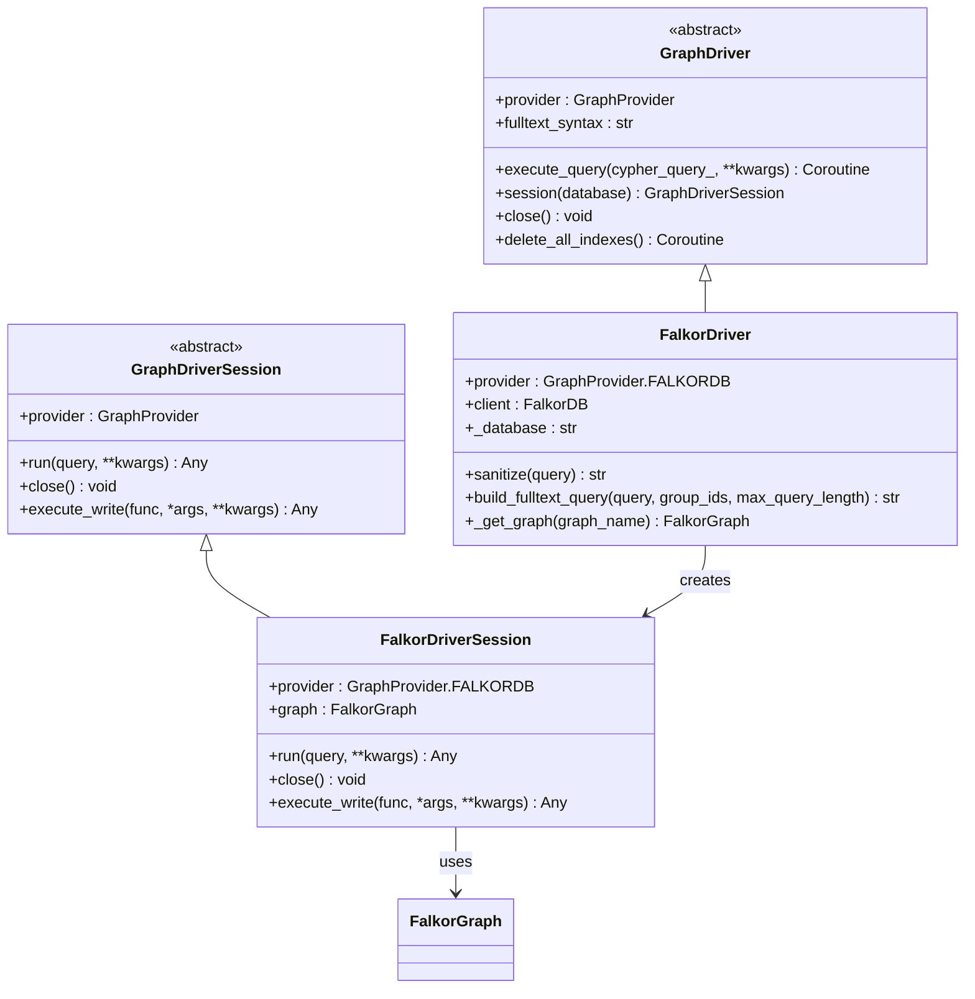
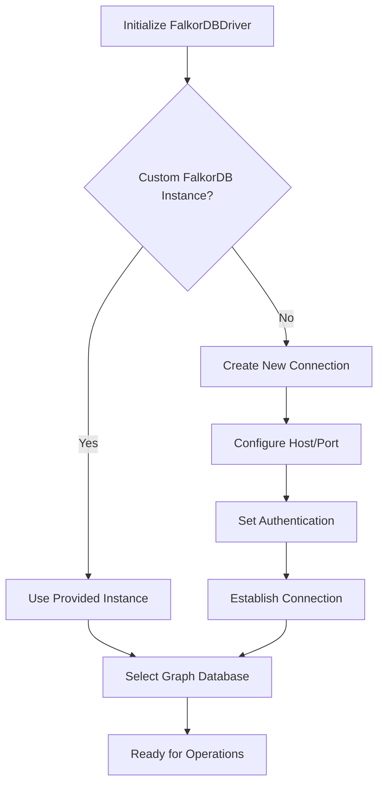
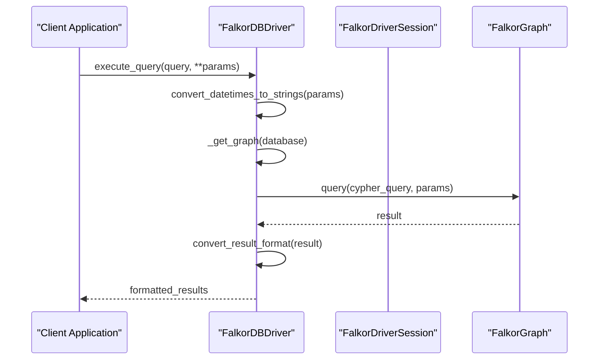
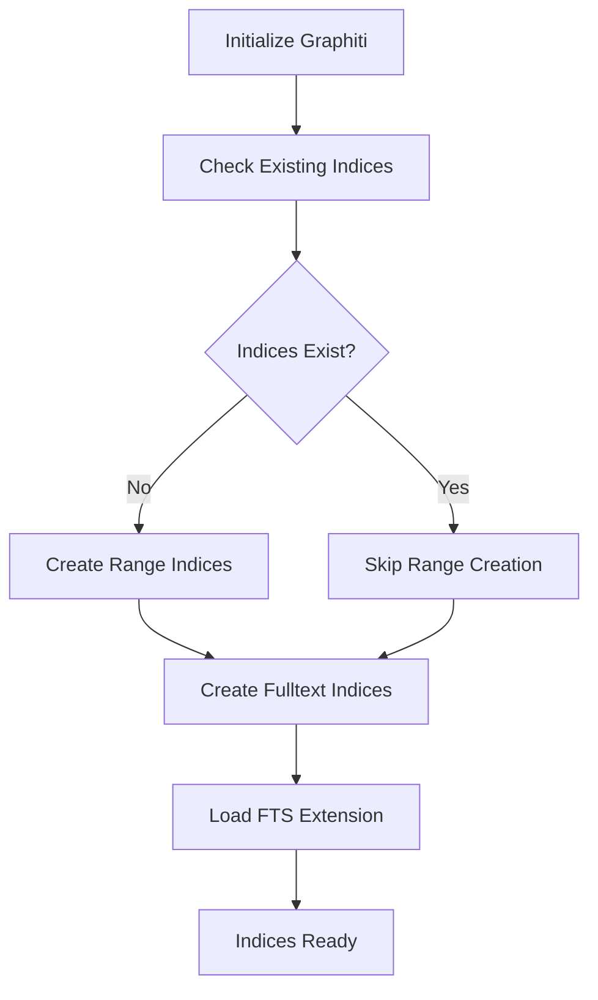

# FalkorDB Integration

<cite>
**Referenced Files in This Document**
- [falkordb_driver.py](file://graphiti_core/driver/falkordb_driver.py)
- [driver.py](file://graphiti_core/driver/driver.py)
- [quickstart_falkordb.py](file://examples/quickstart/quickstart_falkordb.py)
- [datetime_utils.py](file://graphiti_core/utils/datetime_utils.py)
- [graph_queries.py](file://graphiti_core/graph_queries.py)
- [search_config_recipes.py](file://graphiti_core/search/search_config_recipes.py)
- [node_db_queries.py](file://graphiti_core/models/nodes/node_db_queries.py)
- [edge_db_queries.py](file://graphiti_core/models/edges/edge_db_queries.py)
- [test_falkordb_driver.py](file://tests/driver/test_falkordb_driver.py)
- [pyproject.toml](file://pyproject.toml)
</cite>

## Table of Contents
1. [Introduction](#introduction)
2. [Architecture Overview](#architecture-overview)
3. [FalkorDBDriver Implementation](#falkordbdriver-implementation)
4. [Configuration Options](#configuration-options)
5. [OpenCypher Integration](#opencypher-integration)
6. [Index Management](#index-management)
7. [Temporal Query Patterns](#temporal-query-patterns)
8. [Performance Advantages](#performance-advantages)
9. [Memory Optimization](#memory-optimization)
10. [Vector Similarity Search](#vector-similarity-search)
11. [Limitations and Considerations](#limitations-and-considerations)
12. [Best Practices](#best-practices)
13. [Troubleshooting Guide](#troubleshooting-guide)

## Introduction

The FalkorDB driver implementation in Graphiti provides high-performance graph operations on FalkorDB (formerly RedisGraph), enabling real-time incremental updates and low-latency queries for AI agent memory systems. FalkorDB serves as a multi-tenant graph database that efficiently handles temporal knowledge graphs with continuous data streaming capabilities.

FalkorDB's integration with Graphiti leverages its native vector similarity search capabilities, making it particularly suitable for hybrid retrieval workflows that combine semantic similarity with traditional graph traversal methods. The driver implements the GraphDriver interface while providing FalkorDB-specific optimizations for performance-critical AI applications.

## Architecture Overview

The FalkorDB driver follows Graphiti's modular architecture, implementing the GraphDriver interface to provide database-agnostic graph operations while leveraging FalkorDB's unique features.



**Diagram sources**
- [driver.py](file://graphiti_core/driver/driver.py#L49-L116)
- [falkordb_driver.py](file://graphiti_core/driver/falkordb_driver.py#L77-L110)

**Section sources**
- [driver.py](file://graphiti_core/driver/driver.py#L42-L116)
- [falkordb_driver.py](file://graphiti_core/driver/falkordb_driver.py#L112-L141)

## FalkorDBDriver Implementation

The FalkorDBDriver class serves as the primary interface for interacting with FalkorDB databases, implementing all required methods from the GraphDriver abstract base class.

### Core Driver Features

The driver provides several key capabilities:

- **Multi-tenant Support**: Each database instance can host multiple tenant graphs
- **Async Operations**: Full asynchronous query execution for non-blocking operations
- **Automatic Type Conversion**: Handles Python datetime objects by converting them to ISO strings
- **Fulltext Query Building**: Specialized query construction for FalkorDB's RedisSearch syntax
- **Index Management**: Comprehensive index creation and deletion capabilities

### Connection Management

The driver supports flexible connection configurations:



**Diagram sources**
- [falkordb_driver.py](file://graphiti_core/driver/falkordb_driver.py#L116-L140)

**Section sources**
- [falkordb_driver.py](file://graphiti_core/driver/falkordb_driver.py#L112-L141)

## Configuration Options

### Basic Connection Parameters

The FalkorDB driver accepts standard connection parameters:

| Parameter | Type | Default | Description |
|-----------|------|---------|-------------|
| `host` | str | 'localhost' | FalkorDB server hostname |
| `port` | int | 6379 | FalkorDB server port |
| `username` | str \| None | None | Authentication username |
| `password` | str \| None | None | Authentication password |
| `database` | str | 'default_db' | Default database name |
| `falkor_db` | FalkorDB \| None | None | Existing FalkorDB instance |

### Environment Variable Support

The driver automatically reads connection parameters from environment variables:

```python
falkor_username = os.environ.get('FALKORDB_USERNAME', None)
falkor_password = os.environ.get('FALKORDB_PASSWORD', None)
falkor_host = os.environ.get('FALKORDB_HOST', 'localhost')
falkor_port = os.environ.get('FALKORDB_PORT', '6379')
```

### Advanced Configuration

For production deployments, consider:

- **Connection Pooling**: Leverage FalkorDB's built-in connection pooling
- **SSL/TLS**: Enable secure connections for sensitive deployments
- **Timeout Settings**: Configure appropriate timeout values for your workload
- **Cluster Mode**: Support for clustered FalkorDB deployments

**Section sources**
- [quickstart_falkordb.py](file://examples/quickstart/quickstart_falkordb.py#L59-L62)
- [falkordb_driver.py](file://graphiti_core/driver/falkordb_driver.py#L116-L140)

## OpenCypher Integration

FalkorDB's native OpenCypher support enables expressive graph queries with familiar syntax patterns.

### Query Execution

The driver handles query execution through the `execute_query` method:



**Diagram sources**
- [falkordb_driver.py](file://graphiti_core/driver/falkordb_driver.py#L149-L180)

### Node and Edge Manipulation

The driver supports comprehensive CRUD operations:

#### Entity Nodes
- **Creation**: `MERGE (n:Entity {uuid: $uuid}) SET n = $entity_data`
- **Updates**: `SET n.name = $name, n.summary = $summary`
- **Deletion**: `MATCH (n:Entity {uuid: $uuid}) DELETE n`

#### Relationship Edges
- **Creation**: `MERGE (source)-[r:RELATES_TO]->(target)`
- **Properties**: `SET r.fact = $fact, r.fact_embedding = vecf32($embedding)`
- **Temporal Properties**: `SET r.valid_at = $valid_at, r.expired_at = $expired_at`

### Bulk Operations

For high-throughput scenarios, the driver supports bulk operations:


**Diagram sources**
- [node_db_queries.py](file://graphiti_core/models/nodes/node_db_queries.py#L87-L92)
- [edge_db_queries.py](file://graphiti_core/models/edges/edge_db_queries.py#L128-L135)

**Section sources**
- [falkordb_driver.py](file://graphiti_core/driver/falkordb_driver.py#L149-L180)
- [node_db_queries.py](file://graphiti_core/models/nodes/node_db_queries.py#L45-L51)
- [edge_db_queries.py](file://graphiti_core/models/edges/edge_db_queries.py#L63-L72)

## Index Management

FalkorDB's indexing system is crucial for query performance and supports both range and fulltext indexes.

### Supported Index Types

| Index Type | Purpose | Syntax |
|------------|---------|--------|
| Range Index | Equality and range queries | `CREATE INDEX ON :Label(property)` |
| Fulltext Index | Text search capabilities | `CREATE FULLTEXT INDEX FOR (n:Label) ON (n.property)` |

### Automatic Index Creation

The driver automatically creates necessary indexes during initialization:



**Diagram sources**
- [graph_queries.py](file://graphiti_core/graph_queries.py#L28-L67)

### Index Management Operations

The driver provides comprehensive index management:

- **Index Creation**: Automatic creation of range and fulltext indices
- **Index Deletion**: Bulk deletion of all indices for clean resets
- **Index Validation**: Checks for existing indices before creation
- **Cleanup Operations**: Proper resource cleanup during shutdown

**Section sources**
- [falkordb_driver.py](file://graphiti_core/driver/falkordb_driver.py#L194-L225)
- [graph_queries.py](file://graphiti_core/graph_queries.py#L28-L67)

## Temporal Query Patterns

FalkorDB's temporal capabilities enable sophisticated time-based queries essential for AI agent memory systems.

### Bi-temporal Data Model

Graphiti implements a bi-temporal model with:

- **Event Occurrence Time**: When the event actually happened
- **Ingestion Time**: When the information was ingested into the graph

### Temporal Query Examples

#### Point-in-Time Queries
```cypher
MATCH (n:Entity)
WHERE n.valid_at <= $timestamp AND n.expired_at > $timestamp
RETURN n
```

#### Historical Analysis
```cypher
MATCH (n:Entity)
WHERE n.created_at <= $end_time
AND (n.expired_at > $start_time OR n.expired_at IS NULL)
RETURN n
ORDER BY n.created_at DESC
```

#### Event Timeline Construction
```cypher
MATCH (n:Entity)-[r:RELATES_TO]->(m:Entity)
WHERE r.valid_at <= $timestamp AND r.expired_at > $timestamp
RETURN n, r, m
ORDER BY r.created_at
```

### Temporal Indexing Strategy

The driver creates specialized indices for temporal queries:

- **Range Indices**: On `created_at`, `valid_at`, `expired_at` properties
- **Temporal Constraints**: Enforce temporal validity during query execution
- **Historical Queries**: Optimize for time-range based retrievals

**Section sources**
- [datetime_utils.py](file://graphiti_core/utils/datetime_utils.py#L45-L56)
- [graph_queries.py](file://graphiti_core/graph_queries.py#L28-L67)

## Performance Advantages

FalkorDB provides several performance benefits for Graphiti applications:

### Real-Time Incremental Updates

- **Immediate Integration**: New data becomes immediately queryable
- **No Batch Processing**: Eliminates costly recomputation cycles
- **Continuous Streaming**: Supports real-time data ingestion pipelines

### Low-Latency Queries

- **In-Memory Storage**: Fast access to frequently queried data
- **Optimized Indexing**: Native support for complex index structures
- **Parallel Execution**: Concurrent query processing capabilities

### Memory Efficiency

- **Compression**: Built-in data compression reduces memory footprint
- **Eviction Policies**: Configurable memory management strategies
- **Lazy Loading**: Load data on-demand to minimize memory usage

### Scalability Features

- **Horizontal Scaling**: Support for clustered deployments
- **Partitioning**: Automatic data distribution across nodes
- **Sharding**: Intelligent data partitioning for large datasets

**Section sources**
- [README.md](file://README.md#L83-L92)

## Memory Optimization

### Configuration Strategies

#### Memory Allocation
- **Heap Size**: Configure JVM heap size appropriately for your dataset
- **Off-Heap Memory**: Utilize off-heap storage for large indices
- **Swap Configuration**: Minimize swap usage for optimal performance

#### Data Lifecycle Management
- **Retention Policies**: Define data retention periods
- **Archival Strategies**: Move older data to cold storage
- **Cleanup Procedures**: Regular maintenance of temporary data

### Performance Tuning

#### Query Optimization
- **Index Selection**: Choose appropriate indexes for query patterns
- **Query Planning**: Analyze and optimize query execution plans
- **Batch Size**: Optimize batch sizes for bulk operations

#### Resource Monitoring
- **Memory Usage**: Monitor memory consumption patterns
- **Query Performance**: Track query response times
- **Throughput Metrics**: Measure concurrent operation capacity

**Section sources**
- [falkordb_driver.py](file://graphiti_core/driver/falkordb_driver.py#L185-L193)

## Vector Similarity Search

FalkorDB's native vector similarity capabilities enable hybrid retrieval workflows that combine semantic understanding with traditional graph operations.

### Vector Embedding Integration

The driver supports vector operations through FalkorDB's vector functions:


**Diagram sources**
- [node_db_queries.py](file://graphiti_core/models/nodes/node_db_queries.py#L136-L137)
- [graph_queries.py](file://graphiti_core/graph_queries.py#L142-L150)

### Hybrid Retrieval Workflows

#### Semantic + Keyword Search
The driver enables hybrid search combining:
- **Semantic Similarity**: Cosine distance calculations
- **Keyword Matching**: Fulltext BM25 scoring
- **Graph Traversal**: Path-based relevance ranking

#### Vector Distance Functions

FalkorDB provides optimized vector operations:

```sql
-- Cosine similarity calculation
(2 - vec.cosineDistance(vector1, vecf32(vector2))) / 2
```

### Search Configuration Recipes

Graphiti provides pre-configured search strategies:

| Recipe | Purpose | Components |
|--------|---------|------------|
| `NODE_HYBRID_SEARCH_RRF` | Balanced node search | BM25 + Cosine similarity |
| `EDGE_HYBRID_SEARCH_CROSS_ENCODER` | Advanced edge ranking | BM25 + Cosine + BFS + Cross-encoder |
| `COMBINED_HYBRID_SEARCH_MMR` | Diverse result sets | Multi-vector reranking |

**Section sources**
- [search_config_recipes.py](file://graphiti_core/search/search_config_recipes.py#L156-L224)
- [graph_queries.py](file://graphiti_core/graph_queries.py#L142-L150)

## Limitations and Considerations

### Transaction Support

FalkorDB has limited transaction support compared to disk-based databases:

- **ACID Compliance**: Partial ACID guarantees with eventual consistency
- **Multi-Statement Transactions**: Limited support for complex transaction scenarios
- **Rollback Capabilities**: Minimal rollback functionality

### Data Durability

#### Persistence Configuration
- **RDB Snapshots**: Periodic snapshot persistence
- **AOF Logging**: Append-only file logging for data safety
- **Replication**: Master-slave replication for high availability

#### Trade-offs
- **Performance vs. Durability**: Optimized for speed over absolute durability
- **Memory-First Design**: Data primarily resides in memory with periodic persistence
- **Recovery Time**: Faster startup but potential data loss during crashes

### Clustering Considerations

#### Deployment Options
- **Single Node**: Suitable for development and small-scale deployments
- **Master-Slave**: Basic replication for high availability
- **Cluster Mode**: Horizontal scaling across multiple nodes

#### Cluster Management
- **Data Distribution**: Automatic sharding across cluster nodes
- **Failover Handling**: Automatic failover mechanisms
- **Consistency Models**: Eventual consistency across cluster nodes

### Feature Limitations

#### Query Capabilities
- **Complex Joins**: Limited support for complex join operations
- **Recursive Queries**: Restricted recursive pattern matching
- **Advanced Analytics**: Limited built-in analytical functions

#### Data Types
- **Vector Support**: Native vector operations but limited data type variety
- **Temporal Precision**: Limited temporal granularity compared to specialized time-series databases

**Section sources**
- [falkordb_driver.py](file://graphiti_core/driver/falkordb_driver.py#L155-L163)

## Best Practices

### Connection Management

#### Resource Optimization
- **Connection Pooling**: Reuse connections across operations
- **Graceful Shutdown**: Properly close connections during application termination
- **Error Handling**: Implement robust error handling for connection failures

#### Security Considerations
- **Authentication**: Use strong credentials for production deployments
- **Network Security**: Enable SSL/TLS for encrypted communications
- **Access Control**: Implement proper RBAC for multi-tenant environments

### Query Optimization

#### Index Strategy
- **Selective Indexing**: Create indexes based on query patterns
- **Index Maintenance**: Regular index optimization and rebuilding
- **Query Analysis**: Monitor and optimize slow-running queries

#### Data Modeling
- **Label Design**: Use meaningful labels for efficient querying
- **Property Organization**: Group related properties for better performance
- **Relationship Patterns**: Design relationships that support common query patterns

### Operational Excellence

#### Monitoring and Alerting
- **Performance Metrics**: Track query response times and throughput
- **Resource Usage**: Monitor memory and CPU utilization
- **Error Rates**: Alert on high error rates or failed operations

#### Maintenance Procedures
- **Regular Backups**: Implement automated backup strategies
- **Index Optimization**: Periodic index analysis and optimization
- **Capacity Planning**: Monitor growth trends and plan capacity upgrades

**Section sources**
- [quickstart_falkordb.py](file://examples/quickstart/quickstart_falkordb.py#L247-L249)
- [falkordb_driver.py](file://graphiti_core/driver/falkordb_driver.py#L185-L193)

## Troubleshooting Guide

### Common Issues and Solutions

#### Connection Problems
**Symptom**: Unable to connect to FalkorDB server
**Causes**: Network issues, incorrect credentials, server down
**Solutions**:
- Verify network connectivity and firewall settings
- Check authentication credentials and permissions
- Confirm FalkorDB server status and logs

#### Query Performance Issues
**Symptom**: Slow query response times
**Causes**: Missing indexes, inefficient query patterns
**Solutions**:
- Analyze query execution plans
- Create appropriate indexes for query patterns
- Optimize query structure and parameters

#### Memory Issues
**Symptom**: Out of memory errors or degraded performance
**Causes**: Insufficient memory allocation, memory leaks
**Solutions**:
- Increase memory allocation for FalkorDB
- Implement proper resource cleanup
- Monitor memory usage patterns

#### Data Consistency Problems
**Symptom**: Inconsistent or missing data
**Causes**: Replication lag, concurrent modifications
**Solutions**:
- Verify replication configuration
- Implement proper synchronization mechanisms
- Review concurrent access patterns

### Debugging Techniques

#### Query Analysis
- Enable query logging to analyze performance
- Use EXPLAIN statements to understand query plans
- Profile query execution times and resource usage

#### System Monitoring
- Monitor FalkorDB metrics and health indicators
- Track application-level performance metrics
- Implement comprehensive logging for troubleshooting

#### Testing Strategies
- Implement unit tests for critical query patterns
- Use integration tests to verify end-to-end functionality
- Conduct performance testing under realistic loads

**Section sources**
- [falkordb_driver.py](file://graphiti_core/driver/falkordb_driver.py#L155-L163)
- [test_falkordb_driver.py](file://tests/driver/test_falkordb_driver.py#L366-L392)