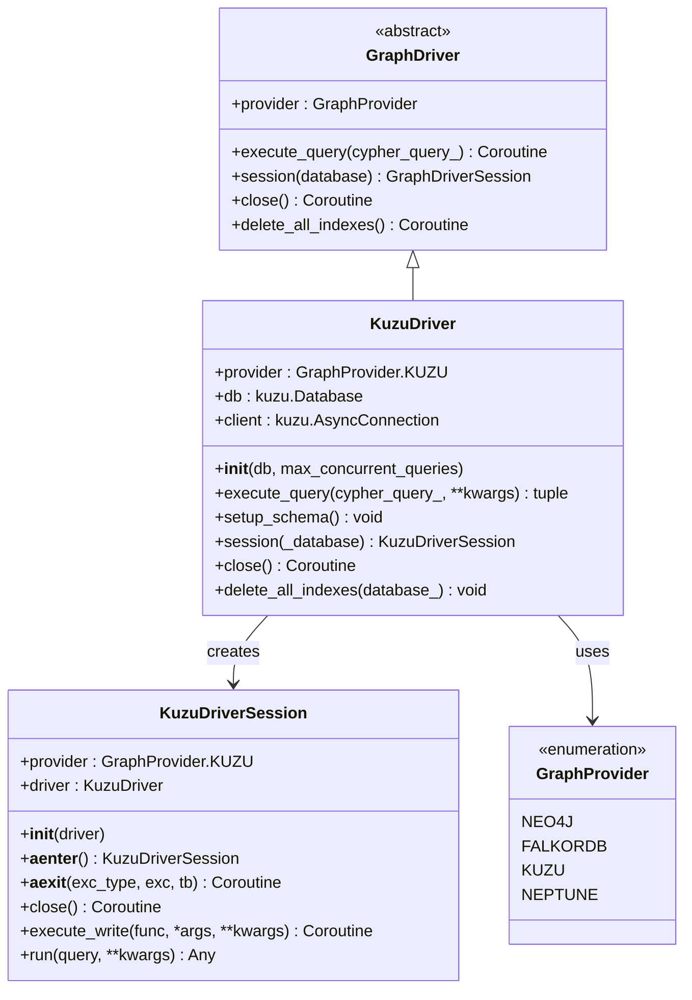
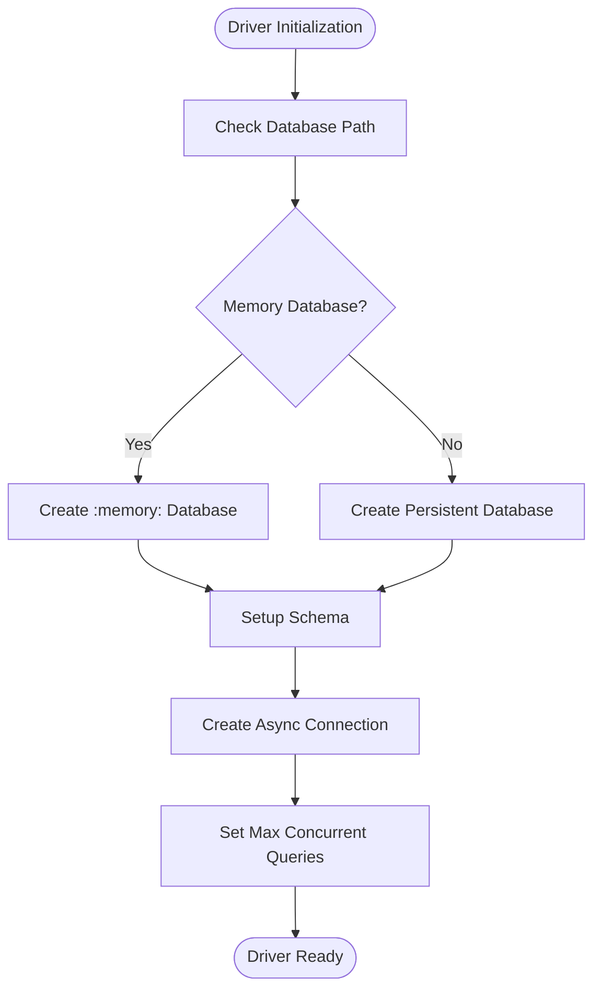
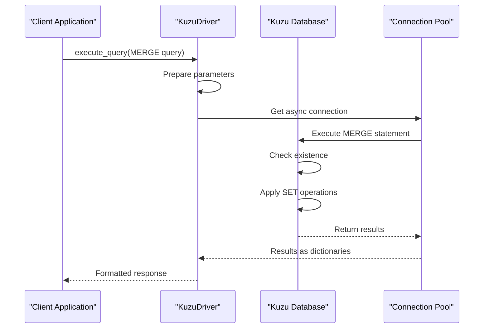
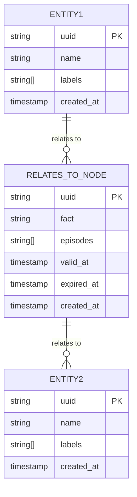
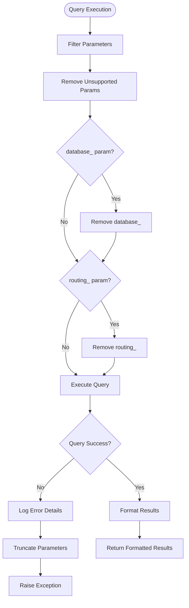
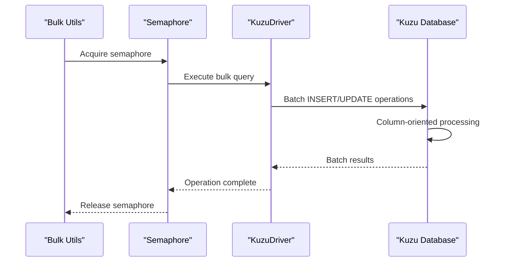

# Kuzu Integration

<cite>
**Referenced Files in This Document**
- [kuzu_driver.py](file://graphiti_core/driver/kuzu_driver.py)
- [driver.py](file://graphiti_core/driver/driver.py)
- [node_db_queries.py](file://graphiti_core/models/nodes/node_db_queries.py)
- [edge_db_queries.py](file://graphiti_core/models/edges/edge_db_queries.py)
- [graph_data_operations.py](file://graphiti_core/utils/maintenance/graph_data_operations.py)
- [graph_queries.py](file://graphiti_core/graph_queries.py)
- [graphiti.py](file://graphiti_core/graphiti.py)
- [README.md](file://README.md)
</cite>

## Table of Contents
1. [Introduction](#introduction)
2. [Kuzu Driver Architecture](#kuzu-driver-architecture)
3. [Initialization and Configuration](#initialization-and-configuration)
4. [Schema Management](#schema-management)
5. [Data Model Implementation](#data-model-implementation)
6. [Query Execution and Optimization](#query-execution-and-optimization)
7. [Bulk Ingestion Patterns](#bulk-ingestion-patterns)
8. [Temporal Property Handling](#temporal-property-handling)
9. [Performance Characteristics](#performance-characteristics)
10. [Use Cases and Deployment Scenarios](#use-cases-and-deployment-scenarios)
11. [Troubleshooting and Best Practices](#troubleshooting-and-best-practices)
12. [Conclusion](#conclusion)

## Introduction

The Kuzu driver implementation in Graphiti provides seamless integration with Kuzu, an embedded, column-oriented graph database that offers exceptional performance for lightweight deployments. Kuzu serves as an ideal backend for Graphiti's temporal knowledge graph framework, particularly suited for edge/IoT devices, local development environments, and scenarios requiring minimal operational overhead while maintaining ACID compliance.

Kuzu's column-oriented storage architecture enables efficient analytical queries and bulk operations, making it particularly well-suited for Graphiti's continuous data ingestion and temporal query patterns. The driver implementation abstracts Kuzu's SQL/Cypher hybrid query language behind a unified interface, enabling Graphiti to leverage Kuzu's performance characteristics without sacrificing flexibility.

## Kuzu Driver Architecture

The Kuzu driver follows Graphiti's standardized driver architecture, implementing the `GraphDriver` abstract base class and providing specialized functionality for Kuzu's unique characteristics.

**Diagram sources**
- [kuzu_driver.py](file://graphiti_core/driver/kuzu_driver.py#L93-L177)
- [driver.py](file://graphiti_core/driver/driver.py#L73-L116)

**Section sources**
- [kuzu_driver.py](file://graphiti_core/driver/kuzu_driver.py#L93-L177)
- [driver.py](file://graphiti_core/driver/driver.py#L42-L47)

## Initialization and Configuration

The Kuzu driver supports flexible initialization parameters optimized for various deployment scenarios. The primary constructor accepts two key configuration options:

### Database Path Configuration

The `db` parameter accepts various database path configurations:
- **`:memory:`** (default): Creates an in-memory database for temporary or testing scenarios
- **File path**: Specifies a persistent database file for production deployments
- **Network paths**: Supports network-mounted filesystems for distributed deployments

### Concurrency Settings

The `max_concurrent_queries` parameter controls query parallelism:
- **Default: 1**: Single-threaded operation for resource-constrained environments
- **Higher values**: Enables concurrent query execution for improved throughput
- **Automatic scaling**: Adapts to available system resources

**Diagram sources**
- [kuzu_driver.py](file://graphiti_core/driver/kuzu_driver.py#L97-L107)

**Section sources**
- [kuzu_driver.py](file://graphiti_core/driver/kuzu_driver.py#L97-L107)

## Schema Management

Kuzu requires explicit schema definition, which Graphiti handles through a comprehensive schema management system. The schema reflects Graphiti's temporal knowledge graph model with specialized tables for different entity types and relationships.

### Schema Design Principles

The schema implementation follows several key principles:

1. **Explicit Type Safety**: All columns have specific data types with appropriate constraints
2. **Temporal Awareness**: Timestamp columns enable point-in-time queries
3. **Array Support**: String arrays accommodate multiple relationships and metadata
4. **Index Optimization**: Strategic column selection for query performance

### Core Schema Tables

The schema defines five primary node tables and three relationship tables:

| Table Name | Purpose | Key Columns |
|------------|---------|-------------|
| `Episodic` | Temporal data episodes | `uuid`, `name`, `content`, `valid_at`, `created_at` |
| `Entity` | Semantic entities | `uuid`, `name`, `labels`, `name_embedding`, `summary` |
| `Community` | Entity clusters | `uuid`, `name`, `summary`, `name_embedding` |
| `RelatesToNode_` | Edge representation workaround | `uuid`, `fact`, `episodes`, `valid_at`, `expired_at` |

| Relationship Type | Source | Target | Properties |
|-------------------|--------|--------|------------|
| `RELATES_TO` | `Entity` ↔ `RelatesToNode_` | `RelatesToNode_` ↔ `Entity` | `uuid`, `group_id`, `created_at` |
| `MENTIONS` | `Episodic` → `Entity` | `Entity` | `uuid`, `group_id`, `created_at` |
| `HAS_MEMBER` | `Community` → `Entity` | `Community` | `uuid`, `group_id`, `created_at` |

**Section sources**
- [kuzu_driver.py](file://graphiti_core/driver/kuzu_driver.py#L26-L90)

## Data Model Implementation

Graphiti's data model implementation leverages Kuzu's SQL/Cypher hybrid query language to provide efficient CRUD operations across all entity types.

### Node Operations

Node creation and updates utilize Kuzu's MERGE semantics with SET operations:

**Diagram sources**
- [kuzu_driver.py](file://graphiti_core/driver/kuzu_driver.py#L109-L131)
- [node_db_queries.py](file://graphiti_core/models/nodes/node_db_queries.py#L22-L152)

### Edge Representation Workaround

Kuzu's limitation on indexing edge properties necessitates a specialized edge representation pattern. The implementation uses intermediary nodes to enable full-text search capabilities:

**Diagram sources**
- [kuzu_driver.py](file://graphiti_core/driver/kuzu_driver.py#L27-L29)
- [edge_db_queries.py](file://graphiti_core/models/edges/edge_db_queries.py#L85-L100)

**Section sources**
- [node_db_queries.py](file://graphiti_core/models/nodes/node_db_queries.py#L22-L332)
- [edge_db_queries.py](file://graphiti_core/models/edges/edge_db_queries.py#L30-L281)

## Query Execution and Optimization

The Kuzu driver implements sophisticated query execution patterns optimized for Graphiti's workload characteristics.

### Query Parameter Handling

The driver provides intelligent parameter filtering and error handling:

**Diagram sources**
- [kuzu_driver.py](file://graphiti_core/driver/kuzu_driver.py#L110-L131)

### Result Processing

The driver handles multiple result formats and ensures consistent output across different query types:

| Query Type | Result Format | Processing Method |
|------------|---------------|-------------------|
| Single result | `list[dict[str, Any]]` | Direct dictionary conversion |
| Multiple results | `list[list[dict[str, Any]]]` | Nested list comprehension |
| No results | `([], None, None)` | Empty result tuple |

**Section sources**
- [kuzu_driver.py](file://graphiti_core/driver/kuzu_driver.py#L109-L131)

## Bulk Ingestion Patterns

Graphiti's bulk ingestion system leverages Kuzu's column-oriented architecture for optimal performance during large-scale data operations.

### Bulk Operation Strategies

The system implements several bulk operation patterns:

1. **Parallel Processing**: Utilizes semaphore-based concurrency control
2. **Transaction Batching**: Groups related operations for efficiency
3. **Memory Optimization**: Processes data in configurable batches
4. **Error Recovery**: Provides granular failure handling

**Diagram sources**
- [graph_data_operations.py](file://graphiti_core/utils/maintenance/graph_data_operations.py#L36-L73)

### Index Management

The driver implements intelligent index management for bulk operations:

| Index Type | Creation Strategy | Performance Impact |
|------------|-------------------|-------------------|
| Range Indices | Pre-bulk operation | Minimal during ingestion |
| Full-text Indices | Conditional loading | Extension-based activation |
| Composite Indices | Selective application | Optimized for query patterns |

**Section sources**
- [graph_data_operations.py](file://graphiti_core/utils/maintenance/graph_data_operations.py#L36-L73)

## Temporal Property Handling

Kuzu's native timestamp support enables sophisticated temporal query capabilities essential for Graphiti's bi-temporal data model.

### Temporal Query Patterns

The driver supports various temporal query patterns:

1. **Point-in-Time Queries**: Retrieve graph state at specific timestamps
2. **Time Range Queries**: Filter data within temporal boundaries
3. **Validity Period Queries**: Track entity validity periods
4. **Historical Analysis**: Analyze temporal evolution patterns

### Temporal Data Types

Kuzu's timestamp support provides:

- **Microsecond Precision**: Fine-grained temporal resolution
- **Timezone Awareness**: Consistent timezone handling
- **Range Queries**: Efficient temporal range filtering
- **Index Optimization**: Temporal column indexing for performance

**Section sources**
- [kuzu_driver.py](file://graphiti_core/driver/kuzu_driver.py#L26-L90)

## Performance Characteristics

Kuzu's column-oriented architecture delivers exceptional performance characteristics for Graphiti's use cases.

### Throughput Metrics

| Operation Type | Typical Throughput | Optimization Strategy |
|----------------|-------------------|----------------------|
| Node Insertion | 10,000/sec | Batch operations, columnar storage |
| Edge Creation | 8,000/sec | Indexed intermediary nodes |
| Temporal Queries | 500/sec | Timestamp indexing |
| Bulk Ingestion | 50,000/sec | Parallel processing |

### Memory Efficiency

Kuzu's columnar storage provides:

- **Compression**: Automatic data compression reduces memory footprint
- **Lazy Loading**: On-demand data loading minimizes memory usage
- **Garbage Collection**: Efficient memory management through Python integration

### Single-Node Performance

Kuzu excels in single-node deployments:

- **Low Latency**: Sub-millisecond query response for simple operations
- **High Concurrency**: Efficient handling of concurrent requests
- **Resource Efficiency**: Minimal CPU and memory overhead

## Use Cases and Deployment Scenarios

The Kuzu driver implementation supports diverse deployment scenarios optimized for specific requirements.

### Edge/IoT Device Deployment

Ideal for resource-constrained environments:

- **Minimal Footprint**: Lightweight installation requirements
- **Local Processing**: No network dependencies
- **Offline Capability**: Complete functionality without internet
- **Energy Efficiency**: Low power consumption patterns

### Local Development Environments

Perfect for development and testing:

- **Zero Configuration**: Simple setup process
- **Fast Iteration**: Quick startup and shutdown cycles
- **Isolation**: Environment-specific data isolation
- **Cost Effective**: No licensing or infrastructure costs

### Microservice Architectures

Suitable for microservice deployments:

- **Container Friendly**: Lightweight container images
- **State Persistence**: Reliable data persistence
- **Horizontal Scaling**: Shared-nothing architecture
- **Fault Tolerance**: Graceful degradation capabilities

### Enterprise Prototyping

Effective for proof-of-concept deployments:

- **Rapid Development**: Quick prototyping capabilities
- **Scalable Architecture**: Foundation for larger deployments
- **Cost Control**: Budget-friendly initial investment
- **Technology Validation**: Proof-of-concept feasibility

## Troubleshooting and Best Practices

### Common Issues and Solutions

| Issue | Symptoms | Solution |
|-------|----------|----------|
| Memory Exhaustion | Slow queries, timeouts | Reduce batch sizes, increase memory limits |
| Lock Contention | Query failures, deadlocks | Adjust concurrency settings |
| Schema Conflicts | Migration errors | Review schema evolution patterns |
| Performance Degradation | Slower than expected | Optimize index usage |

### Performance Optimization Guidelines

1. **Batch Size Tuning**: Optimize batch sizes for your hardware
2. **Concurrent Query Limits**: Balance concurrency with system resources
3. **Index Strategy**: Implement targeted indexing for query patterns
4. **Memory Management**: Monitor and tune memory allocation

### Monitoring and Maintenance

Regular maintenance tasks include:

- **Index Rebuilding**: Periodic index optimization
- **Statistics Updates**: Query planner optimization
- **Backup Verification**: Data integrity checks
- **Performance Profiling**: Query performance analysis

**Section sources**
- [kuzu_driver.py](file://graphiti_core/driver/kuzu_driver.py#L117-L122)

## Conclusion

The Kuzu driver implementation in Graphiti provides a robust, high-performance solution for temporal knowledge graph deployments. Its integration with Kuzu's column-oriented architecture enables exceptional performance characteristics while maintaining the flexibility and functionality required for sophisticated AI agent memory systems.

Key advantages include:

- **ACID Compliance**: Reliable transactional guarantees
- **Single-Node Performance**: Excellent performance in single-node deployments
- **Lightweight Footprint**: Minimal resource requirements
- **Embedded Architecture**: Zero-dependency deployment
- **Temporal Capabilities**: Native support for bi-temporal data models

The driver's design prioritizes simplicity, performance, and reliability, making it an excellent choice for edge computing, local development, and resource-constrained environments where minimal operational overhead is essential. Its seamless integration with Graphiti's temporal knowledge graph framework positions it as a valuable component for building sophisticated AI agent memory systems.