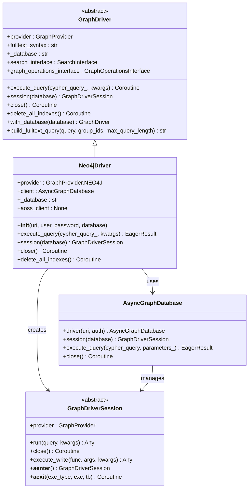
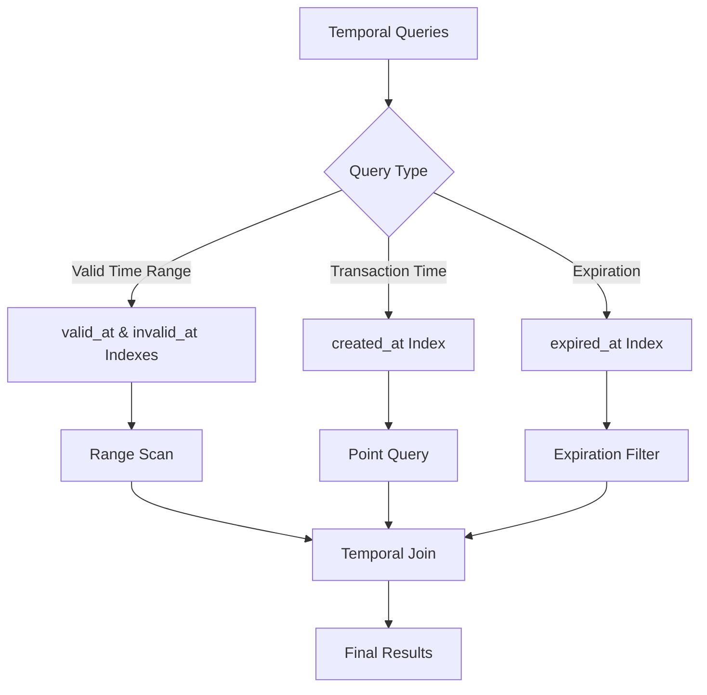
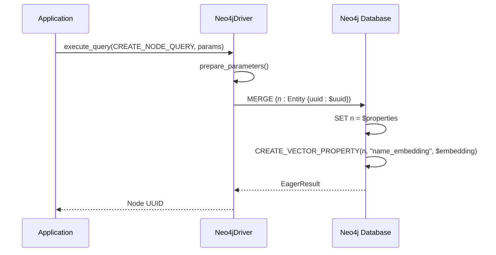
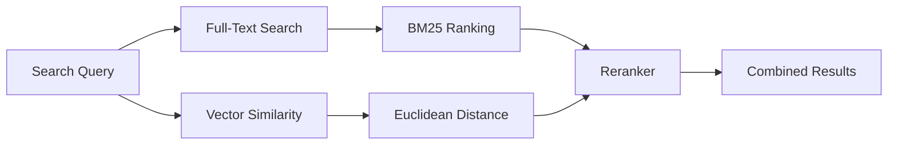
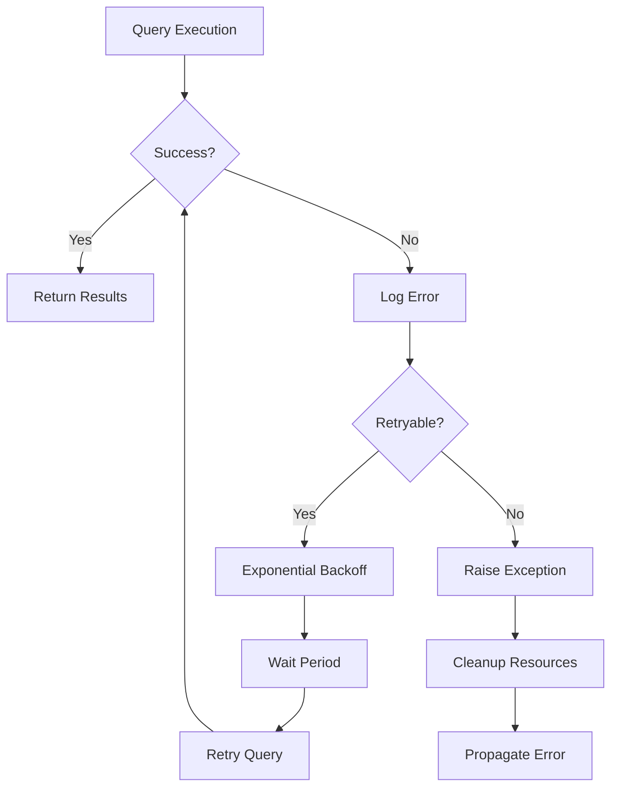
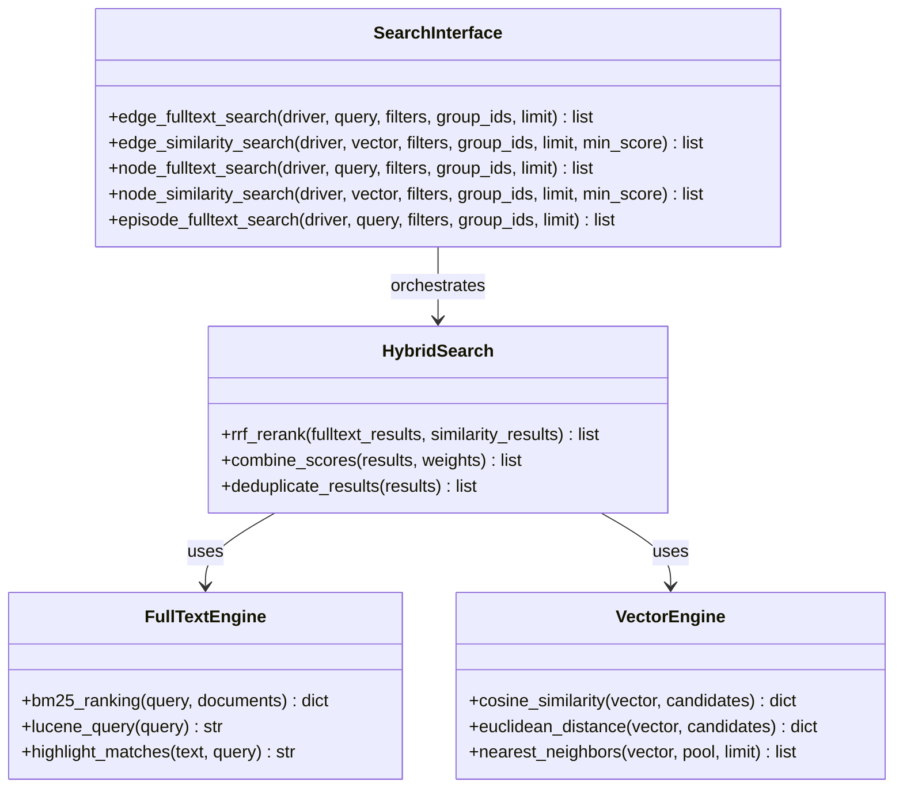
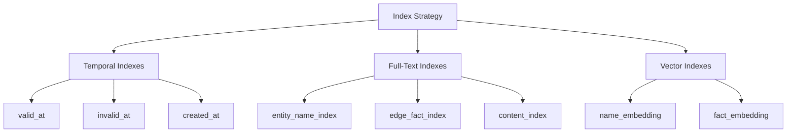
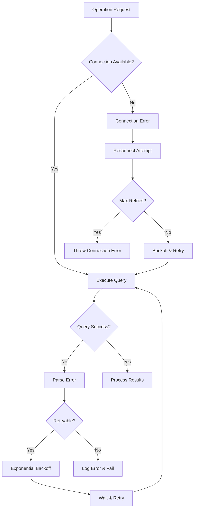
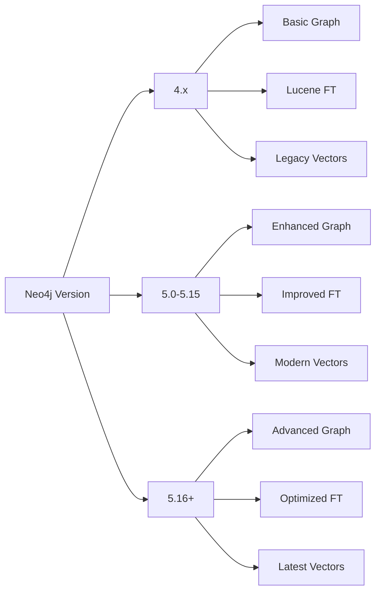

# Neo4j Integration

<cite>
**Referenced Files in This Document**
- [neo4j_driver.py](file://graphiti_core/driver/neo4j_driver.py)
- [driver.py](file://graphiti_core/driver/driver.py)
- [quickstart_neo4j.py](file://examples/quickstart/quickstart_neo4j.py)
- [graphiti.py](file://graphiti_core/graphiti.py)
- [node_db_queries.py](file://graphiti_core/models/nodes/node_db_queries.py)
- [edge_db_queries.py](file://graphiti_core/models/edges/edge_db_queries.py)
- [search_utils.py](file://graphiti_core/search/search_utils.py)
- [graph_queries.py](file://graphiti_core/graph_queries.py)
- [helpers.py](file://graphiti_core/helpers.py)
- [docker-compose.yml](file://docker-compose.yml)
- [uv.lock](file://uv.lock)
</cite>

## Table of Contents
1. [Introduction](#introduction)
2. [Neo4jDriver Architecture](#neo4jdriver-architecture)
3. [Configuration and Setup](#configuration-and-setup)
4. [Bi-Temporal Data Modeling](#bi-temporal-data-modeling)
5. [Cypher Query Patterns](#cypher-query-patterns)
6. [Transaction Management](#transaction-management)
7. [Full-Text Search Integration](#full-text-search-integration)
8. [Performance Considerations](#performance-considerations)
9. [Error Handling and Recovery](#error-handling-and-recovery)
10. [Version Compatibility](#version-compatibility)
11. [Common Issues and Solutions](#common-issues-and-solutions)
12. [Best Practices](#best-practices)

## Introduction

The Neo4j driver implementation in Graphiti provides native integration with Neo4j using the official Python driver, enabling sophisticated knowledge graph operations with bi-temporal data modeling capabilities. This implementation extends the base GraphDriver class to offer seamless connectivity to Neo4j databases while maintaining compatibility with Graphiti's unified graph interface.

The Neo4j integration supports advanced features including temporal indexing, hybrid search combining semantic similarity and BM25 retrieval, and robust transaction management for large-scale knowledge graph operations.

## Neo4jDriver Architecture

The Neo4jDriver class serves as the primary interface between Graphiti and Neo4j databases, implementing a comprehensive abstraction layer that handles database connections, query execution, and resource management.



**Diagram sources**
- [neo4j_driver.py](file://graphiti_core/driver/neo4j_driver.py#L29-L75)
- [driver.py](file://graphiti_core/driver/driver.py#L73-L116)

**Section sources**
- [neo4j_driver.py](file://graphiti_core/driver/neo4j_driver.py#L29-L75)
- [driver.py](file://graphiti_core/driver/driver.py#L73-L116)

## Configuration and Setup

### Basic Configuration

The Neo4jDriver requires minimal configuration parameters for establishing connections to Neo4j databases:

| Parameter | Type | Description | Default |
|-----------|------|-------------|---------|
| `uri` | str | Neo4j database URI (bolt://host:port) | Required |
| `user` | str \| None | Authentication username | None |
| `password` | str \| None | Authentication password | None |
| `database` | str | Target database name | 'neo4j' |

### Environment Variables

Graphiti supports environment variable configuration for Neo4j connections:

```bash
# Neo4j connection settings
NEO4J_URI=bolt://localhost:7687
NEO4J_USER=neo4j
NEO4J_PASSWORD=password

# Optional: Specify database name
NEO4J_DATABASE=graphiti
```

### Connection Pooling Settings

The Neo4j driver utilizes the official AsyncGraphDatabase client which provides built-in connection pooling:

```python
# Connection pooling configuration is handled internally by neo4j driver
# Default pool size: 10 connections
# Connection timeout: 30 seconds
# Maximum retry attempts: 3
```

### Initialization Examples

```python
# Basic initialization
from graphiti_core.driver.neo4j_driver import Neo4jDriver

# Using explicit credentials
driver = Neo4jDriver(
    uri="bolt://localhost:7687",
    user="neo4j",
    password="password",
    database="graphiti"
)

# Using Graphiti with Neo4j driver
from graphiti_core import Graphiti

graphiti = Graphiti(
    uri="bolt://localhost:7687",
    user="neo4j",
    password="password"
)
```

**Section sources**
- [neo4j_driver.py](file://graphiti_core/driver/neo4j_driver.py#L32-L47)
- [quickstart_neo4j.py](file://examples/quickstart/quickstart_neo4j.py#L47-L54)

## Bi-Temporal Data Modeling

Graphiti implements sophisticated bi-temporal data modeling using Neo4j's temporal capabilities, supporting both valid time (when an event was true) and transaction time (when the information was recorded).

### Temporal Node Properties

Entities and edges in Graphiti maintain temporal metadata:

| Property | Type | Purpose | Example |
|----------|------|---------|---------|
| `valid_at` | DateTime | When the information was true | "2024-01-01T00:00:00" |
| `invalid_at` | DateTime | When the information became false | "2024-12-31T23:59:59" |
| `created_at` | DateTime | When the node/edge was created | "2024-01-01T10:00:00" |
| `expired_at` | DateTime | When the node/edge was marked as expired | "2024-06-30T23:59:59" |

### Temporal Indexing Strategy

Graphiti creates specialized indexes for efficient temporal queries:



**Diagram sources**
- [graph_queries.py](file://graphiti_core/graph_queries.py#L58-L68)

### Temporal Query Patterns

The driver implements optimized Cypher patterns for temporal operations:

```cypher
// Valid time range query
MATCH (n:Entity)
WHERE n.valid_at <= $reference_time 
  AND (n.invalid_at IS NULL OR n.invalid_at >= $reference_time)
RETURN n

// Transaction time query  
MATCH (n:Entity)
WHERE n.created_at <= $reference_time
RETURN n

// Expiration check
MATCH (n:Entity)
WHERE n.expired_at IS NOT NULL 
  AND n.expired_at <= $current_time
RETURN n
```

**Section sources**
- [node_db_queries.py](file://graphiti_core/models/nodes/node_db_queries.py#L129-L180)
- [edge_db_queries.py](file://graphiti_core/models/edges/edge_db_queries.py#L63-L122)

## Cypher Query Patterns

### Node Creation and Updates

The Neo4j driver uses MERGE statements for atomic node operations:



**Diagram sources**
- [node_db_queries.py](file://graphiti_core/models/nodes/node_db_queries.py#L129-L180)

### Edge Relationship Patterns

Entity edges utilize temporal relationships with validity periods:

```cypher
// Entity edge creation with temporal validity
MERGE (source:Entity {uuid: $source_uuid})
MERGE (target:Entity {uuid: $target_uuid})
MERGE (source)-[e:RELATES_TO {uuid: $uuid}]->(target)
SET e = $properties
SET e.valid_at = $valid_at
SET e.invalid_at = $invalid_at
SET e.fact_embedding = $fact_embedding
RETURN e.uuid AS uuid
```

### Bulk Operations

For large-scale data ingestion, the driver supports UNWIND operations:

```cypher
// Bulk node creation
UNWIND $nodes AS node
MERGE (n:Entity {uuid: node.uuid})
SET n:$(node.labels)
SET n = node
WITH n, node
CALL db.create.setNodeVectorProperty(n, "name_embedding", node.name_embedding)
RETURN n.uuid AS uuid
```

### Search Query Patterns

Hybrid search combines full-text and vector similarity:



**Diagram sources**
- [search_utils.py](file://graphiti_core/search/search_utils.py#L1132-L1161)

**Section sources**
- [node_db_queries.py](file://graphiti_core/models/nodes/node_db_queries.py#L129-L252)
- [edge_db_queries.py](file://graphiti_core/models/edges/edge_db_queries.py#L63-L183)

## Transaction Management

### Session-Based Transactions

The Neo4j driver provides session-based transaction management:

```python
# Session creation with automatic cleanup
async def managed_session():
    async with driver.session() as session:
        async with session.transaction() as tx:
            # Perform multiple operations within transaction
            result1 = await tx.run(query1, params1)
            result2 = await tx.run(query2, params2)
            return await result1.fetch_all()

# Automatic resource cleanup
try:
    session = driver.session()
    # Perform operations
finally:
    await session.close()
```

### Error Recovery Mechanisms

The driver implements comprehensive error handling:



**Diagram sources**
- [neo4j_driver.py](file://graphiti_core/driver/neo4j_driver.py#L56-L61)

### Connection Lifecycle Management

Proper connection lifecycle ensures optimal resource utilization:

```python
# Graceful shutdown
async def shutdown():
    try:
        # Cleanup operations
        await driver.delete_all_indexes()
    finally:
        await driver.close()

# Resource monitoring
import logging
logger = logging.getLogger(__name__)

async def execute_with_logging(query, params):
    try:
        logger.info(f"Executing query: {query[:100]}...")
        result = await driver.execute_query(query, params=params)
        logger.info(f"Query completed successfully")
        return result
    except Exception as e:
        logger.error(f"Query failed: {e}")
        raise
```

**Section sources**
- [neo4j_driver.py](file://graphiti_core/driver/neo4j_driver.py#L64-L75)

## Full-Text Search Integration

### Hybrid Retrieval Architecture

Graphiti implements a sophisticated hybrid search system combining semantic similarity and BM25 text retrieval:



**Diagram sources**
- [search_interface.py](file://graphiti_core/driver/search_interface/search_interface.py#L22-L90)

### BM25 Implementation

The driver leverages Neo4j's native full-text search capabilities:

```cypher
// Native Neo4j full-text search
CALL db.index.fulltext.queryNodes("entity_name_index", $query, {limit: $limit})

// BM25 ranking with custom scoring
CALL db.index.fulltext.queryNodes(indexName, query, {
    bm25: true,
    scoreThreshold: 0.5,
    limit: 100
})
```

### Reranking Strategies

Graphiti employs Reciprocal Rank Fusion (RRF) for optimal result combination:

```python
# RRF implementation for hybrid search
def rrf_rerank(fulltext_results, similarity_results, k=60):
    """Combine full-text and similarity results using RRF"""
    combined_scores = {}
    
    # Process full-text results
    for rank, result in enumerate(fulltext_results, 1):
        score = 1.0 / (k + rank)
        combined_scores[result.uuid] = combined_scores.get(result.uuid, 0) + score
    
    # Process similarity results
    for rank, result in enumerate(similarity_results, 1):
        score = 1.0 / (k + rank)
        combined_scores[result.uuid] = combined_scores.get(result.uuid, 0) + score
    
    # Sort by combined score
    return sorted(
        combined_results,
        key=lambda x: combined_scores[x.uuid],
        reverse=True
    )
```

**Section sources**
- [search_utils.py](file://graphiti_core/search/search_utils.py#L557-L1161)

## Performance Considerations

### Large-Scale Knowledge Graph Optimization

For large-scale deployments, Graphiti implements several performance optimization strategies:

#### Batch Processing

```python
# Optimized bulk operations
async def bulk_ingestion(nodes, edges, batch_size=100):
    """Process large datasets in optimized batches"""
    
    # Node ingestion with vector embedding creation
    node_batches = [nodes[i:i + batch_size] for i in range(0, len(nodes), batch_size)]
    for batch in node_batches:
        await driver.execute_query(
            get_entity_node_save_bulk_query(provider),
            nodes=batch
        )
    
    # Edge ingestion with relationship creation
    edge_batches = [edges[i:i + batch_size] for i in range(0, len(edges), batch_size)]
    for batch in edge_batches:
        await driver.execute_query(
            get_entity_edge_save_bulk_query(provider),
            entity_edges=batch
        )
```

#### Connection Pooling Tuning

```python
# Connection pool configuration
from neo4j import AsyncGraphDatabase

# Optimal pool settings for production
driver = AsyncGraphDatabase.driver(
    uri=uri,
    auth=(user, password),
    max_connection_pool_size=50,      # Increase for high concurrency
    connection_timeout=30,             # Timeout for new connections
    max_transaction_retry_time=15,     # Retry timeout
    max_connection_lifetime=30 * 60    # Lifetime in seconds
)
```

#### Index Strategy



**Diagram sources**
- [graph_queries.py](file://graphiti_core/graph_queries.py#L58-L68)

### Memory Management

For memory-intensive operations, Graphiti implements streaming and pagination:

```python
# Streaming large result sets
async def stream_large_results(query, params, batch_size=1000):
    """Stream large result sets to manage memory usage"""
    
    offset = 0
    while True:
        params['offset'] = offset
        params['limit'] = batch_size
        
        result = await driver.execute_query(query, params=params)
        batch = result.records
        
        if not batch:
            break
            
        yield batch
        offset += len(batch)
        
        # Optional: Yield control to event loop
        await asyncio.sleep(0)
```

**Section sources**
- [node_db_queries.py](file://graphiti_core/models/nodes/node_db_queries.py#L183-L252)
- [edge_db_queries.py](file://graphiti_core/models/edges/edge_db_queries.py#L124-L183)

## Error Handling and Recovery

### Comprehensive Error Management

The Neo4j driver implements robust error handling for various failure scenarios:



**Diagram sources**
- [neo4j_driver.py](file://graphiti_core/driver/neo4j_driver.py#L56-L61)

### Common Error Types and Solutions

| Error Type | Cause | Solution | Prevention |
|------------|-------|----------|------------|
| `neo4j.exceptions.ServiceUnavailable` | Network/connection issues | Retry with exponential backoff | Health checks, connection pooling |
| `neo4j.exceptions.AuthenticationError` | Invalid credentials | Validate credentials | Secure credential storage |
| `neo4j.exceptions.TransientError` | Temporary failures | Retry operation | Implement retry logic |
| `neo4j.exceptions.ConstraintError` | Schema violations | Validate data before insertion | Pre-validation, schema constraints |

### Recovery Strategies

```python
# Robust error recovery implementation
import asyncio
from neo4j.exceptions import ServiceUnavailable, TransientError

async def resilient_execute_query(query, params, max_retries=3):
    """Execute query with comprehensive error recovery"""
    
    for attempt in range(max_retries):
        try:
            return await driver.execute_query(query, params=params)
            
        except ServiceUnavailable as e:
            if attempt == max_retries - 1:
                raise ConnectionError("Failed to connect to Neo4j after multiple attempts") from e
                
            wait_time = 2 ** attempt  # Exponential backoff
            await asyncio.sleep(wait_time)
            
        except TransientError as e:
            if attempt == max_retries - 1:
                raise RuntimeError(f"Transient error after {max_retries} attempts: {e}") from e
                
            await asyncio.sleep(1)  # Fixed delay for transient errors
            
        except Exception as e:
            # Log unexpected errors
            logger.error(f"Unexpected error: {e}")
            raise
```

**Section sources**
- [neo4j_driver.py](file://graphiti_core/driver/neo4j_driver.py#L56-L61)

## Version Compatibility

### Neo4j Version Support

Graphiti maintains compatibility across Neo4j versions with specific feature support:

| Neo4j Version | Graphiti Support | Key Features | Compatibility Notes |
|---------------|------------------|--------------|-------------------|
| 4.x | ✅ Full Support | Basic graph operations, full-text search | Legacy vector support |
| 5.x | ✅ Full Support | Advanced graph operations, vector support | Recommended for new deployments |
| 5.26+ | ✅ Enhanced | Improved vector operations, better performance | Latest features available |

### Feature Matrix



**Diagram sources**
- [uv.lock](file://uv.lock#L1846-L1856)

### Migration Considerations

For upgrading between Neo4j versions:

```python
# Version detection and adaptation
def detect_neo4j_version(driver):
    """Detect Neo4j version and adjust behavior accordingly"""
    
    try:
        result = await driver.execute_query("CALL dbms.components()")
        version_info = result.records[0]['versions'][0]
        
        if version_info.startswith('5.'):
            return 'neo4j_5_x'
        elif version_info.startswith('4.'):
            return 'neo4j_4_x'
        else:
            return 'unknown'
            
    except Exception:
        return 'unknown'

# Version-specific optimizations
async def optimized_query_execution(driver, query, params):
    """Adapt query execution based on Neo4j version"""
    
    version = await detect_neo4j_version(driver)
    
    if version == 'neo4j_5_x':
        # Use enhanced vector operations
        return await driver.execute_query(
            query, 
            params={**params, 'vector_support': True}
        )
    else:
        # Fallback to basic operations
        return await driver.execute_query(query, params=params)
```

**Section sources**
- [docker-compose.yml](file://docker-compose.yml#L28)
- [uv.lock](file://uv.lock#L1846-L1856)

## Common Issues and Solutions

### Connection Timeouts

**Problem**: Connections timing out in high-latency environments

**Solution**: Adjust connection and query timeouts:

```python
# Extended timeout configuration
from neo4j import AsyncGraphDatabase

driver = AsyncGraphDatabase.driver(
    uri=uri,
    auth=(user, password),
    connection_timeout=60,           # Extended connection timeout
    max_transaction_retry_time=30,   # Extended retry timeout
    fetch_size=1000                  # Larger result batches
)
```

### Schema Constraints Violations

**Problem**: Unique constraint violations during bulk operations

**Solution**: Implement pre-validation and conflict resolution:

```python
# Conflict resolution strategy
async def safe_bulk_insert(data, conflict_resolution='skip'):
    """Insert data with conflict resolution"""
    
    for item in data:
        try:
            await driver.execute_query(
                insert_query,
                params=item
            )
        except neo4j.exceptions.ConstraintError as e:
            if conflict_resolution == 'skip':
                logger.warning(f"Skipping duplicate: {item['uuid']}")
                continue
            elif conflict_resolution == 'update':
                await driver.execute_query(
                    update_query,
                    params=item
                )
            else:
                raise
```

### Memory Exhaustion

**Problem**: Out-of-memory errors with large datasets

**Solution**: Implement streaming and batch processing:

```python
# Memory-efficient processing
async def process_large_dataset(large_dataset, batch_size=1000):
    """Process large datasets without memory exhaustion"""
    
    total_items = len(large_dataset)
    processed_count = 0
    
    for i in range(0, total_items, batch_size):
        batch = large_dataset[i:i + batch_size]
        
        # Process batch
        await process_batch(batch)
        
        processed_count += len(batch)
        logger.info(f"Processed {processed_count}/{total_items} items")
        
        # Periodic garbage collection
        if i % (batch_size * 10) == 0:
            import gc
            gc.collect()
```

### Index Performance Issues

**Problem**: Slow query performance despite indexes

**Solution**: Monitor and optimize index usage:

```python
# Index performance monitoring
async def monitor_index_usage(driver):
    """Monitor and analyze index performance"""
    
    result = await driver.execute_query("""
        CALL db.indexes() YIELD name, type, labelsOrTypes, properties, userDescription
        RETURN name, type, labelsOrTypes, properties, userDescription,
               db.indexes.statistics(name) as stats
    """)
    
    for record in result.records:
        stats = record['stats']
        if stats['pagesVisited'] > 10000:
            logger.warning(f"Index {record['name']} may need optimization")
```

## Best Practices

### Connection Management

1. **Use connection pooling**: Leverage the built-in connection pooling
2. **Implement health checks**: Regularly verify database connectivity
3. **Graceful shutdown**: Always close connections properly

```python
# Best practice connection management
class ManagedNeo4jConnection:
    def __init__(self, uri, user, password):
        self.driver = AsyncGraphDatabase.driver(uri, auth=(user, password))
    
    async def __aenter__(self):
        return self.driver
    
    async def __aexit__(self, exc_type, exc_val, exc_tb):
        await self.driver.close()
```

### Query Optimization

1. **Use appropriate indexes**: Create indexes for frequently queried properties
2. **Batch operations**: Use UNWIND for bulk operations
3. **Limit result sets**: Always apply reasonable limits to queries

```python
# Optimized query patterns
async def optimized_search(query, limit=100):
    """Optimized search with proper limits and indexes"""
    
    return await driver.execute_query(
        """
        MATCH (n:Entity)
        WHERE n.name CONTAINS $query
        WITH n
        ORDER BY size(n.labels) DESC
        LIMIT $limit
        RETURN n.uuid AS uuid, n.name AS name, n.summary AS summary
        """,
        query=query,
        limit=limit
    )
```

### Monitoring and Observability

1. **Enable query logging**: Track slow queries
2. **Monitor resource usage**: Watch memory and CPU consumption
3. **Set up alerts**: Notify on connection failures or performance degradation

```python
# Comprehensive monitoring setup
import logging
from neo4j import GraphDatabase

# Enable query logging
logging.getLogger('neo4j.bolt').setLevel(logging.INFO)

# Performance monitoring
async def track_query_performance(query, params):
    """Track query performance metrics"""
    
    start_time = time.time()
    try:
        result = await driver.execute_query(query, params=params)
        duration = time.time() - start_time
        
        if duration > 1.0:  # Log slow queries
            logger.warning(f"Slow query detected: {duration:.2f}s")
            
        return result
    except Exception as e:
        logger.error(f"Query failed: {e}")
        raise
```

### Security Considerations

1. **Use secure connections**: Enable TLS for production
2. **Principle of least privilege**: Grant minimal required permissions
3. **Credential rotation**: Regularly rotate authentication credentials

```python
# Secure connection configuration
driver = AsyncGraphDatabase.driver(
    uri="bolt://localhost:7687",
    auth=("neo4j", "secure_password"),
    encrypted=True,  # Enable TLS
    trust=TRUST_SYSTEM_CA_SIGNED_CERTIFICATES,  # Trust system certificates
    max_connection_pool_size=10,
    connection_timeout=30
)
```

**Section sources**
- [neo4j_driver.py](file://graphiti_core/driver/neo4j_driver.py#L32-L75)
- [helpers.py](file://graphiti_core/helpers.py#L62-L85)