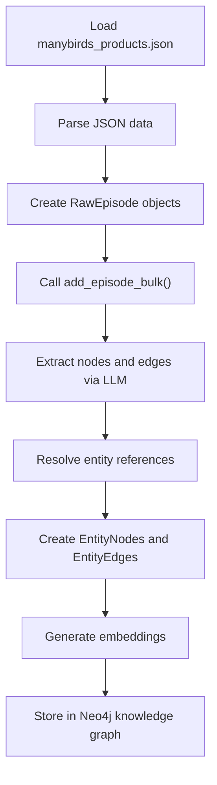
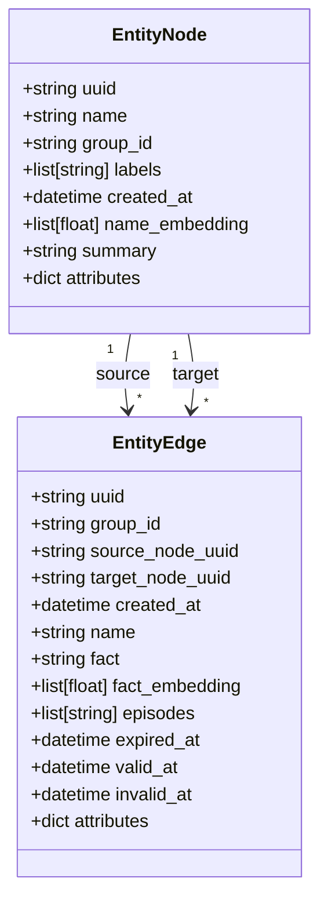
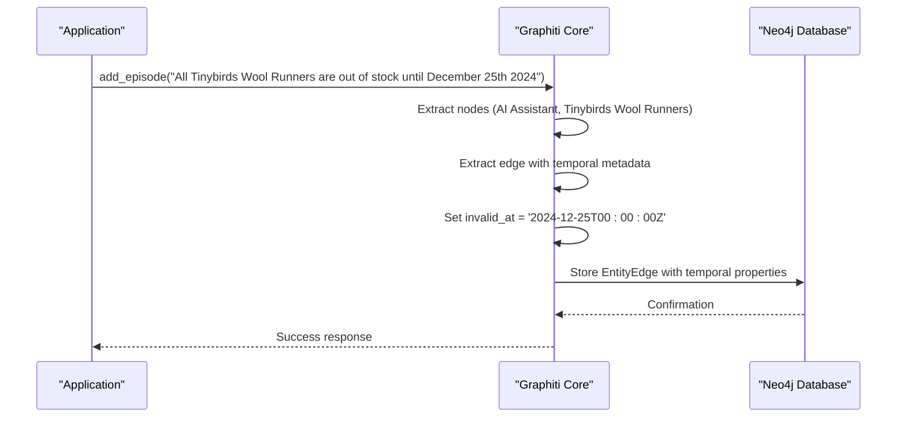
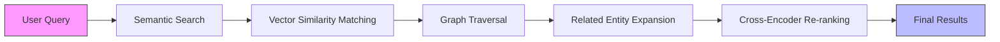
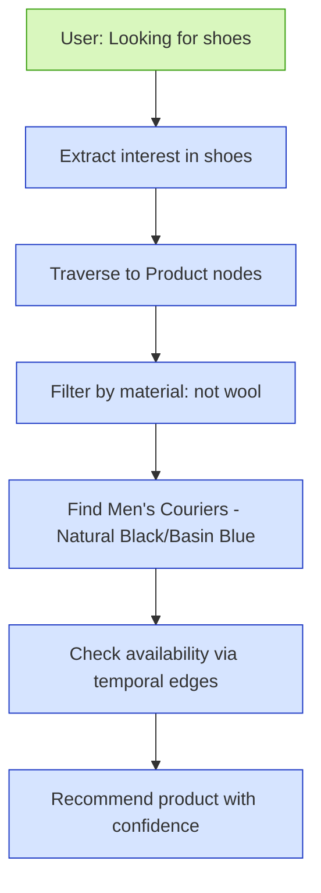

# E-commerce Use Case

<cite>
**Referenced Files in This Document**   
- [manybirds_products.json](file://examples/data/manybirds_products.json)
- [runner.py](file://examples/ecommerce/runner.py)
- [runner.ipynb](file://examples/ecommerce/runner.ipynb)
- [graphiti.py](file://graphiti_core/graphiti.py)
- [nodes.py](file://graphiti_core/nodes.py)
- [edges.py](file://graphiti_core/edges.py)
- [search.py](file://graphiti_core/search/search.py)
</cite>

## Table of Contents
1. [Introduction](#introduction)
2. [Data Ingestion Flow](#data-ingestion-flow)
3. [Node and Edge Creation](#node-and-edge-creation)
4. [Temporal Modeling](#temporal-modeling)
5. [Hybrid Search for Product Discovery](#hybrid-search-for-product-discovery)
6. [Dynamic Recommendations](#dynamic-recommendations)
7. [Performance Considerations](#performance-considerations)
8. [Handling E-commerce Challenges](#handling-e-commerce-challenges)
9. [Conclusion](#conclusion)

## Introduction
Graphiti enables sophisticated product knowledge management and intelligent recommendation systems for e-commerce applications. This document demonstrates how Graphiti processes product data from the manybirds_products.json dataset, creating a knowledge graph that captures product entities, their attributes, and relationships. The system leverages the Graphiti framework to extract and store product information, enabling semantic search and graph traversal for dynamic recommendations. By combining vector embeddings with graph relationships, Graphiti provides a powerful foundation for product discovery and personalized shopping experiences.

**Section sources**
- [manybirds_products.json](file://examples/data/manybirds_products.json)
- [runner.py](file://examples/ecommerce/runner.py)
- [runner.ipynb](file://examples/ecommerce/runner.ipynb)

## Data Ingestion Flow
The data ingestion process begins with loading product data from the manybirds_products.json file, which contains structured information about various products including their titles, descriptions, variants, and metadata. The ingestion workflow, implemented in both runner.py and runner.ipynb, follows a systematic approach to transform raw JSON data into knowledge graph entities. Each product is processed as an episode, with the add_episode method creating episodic nodes that represent the data ingestion event. The system extracts product attributes and relationships through LLM-powered entity and relationship extraction, converting unstructured product descriptions into structured graph data. This process preserves temporal information, allowing the system to track product changes over time.

**Diagram sources**
- [runner.py](file://examples/ecommerce/runner.py#L95-L121)
- [graphiti.py](file://graphiti_core/graphiti.py#L438-L467)

**Section sources**
- [runner.py](file://examples/ecommerce/runner.py#L95-L121)
- [runner.ipynb](file://examples/ecommerce/runner.ipynb#L125-L143)

## Node and Edge Creation
Product entities and their relationships are created through the add_episode functionality, which processes each product as a discrete episode. The system automatically extracts nodes representing products, brands, categories, materials, and other attributes from the product data. For example, the "TinyBirds Wool Runners" product creates nodes for the product itself, the "Manybirds" brand, "Shoes" category, "wool" material, and specific features like "Blizzard Sole". Relationships between these entities are established as edges with descriptive facts, such as "TinyBirds Wool Runners are manufactured by Manybirds" or "TinyBirds Wool Runners are available in Natural Black color". Custom entity definitions can be provided to guide the extraction process and ensure consistent node creation across the product catalog.

**Diagram sources**
- [nodes.py](file://graphiti_core/nodes.py#L435-L589)
- [edges.py](file://graphiti_core/edges.py#L221-L454)

**Section sources**
- [graphiti.py](file://graphiti_core/graphiti.py#L356-L412)
- [nodes.py](file://graphiti_core/nodes.py#L435-L589)
- [edges.py](file://graphiti_core/edges.py#L221-L454)

## Temporal Modeling
Graphiti's bi-temporal data model captures both when product facts become valid (valid_at) and when they cease to be true (invalid_at), enabling historical tracking of product attributes. This is particularly valuable for e-commerce applications where product information changes over time, such as pricing, availability, and features. For example, when ingesting inventory updates, the system can set the invalid_at timestamp to indicate when out-of-stock conditions will be resolved. The temporal modeling is implemented through the EntityEdge class, which includes valid_at and invalid_at fields that represent the time period during which a relationship is considered accurate. This allows queries to retrieve product information as it existed at any point in time, supporting features like historical price tracking and product change auditing.

**Diagram sources**
- [edges.py](file://graphiti_core/edges.py#L232-L237)
- [runner.ipynb](file://examples/ecommerce/runner.ipynb#L462-L468)

**Section sources**
- [edges.py](file://graphiti_core/edges.py#L232-L237)
- [runner.ipynb](file://examples/ecommerce/runner.ipynb#L462-L468)

## Hybrid Search for Product Discovery
Product discovery is powered by hybrid search that combines semantic search with graph traversal, leveraging both vector similarity and relational structure. The search functionality, implemented in the search.py module, supports multiple search configurations including combined hybrid search with cross-encoder re-ranking and edge hybrid search with reciprocal rank fusion. When a user queries for products, the system first performs semantic search to find relevant nodes based on vector similarity, then expands the results through graph traversal to include related entities. This approach enables sophisticated product discovery that goes beyond simple keyword matching, allowing users to find products based on attributes, relationships, and contextual relevance.

**Diagram sources**
- [search.py](file://graphiti_core/search/search.py)
- [search_config_recipes.py](file://graphiti_core/search/search_config_recipes.py)

**Section sources**
- [search.py](file://graphiti_core/search/search.py)
- [search_config_recipes.py](file://graphiti_core/search/search_config_recipes.py)

## Dynamic Recommendations
Intelligent recommendations are generated by combining semantic search with graph traversal to identify products that match user preferences and behavior. The system analyzes user interactions, stored as episodic nodes, to understand preferences and intent. For example, when a user expresses interest in wool-free shoes, the system can traverse the knowledge graph to find products made from alternative materials like cotton. The recommendation engine leverages the bi-temporal model to ensure recommendations are based on current product availability and attributes. Personalization at scale is achieved by maintaining user context in the graph, allowing the system to build comprehensive customer profiles that evolve over time based on interactions and preferences.

**Diagram sources**
- [runner.ipynb](file://examples/ecommerce/runner.ipynb#L86-L93)
- [graphiti.py](file://graphiti_core/graphiti.py#L611-L681)

**Section sources**
- [runner.ipynb](file://examples/ecommerce/runner.ipynb#L86-L93)
- [graphiti.py](file://graphiti_core/graphiti.py#L611-L681)

## Performance Considerations
Handling large product catalogs requires careful consideration of performance and scalability. Graphiti addresses this through bulk operations like add_episode_bulk, which processes multiple episodes efficiently, and optimized indexing strategies that support fast retrieval. The system implements rate limiting and coroutine management to prevent overwhelming the database during large-scale ingestion. For incremental updates, the system can process only changed products rather than re-ingesting the entire catalog, significantly reducing processing time. The knowledge graph structure itself provides performance advantages for complex queries, as graph traversals are typically more efficient than JOIN operations in relational databases when dealing with deeply connected data.

**Section sources**
- [graphiti.py](file://graphiti_core/graphiti.py#L438-L576)
- [bulk_utils.py](file://graphiti_core/utils/bulk_utils.py)

## Handling E-commerce Challenges
Graphiti's bi-temporal data model effectively addresses common e-commerce challenges such as handling out-of-stock items, pricing changes, and personalization at scale. For out-of-stock items, the system can set the invalid_at timestamp to indicate when inventory will be replenished, allowing the recommendation engine to inform customers of future availability. Pricing changes over time are captured by creating new edges with appropriate valid_at timestamps, preserving historical pricing information while reflecting current prices. Personalization is achieved by maintaining user preferences and interaction history in the graph, enabling the system to provide tailored recommendations based on individual customer profiles and behavior patterns.

**Section sources**
- [edges.py](file://graphiti_core/edges.py#L232-L237)
- [runner.ipynb](file://examples/ecommerce/runner.ipynb#L462-L468)

## Conclusion
Graphiti provides a comprehensive solution for e-commerce product knowledge management and intelligent recommendations. By transforming product data into a temporal knowledge graph, the system enables sophisticated product discovery and personalized shopping experiences. The combination of semantic search and graph traversal allows for dynamic recommendations that consider both product attributes and customer preferences. The bi-temporal data model ensures accurate representation of product information over time, addressing key e-commerce challenges like inventory management and pricing changes. This approach provides a scalable foundation for building intelligent e-commerce applications that can adapt to changing product catalogs and customer needs.