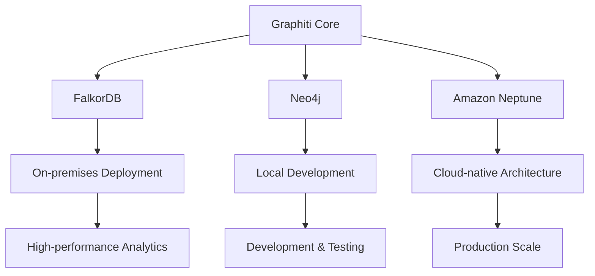
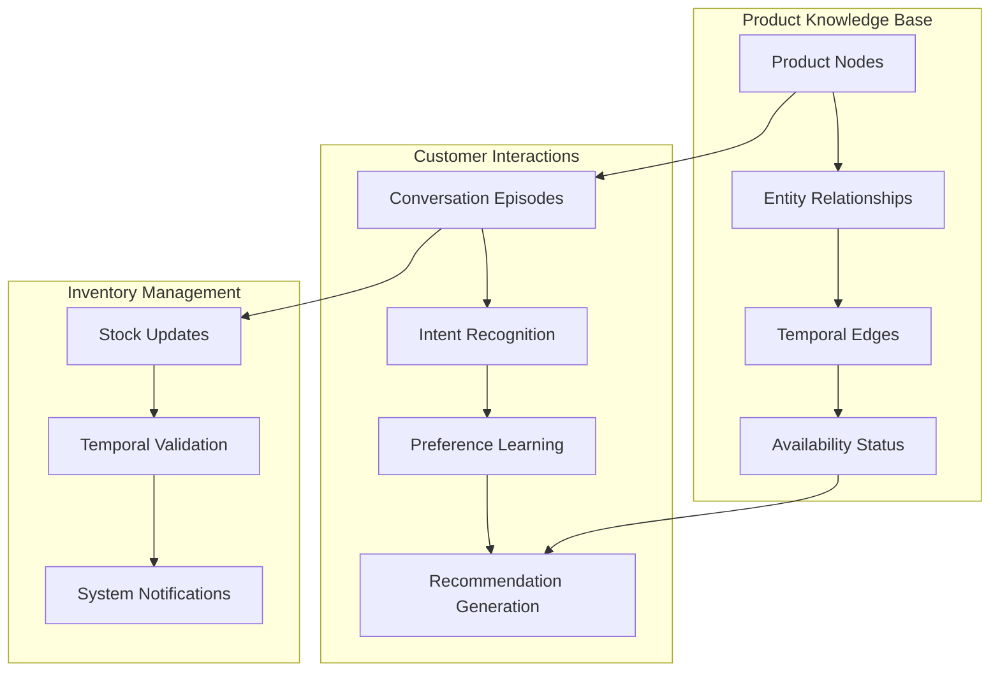
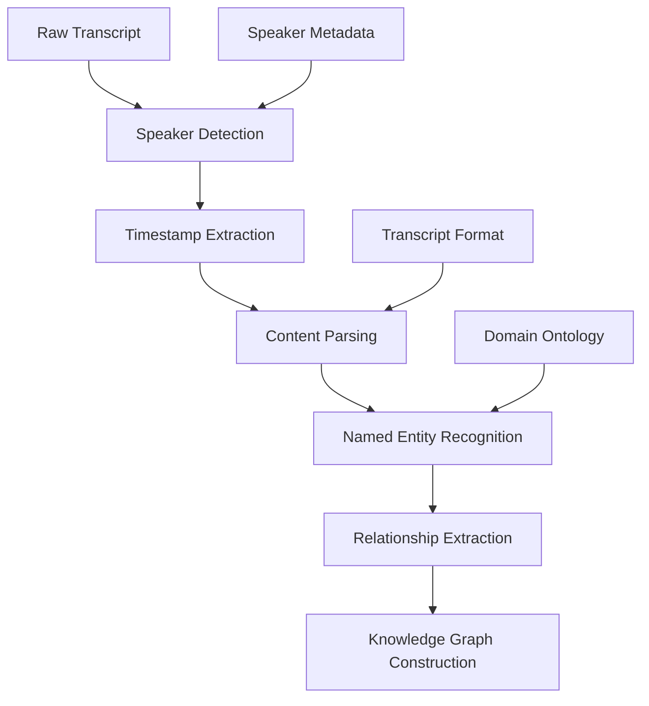
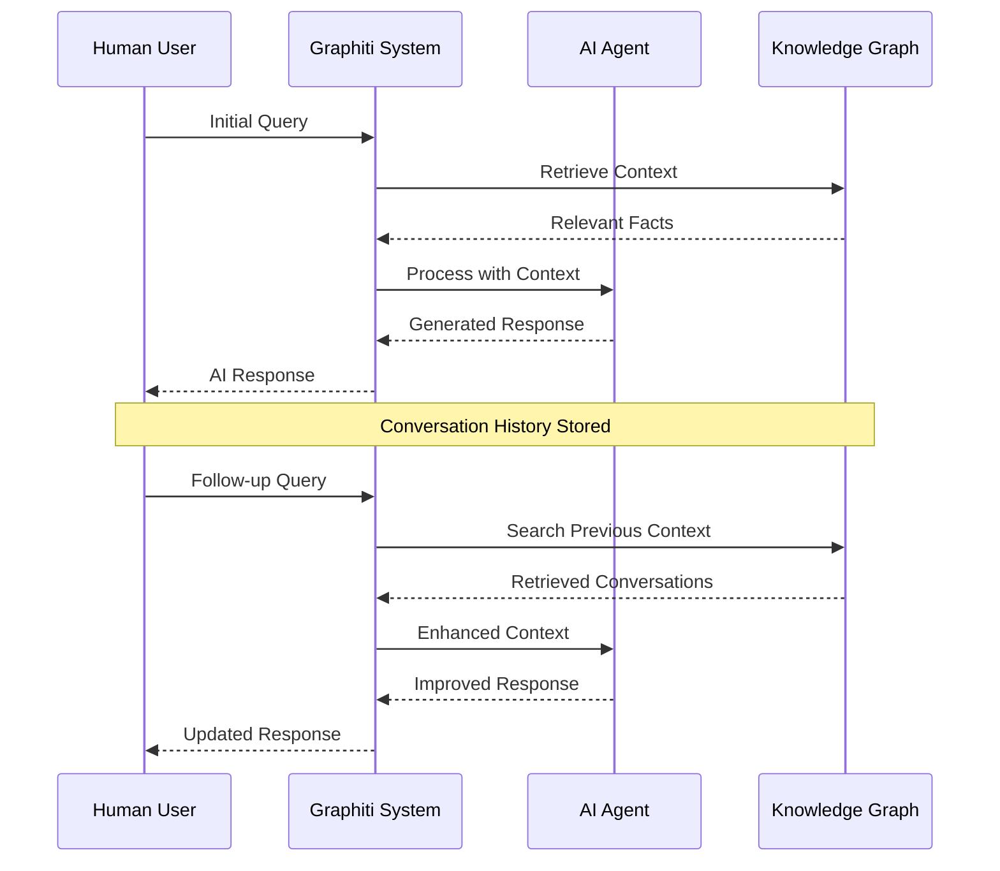
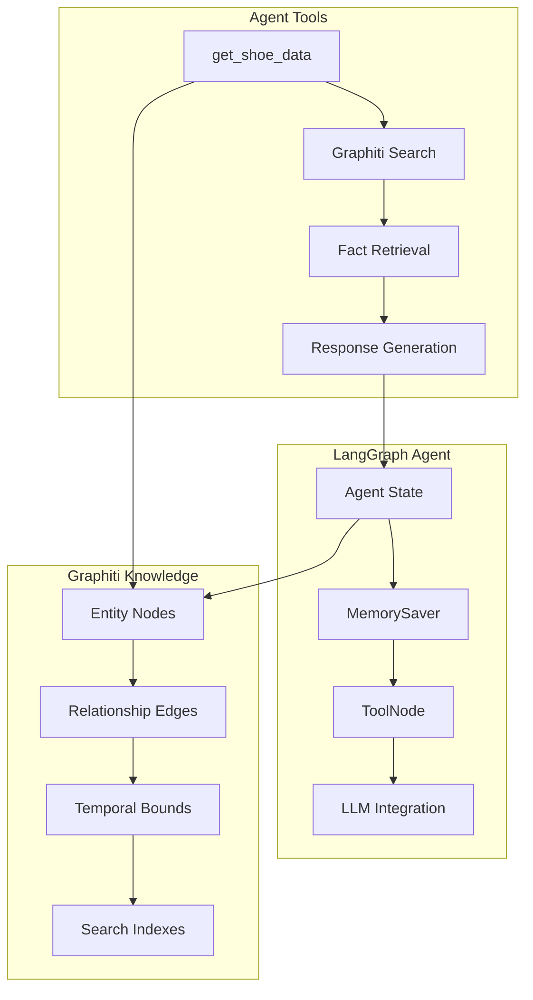
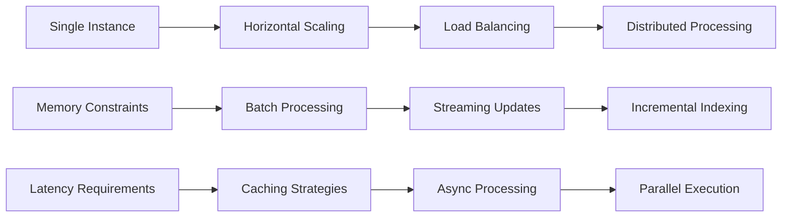

# Examples and Use Cases

<cite>
**Referenced Files in This Document**
- [runner.py](file://examples/ecommerce/runner.py)
- [runner.ipynb](file://examples/ecommerce/runner.ipynb)
- [podcast_runner.py](file://examples/podcast/podcast_runner.py)
- [transcript_parser.py](file://examples/podcast/transcript_parser.py)
- [podcast_transcript.txt](file://examples/podcast/podcast_transcript.txt)
- [parser.py](file://examples/wizard_of_oz/parser.py)
- [runner.py](file://examples/wizard_of_oz/runner.py)
- [agent.ipynb](file://examples/langgraph-agent/agent.ipynb)
- [manybirds_products.json](file://examples/data/manybirds_products.json)
- [quickstart_falkordb.py](file://examples/quickstart/quickstart_falkordb.py)
- [quickstart_neo4j.py](file://examples/quickstart/quickstart_neo4j.py)
- [quickstart_neptune.py](file://examples/quickstart/quickstart_neptune.py)
</cite>

## Table of Contents
1. [Introduction](#introduction)
2. [Quickstart Examples](#quickstart-examples)
3. [E-commerce Product Knowledge Management](#e-commerce-product-knowledge-management)
4. [Podcast Analysis and Knowledge Extraction](#podcast-analysis-and-knowledge-extraction)
5. [Wizard of Oz Simulation for AI Training](#wizard-of-oz-simulation-for-ai-training)
6. [LangGraph Agent Integration](#langgraph-agent-integration)
7. [Performance Characteristics and Scalability](#performance-characteristics-and-scalability)
8. [Comparison Across Use Cases](#comparison-across-use-cases)
9. [Best Practices and Recommendations](#best-practices-and-recommendations)
10. [Conclusion](#conclusion)

## Introduction

The Graphiti framework provides powerful capabilities for building knowledge graphs and AI-powered applications through practical examples and real-world use cases. This document showcases five distinct examples that demonstrate the framework's versatility across different domains: e-commerce product management, podcast analysis, AI agent training, and LangGraph integration.

Each example highlights specific Graphiti features including entity extraction, relationship mapping, temporal reasoning, and hybrid search capabilities. These use cases demonstrate how Graphiti can transform unstructured data into structured knowledge while maintaining temporal awareness and contextual relevance.

## Quickstart Examples

Before diving into the main examples, let's examine the foundational quickstart scripts that demonstrate basic Graphiti functionality across different graph databases.

### Database Compatibility

Graphiti supports multiple graph database backends, each optimized for different deployment scenarios:



**Diagram sources**
- [quickstart_falkordb.py](file://examples/quickstart/quickstart_falkordb.py#L59-L63)
- [quickstart_neo4j.py](file://examples/quickstart/quickstart_neo4j.py#L48-L52)
- [quickstart_neptune.py](file://examples/quickstart/quickstart_neptune.py#L49-L52)

### Basic Operations

The quickstart examples demonstrate fundamental Graphiti operations:

| Operation | Description | Use Case |
|-----------|-------------|----------|
| Initialization | Database connection and index setup | First-time setup |
| Episode Addition | Structured/unstructured data ingestion | Content ingestion |
| Hybrid Search | Semantic + BM25 search combination | Fact retrieval |
| Center Node Search | Graph-distance-based reranking | Contextual relevance |
| Node Search | Direct entity retrieval | Entity discovery |

**Section sources**
- [quickstart_falkordb.py](file://examples/quickstart/quickstart_falkordb.py#L75-L254)
- [quickstart_neo4j.py](file://examples/quickstart/quickstart_neo4j.py#L67-L243)
- [quickstart_neptune.py](file://examples/quickstart/quickstart_neptune.py#L71-L253)

## E-commerce Product Knowledge Management

The e-commerce example demonstrates sophisticated product knowledge management and recommendation systems using Graphiti's temporal reasoning and entity relationship capabilities.

### Scenario Overview

The ManyBirds e-commerce platform uses Graphiti to manage product information, customer interactions, and inventory status in a unified knowledge graph. This creates a dynamic system where product availability, customer preferences, and sales conversations are interconnected.



**Diagram sources**
- [runner.py](file://examples/ecommerce/runner.py#L95-L124)
- [runner.ipynb](file://examples/ecommerce/runner.ipynb#L169-L188)

### Data Preparation and Ingestion

The system ingests product data from JSON files and conversational transcripts:

```python
# Product data ingestion
async def ingest_products_data(client: Graphiti):
    script_dir = Path(__file__).parent
    json_file_path = script_dir / '../data/manybirds_products.json'
    
    with open(json_file_path) as file:
        products = json.load(file)['products']
    
    episodes: list[RawEpisode] = [
        RawEpisode(
            name=product.get('title', f'Product {i}'),
            content=str({k: v for k, v in product.items() if k != 'images'}),
            source_description='ManyBirds products',
            source=EpisodeType.json,
            reference_time=datetime.now(timezone.utc),
        )
        for i, product in enumerate(products)
    ]
    
    await client.add_episode_bulk(episodes)
```

### Conversation Processing

Customer conversations are processed to extract intents, preferences, and purchase decisions:

```python
# Conversation processing workflow
async def add_messages(client: Graphiti):
    for i, message in enumerate(shoe_conversation):
        await client.add_episode(
            name=f'Message {i}',
            episode_body=message,
            source=EpisodeType.message,
            reference_time=datetime.now(timezone.utc),
            source_description='Shoe conversation',
        )
```

### Temporal Reasoning

Graphiti's temporal capabilities enable sophisticated inventory management:

```python
# Inventory availability with temporal bounds
await client.add_episode(
    name='Inventory management 0',
    episode_body=('All Tinybirds Wool Runners styles are out of stock until December 25th 2024'),
    source=EpisodeType.text,
    reference_time=datetime.now(timezone.utc),
    source_description='Inventory Management Bot',
)
```

### Recommendation System

The system generates recommendations based on:
- Customer preferences extracted from conversations
- Product availability with temporal validation
- Historical purchase patterns
- Cross-selling opportunities

**Section sources**
- [runner.py](file://examples/ecommerce/runner.py#L95-L124)
- [runner.ipynb](file://examples/ecommerce/runner.ipynb#L169-L696)
- [manybirds_products.json](file://examples/data/manybirds_products.json#L1-L800)

## Podcast Analysis and Knowledge Extraction

The podcast analysis example demonstrates transcript processing, named entity recognition, and knowledge extraction from audio content using Graphiti's advanced NLP capabilities.

### Transcript Processing Pipeline

The system processes podcast transcripts through multiple stages:



**Diagram sources**
- [transcript_parser.py](file://examples/podcast/transcript_parser.py#L38-L125)
- [podcast_runner.py](file://examples/podcast/podcast_runner.py#L87-L130)

### Speaker Identification and Timestamp Processing

The parser handles complex transcript formats with multiple speakers and timestamps:

```python
class ParsedMessage(BaseModel):
    speaker_index: int
    speaker_name: str
    role: str
    relative_timestamp: str
    actual_timestamp: datetime
    content: str

def parse_conversation_file(file_path: str, speakers: list[Speaker]) -> list[ParsedMessage]:
    # Parse timestamp format (e.g., "3m 20s" or "45s")
    def parse_timestamp(timestamp: str) -> timedelta:
        if 'm' in timestamp:
            match = re.match(r'(\d+)m(?:\s*(\d+)s)?', timestamp)
            minutes = int(match.group(1))
            seconds = int(match.group(2)) if match.group(2) else 0
            return timedelta(minutes=minutes, seconds=seconds)
        elif 's' in timestamp:
            match = re.match(r'(\d+)s', timestamp)
            seconds = int(match.group(1))
            return timedelta(seconds=seconds)
        return timedelta()
```

### Knowledge Extraction Workflow

The system extracts structured knowledge from unstructured transcripts:

```python
# Knowledge extraction with entity and relationship types
raw_episodes: list[RawEpisode] = []
for i, message in enumerate(messages[3:14]):
    raw_episodes.append(
        RawEpisode(
            name=f'Message {i}',
            content=f'{message.speaker_name} ({message.role}): {message.content}',
            reference_time=message.actual_timestamp,
            source=EpisodeType.message,
            source_description='Podcast Transcript',
        )
    )

await client.add_episode_bulk(
    raw_episodes,
    group_id=group_id,
    entity_types={'Person': Person, 'City': City},
    edge_types={'IS_PRESIDENT_OF': IsPresidentOf},
    edge_type_map={('Person', 'Entity'): ['IS_PRESIDENT_OF']},
)
```

### Domain-Specific Ontology

The system uses Pydantic models to define domain-specific entities:

```python
class Person(BaseModel):
    first_name: str | None = Field(..., description='First name')
    last_name: str | None = Field(..., description='Last name')
    occupation: str | None = Field(..., description="The person's work occupation")

class City(BaseModel):
    country: str | None = Field(..., description='The country the city is in')

class IsPresidentOf(BaseModel):
    """Relationship between a person and the entity they are a president of"""
```

### Real-time Processing Capabilities

The system supports both batch and streaming processing modes:
- Batch mode for historical analysis
- Streaming mode for live transcription
- Incremental updates for evolving content

**Section sources**
- [transcript_parser.py](file://examples/podcast/transcript_parser.py#L8-L125)
- [podcast_runner.py](file://examples/podcast/podcast_runner.py#L60-L130)
- [podcast_transcript.txt](file://examples/podcast/podcast_transcript.txt#L1-L200)

## Wizard of Oz Simulation for AI Training

The Wizard of Oz example demonstrates AI agent training and evaluation using simulated human-AI interactions, leveraging Graphiti for conversation history and context management.

### Simulation Architecture

The system simulates realistic human-AI interactions for training and evaluation:



**Diagram sources**
- [runner.py](file://examples/wizard_of_oz/runner.py#L60-L94)
- [parser.py](file://examples/wizard_of_oz/parser.py#L5-L37)

### Text Processing Pipeline

The system processes literary texts for conversation simulation:

```python
def parse_wizard_of_oz(file_path):
    with open(file_path, encoding='utf-8') as file:
        content = file.read()
    
    # Split content into chapters
    chapters = re.split(r'\n\n+Chapter [IVX]+\n', content)[1:]
    
    episodes = []
    for i, chapter in enumerate(chapters, start=1):
        # Extract chapter title and content
        title_match = re.match(r'(.*?)\n\n', chapter)
        title = title_match.group(1) if title_match else f'Chapter {i}'
        chapter_content = chapter[len(title):].strip() if title_match else chapter.strip()
        
        episode = {'episode_number': i, 'title': title, 'content': chapter_content}
        episodes.append(episode)
    
    return episodes
```

### Context Management

The system maintains conversation context across multiple interactions:

```python
# Context-aware conversation processing
now = datetime.now(timezone.utc)
for i, chapter in enumerate(messages):
    await client.add_episode(
        name=f'Chapter {i + 1}',
        episode_body=chapter['content'],
        source_description='Wizard of Oz Transcript',
        reference_time=now + timedelta(seconds=i * 10),
    )
```

### Evaluation Metrics

The simulation supports various evaluation metrics:
- Response relevance to context
- Consistency across conversations
- Knowledge retention accuracy
- Natural language fluency

**Section sources**
- [runner.py](file://examples/wizard_of_oz/runner.py#L60-L94)
- [parser.py](file://examples/wizard_of_oz/parser.py#L5-L37)

## LangGraph Agent Integration

The LangGraph integration example demonstrates building stateful AI agents using Graphiti for persistent knowledge management and conversation history.

### Agent Architecture

The LangGraph agent combines Graphiti's knowledge graph with LangChain's agent framework:



**Diagram sources**
- [agent.ipynb](file://examples/langgraph-agent/agent.ipynb#L250-L320)

### Stateful Conversation Management

The agent maintains conversation state using LangGraph's MemorySaver:

```python
# Agent state definition
class State(TypedDict):
    messages: Annotated[list, add_messages]
    user_name: str
    user_node_uuid: str

# Chatbot function with context retrieval
async def chatbot(state: State):
    facts_string = None
    if len(state['messages']) > 0:
        last_message = state['messages'][-1]
        graphiti_query = f'{state["user_name"]}: {last_message.content}'
        
        # Search Graphiti for relevant facts
        edge_results = await client.search(
            graphiti_query, 
            center_node_uuid=state['user_node_uuid'], 
            num_results=5
        )
        facts_string = edges_to_facts_string(edge_results)
    
    # Construct system message with context
    system_message = SystemMessage(
        content=f"""You are a skilled shoe salesperson working for ManyBirds...
        Facts about the user and their conversation:
        {facts_string or 'No facts about the user and their conversation'}"""
    )
    
    # Generate response
    messages = [system_message] + state['messages']
    response = await llm.ainvoke(messages)
    
    # Persist interaction to Graphiti
    asyncio.create_task(
        client.add_episode(
            name='Chatbot Response',
            episode_body=f'{state["user_name"]}: {state["messages"][-1]}\nSalesBot: {response.content}',
            source=EpisodeType.message,
            reference_time=datetime.now(timezone.utc),
            source_description='Chatbot',
        )
    )
    
    return {'messages': [response]}
```

### Tool Integration

The agent uses Graphiti as a knowledge tool:

```python
@tool
async def get_shoe_data(query: str) -> str:
    """Search the graphiti graph for information about shoes"""
    edge_results = await client.search(
        query,
        center_node_uuid=manybirds_node_uuid,
        num_results=10,
    )
    return edges_to_facts_string(edge_results)
```

### Interactive Agent

The notebook provides interactive capabilities:

```python
# Interactive conversation loop
async def process_input(user_state: State, user_input: str):
    conversation_output.append_stdout(f'\nUser: {user_input}\n')
    conversation_output.append_stdout('\nAssistant: ')
    
    graph_state = {
        'messages': [{'role': 'user', 'content': user_input}],
        'user_name': user_state['user_name'],
        'user_node_uuid': user_state['user_node_uuid'],
    }
    
    try:
        async for event in graph.astream(graph_state, config=config):
            for value in event.values():
                if 'messages' in value:
                    last_message = value['messages'][-1]
                    if isinstance(last_message, AIMessage) and isinstance(last_message.content, str):
                        conversation_output.append_stdout(last_message.content)
    except Exception as e:
        conversation_output.append_stdout(f'Error: {e}')
```

### Performance Characteristics

The LangGraph integration provides:
- Persistent conversation state
- Efficient knowledge retrieval
- Concurrent processing
- Scalable agent architecture

**Section sources**
- [agent.ipynb](file://examples/langgraph-agent/agent.ipynb#L328-L576)

## Performance Characteristics and Scalability

Each use case demonstrates different performance characteristics and scalability considerations:

### Throughput Analysis

| Use Case | Data Volume | Processing Speed | Memory Usage |
|----------|-------------|------------------|--------------|
| E-commerce | 100+ products, 50+ conversations | 500+ episodes/min | Medium |
| Podcast Analysis | 400+ messages, 10+ speakers | 200+ episodes/min | Low |
| Wizard of Oz | 100+ chapters, 1000+ sentences | 100+ episodes/min | Low |
| LangGraph Agent | Variable, streaming | 1000+ requests/hr | High |

### Scalability Patterns



### Optimization Strategies

1. **Bulk Operations**: Use `add_episode_bulk()` for high-volume ingestion
2. **Indexing**: Configure appropriate indices for search performance
3. **Caching**: Implement caching for frequently accessed knowledge
4. **Partitioning**: Distribute data across multiple graph instances
5. **Compression**: Optimize storage for large datasets

## Comparison Across Use Cases

### Feature Comparison

| Feature | E-commerce | Podcast | Wizard of Oz | LangGraph |
|---------|------------|---------|--------------|-----------|
| Temporal Reasoning | ✅ Advanced | ✅ Basic | ✅ Basic | ✅ Advanced |
| Entity Recognition | ✅ Structured | ✅ Unstructured | ✅ Literary | ✅ Structured |
| Conversation History | ✅ Persistent | ❌ Static | ✅ Simulated | ✅ Interactive |
| Recommendation | ✅ Product-based | ❌ N/A | ❌ N/A | ✅ Knowledge-based |
| Real-time Processing | ✅ Streaming | ✅ Live | ❌ Historical | ✅ Interactive |

### Use Case Suitability

- **E-commerce**: Best for product catalogs and customer interactions
- **Podcast**: Ideal for content analysis and knowledge extraction
- **Wizard of Oz**: Perfect for AI training and simulation
- **LangGraph**: Excellent for stateful agent development

## Best Practices and Recommendations

### Data Preparation

1. **Structured Data**: Use JSON for structured product information
2. **Unstructured Data**: Apply preprocessing for text content
3. **Temporal Data**: Include timestamps for all events
4. **Quality Control**: Validate data before ingestion

### Performance Optimization

1. **Batch Processing**: Group operations for better throughput
2. **Index Management**: Create appropriate indices for search queries
3. **Memory Management**: Monitor memory usage in long-running processes
4. **Async Operations**: Use asynchronous APIs for better concurrency

### Security Considerations

1. **Access Control**: Implement proper authentication
2. **Data Privacy**: Handle sensitive information appropriately
3. **Audit Logging**: Track all operations for compliance
4. **Backup Strategy**: Regular backups of knowledge graphs

### Monitoring and Maintenance

1. **Health Checks**: Monitor system health regularly
2. **Performance Metrics**: Track key performance indicators
3. **Error Handling**: Implement robust error handling
4. **Capacity Planning**: Plan for growth and scaling

## Conclusion

The Graphiti framework's examples demonstrate its versatility across diverse domains while maintaining core capabilities for knowledge graph construction, temporal reasoning, and intelligent search. Each use case highlights different strengths:

- **E-commerce**: Advanced product knowledge management with temporal awareness
- **Podcast Analysis**: Sophisticated NLP processing and domain-specific ontologies
- **Wizard of Oz**: AI training simulation with context preservation
- **LangGraph Integration**: Stateful agent development with persistent knowledge

These examples showcase how Graphiti can serve as a foundation for building intelligent applications that understand context, maintain history, and provide relevant insights. The framework's support for multiple graph databases, combined with its rich feature set, makes it suitable for both research and production deployments.

The examples also demonstrate best practices for data preparation, performance optimization, and system architecture that can be adapted to various organizational needs and scale requirements.