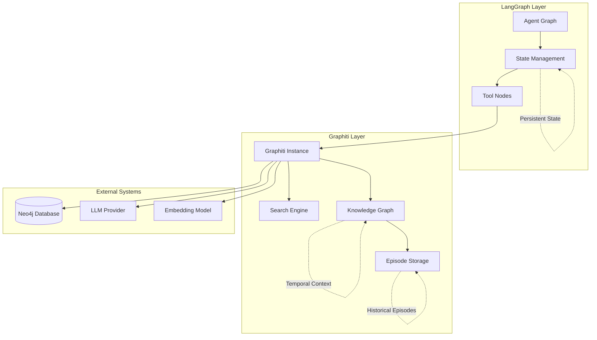
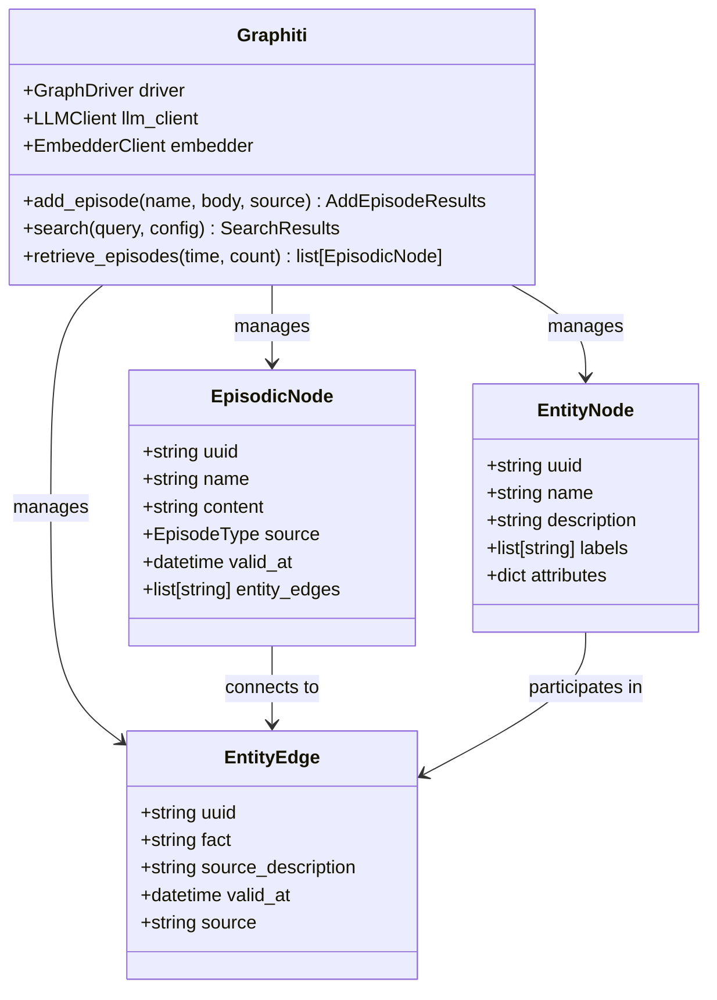
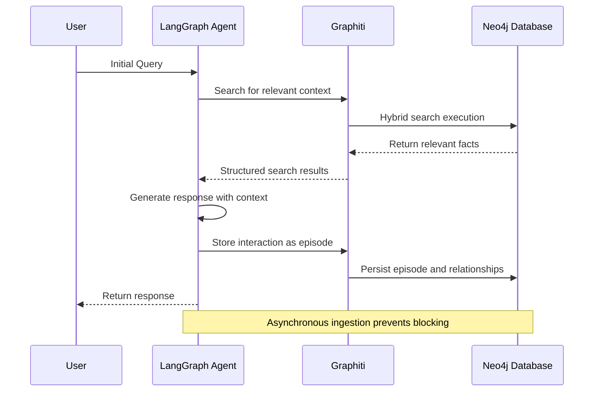
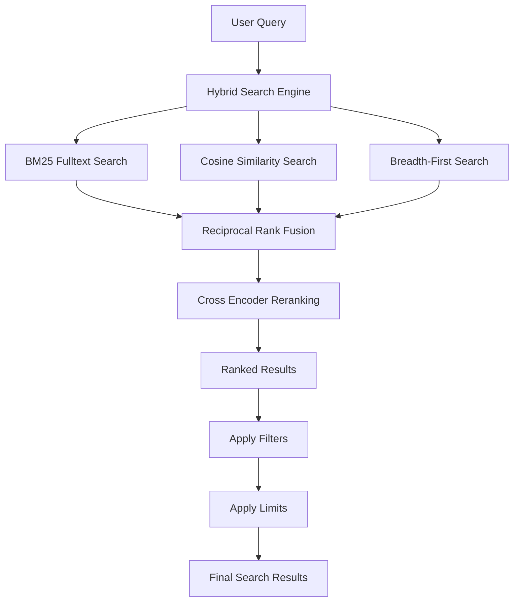
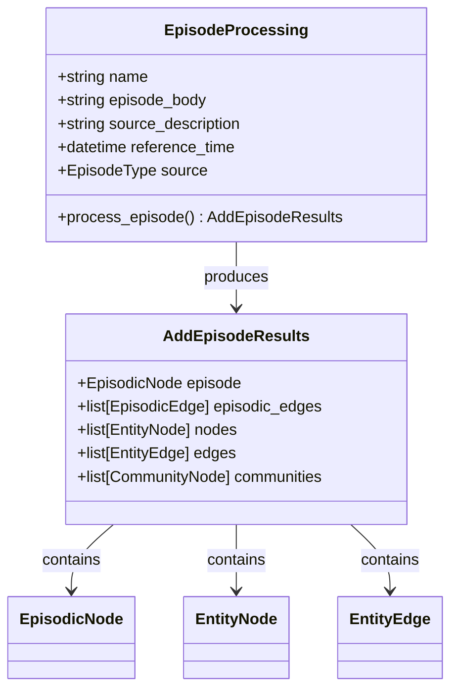
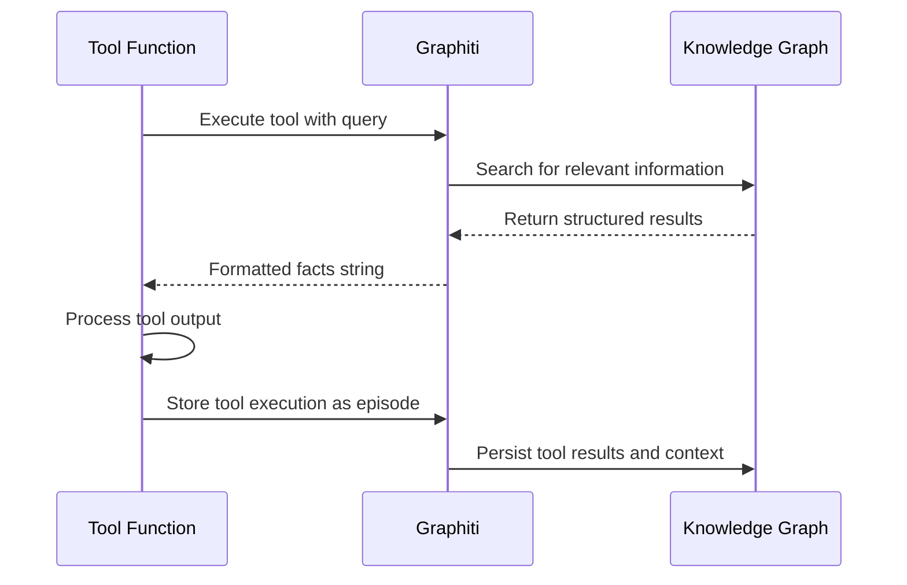
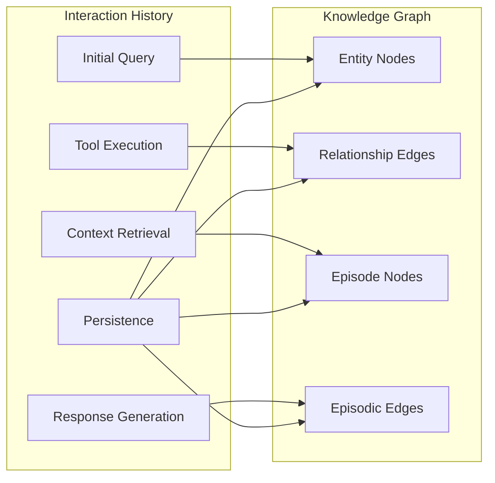

# LangGraph Agent Integration

<cite>
**Referenced Files in This Document**
- [agent.ipynb](file://examples/langgraph-agent/agent.ipynb)
- [graphiti.py](file://graphiti_core/graphiti.py)
- [search_interface.py](file://graphiti_core/driver/search_interface/search_interface.py)
- [search_config_recipes.py](file://graphiti_core/search/search_config_recipes.py)
- [nodes.py](file://graphiti_core/nodes.py)
- [graph_data_operations.py](file://graphiti_core/utils/maintenance/graph_data_operations.py)
- [helpers.py](file://graphiti_core/helpers.py)
- [manybirds_products.json](file://examples/data/manybirds_products.json)
</cite>

## Table of Contents
1. [Introduction](#introduction)
2. [Architecture Overview](#architecture-overview)
3. [Core Components](#core-components)
4. [Integration Pattern](#integration-pattern)
5. [Hybrid Search Implementation](#hybrid-search-implementation)
6. [State Management and Persistence](#state-management-and-persistence)
7. [Custom Node Types and Tool Outputs](#custom-node-types-and-tool-outputs)
8. [Performance Optimization](#performance-optimization)
9. [Auditable Agent Trajectories](#auditable-agent-trajectories)
10. [Best Practices and Design Patterns](#best-practices-and-design-patterns)
11. [Troubleshooting Guide](#troubleshooting-guide)
12. [Conclusion](#conclusion)

## Introduction

The LangGraph agent integration with Graphiti represents a sophisticated approach to building stateful AI workflows that maintain persistent, structured memory across multiple interaction steps. This integration leverages Graphiti's knowledge graph capabilities as a shared context layer between LangGraph agents and their tools, enabling long-term coherence, explainable decisions, and continuous learning from interaction history.

Graphiti serves as a temporal knowledge graph that captures intermediate reasoning, tool calls, observations, and user interactions as temporally-ordered nodes and edges. This persistent memory layer allows agents to maintain context across conversations, retrieve relevant historical information via hybrid search, and make informed decisions based on accumulated knowledge.

The integration pattern demonstrated in the `agent.ipynb` example showcases how to combine LangGraph's state management with Graphiti's add_episode and search methods to create sophisticated, context-aware AI agents that can:

- Maintain conversation state across multiple turns
- Retrieve relevant context using hybrid search algorithms
- Persist intermediate reasoning and tool outputs
- Enable auditable agent trajectories
- Support explainable decision-making
- Facilitate continuous learning from interaction history

## Architecture Overview

The LangGraph agent integration follows a layered architecture that separates concerns between state management, knowledge persistence, and context retrieval:



**Diagram sources**
- [agent.ipynb](file://examples/langgraph-agent/agent.ipynb#L322-L373)
- [graphiti.py](file://graphiti_core/graphiti.py#L128-L232)

The architecture consists of four main layers:

1. **LangGraph Layer**: Handles agent orchestration, state management, and tool execution
2. **Graphiti Layer**: Provides knowledge graph storage, search capabilities, and episode management
3. **External Systems**: Includes the underlying database, LLM providers, and embedding models
4. **Integration Layer**: Manages communication between LangGraph and Graphiti components

**Section sources**
- [agent.ipynb](file://examples/langgraph-agent/agent.ipynb#L1-L50)
- [graphiti.py](file://graphiti_core/graphiti.py#L128-L232)

## Core Components

### Graphiti Knowledge Graph

The Graphiti knowledge graph serves as the central persistence layer for agent interactions. It maintains:

- **Episodic Nodes**: Represent individual conversation turns or tool executions
- **Entity Nodes**: Capture people, products, concepts, and other entities
- **Entity Edges**: Connect entities with contextual relationships
- **Episodic Edges**: Link episodes to relevant entities and other episodes



**Diagram sources**
- [graphiti.py](file://graphiti_core/graphiti.py#L128-L232)
- [nodes.py](file://graphiti_core/nodes.py#L40-L82)

### LangGraph Agent State Management

The LangGraph agent maintains state through a typed dictionary structure that includes:

- **Messages**: Complete conversation history
- **User Information**: User identification and preferences
- **Context**: Current conversation context and metadata

**Section sources**
- [agent.ipynb](file://examples/langgraph-agent/agent.ipynb#L322-L326)
- [graphiti.py](file://graphiti_core/graphiti.py#L105-L121)

## Integration Pattern

The integration between LangGraph and Graphiti follows a specific pattern that ensures seamless state management and context persistence:



**Diagram sources**
- [agent.ipynb](file://examples/langgraph-agent/agent.ipynb#L328-L373)
- [graphiti.py](file://graphiti_core/graphiti.py#L611-L800)

### Key Integration Steps

1. **Context Retrieval**: Agent searches Graphiti for relevant historical context
2. **System Message Construction**: Uses retrieved facts to construct context-aware system messages
3. **Response Generation**: LLM generates response based on current state and retrieved context
4. **Persistence**: Agent asynchronously stores the interaction as a new episode
5. **State Update**: LangGraph state is updated with the new response

**Section sources**
- [agent.ipynb](file://examples/langgraph-agent/agent.ipynb#L328-L373)

## Hybrid Search Implementation

Graphiti implements sophisticated hybrid search algorithms that combine multiple search methods to retrieve the most relevant context:

### Search Configuration Recipes

Graphiti provides pre-configured search recipes optimized for different use cases:

| Recipe | Search Methods | Reranker | Use Case |
|--------|---------------|----------|----------|
| `COMBINED_HYBRID_SEARCH_CROSS_ENCODER` | BM25, Cosine Similarity, BFS | Cross Encoder | General-purpose hybrid search |
| `EDGE_HYBRID_SEARCH_EPISODE_MENTIONS` | BM25, Cosine Similarity | Episode Mentions | Context-aware edge search |
| `NODE_HYBRID_SEARCH_EPISODE_MENTIONS` | BM25, Cosine Similarity | Episode Mentions | Context-aware node search |
| `EDGE_HYBRID_SEARCH_CROSS_ENCODER` | BM25, Cosine Similarity, BFS | Cross Encoder | High-precision edge search |

### Search Execution Flow



**Diagram sources**
- [search_config_recipes.py](file://graphiti_core/search/search_config_recipes.py#L33-L154)
- [search_interface.py](file://graphiti_core/driver/search_interface/search_interface.py#L27-L89)

**Section sources**
- [search_config_recipes.py](file://graphiti_core/search/search_config_recipes.py#L33-L154)
- [agent.ipynb](file://examples/langgraph-agent/agent.ipynb#L268-L273)

## State Management and Persistence

### Episode-Based Persistence

Graphiti's add_episode method captures agent interactions as temporally-ordered episodes:



**Diagram sources**
- [graphiti.py](file://graphiti_core/graphiti.py#L105-L121)
- [graphiti.py](file://graphiti_core/graphiti.py#L611-L800)

### Asynchronous Ingestion

The integration uses asynchronous ingestion to prevent blocking agent execution:

```python
# Asynchronous episode storage (from agent.ipynb)
asyncio.create_task(
    client.add_episode(
        name='Chatbot Response',
        episode_body=f'{state["user_name"]}: {state["messages"][-1]}\nSalesBot: {response.content}',
        source=EpisodeType.message,
        reference_time=datetime.now(timezone.utc),
        source_description='Chatbot',
    )
)
```

**Section sources**
- [agent.ipynb](file://examples/langgraph-agent/agent.ipynb#L360-L371)
- [graphiti.py](file://graphiti_core/graphiti.py#L611-L800)

## Custom Node Types and Tool Outputs

### Defining Custom Node Types

Graphiti supports custom entity types for specialized domains:

```python
# Custom entity type definition (conceptual)
ENTITY_TYPES: dict[str, BaseModel] = {
    'Requirement': Requirement,  # type: ignore
    'Preference': Preference,  # type: ignore
    'Procedure': Procedure,  # type: ignore
}
```

### Tool Output Integration

Tools integrate with Graphiti by storing their outputs as structured episodes:



**Diagram sources**
- [agent.ipynb](file://examples/langgraph-agent/agent.ipynb#L265-L277)

**Section sources**
- [agent.ipynb](file://examples/langgraph-agent/agent.ipynb#L265-L277)
- [search_config_recipes.py](file://graphiti_core/search/search_config_recipes.py#L113-L154)

## Performance Optimization

### Concurrency Control

Graphiti implements semaphore-based concurrency control to manage resource utilization:

```python
# Semaphore-based coroutine limiting (from helpers.py)
async def semaphore_gather(
    *coroutines: Coroutine,
    max_coroutines: int | None = None,
) -> list[Any]:
    semaphore = asyncio.Semaphore(max_coroutines or SEMAPHORE_LIMIT)
    
    async def _wrap_coroutine(coroutine):
        async with semaphore:
            return await coroutine
    
    return await asyncio.gather(*(_wrap_coroutine(coroutine) for coroutine in coroutines))
```

### Latency Optimization Strategies

1. **Asynchronous Operations**: All Graphiti operations are asynchronous to prevent blocking
2. **Batch Processing**: Multiple episodes can be processed concurrently within limits
3. **Connection Pooling**: Reuses database connections for improved performance
4. **Index Optimization**: Pre-built indices for fast search operations

### Performance Monitoring

Graphiti includes built-in telemetry for monitoring performance:

```python
# Performance metrics capture (from graphiti.py)
span.add_attributes({
    'episode.uuid': episode.uuid,
    'episode.source': source.value,
    'node.count': len(hydrated_nodes),
    'edge.count': len(entity_edges),
    'duration_ms': (end - start) * 1000,
})
```

**Section sources**
- [helpers.py](file://graphiti_core/helpers.py#L105-L117)
- [graphiti.py](file://graphiti_core/graphiti.py#L780-L798)
- [README.md](file://README.md#L176-L219)

## Auditable Agent Trajectories

### Persistent Interaction History

Every agent interaction becomes a permanent part of the knowledge graph:



**Diagram sources**
- [graphiti.py](file://graphiti_core/graphiti.py#L611-L800)

### Explainable Decision Making

The knowledge graph provides transparency into agent decisions:

1. **Traceable Context**: Every piece of retrieved context is traceable to its source
2. **Temporal Ordering**: Interactions are preserved in chronological order
3. **Structured Relationships**: Clear relationships between entities and events
4. **Source Attribution**: All information is attributed to its original source

### Continuous Learning

Agent behavior improves over time through:

- **Experience Accumulation**: Historical interactions inform future decisions
- **Pattern Recognition**: Repeated patterns become easier to recognize
- **Context Enrichment**: New information enhances existing contexts
- **Feedback Integration**: Tool outputs contribute to knowledge base

**Section sources**
- [agent.ipynb](file://examples/langgraph-agent/agent.ipynb#L360-L371)
- [graphiti.py](file://graphiti_core/graphiti.py#L611-L800)

## Best Practices and Design Patterns

### Agent State Design

1. **Minimal State**: Only store essential information in LangGraph state
2. **Context Delegation**: Use Graphiti for persistent context storage
3. **Clear Separation**: Separate transient state from persistent knowledge

### Search Strategy

1. **Centered Search**: Use relevant entities as search centers for better relevance
2. **Multiple Configurations**: Use different search configs for different purposes
3. **Result Limiting**: Apply appropriate limits to balance quality and performance

### Error Handling

1. **Graceful Degradation**: Continue operation even if Graphiti operations fail
2. **Retry Logic**: Implement retry mechanisms for transient failures
3. **Fallback Strategies**: Provide fallback search methods when primary methods fail

### Security Considerations

1. **Access Control**: Implement proper access controls for Graphiti operations
2. **Data Sanitization**: Sanitize user inputs before storing in knowledge graph
3. **Privacy Protection**: Implement privacy controls for sensitive information

**Section sources**
- [agent.ipynb](file://examples/langgraph-agent/agent.ipynb#L328-L373)
- [graph_data_operations.py](file://graphiti_core/utils/maintenance/graph_data_operations.py#L36-L73)

## Troubleshooting Guide

### Common Issues and Solutions

#### Search Performance Issues

**Problem**: Slow search responses affecting agent performance
**Solution**: 
- Adjust `SEMAPHORE_LIMIT` environment variable
- Use appropriate search configurations for the use case
- Ensure database indices are properly built

#### Memory Management

**Problem**: High memory usage during episode processing
**Solution**:
- Implement batch processing for large datasets
- Use streaming for large episode bodies
- Monitor and adjust `max_coroutines` parameter

#### Asynchronous Operation Failures

**Problem**: Async operations hanging or failing
**Solution**:
- Implement proper timeout handling
- Use structured exception handling
- Monitor coroutine completion status

### Debugging Techniques

1. **Enable Logging**: Set appropriate log levels for Graphiti components
2. **Monitor Telemetry**: Use built-in telemetry for performance insights
3. **Database Inspection**: Directly inspect the knowledge graph for data integrity
4. **Step-by-Step Testing**: Test individual components in isolation

**Section sources**
- [graphiti.py](file://graphiti_core/graphiti.py#L198-L232)
- [helpers.py](file://graphiti_core/helpers.py#L105-L117)

## Conclusion

The LangGraph agent integration with Graphiti represents a powerful paradigm for building sophisticated, stateful AI systems. By combining LangGraph's orchestration capabilities with Graphiti's persistent knowledge graph, developers can create agents that maintain coherent conversations, learn from interactions, and make explainable decisions based on accumulated knowledge.

Key benefits of this integration include:

- **Persistent Memory**: Long-term retention of conversation context and learned patterns
- **Hybrid Search**: Advanced search capabilities combining multiple algorithms for optimal results
- **Asynchronous Processing**: Non-blocking operations that maintain responsive agent behavior
- **Auditability**: Complete traceability of agent decisions and learning progress
- **Scalability**: Concurrent processing capabilities for high-throughput applications

The integration pattern demonstrated in the `agent.ipynb` example provides a solid foundation for building production-ready AI agents that can operate effectively in real-world scenarios requiring sustained context awareness and continuous learning capabilities.

Future enhancements could include:
- Enhanced entity recognition for specialized domains
- Advanced reasoning capabilities through graph traversal
- Multi-agent coordination through shared knowledge graphs
- Real-time collaboration features for team-based applications

This integration exemplifies how modern AI systems can leverage persistent, structured memory to achieve human-like reasoning capabilities while maintaining transparency and accountability in their decision-making processes.