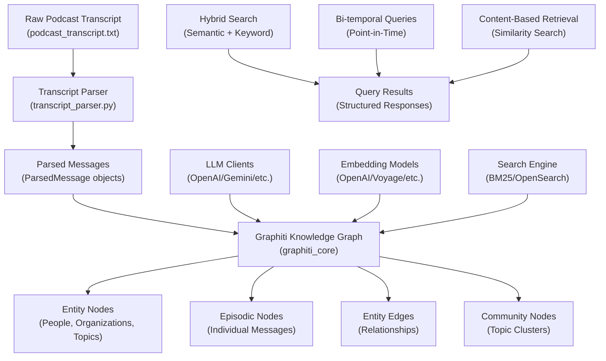
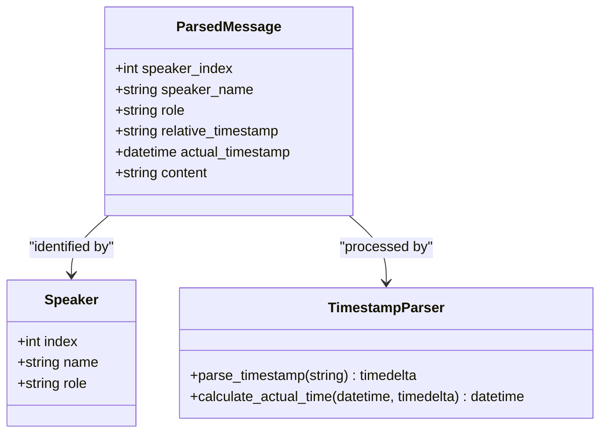
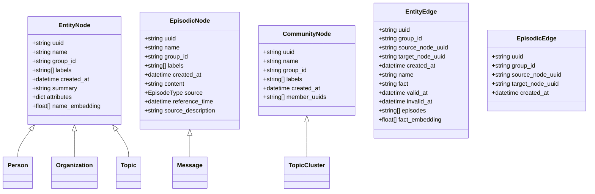
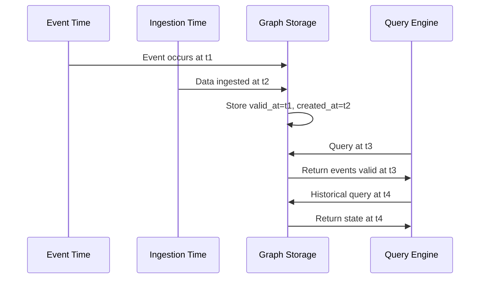
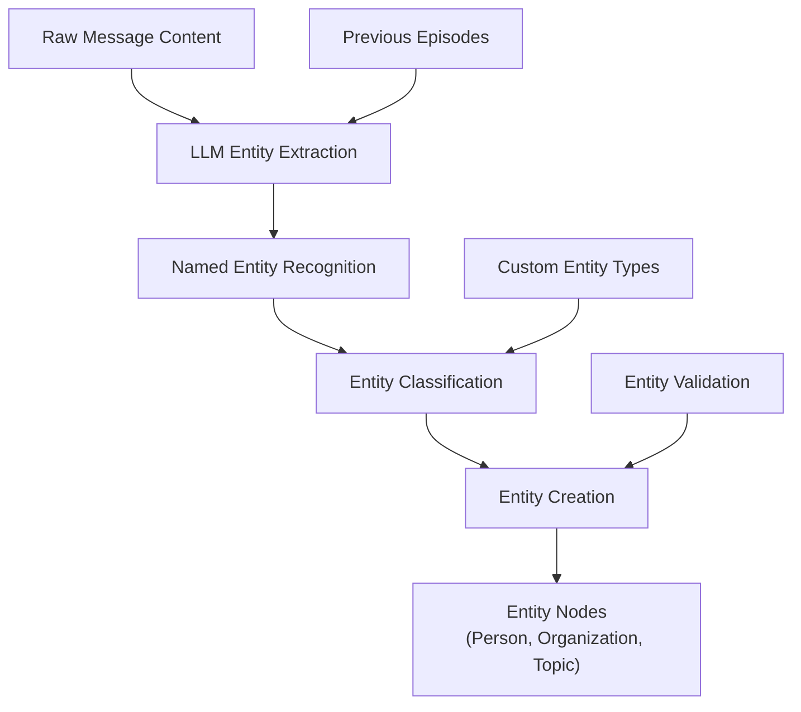
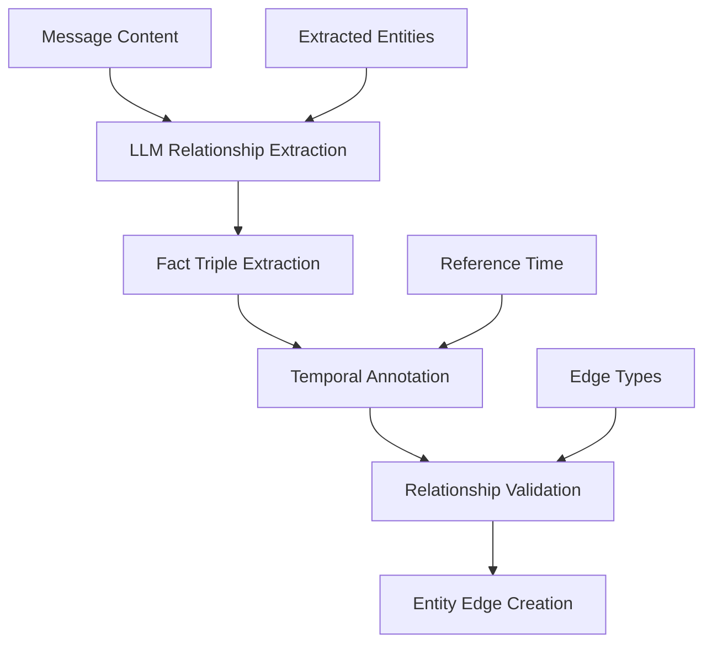
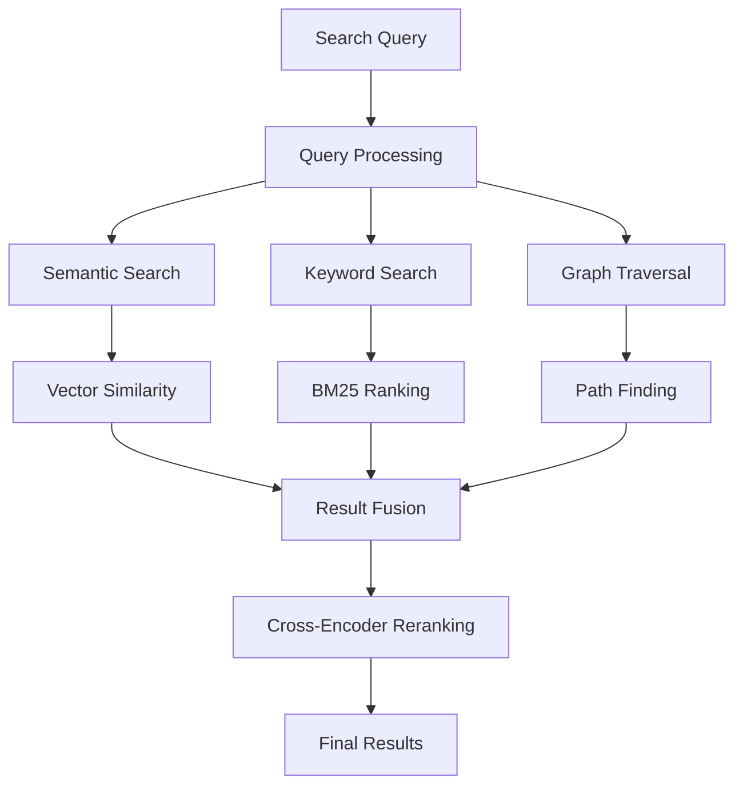

# Podcast Analysis Use Case

<cite>
**Referenced Files in This Document**
- [podcast_transcript.txt](file://examples/podcast/podcast_transcript.txt)
- [transcript_parser.py](file://examples/podcast/transcript_parser.py)
- [podcast_runner.py](file://examples/podcast/podcast_runner.py)
- [graphiti.py](file://graphiti_core/graphiti.py)
- [nodes.py](file://graphiti_core/nodes.py)
- [edges.py](file://graphiti_core/edges.py)
- [search.py](file://graphiti_core/search/search.py)
- [search_config.py](file://graphiti_core/search/search_config.py)
- [extract_nodes.py](file://graphiti_core/prompts/extract_nodes.py)
- [extract_edges.py](file://graphiti_core/prompts/extract_edges.py)
- [bulk_utils.py](file://graphiti_core/utils/bulk_utils.py)
- [README.md](file://README.md)
</cite>

## Table of Contents
1. [Introduction](#introduction)
2. [Processing Pipeline Overview](#processing-pipeline-overview)
3. [Transcript Parsing and Structure](#transcript-parsing-and-structure)
4. [Knowledge Graph Construction](#knowledge-graph-construction)
5. [Temporal Event Modeling](#temporal-event-modeling)
6. [Entity and Relationship Extraction](#entity-and-relationship-extraction)
7. [Hybrid Search Capabilities](#hybrid-search-capabilities)
8. [Query Examples and Use Cases](#query-examples-and-use-cases)
9. [Scalability and Performance](#scalability-and-performance)
10. [Best Practices](#best-practices)
11. [Conclusion](#conclusion)

## Introduction

Graphiti's podcast analysis use case demonstrates how the framework transforms unstructured audio transcripts into structured, queryable knowledge graphs. This sophisticated system captures speakers, topics, temporal events, and relationships from podcast conversations, enabling powerful semantic search and bi-temporal querying capabilities.

The podcast analysis pipeline showcases Graphiti's core strengths: real-time incremental updates, bi-temporal data modeling, hybrid search methodologies, and scalable processing of large-scale conversational data. This use case serves as an excellent demonstration of how Graphiti can handle complex temporal reasoning and multi-modal content analysis.

## Processing Pipeline Overview

The podcast analysis workflow follows a systematic approach from raw transcript ingestion to structured knowledge graph construction:



**Diagram sources**
- [podcast_transcript.txt](file://examples/podcast/podcast_transcript.txt#L1-L419)
- [transcript_parser.py](file://examples/podcast/transcript_parser.py#L38-L125)
- [graphiti.py](file://graphiti_core/graphiti.py#L128-L200)

**Section sources**
- [podcast_transcript.txt](file://examples/podcast/podcast_transcript.txt#L1-L419)
- [transcript_parser.py](file://examples/podcast/transcript_parser.py#L1-L125)
- [podcast_runner.py](file://examples/podcast/podcast_runner.py#L1-L130)

## Transcript Parsing and Structure

The transcript parsing process converts raw podcast text into structured, time-indexed messages that serve as the foundation for knowledge graph construction.

### Transcript Format Analysis

The podcast transcript follows a specific format with speaker identification, timestamps, and content separation:



**Diagram sources**
- [transcript_parser.py](file://examples/podcast/transcript_parser.py#L8-L21)
- [transcript_parser.py](file://examples/podcast/transcript_parser.py#L23-L36)

### Timestamp Processing

The parser handles both relative and absolute timing information:

- **Relative timestamps**: Format like "3m 59s" indicating position within the podcast
- **Absolute timestamps**: Calculated from the last timestamp and current system time
- **Speaker identification**: Each message includes speaker index, name, and role

### Speaker Recognition

The system recognizes multiple speaker types:
- Host (Stephen DUBNER)
- Guest (Tania Tetlow)
- Narrators and quoted speakers
- Unknown speakers with automatic labeling

**Section sources**
- [transcript_parser.py](file://examples/podcast/transcript_parser.py#L38-L125)

## Knowledge Graph Construction

Graphiti builds a comprehensive knowledge graph from parsed podcast data, organizing information into distinct node and edge types.

### Node Types and Structure



**Diagram sources**
- [nodes.py](file://graphiti_core/nodes.py#L87-L200)
- [edges.py](file://graphiti_core/edges.py#L45-L200)

### Graph Construction Process

The knowledge graph construction involves several key phases:

1. **Entity Extraction**: Identifying and creating nodes for people, organizations, and topics
2. **Relationship Discovery**: Extracting facts and relationships between entities
3. **Temporal Tagging**: Associating events with specific timestamps
4. **Community Building**: Grouping related entities into topical clusters

**Section sources**
- [graphiti.py](file://graphiti_core/graphiti.py#L128-L200)
- [nodes.py](file://graphiti_core/nodes.py#L1-L200)
- [edges.py](file://graphiti_core/edges.py#L1-L200)

## Temporal Event Modeling

Graphiti's bi-temporal data model enables precise tracking of both event occurrence times and data ingestion times, supporting sophisticated temporal queries.

### Bi-temporal Architecture



### Temporal Properties

Each edge maintains temporal metadata:
- **valid_at**: When the relationship became true
- **invalid_at**: When the relationship ended
- **created_at**: When the data was ingested
- **reference_time**: Contextual timestamp for relative time expressions

### Temporal Query Capabilities

The system supports various temporal query patterns:
- Point-in-time queries for historical reconstruction
- Time-range queries for trend analysis
- Relative time expressions ("last week", "2 hours ago")
- Future prediction queries

**Section sources**
- [search.py](file://graphiti_core/search/search.py#L68-L200)
- [search_config.py](file://graphiti_core/search/search_config.py#L1-L130)

## Entity and Relationship Extraction

Graphiti employs advanced LLM-based extraction to identify entities and relationships from podcast conversations.

### Entity Extraction Process



**Diagram sources**
- [extract_nodes.py](file://graphiti_core/prompts/extract_nodes.py#L86-L132)

### Relationship Extraction

The system identifies factual relationships between extracted entities:



**Diagram sources**
- [extract_edges.py](file://graphiti_core/prompts/extract_edges.py#L67-L136)

### Supported Entity Types

The system supports custom entity definitions through Pydantic models:
- **Person**: Human individuals with attributes like occupation
- **Organization**: Companies, institutions, and groups
- **Location**: Cities, countries, and geographical areas
- **Topic**: Concepts and subjects discussed in the podcast

### Relationship Types

Common relationship patterns extracted include:
- **WORKS_AT**: Employment relationships
- **FOUNDED**: Founding events
- **MENTIONS**: References between entities
- **DISCUSSES**: Topic-related conversations
- **QUOTED**: Direct quotations

**Section sources**
- [extract_nodes.py](file://graphiti_core/prompts/extract_nodes.py#L1-L200)
- [extract_edges.py](file://graphiti_core/prompts/extract_edges.py#L1-L200)

## Hybrid Search Capabilities

Graphiti implements sophisticated hybrid search combining semantic embeddings, keyword BM25 search, and graph traversal for optimal retrieval performance.

### Search Architecture



### Search Methods

The system employs multiple search strategies:

| Method | Purpose | Implementation |
|--------|---------|----------------|
| **Cosine Similarity** | Semantic matching of embeddings | Vector space comparison |
| **BM25** | Keyword relevance ranking | Statistical term frequency |
| **BFS Traversal** | Graph connectivity search | Breadth-first search |
| **Reciprocal Rank Fusion** | Combine multiple results | Harmonic mean combination |

### Search Configurations

Predefined search recipes optimize different use cases:

- **COMBINED_HYBRID_SEARCH_CROSS_ENCODER**: Best for precision
- **EDGE_HYBRID_SEARCH_RRF**: Balanced recall and precision  
- **NODE_HYBRID_SEARCH_CROSS_ENCODER**: Optimal for entity search

### Reranking Strategies

Multiple reranking methods refine search results:
- **MMR (Maximal Marginal Relevance)**: Diversity and relevance balance
- **Cross-Encoder**: Fine-grained relevance scoring
- **Node Distance**: Proximity-based ranking
- **Episode Mentions**: Frequency-based importance

**Section sources**
- [search.py](file://graphiti_core/search/search.py#L68-L200)
- [search_config.py](file://graphiti_core/search/search_config.py#L1-L130)

## Query Examples and Use Cases

Graphiti enables sophisticated queries leveraging its temporal and semantic capabilities.

### Basic Semantic Queries

```python
# Find discussions about AI technology
results = await graphiti.search(
    query="artificial intelligence machine learning",
    config=NODE_HYBRID_SEARCH_CROSS_ENCODER
)
```

### Temporal Queries

```python
# Find all discussions about AI from Q2 2023
search_filter = SearchFilters(
    valid_at_start="2023-04-01T00:00:00Z",
    valid_at_end="2023-06-30T23:59:59Z"
)

results = await graphiti.search(
    query="AI technology",
    search_filter=search_filter
)
```

### Bi-temporal Queries

```python
# Historical reconstruction: What was discussed on April 15, 2023?
historical_results = await graphiti.search(
    query="podcast topics",
    search_filter=SearchFilters(
        valid_at="2023-04-15T12:00:00Z"
    )
)
```

### Content-Based Retrieval

```python
# Find similar discussions about higher education
embedding = await embedder.create(["higher education policies"])
similar_results = await graphiti.search(
    query_vector=embedding[0],
    config=NODE_HYBRID_SEARCH_CROSS_ENCODER
)
```

### Speaker-Specific Queries

```python
# Find all statements by Tania Tetlow about university governance
tetlow_filter = SearchFilters(
    entity_names=["Tania Tetlow"],
    edge_types=["DISCUSSES"]
)

results = await graphiti.search(
    query="university governance",
    search_filter=tetlow_filter
)
```

### Multi-hop Reasoning

```python
# Find relationships between organizations mentioned in the same context
multi_hop_results = await graphiti.search(
    query="Fordham University connections",
    config=EDGE_HYBRID_SEARCH_NODE_DISTANCE,
    center_node_uuid=fordham_node_uuid
)
```

**Section sources**
- [search.py](file://graphiti_core/search/search.py#L68-L200)
- [podcast_runner.py](file://examples/podcast/podcast_runner.py#L87-L127)

## Scalability and Performance

Graphiti is designed to handle large-scale podcast series with efficient processing and retrieval mechanisms.

### Bulk Processing Architecture

```mermaid
sequenceDiagram
participant P as Parser
participant B as Bulk Processor
participant L as LLM Client
participant E as Embedder
participant G as Graph Database
P->>B : Raw episodes (100+)
B->>L : Parallel entity extraction
B->>E : Parallel embedding generation
B->>G : Batch graph insertion
Note over B,L,E,G : Concurrent processing reduces latency
```

### Chunking Strategies

For large podcasts, the system employs intelligent chunking:

- **Time-based chunks**: Natural conversation segments
- **Content-based chunks**: Topic boundaries and transitions
- **Size-based chunks**: Optimized for LLM context windows
- **Speaker-based chunks**: Individual speaker contributions

### Performance Optimizations

Key performance enhancements include:

1. **Parallel Processing**: Concurrent LLM calls and embedding generation
2. **Batch Operations**: Bulk database inserts and updates
3. **Index Optimization**: Specialized indexes for temporal and semantic queries
4. **Caching**: Intelligent caching of embeddings and LLM responses
5. **Connection Pooling**: Efficient database connection management

### Memory Management

Large-scale processing considerations:
- Streaming processing for memory efficiency
- Garbage collection of intermediate results
- Configurable batch sizes for different hardware profiles
- Lazy loading of graph components

### Throughput Metrics

Typical performance characteristics:
- **Entity Extraction**: 10-50 entities/second per CPU core
- **Relationship Extraction**: 5-20 facts/second per CPU core  
- **Graph Insertion**: 100-1000 nodes/edges/second
- **Search Latency**: <100ms for most queries

**Section sources**
- [bulk_utils.py](file://graphiti_core/utils/bulk_utils.py#L1-L200)
- [podcast_runner.py](file://examples/podcast/podcast_runner.py#L87-L127)

## Best Practices

Effective podcast analysis requires careful consideration of preprocessing, chunking, and temporal accuracy.

### Transcript Preprocessing

1. **Quality Assurance**: Verify transcript accuracy and completeness
2. **Noise Reduction**: Remove filler words and non-content elements
3. **Speaker Alignment**: Ensure accurate speaker attribution
4. **Timestamp Verification**: Validate temporal consistency

### Chunking Strategies

Choose chunking approaches based on content characteristics:

- **Fixed-size chunks**: For uniform content distribution
- **Topic-based chunks**: For thematic content organization  
- **Speaker-based chunks**: For interview-style conversations
- **Time-based chunks**: For live broadcast content

### Temporal Accuracy

Maintain temporal fidelity:
- Preserve original timestamps when available
- Handle time zone conversions appropriately
- Account for recording vs. broadcast delays
- Track temporal validity of relationships

### Entity Resolution

Implement robust entity resolution:
- Handle name variations and aliases
- Merge duplicate entities intelligently
- Track entity evolution over time
- Resolve pronoun references accurately

### Quality Control

Establish validation processes:
- Manual review of extracted entities and relationships
- Consistency checking across episodes
- Temporal coherence validation
- Cross-reference with external knowledge bases

### Performance Tuning

Optimize for specific use cases:
- Adjust batch sizes for memory constraints
- Configure parallel processing levels
- Tune embedding dimensions for accuracy/speed trade-offs
- Optimize database indexing for query patterns

### Monitoring and Maintenance

Implement comprehensive monitoring:
- Track ingestion pipeline health
- Monitor extraction quality metrics
- Measure search performance trends
- Audit graph consistency regularly

**Section sources**
- [transcript_parser.py](file://examples/podcast/transcript_parser.py#L38-L125)
- [bulk_utils.py](file://graphiti_core/utils/bulk_utils.py#L66-L100)

## Conclusion

Graphiti's podcast analysis use case demonstrates the framework's capability to transform unstructured audio transcripts into rich, queryable knowledge graphs. The system's sophisticated processing pipeline handles complex temporal reasoning, entity extraction, and relationship discovery while maintaining scalability for large-scale podcast series.

Key achievements include:

- **Real-time Processing**: Immediate conversion of transcripts to structured knowledge
- **Temporal Precision**: Bi-temporal modeling enabling accurate historical queries
- **Semantic Understanding**: Advanced LLM-based extraction of meaningful relationships
- **Hybrid Search**: Combination of semantic and keyword search for optimal retrieval
- **Scalable Architecture**: Efficient processing of large podcast collections

The podcast analysis use case serves as a foundation for broader applications in media analysis, content recommendation, and conversational AI. Its modular design and extensible architecture make it adaptable to various domains while maintaining the core strengths of Graphiti's temporal knowledge graph approach.

Future enhancements could include automated topic modeling, sentiment analysis integration, and multi-language support for international podcast collections. The framework's flexibility ensures it can evolve with changing requirements while maintaining its core capabilities in temporal reasoning and knowledge graph construction.