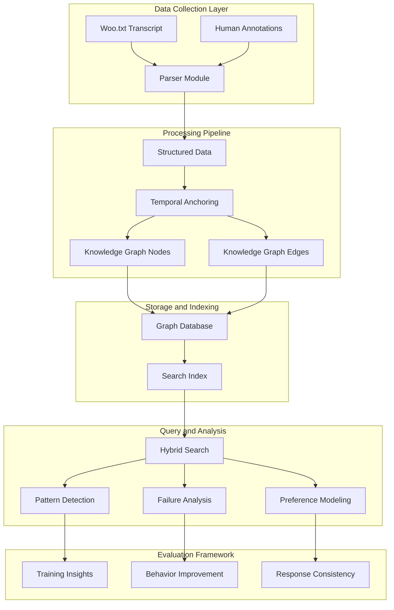
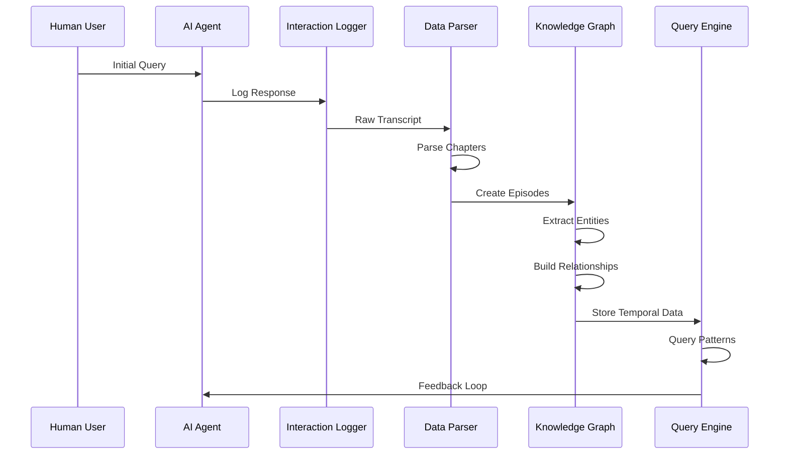
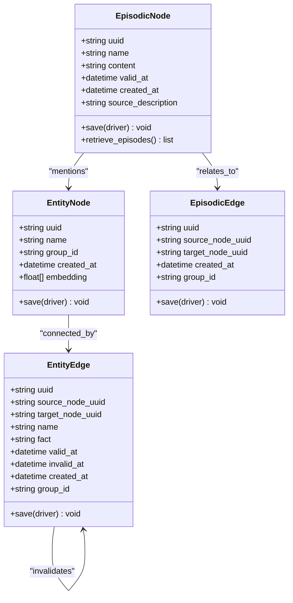
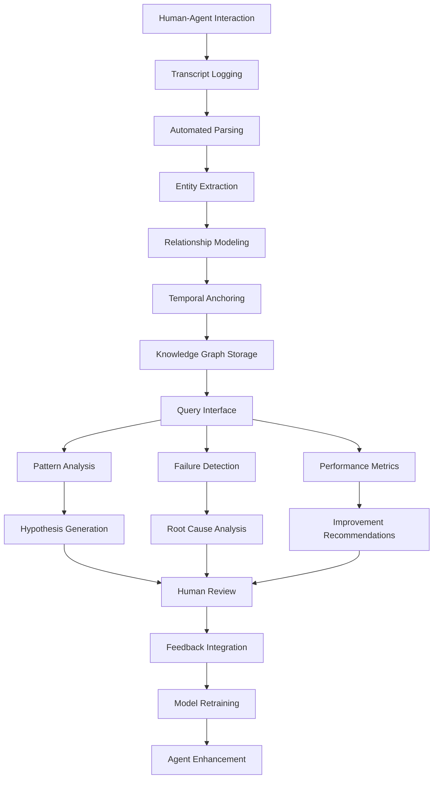
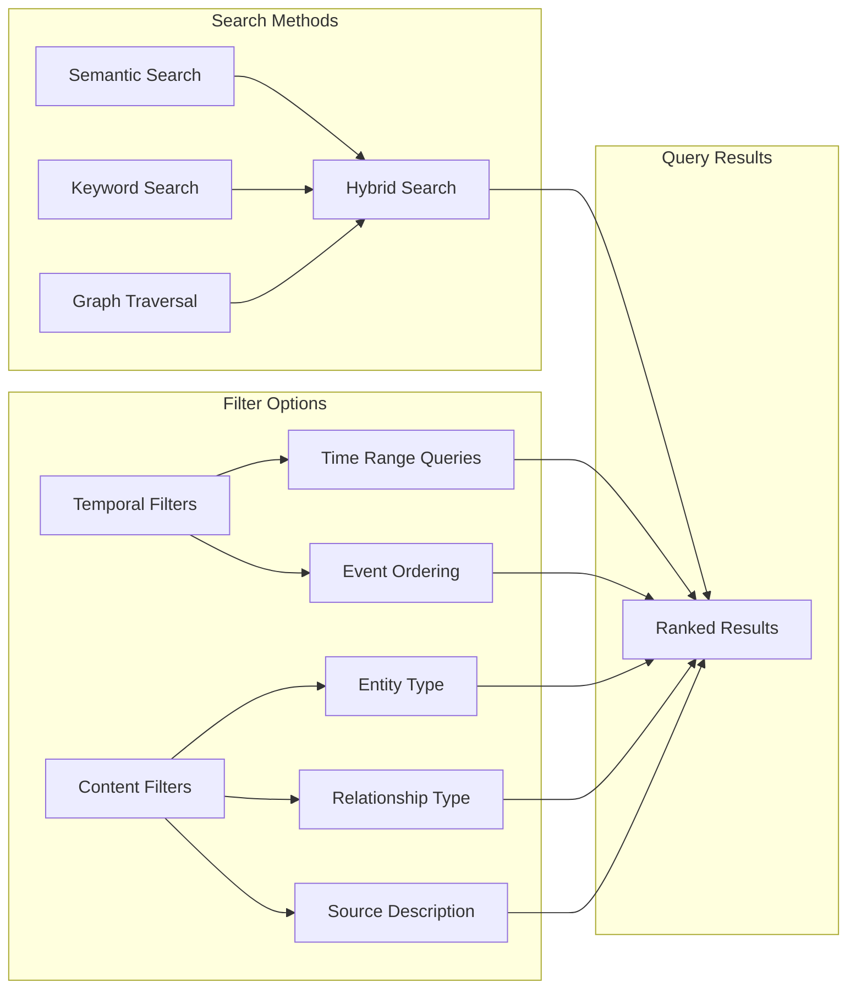
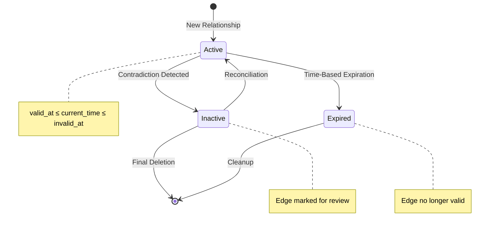
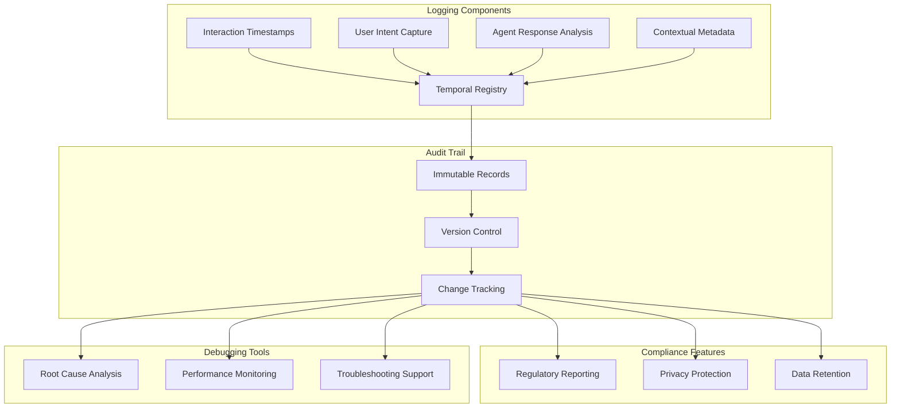

# Wizard of Oz Simulation

<cite>
**Referenced Files in This Document**
- [examples/wizard_of_oz/woo.txt](file://examples/wizard_of_oz/woo.txt)
- [examples/wizard_of_oz/parser.py](file://examples/wizard_of_oz/parser.py)
- [examples/wizard_of_oz/runner.py](file://examples/wizard_of_oz/runner.py)
- [graphiti_core/graphiti.py](file://graphiti_core/graphiti.py)
- [graphiti_core/nodes.py](file://graphiti_core/nodes.py)
- [graphiti_core/edges.py](file://graphiti_core/edges.py)
- [graphiti_core/search/search.py](file://graphiti_core/search/search.py)
- [graphiti_core/utils/maintenance/temporal_operations.py](file://graphiti_core/utils/maintenance/temporal_operations.py)
- [graphiti_core/prompts/extract_edges.py](file://graphiti_core/prompts/extract_edges.py)
- [graphiti_core/search/search_config_recipes.py](file://graphiti_core/search/search_config_recipes.py)
- [README.md](file://README.md)
</cite>

## Table of Contents
1. [Introduction](#introduction)
2. [Architecture Overview](#architecture-overview)
3. [Data Flow and Processing Pipeline](#data-flow-and-processing-pipeline)
4. [Temporal Anchoring and Knowledge Graph Construction](#temporal-anchoring-and-knowledge-graph-construction)
5. [Human-in-the-Loop Evaluation Framework](#human-in-the-loop-evaluation-framework)
6. [Search and Query Capabilities](#search-and-query-capabilities)
7. [Edge Invalidation and Preference Modeling](#edge-invalidation-and-preference-modeling)
8. [Agent Training and Evaluation](#agent-training-and-evaluation)
9. [Auditable Behavior Logs](#auditable-behavior-logs)
10. [Implementation Walkthrough](#implementation-walkthrough)
11. [Best Practices and Guidelines](#best-practices-and-guidelines)
12. [Conclusion](#conclusion)

## Introduction

The Wizard of Oz simulation represents a sophisticated approach to AI agent training and evaluation through human-in-the-loop scenarios. This use case demonstrates how Graphiti supports comprehensive agent behavior analysis by systematically logging, parsing, and ingesting human-agent interactions into a temporal knowledge graph. The framework captures the nuanced dynamics of conversational AI, enabling retrospective analysis, pattern detection, and supervised fine-tuning of agent behaviors.

Unlike traditional evaluation methods that rely on static test suites or synthetic benchmarks, the Wizard of Oz simulation creates a living knowledge graph that evolves with each interaction. This approach provides unprecedented insights into agent performance, user satisfaction, and the complex interplay between human expectations and AI capabilities.

## Architecture Overview

The Wizard of Oz simulation architecture consists of three primary components working in concert to create a comprehensive evaluation framework:

**Diagram sources**
- [examples/wizard_of_oz/runner.py](file://examples/wizard_of_oz/runner.py#L60-L94)
- [examples/wizard_of_oz/parser.py](file://examples/wizard_of_oz/parser.py#L5-L37)

The architecture emphasizes temporal awareness, where each interaction is anchored to specific timestamps, enabling sophisticated historical queries and trend analysis. The system maintains bidirectional relationships between user intents, agent responses, and contextual factors, creating a rich tapestry of conversational dynamics.

**Section sources**
- [examples/wizard_of_oz/runner.py](file://examples/wizard_of_oz/runner.py#L1-L94)
- [examples/wizard_of_oz/parser.py](file://examples/wizard_of_oz/parser.py#L1-L37)

## Data Flow and Processing Pipeline

The data flow in the Wizard of Oz simulation follows a carefully orchestrated pipeline that transforms raw transcript data into actionable knowledge graph structures:

**Diagram sources**
- [examples/wizard_of_oz/runner.py](file://examples/wizard_of_oz/runner.py#L84-L91)
- [examples/wizard_of_oz/parser.py](file://examples/wizard_of_oz/parser.py#L30-L37)

The processing pipeline begins with the collection of human-agent interactions, which are logged in the `woo.txt` format. The parser module systematically breaks down the transcript into discrete episodes, each representing a coherent segment of the conversation. These episodes are then processed through Graphiti's knowledge graph construction pipeline, where temporal anchors are established and relationships are extracted.

**Section sources**
- [examples/wizard_of_oz/runner.py](file://examples/wizard_of_oz/runner.py#L60-L94)
- [examples/wizard_of_oz/parser.py](file://examples/wizard_of_oz/parser.py#L5-L37)

## Temporal Anchoring and Knowledge Graph Construction

The core innovation of the Wizard of Oz simulation lies in its temporal anchoring mechanism, which creates a bi-temporal knowledge graph that tracks both when events occurred and when they were recorded:

**Diagram sources**
- [graphiti_core/nodes.py](file://graphiti_core/nodes.py#L301-L342)
- [graphiti_core/edges.py](file://graphiti_core/edges.py#L131-L200)

Each conversation turn is captured as an episodic node with explicit temporal metadata. The `valid_at` field represents when the interaction actually occurred, while `created_at` indicates when it was recorded in the knowledge graph. This distinction enables sophisticated queries that can analyze agent performance at specific points in time or track changes in user satisfaction over extended periods.

The entity extraction process identifies key actors, objects, and concepts within each interaction, creating entity nodes that serve as the foundation for relationship modeling. The relationship extraction algorithm identifies explicit and implicit connections between entities, capturing the semantic structure of the conversation.

**Section sources**
- [graphiti_core/nodes.py](file://graphiti_core/nodes.py#L301-L342)
- [graphiti_core/edges.py](file://graphiti_core/edges.py#L131-L200)

## Human-in-the-Loop Evaluation Framework

The Wizard of Oz simulation creates a comprehensive evaluation framework that combines automated analysis with human oversight:

**Diagram sources**
- [examples/wizard_of_oz/runner.py](file://examples/wizard_of_oz/runner.py#L84-L91)
- [graphiti_core/prompts/extract_edges.py](file://graphiti_core/prompts/extract_edges.py#L67-L136)

The evaluation framework operates on multiple levels of abstraction, from individual interaction analysis to systemic pattern recognition. Automated systems handle the initial processing and basic categorization, while human evaluators provide nuanced judgment on complex cases and interpret broader trends.

This hybrid approach ensures that the evaluation captures both quantitative metrics (response accuracy, response time) and qualitative aspects (user satisfaction, contextual appropriateness). The framework can identify subtle patterns that might indicate agent improvement or degradation over time, enabling proactive intervention and continuous enhancement.

**Section sources**
- [examples/wizard_of_oz/runner.py](file://examples/wizard_of_oz/runner.py#L60-L94)
- [graphiti_core/prompts/extract_edges.py](file://graphiti_core/prompts/extract_edges.py#L67-L136)

## Search and Query Capabilities

The search capabilities in the Wizard of Oz simulation enable sophisticated querying of the knowledge graph using both semantic and temporal filters:

**Diagram sources**
- [graphiti_core/search/search.py](file://graphiti_core/search/search.py#L68-L182)
- [graphiti_core/search/search_config_recipes.py](file://graphiti_core/search/search_config_recipes.py#L33-L153)

The system supports complex queries that combine semantic similarity with temporal constraints. For example, developers can search for "all instances where the agent failed to understand payment questions" using semantic filters combined with temporal boundaries. This capability enables targeted analysis of specific failure modes and helps identify patterns in agent performance across different contexts.

The search engine employs multiple ranking algorithms, including reciprocal rank fusion (RRF), maximal marginal relevance (MMR), and cross-encoder reranking, to provide the most relevant results for each query type. The hybrid approach ensures that both exact matches and semantically similar content are surfaced appropriately.

**Section sources**
- [graphiti_core/search/search.py](file://graphiti_core/search/search.py#L68-L182)
- [graphiti_core/search/search_config_recipes.py](file://graphiti_core/search/search_config_recipes.py#L33-L153)

## Edge Invalidation and Preference Modeling

The edge invalidation system models changing user preferences and agent behavior over time, creating a dynamic knowledge graph that reflects evolving relationships:

**Diagram sources**
- [graphiti_core/utils/maintenance/temporal_operations.py](file://graphiti_core/utils/maintenance/temporal_operations.py#L33-L108)

The temporal operations module implements sophisticated logic for managing edge lifecycles. When new information contradicts existing relationships, the system automatically identifies and invalidates conflicting edges. This process considers both explicit contradictions and implicit inconsistencies that arise from changing user preferences or evolving agent capabilities.

The invalidation process uses LLM-powered reasoning to determine which relationships should be maintained and which should be marked as outdated. This approach ensures that the knowledge graph remains accurate and reflective of current conditions, rather than becoming cluttered with obsolete information.

**Section sources**
- [graphiti_core/utils/maintenance/temporal_operations.py](file://graphiti_core/utils/maintenance/temporal_operations.py#L33-L108)

## Agent Training and Evaluation

The Wizard of Oz simulation provides comprehensive tools for agent training and evaluation, enabling iterative improvement through data-driven insights:

| Evaluation Dimension | Measurement Method | Improvement Action |
|---------------------|-------------------|-------------------|
| **Response Accuracy** | Semantic similarity to gold standards | Fine-tune LLM parameters |
| **Context Awareness** | Temporal coherence analysis | Improve context window |
| **User Satisfaction** | Sentiment analysis + explicit ratings | Adjust tone and personality |
| **Consistency** | Pattern detection across sessions | Standardize response templates |
| **Learning Progress** | Longitudinal performance tracking | Adaptive training schedules |

The evaluation framework tracks multiple metrics simultaneously, providing a holistic view of agent performance. Response accuracy is measured against gold-standard responses, while context awareness is evaluated by analyzing the agent's ability to maintain coherent conversations over extended periods.

User satisfaction metrics incorporate both explicit feedback (ratings, thumbs up/down) and implicit indicators (response time, follow-up questions). Consistency analysis identifies patterns where the agent provides conflicting information across different interactions, while learning progress tracking monitors improvements over time.

**Section sources**
- [examples/wizard_of_oz/runner.py](file://examples/wizard_of_oz/runner.py#L84-L91)
- [graphiti_core/utils/maintenance/temporal_operations.py](file://graphiti_core/utils/maintenance/temporal_operations.py#L74-L108)

## Auditable Behavior Logs

The framework creates auditable, explainable agent behavior logs that serve multiple purposes in compliance and debugging:

**Diagram sources**
- [examples/wizard_of_oz/runner.py](file://examples/wizard_of_oz/runner.py#L38-L57)
- [graphiti_core/nodes.py](file://graphiti_core/nodes.py#L301-L342)

The logging system maintains immutable records of all interactions, with comprehensive metadata that enables detailed analysis. Each interaction is timestamped with microsecond precision, ensuring that temporal relationships are accurately preserved. User intents are captured with sufficient detail to understand the context and rationale behind each query.

The system implements robust privacy protections, including automatic anonymization of personally identifiable information and configurable data retention policies. Regulatory reporting capabilities enable organizations to demonstrate compliance with industry standards and legal requirements.

**Section sources**
- [examples/wizard_of_oz/runner.py](file://examples/wizard_of_oz/runner.py#L38-L57)
- [graphiti_core/nodes.py](file://graphiti_core/nodes.py#L301-L342)

## Implementation Walkthrough

The implementation of the Wizard of Oz simulation involves several key steps that demonstrate the practical application of Graphiti's capabilities:

### Step 1: Data Preparation
The `woo.txt` file serves as the primary data source, containing the classic "Wizard of Oz" narrative that has been adapted for AI agent evaluation. The parser module reads this file and converts it into structured episodes, each representing a distinct conversation segment.

### Step 2: Knowledge Graph Construction
The runner script initializes the Graphiti instance and processes each episode through the knowledge graph construction pipeline. The system extracts entities, builds relationships, and establishes temporal anchors for each interaction.

### Step 3: Search and Analysis
Once the knowledge graph is populated, developers can query it using various search methods. The hybrid search capabilities enable sophisticated queries that combine semantic similarity with temporal filtering.

### Step 4: Pattern Detection and Insights
The system automatically identifies patterns in agent behavior, user preferences, and interaction dynamics. These insights inform training decisions and help optimize agent performance.

**Section sources**
- [examples/wizard_of_oz/runner.py](file://examples/wizard_of_oz/runner.py#L60-L94)
- [examples/wizard_of_oz/parser.py](file://examples/wizard_of_oz/parser.py#L30-L37)

## Best Practices and Guidelines

Implementing a successful Wizard of Oz simulation requires adherence to several best practices:

### Data Quality Standards
- Ensure transcripts are accurately transcribed with minimal errors
- Maintain consistent formatting across all interaction logs
- Include sufficient context for meaningful analysis
- Implement quality checks for automated parsing

### Temporal Precision
- Use UTC timestamps for all temporal data
- Maintain microsecond precision for critical timing analysis
- Establish clear policies for timestamp resolution
- Account for timezone differences in distributed systems

### Privacy and Compliance
- Implement robust data anonymization procedures
- Establish clear data retention policies
- Maintain audit trails for all modifications
- Ensure compliance with relevant regulations

### Evaluation Methodology
- Combine automated metrics with human judgment
- Establish baseline performance metrics
- Implement continuous monitoring
- Regularly update evaluation criteria

## Conclusion

The Wizard of Oz simulation represents a paradigm shift in AI agent evaluation, moving from static test suites to dynamic, human-in-the-loop scenarios that capture the complexity of real-world interactions. By leveraging Graphiti's temporal knowledge graph capabilities, this approach provides unprecedented insights into agent behavior, user satisfaction, and the evolving nature of human-AI interactions.

The framework's emphasis on auditable logs, comprehensive search capabilities, and sophisticated pattern detection enables organizations to build more reliable, responsive, and user-centered AI systems. As AI continues to evolve, the principles demonstrated in this simulation will become increasingly important for ensuring that intelligent systems meet the highest standards of performance, reliability, and ethical responsibility.

Through careful implementation of the techniques described in this document, organizations can harness the power of human-in-the-loop evaluation to drive continuous improvement in their AI systems, ultimately delivering better experiences for users and more valuable outcomes for businesses.