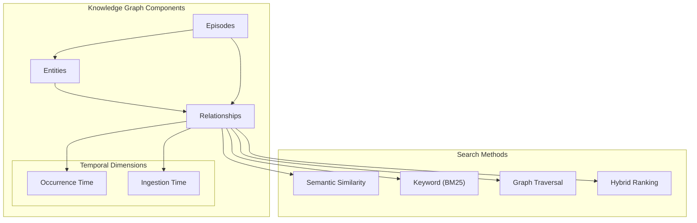
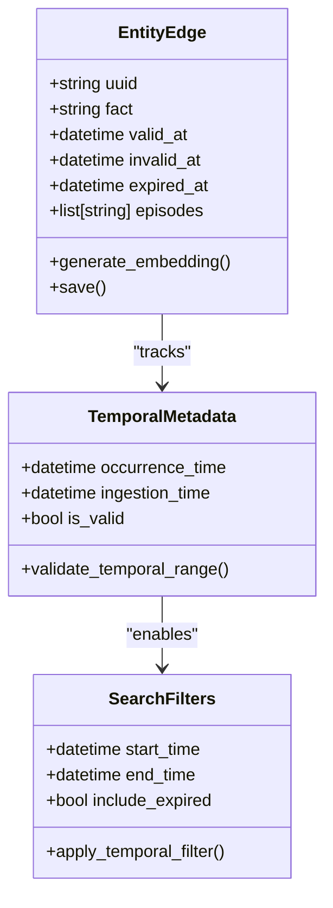
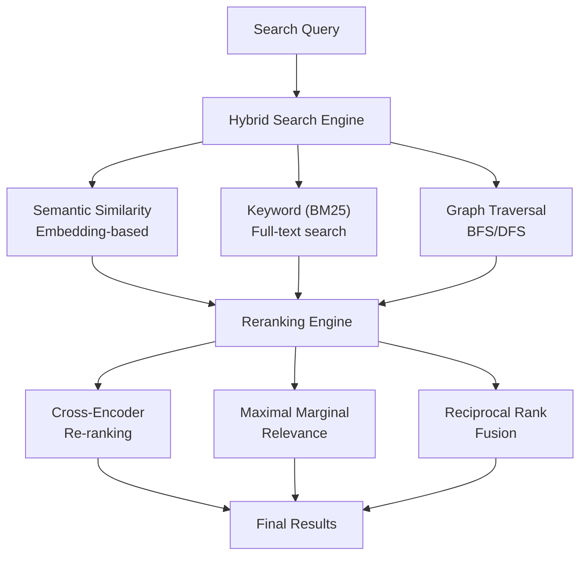
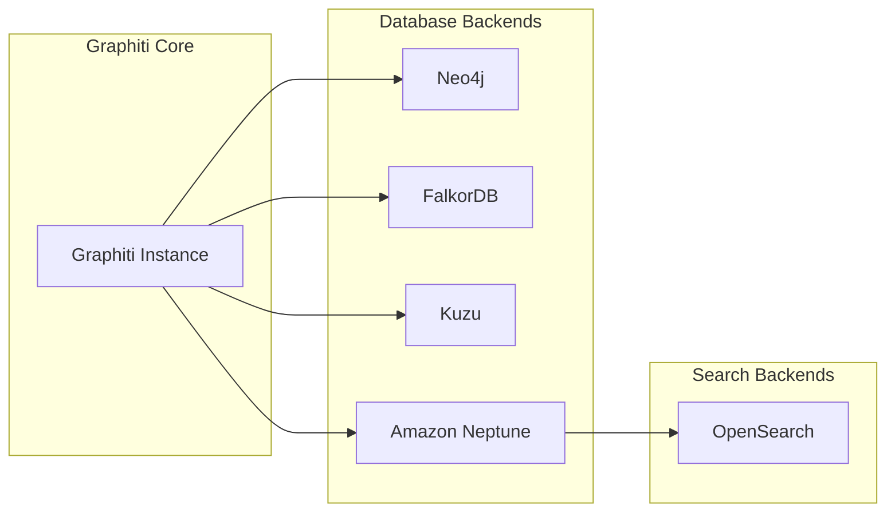
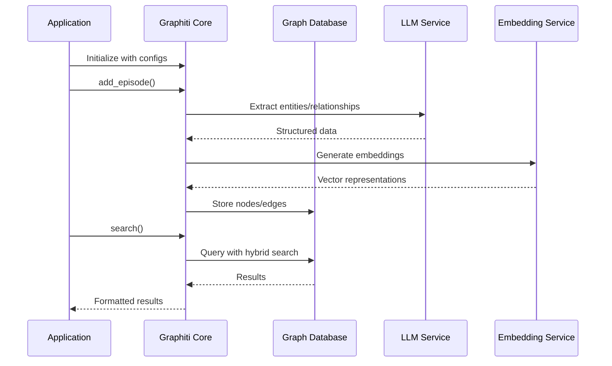
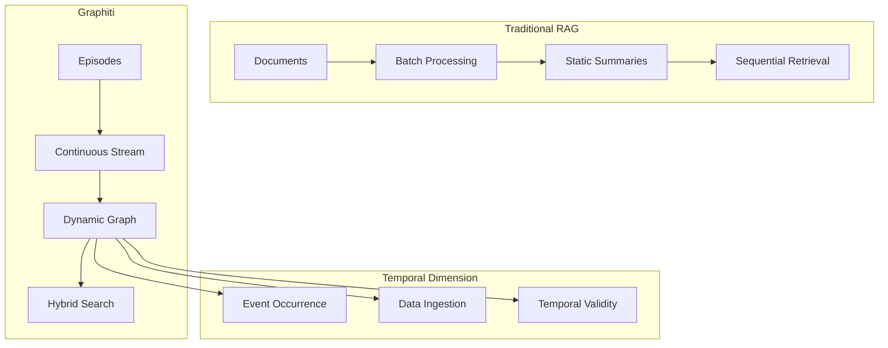
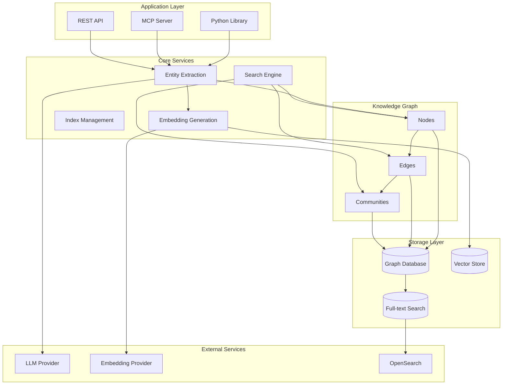

# Graphiti Framework: Project Overview

<cite>
**Referenced Files in This Document**
- [README.md](file://README.md)
- [graphiti_core/__init__.py](file://graphiti_core/__init__.py)
- [graphiti_core/graphiti.py](file://graphiti_core/graphiti.py)
- [graphiti_core/search/search.py](file://graphiti_core/search/search.py)
- [graphiti_core/nodes.py](file://graphiti_core/nodes.py)
- [graphiti_core/edges.py](file://graphiti_core/edges.py)
- [graphiti_core/search/search_config_recipes.py](file://graphiti_core/search/search_config_recipes.py)
- [graphiti_core/driver/driver.py](file://graphiti_core/driver/driver.py)
- [graphiti_core/utils/maintenance/temporal_operations.py](file://graphiti_core/utils/maintenance/temporal_operations.py)
- [mcp_server/graphiti_mcp_server.py](file://mcp_server/graphiti_mcp_server.py)
- [server/graph_service/main.py](file://server/graph_service/main.py)
- [examples/quickstart/README.md](file://examples/quickstart/README.md)
- [examples/quickstart/quickstart_neo4j.py](file://examples/quickstart/quickstart_neo4j.py)
- [mcp_server/README.md](file://mcp_server/README.md)
- [server/README.md](file://server/README.md)
</cite>

## Table of Contents
1. [Introduction](#introduction)
2. [Core Architecture](#core-architecture)
3. [Temporal Knowledge Graph System](#temporal-knowledge-graph-system)
4. [Hybrid Retrieval Mechanism](#hybrid-retrieval-mechanism)
5. [Multi-Database Support](#multi-database-support)
6. [Three Entry Points](#three-entry-points)
7. [Key Benefits and Advantages](#key-benefits-and-advantages)
8. [Primary Use Cases](#primary-use-cases)
9. [Graph RAG vs Traditional RAG Comparison](#graph-rag-vs-traditional-rag-comparison)
10. [System Components and Interactions](#system-components-and-interactions)
11. [Implementation Examples](#implementation-examples)
12. [Conclusion](#conclusion)

## Introduction

Graphiti is a revolutionary framework for building and querying temporally-aware knowledge graphs, specifically designed for AI agents operating in dynamic environments. Unlike traditional retrieval-augmented generation (RAG) methods that rely on batch processing and static data summarization, Graphiti continuously integrates user interactions, structured and unstructured enterprise data, and external information into a coherent, queryable graph.

The framework's core innovation lies in its bi-temporal data model that explicitly tracks both event occurrence times and ingestion times, enabling precise point-in-time queries without requiring complete graph recomputation. This capability makes Graphiti uniquely suited for developing interactive, context-aware AI applications that require real-time knowledge management.

**Section sources**
- [README.md](file://README.md#L37-L42)

## Core Architecture

Graphiti's architecture is built around three fundamental components: **Episodes**, **Nodes**, and **Edges**, forming the backbone of its knowledge graph system.

### Knowledge Graph Structure



**Diagram sources**
- [graphiti_core/nodes.py](file://graphiti_core/nodes.py#L295-L350)
- [graphiti_core/edges.py](file://graphiti_core/edges.py#L221-L290)

### Core Data Types

The framework operates with three primary data types that form the knowledge graph:

1. **Episodes**: Represent discrete pieces of information or experiences
2. **Nodes**: Entities or concepts extracted from episodes
3. **Edges**: Relationships between entities, capturing facts and assertions

**Section sources**
- [graphiti_core/nodes.py](file://graphiti_core/nodes.py#L87-L120)
- [graphiti_core/edges.py](file://graphiti_core/edges.py#L45-L85)

## Temporal Knowledge Graph System

Graphiti's bi-temporal data model is its most distinctive feature, enabling sophisticated temporal reasoning and historical query capabilities.

### Bi-Temporal Data Model



**Diagram sources**
- [graphiti_core/edges.py](file://graphiti_core/edges.py#L221-L240)
- [graphiti_core/utils/maintenance/temporal_operations.py](file://graphiti_core/utils/maintenance/temporal_operations.py#L33-L72)

### Temporal Accuracy Features

The bi-temporal model provides several key capabilities:

- **Explicit Event Tracking**: Records when relationships were established or changed
- **Ingestion Timestamps**: Tracks when information was added to the graph
- **Historical Queries**: Enables point-in-time reconstruction of knowledge
- **Temporal Contradiction Detection**: Identifies conflicting temporal information
- **Validity Periods**: Maintains when relationships were active or expired

**Section sources**
- [graphiti_core/utils/maintenance/temporal_operations.py](file://graphiti_core/utils/maintenance/temporal_operations.py#L33-L108)

## Hybrid Retrieval Mechanism

Graphiti employs a sophisticated hybrid retrieval system that combines multiple search methodologies to achieve optimal performance and accuracy.

### Search Architecture



**Diagram sources**
- [graphiti_core/search/search.py](file://graphiti_core/search/search.py#L68-L183)
- [graphiti_core/search/search_config_recipes.py](file://graphiti_core/search/search_config_recipes.py#L33-L108)

### Search Configuration Recipes

Graphiti provides pre-configured search recipes optimized for different scenarios:

| Recipe | Purpose | Search Methods | Reranking |
|--------|---------|----------------|-----------|
| `COMBINED_HYBRID_SEARCH_RRF` | General hybrid search | BM25 + Cosine Similarity | RRF |
| `EDGE_HYBRID_SEARCH_CROSS_ENCODER` | Fact extraction | BM25 + Cosine + BFS | Cross-Encoder |
| `NODE_HYBRID_SEARCH_RRF` | Entity search | BM25 + Cosine Similarity | RRF |
| `COMMUNITY_HYBRID_SEARCH_CROSS_ENCODER` | Community search | BM25 + Cosine Similarity | Cross-Encoder |

**Section sources**
- [graphiti_core/search/search_config_recipes.py](file://graphiti_core/search/search_config_recipes.py#L33-L224)

## Multi-Database Support

Graphiti supports multiple graph database backends, providing flexibility and scalability for different deployment scenarios.

### Supported Databases



**Diagram sources**
- [graphiti_core/driver/driver.py](file://graphiti_core/driver/driver.py#L42-L47)

### Database-Specific Features

| Database | Strengths | Use Cases |
|----------|-----------|-----------|
| Neo4j | Mature ecosystem, ACID compliance | Production deployments, complex queries |
| FalkorDB | High performance, lightweight | Real-time applications, embedded systems |
| Kuzu | Memory-efficient, fast iteration | Development, prototyping |
| Amazon Neptune | Managed service, scalability | Cloud-native applications |

**Section sources**
- [graphiti_core/driver/driver.py](file://graphiti_core/driver/driver.py#L42-L47)

## Three Entry Points

Graphiti provides three distinct ways to interact with the knowledge graph system, catering to different use cases and integration requirements.

### 1. Python Library

The core Python library offers the most comprehensive functionality for direct integration:



**Diagram sources**
- [graphiti_core/graphiti.py](file://graphiti_core/graphiti.py#L611-L800)

### 2. MCP Server

The Model Context Protocol (MCP) server enables AI assistants to interact with Graphiti:

- **Episode Management**: Add, retrieve, and delete episodes
- **Entity Management**: Search and manage knowledge graph entities
- **Search Capabilities**: Semantic and hybrid search for facts and nodes
- **Group Management**: Organize related data with group_id filtering

### 3. REST API Service

The FastAPI-based REST service provides HTTP endpoints for knowledge graph operations:

- **Ingest Endpoints**: Add episodes and structured data
- **Retrieve Endpoints**: Search and query the knowledge graph
- **Health Monitoring**: Service status and connectivity checks

**Section sources**
- [mcp_server/graphiti_mcp_server.py](file://mcp_server/graphiti_mcp_server.py#L575-L800)
- [server/graph_service/main.py](file://server/graph_service/main.py#L1-L30)

## Key Benefits and Advantages

Graphiti delivers significant advantages over traditional knowledge management approaches:

### Scalability and Performance

- **Incremental Updates**: Real-time processing without batch recomputation
- **Parallel Processing**: Concurrent episode ingestion with semaphore controls
- **Efficient Indexing**: Optimized database indices for rapid queries
- **Memory Management**: Configurable concurrency limits to prevent rate limiting

### Flexibility and Extensibility

- **Custom Entity Types**: Pydantic-based ontology definition
- **Multiple LLM Providers**: OpenAI, Azure, Anthropic, Gemini support
- **Flexible Embeddings**: Support for various embedding providers
- **Modular Architecture**: Pluggable components for different needs

### Reliability and Quality

- **Temporal Accuracy**: Bi-temporal tracking prevents historical inconsistencies
- **Contradiction Detection**: Automatic identification of conflicting facts
- **Quality Assurance**: Built-in validation and deduplication
- **Error Handling**: Comprehensive error management and recovery

**Section sources**
- [README.md](file://README.md#L80-L97)

## Primary Use Cases

Graphiti excels in scenarios requiring dynamic, temporal-aware knowledge management:

### AI Agent Memory Systems

- **Persistent Memory**: Long-term retention of agent experiences
- **Context Awareness**: Historical context for decision-making
- **Learning Integration**: Incorporation of new information over time
- **Conversation History**: Maintaining dialogue context across sessions

### Task Automation and Workflow Management

- **Process Knowledge**: Capturing and sharing business processes
- **Rule Extraction**: Automatically identifying operational patterns
- **Change Management**: Tracking organizational changes over time
- **Compliance Monitoring**: Historical audit trails and regulatory compliance

### Contextual Reasoning and Decision Support

- **Knowledge Discovery**: Finding relevant information across domains
- **Trend Analysis**: Identifying patterns and emerging insights
- **Scenario Planning**: Historical analysis for future predictions
- **Cross-Reference Intelligence**: Connecting disparate pieces of information

### Enterprise Knowledge Management

- **Documentation Integration**: Structured extraction from unstructured content
- **Expertise Mapping**: Identifying subject matter experts and their knowledge
- **Organizational Learning**: Capturing lessons learned and best practices
- **Knowledge Sharing**: Facilitating cross-team collaboration

## Graph RAG vs Traditional RAG Comparison

Graphiti fundamentally differs from traditional Graph RAG approaches in several critical aspects:

### Comparative Analysis

| Aspect | GraphRAG | Graphiti |
|--------|----------|----------|
| **Primary Use** | Static document summarization | Dynamic data management |
| **Data Handling** | Batch-oriented processing | Continuous, incremental updates |
| **Knowledge Structure** | Entity clusters & community summaries | Episodic data, semantic entities, communities |
| **Retrieval Method** | Sequential LLM summarization | Hybrid semantic, keyword, and graph-based search |
| **Adaptability** | Low | High |
| **Temporal Handling** | Basic timestamp tracking | Explicit bi-temporal tracking |
| **Contradiction Handling** | LLM-driven summarization judgments | Temporal edge invalidation |
| **Query Latency** | Seconds to tens of seconds | Typically sub-second latency |
| **Custom Entity Types** | No | Yes, customizable |
| **Scalability** | Moderate | High, optimized for large datasets |

### Architectural Differences



**Diagram sources**
- [README.md](file://README.md#L98-L117)

**Section sources**
- [README.md](file://README.md#L98-L117)

## System Components and Interactions

The Graphiti system consists of several interconnected components that work together to provide comprehensive knowledge graph functionality.

### Component Architecture



**Diagram sources**
- [graphiti_core/graphiti.py](file://graphiti_core/graphiti.py#L128-L236)
- [mcp_server/graphiti_mcp_server.py](file://mcp_server/graphiti_mcp_server.py#L575-L600)

### Data Flow Architecture

The system processes information through multiple stages:

1. **Episode Ingestion**: Raw data is received and validated
2. **Entity Extraction**: LLM identifies entities and relationships
3. **Temporal Processing**: Dates and validity periods are determined
4. **Graph Construction**: Nodes and edges are created and linked
5. **Indexing**: Search indexes are updated for fast retrieval
6. **Community Detection**: Related entities are grouped together

**Section sources**
- [graphiti_core/graphiti.py](file://graphiti_core/graphiti.py#L611-L800)

## Implementation Examples

### Basic Python Library Usage

The Python library provides the most direct access to Graphiti's capabilities:

```python
# Initialize Graphiti with Neo4j connection
graphiti = Graphiti(
    uri="bolt://localhost:7687",
    user="neo4j",
    password="password"
)

# Add an episode to the knowledge graph
await graphiti.add_episode(
    name="Customer Interaction",
    episode_body="Customer reported issue with order #12345",
    source=EpisodeType.text,
    source_description="Support ticket",
    reference_time=datetime.now()
)

# Perform hybrid search
results = await graphiti.search(
    "customer support issues",
    config=EDGE_HYBRID_SEARCH_CROSS_ENCODER
)
```

### MCP Server Integration

The MCP server enables AI assistants to leverage Graphiti's knowledge graph:

```bash
# Start MCP server with Docker
docker compose up

# Configure Claude Desktop to use Graphiti
{
  "mcpServers": {
    "graphiti-memory": {
      "url": "http://localhost:8000/sse"
    }
  }
}
```

### REST API Service

The REST API provides HTTP-based access to knowledge graph operations:

```bash
# Health check endpoint
GET /healthcheck

# Ingest episode
POST /ingest/episode
{
  "name": "New Product Launch",
  "content": "Acme Corp launches new widget",
  "source": "text",
  "source_description": "Press release"
}

# Retrieve facts
GET /retrieve/facts?query=product+launch
```

**Section sources**
- [examples/quickstart/quickstart_neo4j.py](file://examples/quickstart/quickstart_neo4j.py#L66-L130)
- [mcp_server/README.md](file://mcp_server/README.md#L200-L250)
- [server/README.md](file://server/README.md#L1-L58)

## Conclusion

Graphiti represents a paradigm shift in knowledge graph construction and retrieval, offering a comprehensive solution for temporal-aware AI agent memory systems. Its bi-temporal data model, hybrid retrieval mechanisms, and multi-database support make it uniquely suited for dynamic environments where knowledge evolves continuously.

The framework's three entry points—Python library, MCP server, and REST API—provide flexibility for diverse integration scenarios, from direct application development to AI assistant enhancement. The combination of real-time incremental updates, sophisticated temporal reasoning, and scalable architecture positions Graphiti as a leading solution for modern knowledge management challenges.

As AI agents become increasingly prevalent in business and research applications, Graphiti's ability to maintain persistent, contextually aware memory will prove invaluable for building intelligent systems that learn and adapt over time. The framework's emphasis on temporal accuracy and historical consistency ensures that AI decisions remain grounded in reliable, verifiable knowledge.