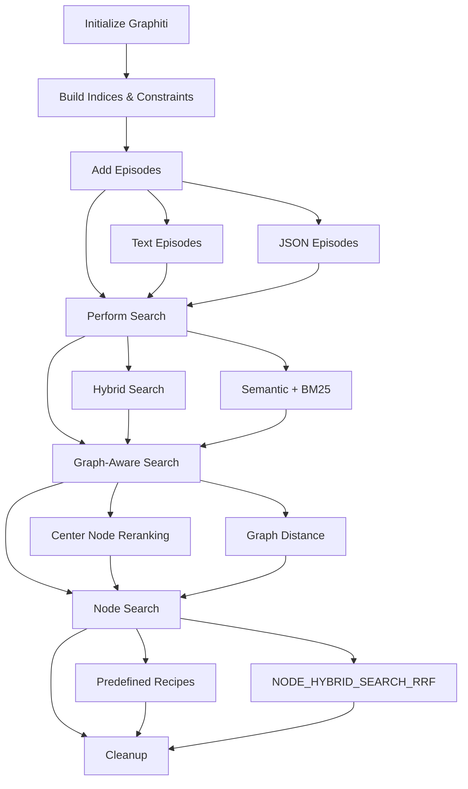

# Quickstart Guide

<cite>
**Referenced Files in This Document**
- [examples/quickstart/README.md](file://examples/quickstart/README.md)
- [examples/quickstart/requirements.txt](file://examples/quickstart/requirements.txt)
- [examples/quickstart/quickstart_neo4j.py](file://examples/quickstart/quickstart_neo4j.py)
- [examples/quickstart/quickstart_falkordb.py](file://examples/quickstart/quickstart_falkordb.py)
- [examples/quickstart/quickstart_neptune.py](file://examples/quickstart/quickstart_neptune.py)
- [graphiti_core/__init__.py](file://graphiti_core/__init__.py)
- [graphiti_core/graphiti.py](file://graphiti_core/graphiti.py)
- [graphiti_core/search/search.py](file://graphiti_core/search/search.py)
- [graphiti_core/search/search_config_recipes.py](file://graphiti_core/search/search_config_recipes.py)
- [graphiti_core/driver/falkordb_driver.py](file://graphiti_core/driver/falkordb_driver.py)
- [graphiti_core/driver/neo4j_driver.py](file://graphiti_core/driver/neo4j_driver.py)
- [graphiti_core/driver/neptune_driver.py](file://graphiti_core/driver/neptune_driver.py)
- [README.md](file://README.md)
</cite>

## Table of Contents
1. [Introduction](#introduction)
2. [Prerequisites](#prerequisites)
3. [Installation](#installation)
4. [Environment Setup](#environment-setup)
5. [Running the Quickstart Examples](#running-the-quickstart-examples)
6. [Understanding the Example Code](#understanding-the-example-code)
7. [Example Data Structure](#example-data-structure)
8. [Expected Results](#expected-results)
9. [Key Configuration Options](#key-configuration-options)
10. [Success Criteria](#success-criteria)
11. [Troubleshooting](#troubleshooting)
12. [Next Steps](#next-steps)

## Introduction

This quickstart guide provides a hands-on walkthrough to help developers quickly understand and experiment with Graphiti, a framework for building and querying temporally-aware knowledge graphs. Graphiti enables AI agents to continuously integrate user interactions, structured and unstructured data, and external information into coherent, queryable graphs.

The quickstart examples demonstrate the fundamental capabilities of Graphiti using three different graph database backends:
- **Neo4j**: Traditional graph database with robust ACID transactions
- **FalkorDB**: High-performance graph database optimized for AI workloads
- **Amazon Neptune**: Fully managed graph database service with integrated search

## Prerequisites

Before starting the quickstart, ensure you have the following prerequisites installed:

### System Requirements
- **Python 3.9+**: Graphiti requires Python 3.9 or higher
- **OpenAI API Key**: Required for LLM and embedding operations
- **Internet Connection**: For downloading dependencies and API calls

### Database Requirements
Choose one of the supported graph databases:

#### Neo4j Requirements
- **Neo4j Desktop**: Installed and running locally
- **Local DBMS**: Created and started in Neo4j Desktop
- **Default Credentials**: `neo4j` / `password` (configurable)

#### FalkorDB Requirements
- **FalkorDB Server**: Running locally or remotely
- **Default Connection**: `falkor://localhost:6379` (configurable)
- **Optional Authentication**: Username/password (configurable)

#### Amazon Neptune Requirements
- **Neptune Host**: Available Neptune cluster or graph endpoint
- **AOSS Host**: OpenSearch Serverless collection endpoint
- **AWS Credentials**: Properly configured for authentication

## Installation

### Step 1: Install Graphiti Core Package

Install the base Graphiti package using pip:

```bash
pip install graphiti-core
```

### Step 2: Install Database-Specific Dependencies

Choose the appropriate installation based on your chosen database backend:

#### For FalkorDB
```bash
pip install graphiti-core[falkordb]
```

#### For Amazon Neptune
```bash
pip install graphiti-core[neptune]
```

#### For Multiple Providers
```bash
pip install graphiti-core[falkordb,neptune]
```

### Step 3: Verify Installation

Verify the installation by importing Graphiti:

```python
from graphiti_core import Graphiti
print("Graphiti installed successfully!")
```

**Section sources**
- [examples/quickstart/README.md](file://examples/quickstart/README.md#L12-L23)
- [examples/quickstart/requirements.txt](file://examples/quickstart/requirements.txt#L1-L2)

## Environment Setup

### Step 1: Set OpenAI API Key

Configure your OpenAI API key as an environment variable:

```bash
export OPENAI_API_KEY=your_openai_api_key_here
```

### Step 2: Configure Database Connection Parameters

Set up environment variables for your chosen database backend:

#### Neo4j Configuration
```bash
# Required for Neo4j connection
export NEO4J_URI=bolt://localhost:7687
export NEO4J_USER=neo4j
export NEO4J_PASSWORD=password
```

#### FalkorDB Configuration
```bash
# Required for FalkorDB connection
export FALKORDB_URI=falkor://localhost:6379
# Optional authentication
export FALKORDB_USERNAME=your_username
export FALKORDB_PASSWORD=your_password
```

#### Amazon Neptune Configuration
```bash
# Required for Amazon Neptune
export NEPTUNE_HOST=your_neptune_cluster_endpoint
export NEPTUNE_PORT=8182
export AOSS_HOST=your_aoss_collection_endpoint
export AOSS_PORT=443
```

### Step 3: Verify Environment Variables

Test your environment setup:

```python
import os
from dotenv import load_dotenv

load_dotenv()
print(f"OpenAI API Key: {'*' * 8}" if os.getenv('OPENAI_API_KEY') else "OpenAI API Key not set")
print(f"Neo4j URI: {os.getenv('NEO4J_URI', 'Not set')}")
print(f"FalkorDB URI: {os.getenv('FALKORDB_URI', 'Not set')}")
print(f"Neptune Host: {os.getenv('NEPTUNE_HOST', 'Not set')}")
```

**Section sources**
- [examples/quickstart/README.md](file://examples/quickstart/README.md#L33-L56)

## Running the Quickstart Examples

### Choose Your Database Backend

Select the appropriate quickstart example based on your chosen database:

#### Neo4j Quickstart
```bash
python examples/quickstart/quickstart_neo4j.py
```

#### FalkorDB Quickstart
```bash
python examples/quickstart/quickstart_falkordb.py
```

#### Amazon Neptune Quickstart
```bash
python examples/quickstart/quickstart_neptune.py
```

### Expected Execution Flow

The quickstart script demonstrates the following workflow:

1. **Initialization**: Connect to the database and set up Graphiti indices
2. **Episode Addition**: Add structured and unstructured content to the graph
3. **Basic Search**: Perform hybrid semantic and keyword searches
4. **Graph-Aware Search**: Use center nodes for reranking based on graph distance
5. **Node Search**: Utilize predefined search recipes for targeted node retrieval
6. **Cleanup**: Properly close database connections

### Monitoring Progress

The script provides real-time feedback during execution:

```bash
# Example output during execution
Added episode: Freakonomics Radio 0 (text)
Added episode: Freakonomics Radio 1 (text)
Added episode: Freakonomics Radio 2 (json)
Added episode: Freakonomics Radio 3 (json)
Searching for: 'Who was the California Attorney General?'
```

**Section sources**
- [examples/quickstart/README.md](file://examples/quickstart/README.md#L60-L70)

## Understanding the Example Code

### Basic Usage Pattern

The quickstart examples follow a consistent pattern for Graphiti usage:



**Diagram sources**
- [examples/quickstart/quickstart_neo4j.py](file://examples/quickstart/quickstart_neo4j.py#L66-L242)
- [examples/quickstart/quickstart_falkordb.py](file://examples/quickstart/quickstart_falkordb.py#L75-L253)
- [examples/quickstart/quickstart_neptune.py](file://examples/quickstart/quickstart_neptune.py#L71-L252)

### Core Components

#### 1. Graphiti Initialization

The Graphiti instance connects to your chosen database backend:

```python
# Neo4j example
graphiti = Graphiti(neo4j_uri, neo4j_user, neo4j_password)

# FalkorDB example  
falkor_driver = FalkorDriver(host=falkor_host, port=falkor_port)
graphiti = Graphiti(graph_driver=falkor_driver)

# Neptune example
driver = NeptuneDriver(host=neptune_uri, aoss_host=aoss_host, port=neptune_port)
graphiti = Graphiti(graph_driver=driver)
```

#### 2. Index and Constraint Setup

Initialize the database with Graphiti's required indices:

```python
await graphiti.build_indices_and_constraints()
```

#### 3. Episode Addition

Add content to the knowledge graph using structured or unstructured data:

```python
await graphiti.add_episode(
    name=f'Freakonomics Radio {i}',
    episode_body=episode_content,
    source=EpisodeType.text,
    source_description='podcast transcript',
    reference_time=datetime.now(timezone.utc),
)
```

#### 4. Search Operations

Perform various types of searches using Graphiti's hybrid search capabilities:

```python
# Basic hybrid search
results = await graphiti.search('Who was the California Attorney General?')

# Graph-aware search with center node
reranked_results = await graphiti.search(
    'Who was the California Attorney General?', 
    center_node_uuid=center_node_uuid
)

# Node search using predefined recipes
node_search_config = NODE_HYBRID_SEARCH_RRF.model_copy(deep=True)
node_search_config.limit = 5
node_search_results = await graphiti._search(
    query='California Governor',
    config=node_search_config,
)
```

**Section sources**
- [examples/quickstart/quickstart_neo4j.py](file://examples/quickstart/quickstart_neo4j.py#L66-L242)
- [examples/quickstart/quickstart_falkordb.py](file://examples/quickstart/quickstart_falkordb.py#L75-L253)
- [examples/quickstart/quickstart_neptune.py](file://examples/quickstart/quickstart_neptune.py#L71-L252)

## Example Data Structure

### Episode Content Types

The quickstart examples demonstrate two types of episode content:

#### Text Episodes
Structured text content that is automatically parsed for entities and relationships:

```python
{
    'content': 'Kamala Harris is the Attorney General of California. She was previously '
              'the district attorney for San Francisco.',
    'type': EpisodeType.text,
    'description': 'podcast transcript',
}
```

#### JSON Episodes
Structured data with predefined schema for entities:

```python
{
    'content': {
        'name': 'Gavin Newsom',
        'position': 'Governor',
        'state': 'California',
        'previous_role': 'Lieutenant Governor',
        'previous_location': 'San Francisco',
    },
    'type': EpisodeType.json,
    'description': 'podcast metadata',
}
```

### Entity Recognition

The example data includes:
- **People**: Kamala Harris, Gavin Newsom
- **Organizations**: California Attorney General's Office
- **Locations**: California, San Francisco
- **Roles**: Attorney General, Governor, Lieutenant Governor

### Relationship Extraction

Graphiti automatically extracts relationships between entities:
- **Employment**: Kamala Harris → Attorney General of California
- **Previous Role**: Kamala Harris → District Attorney of San Francisco
- **Political Position**: Gavin Newsom → Governor of California

**Section sources**
- [examples/quickstart/quickstart_neo4j.py](file://examples/quickstart/quickstart_neo4j.py#L83-L117)
- [examples/quickstart/quickstart_falkordb.py](file://examples/quickstart/quickstart_falkordb.py#L94-L128)
- [examples/quickstart/quickstart_neptune.py](file://examples/quickstart/quickstart_neptune.py#L91-L125)

## Expected Results

### Search Result Structure

Graphiti returns results with rich metadata:

#### Edge Search Results
Each search result includes:
- **UUID**: Unique identifier for the edge
- **Fact**: The extracted fact from the episode
- **Valid Period**: Time range during which the fact was true
- **Source/Target Nodes**: Connected entities in the knowledge graph

Example output:
```
UUID: 12345678-1234-1234-1234-123456789012
Fact: Kamala Harris is the Attorney General of California
Valid from: 2011-01-03 00:00:00+00:00
Valid until: 2017-01-03 00:00:00+00:00
---
```

#### Node Search Results
Each node result includes:
- **UUID**: Unique identifier for the node
- **Name**: The name of the entity
- **Content Summary**: A summary of the node's content
- **Node Labels**: Types of the node (Person, Organization, Location)
- **Created At**: When the node was created
- **Attributes**: Additional properties associated with the node

Example output:
```
Node UUID: 87654321-4321-4321-4321-210987654321
Node Name: Kamala Harris
Content Summary: California Attorney General who served from 2011-2017...
Node Labels: Person
Created At: 2024-01-15 10:30:00+00:00
Attributes:
  position: Attorney General
  state: California
  term_start: 2011-01-03
  term_end: 2017-01-03
---
```

### Graph-Aware Search Benefits

The reranking based on graph distance provides more contextually relevant results:

1. **Initial Search**: Returns relevant edges based on semantic and keyword matching
2. **Center Node Selection**: Uses the source node from the top result
3. **Distance-Based Reranking**: Reorders results based on proximity to the center node
4. **Enhanced Context**: Provides results that are more closely related to the original query

**Section sources**
- [examples/quickstart/README.md](file://examples/quickstart/README.md#L108-L129)

## Key Configuration Options

### Search Configuration Recipes

Graphiti provides predefined search configurations optimized for different scenarios:

#### Edge Search Configurations
- **EDGE_HYBRID_SEARCH_RRF**: Hybrid search with reciprocal rank fusion
- **EDGE_HYBRID_SEARCH_MMR**: Hybrid search with maximal marginal relevance
- **EDGE_HYBRID_SEARCH_NODE_DISTANCE**: Graph-aware search using node distances
- **EDGE_HYBRID_SEARCH_CROSS_ENCODER**: Advanced search with cross-encoder reranking

#### Node Search Configurations  
- **NODE_HYBRID_SEARCH_RRF**: Hybrid search for nodes with RRF reranking
- **NODE_HYBRID_SEARCH_MMR**: Hybrid search for nodes with MMR reranking
- **NODE_HYBRID_SEARCH_NODE_DISTANCE**: Node search with distance-based reranking

#### Combined Search Configurations
- **COMBINED_HYBRID_SEARCH_RRF**: Searches across edges, nodes, communities with RRF
- **COMBINED_HYBRID_SEARCH_MMR**: Searches across all types with MMR
- **COMBINED_HYBRID_SEARCH_CROSS_ENCODER**: Advanced combined search with cross-encoder

### Customizing Search Behavior

Modify search parameters for specific use cases:

```python
# Customize search limits
node_search_config = NODE_HYBRID_SEARCH_RRF.model_copy(deep=True)
node_search_config.limit = 10  # Increase result count

# Adjust reranking thresholds
node_search_config.reranker_min_score = 0.5  # Filter lower quality results

# Enable temporal filtering
search_filter = SearchFilters(valid_at=reference_time)
```

### Driver-Specific Configuration

Each database backend supports specific configuration options:

#### Neo4j Configuration
- **Database Name**: Specify custom database (default: 'neo4j')
- **Connection Pooling**: Configurable connection limits
- **Transaction Isolation**: ACID-compliant transactions

#### FalkorDB Configuration
- **Multi-tenancy**: Support for multiple graph databases
- **Memory Management**: Optimized for large-scale AI workloads
- **Query Performance**: High-performance graph traversal

#### Amazon Neptune Configuration
- **Cluster vs Analytics**: Support for both Neptune Database and Analytics
- **OpenSearch Integration**: Built-in full-text search capabilities
- **Managed Scaling**: Automatic scaling for large datasets

**Section sources**
- [graphiti_core/search/search_config_recipes.py](file://graphiti_core/search/search_config_recipes.py#L33-L200)
- [examples/quickstart/quickstart_neo4j.py](file://examples/quickstart/quickstart_neo4j.py#L203-L211)
- [examples/quickstart/quickstart_falkordb.py](file://examples/quickstart/quickstart_falkordb.py#L214-L222)

## Success Criteria

### Verification Checklist

To confirm successful setup and execution, verify the following:

#### 1. Environment Setup
- [ ] OpenAI API key is properly configured
- [ ] Database connection parameters are correct
- [ ] Required dependencies are installed
- [ ] Python version is 3.9+

#### 2. Database Connectivity
- [ ] Graphiti can establish connection to chosen database
- [ ] Database indices and constraints are created successfully
- [ ] No connection errors during initialization

#### 3. Episode Processing
- [ ] All episodes are added without errors
- [ ] Episode count matches expected number (4 episodes)
- [ ] Episode content is properly parsed and stored

#### 4. Search Functionality
- [ ] Basic search returns relevant results
- [ ] Graph-aware search provides improved relevance
- [ ] Node search using recipes returns expected entities
- [ ] Search results include proper metadata (UUID, facts, timestamps)

#### 5. Result Quality
- [ ] Search results contain meaningful relationships
- [ ] Temporal information is accurately preserved
- [ ] Graph-aware reranking improves result relevance
- [ ] Node attributes are properly extracted and displayed

### Expected Output Validation

Run the following validation script to verify results:

```python
async def validate_quickstart_results(graphiti):
    # Test basic search
    results = await graphiti.search('California Governor')
    
    # Verify results
    assert len(results) > 0, "No results found for basic search"
    assert hasattr(results[0], 'uuid'), "Results missing UUID"
    assert hasattr(results[0], 'fact'), "Results missing fact"
    
    # Test node search
    node_config = NODE_HYBRID_SEARCH_RRF.model_copy(deep=True)
    node_results = await graphiti._search('California', config=node_config)
    
    assert len(node_results.nodes) > 0, "No nodes found in search"
    
    print("✓ All validation checks passed!")

# Run validation
await validate_quickstart_results(graphiti)
```

### Performance Benchmarks

Monitor execution metrics for optimal performance:

- **Initialization Time**: Should complete within 10 seconds
- **Episode Processing**: ~2-5 seconds per episode
- **Basic Search**: Sub-second response time
- **Graph-Aware Search**: Slightly slower due to reranking (~2-3x baseline)

**Section sources**
- [examples/quickstart/README.md](file://examples/quickstart/README.md#L81-L91)

## Troubleshooting

### Common Issues and Solutions

#### 1. "Graph not found: default_db" Error

**Problem**: Neo4j driver fails to find the default database.

**Solution**: 
```python
# Modify the driver constructor to specify database name
driver = Neo4jDriver(
    uri=neo4j_uri, 
    user=neo4j_user, 
    password=neo4j_password,
    database="your_database_name"  # Add this parameter
)
```

#### 2. Connection Timeout Errors

**Problem**: Database connection takes too long or fails.

**Solutions**:
- Verify database server is running and accessible
- Check firewall settings and network connectivity
- Validate connection parameters (URI, credentials)
- Increase timeout values if necessary

#### 3. OpenAI API Key Issues

**Problem**: Authentication failures or quota exceeded.

**Solutions**:
- Verify API key is correctly set in environment variables
- Check API key permissions and billing status
- Ensure sufficient quota for embeddings and LLM calls
- Consider using alternative LLM providers

#### 4. Memory Issues with Large Datasets

**Problem**: Out of memory errors during episode processing.

**Solutions**:
- Reduce batch sizes for episode processing
- Increase system memory allocation
- Use streaming processing for large datasets
- Implement pagination for search results

#### 5. Search Result Quality Issues

**Problem**: Poor search relevance or missing results.

**Solutions**:
- Adjust search configuration parameters
- Verify embedding model quality
- Check for proper entity recognition
- Review episode content quality and structure

### Debugging Tools

Enable detailed logging for troubleshooting:

```python
import logging
logging.basicConfig(level=logging.DEBUG)

# Enable Graphiti debug logging
logger = logging.getLogger('graphiti_core')
logger.setLevel(logging.DEBUG)
```

### Database-Specific Troubleshooting

#### Neo4j Issues
- Check Neo4j logs for constraint violations
- Verify database version compatibility
- Monitor disk space and memory usage

#### FalkorDB Issues
- Verify FalkorDB server is running
- Check Redis compatibility requirements
- Monitor memory usage and query performance

#### Amazon Neptune Issues
- Verify AWS credentials and permissions
- Check VPC and security group settings
- Monitor cluster health and performance metrics

**Section sources**
- [examples/quickstart/README.md](file://examples/quickstart/README.md#L92-L107)

## Next Steps

### Experimentation and Customization

After completing the quickstart, try these enhancements:

#### 1. Modify Episode Content
Replace the example content with your own data:
```python
custom_episodes = [
    {
        'content': 'Your custom text content here...',
        'type': EpisodeType.text,
        'description': 'custom source'
    }
]
```

#### 2. Try Different Search Queries
Explore various query types:
- Historical questions: "Who was the CEO in 2020?"
- Comparative queries: "Compare salaries between companies"
- Temporal queries: "What changed in 2023?"

#### 3. Experiment with Center Nodes
Try different center nodes for graph-aware search:
```python
# Use different center nodes for reranking
different_center_node = results[2].source_node_uuid  # Third result
reranked = await graphiti.search(query, center_node_uuid=different_center_node)
```

#### 4. Explore Search Recipes
Try different predefined search configurations:
```python
from graphiti_core.search.search_config_recipes import (
    EDGE_HYBRID_SEARCH_CROSS_ENCODER,
    NODE_HYBRID_SEARCH_MMR
)

# Use cross-encoder for better accuracy
cross_encoder_config = EDGE_HYBRID_SEARCH_CROSS_ENCODER.model_copy()
cross_encoder_results = await graphiti._search(query, config=cross_encoder_config)
```

### Advanced Use Cases

#### 1. Bulk Episode Processing
Process multiple episodes efficiently:
```python
bulk_episodes = [RawEpisode(...) for ...]
results = await graphiti.add_episode_bulk(bulk_episodes)
```

#### 2. Custom Entity Types
Define your own entity schemas:
```python
custom_entities = {
    'Company': CompanyModel,
    'Product': ProductModel,
    'Technology': TechnologyModel
}

await graphiti.add_episode(..., entity_types=custom_entities)
```

#### 3. Community Detection
Enable automatic community detection:
```python
await graphiti.add_episode(..., update_communities=True)
await graphiti.build_communities()
```

### Learning Resources

#### Documentation
- [Full Graphiti Documentation](https://github.com/getzep/Graphiti/tree/main)
- [API Reference](https://github.com/getzep/Graphiti/blob/main/graphiti_core/graphiti.py)
- [Examples Directory](https://github.com/getzep/Graphiti/tree/main/examples)

#### Community
- [GitHub Discussions](https://github.com/getzep/Graphiti/discussions)
- [Discord Community](https://discord.com/invite/W8Kw6bsgXQ)
- [Issue Reporting](https://github.com/getzep/Graphiti/issues)

#### Additional Examples
Explore more advanced examples in the repository:
- **Podcast Example**: Process audio transcripts and metadata
- **E-commerce Example**: Build product recommendation systems
- **Wizard of Oz Example**: Process narrative text with character tracking

**Section sources**
- [examples/quickstart/README.md](file://examples/quickstart/README.md#L81-L91)