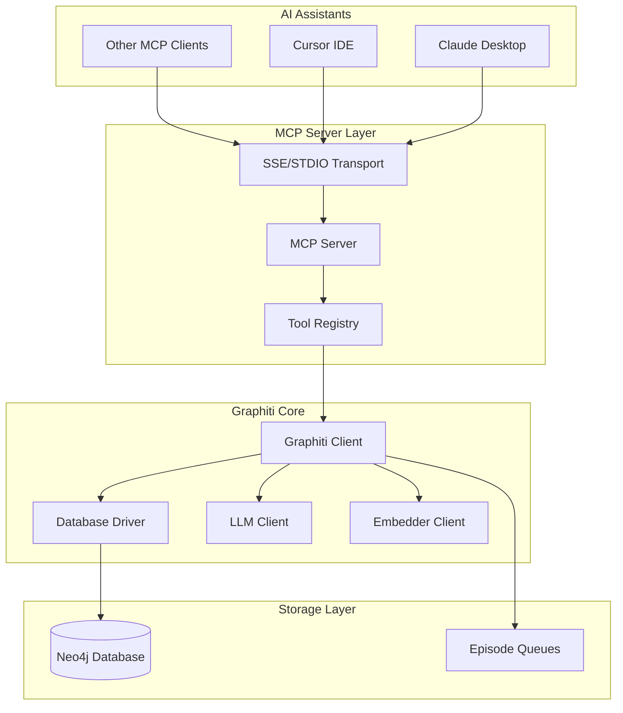
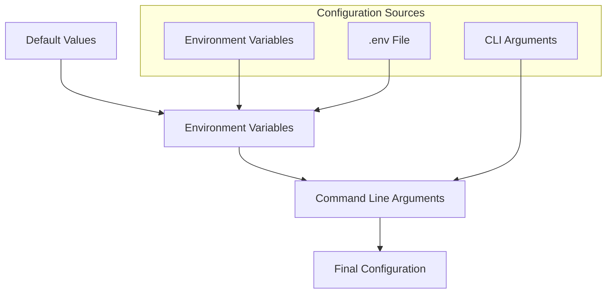
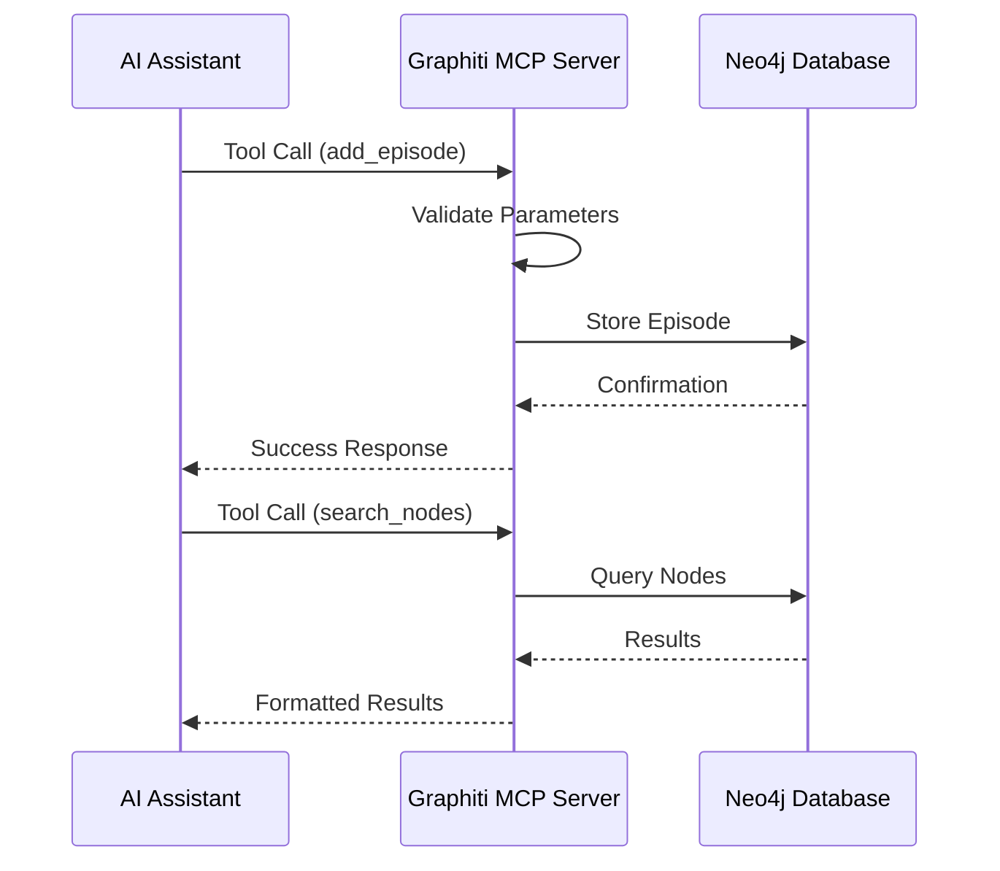
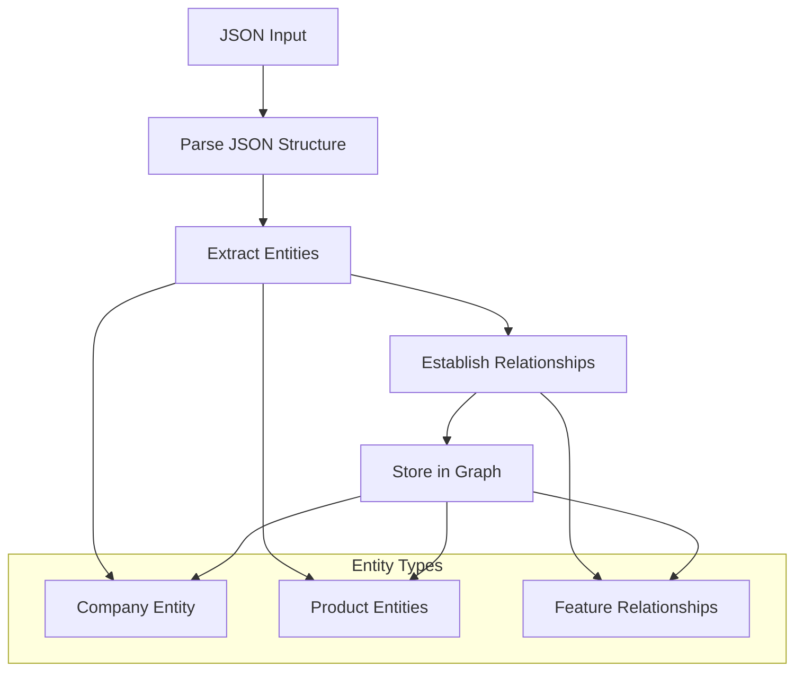
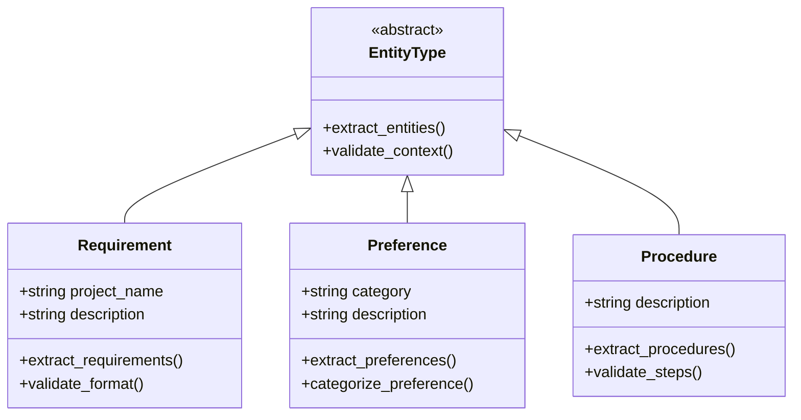
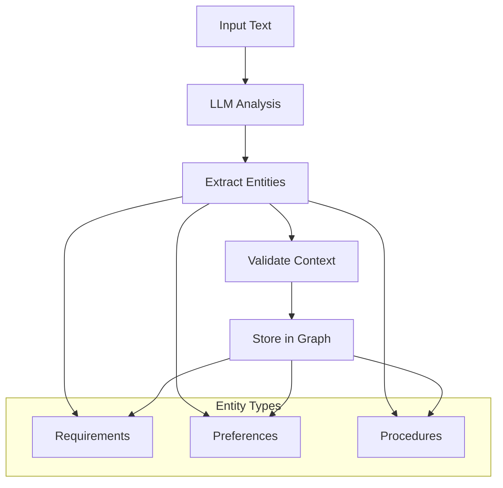

# Graphiti MCP Server API Documentation

<cite>
**Referenced Files in This Document**
- [graphiti_mcp_server.py](file://mcp_server/graphiti_mcp_server.py)
- [README.md](file://mcp_server/README.md)
- [docker-compose.yml](file://mcp_server/docker-compose.yml)
- [Dockerfile](file://mcp_server/Dockerfile)
- [pyproject.toml](file://mcp_server/pyproject.toml)
- [mcp_config_sse_example.json](file://mcp_server/mcp_config_sse_example.json)
- [mcp_config_stdio_example.json](file://mcp_server/mcp_config_stdio_example.json)
- [cursor_rules.md](file://mcp_server/cursor_rules.md)
- [telemetry.py](file://graphiti_core/telemetry/telemetry.py)
- [manybirds_products.json](file://examples/data/manybirds_products.json)
</cite>

## Table of Contents
1. [Introduction](#introduction)
2. [Architecture Overview](#architecture-overview)
3. [Setup and Installation](#setup-and-installation)
4. [Configuration Options](#configuration-options)
5. [Transport Methods](#transport-methods)
6. [Available Tools](#available-tools)
7. [Environment Variables](#environment-variables)
8. [Deployment with Docker](#deployment-with-docker)
9. [Integration Patterns](#integration-patterns)
10. [JSON Data Processing](#json-data-processing)
11. [Security Considerations](#security-considerations)
12. [Telemetry Configuration](#telemetry-configuration)
13. [Custom Entity Extraction](#custom-entity-extraction)
14. [Troubleshooting](#troubleshooting)

## Introduction

The Graphiti MCP (Model Context Protocol) Server is an experimental implementation that exposes Graphiti's knowledge graph capabilities through the MCP protocol. It serves as a bridge between AI assistants and Graphiti's powerful graph-based memory system, enabling persistent, contextual memory for AI agents operating in dynamic environments.

Graphiti transforms information into a richly connected knowledge network, organizing data as episodes (content snippets), nodes (entities), and facts (relationships between entities). The MCP server makes these capabilities available to AI assistants through standardized tool interfaces.

**Section sources**
- [README.md](file://mcp_server/README.md#L1-L25)

## Architecture Overview

The Graphiti MCP Server follows a modular architecture designed for flexibility and scalability:



**Diagram sources**
- [graphiti_mcp_server.py](file://mcp_server/graphiti_mcp_server.py#L565-L570)
- [docker-compose.yml](file://mcp_server/docker-compose.yml#L1-L48)

The server architecture consists of several key components:

- **MCP Server**: Implements the Model Context Protocol for communication with AI assistants
- **Transport Layer**: Supports both SSE (Server-Sent Events) and STDIO transport methods
- **Tool Registry**: Provides standardized interfaces for graph operations
- **Graphiti Client**: Manages knowledge graph operations and persistence
- **Database Layer**: Handles data storage and retrieval using Neo4j

**Section sources**
- [graphiti_mcp_server.py](file://mcp_server/graphiti_mcp_server.py#L565-L570)

## Setup and Installation

### Prerequisites

Before installing the Graphiti MCP Server, ensure you have the following requirements:

- **Python 3.10 or higher** installed on your system
- **A running Neo4j database** (version 5.26 or later required)
- **OpenAI API key** for LLM operations
- **uv package manager** for dependency management

### Installation Steps

1. **Clone the Repository**:
   ```bash
   git clone https://github.com/getzep/graphiti.git
   cd graphiti/mcp_server
   ```

2. **Install Dependencies**:
   ```bash
   # Install uv if you don't have it already
   curl -LsSf https://astral.sh/uv/install.sh | sh
   
   # Create virtual environment and install dependencies
   uv sync
   ```

3. **Verify Installation**:
   ```bash
   uv run graphiti_mcp_server.py --help
   ```

**Section sources**
- [README.md](file://mcp_server/README.md#L63-L85)
- [pyproject.toml](file://mcp_server/pyproject.toml#L1-L14)

## Configuration Options

The Graphiti MCP Server provides comprehensive configuration through environment variables and command-line arguments:

### Configuration Hierarchy



**Diagram sources**
- [graphiti_mcp_server.py](file://mcp_server/graphiti_mcp_server.py#L185-L200)

### Core Configuration Classes

The server uses a hierarchical configuration system:

- **GraphitiConfig**: Top-level configuration containing LLM, Embedder, and Neo4j settings
- **GraphitiLLMConfig**: LLM client configuration including model selection and authentication
- **GraphitiEmbedderConfig**: Embedding client configuration
- **Neo4jConfig**: Database connection settings

**Section sources**
- [graphiti_mcp_server.py](file://mcp_server/graphiti_mcp_server.py#L470-L510)

## Transport Methods

The Graphiti MCP Server supports two transport methods for communication with AI assistants:

### SSE (Server-Sent Events) Transport

SSE transport is recommended for modern MCP clients and provides real-time bidirectional communication:

```json
{
    "mcpServers": {
        "graphiti-memory": {
            "transport": "sse",
            "url": "http://localhost:8000/sse"
        }
    }
}
```

**Characteristics**:
- HTTP-based communication
- Real-time event streaming
- Built-in health checks
- Automatic reconnection support

### STDIO Transport

STDIO transport is compatible with Claude Desktop and other clients that don't support SSE:

```json
{
    "mcpServers": {
        "graphiti-memory": {
            "transport": "stdio",
            "command": "uv",
            "args": [
                "run",
                "/absolute/path/to/graphiti_mcp_server.py",
                "--transport", "stdio"
            ],
            "env": {
                "NEO4J_URI": "bolt://localhost:7687",
                "NEO4J_USER": "neo4j",
                "NEO4J_PASSWORD": "password",
                "OPENAI_API_KEY": "your-api-key",
                "MODEL_NAME": "gpt-4.1-mini"
            }
        }
    }
}
```

**Characteristics**:
- Process-based communication
- Text-based protocol
- Compatible with Claude Desktop
- Requires manual process management

**Section sources**
- [mcp_config_sse_example.json](file://mcp_server/mcp_config_sse_example.json#L1-L8)
- [mcp_config_stdio_example.json](file://mcp_server/mcp_config_stdio_example.json#L1-L22)

## Available Tools

The Graphiti MCP Server exposes five primary tools for knowledge graph operations:

### 1. add_episode

Adds an episode to the knowledge graph, serving as the primary method for ingesting information.

**Parameters**:
- `name` (string): Descriptive name for the episode
- `episode_body` (string): Content to persist (JSON, text, or message format)
- `group_id` (string, optional): Namespace for graph organization
- `source` (string, optional): Content type (text/json/message)
- `source_description` (string, optional): Description of the source
- `uuid` (string, optional): Optional UUID for the episode

**Example Usage**:
```python
add_episode(
    name="Customer Support Interaction",
    episode_body="Customer reported issue with order #12345",
    source="text",
    source_description="Support chat transcript"
)
```

### 2. search_nodes

Searches the knowledge graph for relevant node summaries using semantic and hybrid search.

**Parameters**:
- `query` (string): Search query
- `group_ids` (list[string], optional): Filter results by group IDs
- `max_nodes` (integer, default: 10): Maximum number of nodes to return
- `center_node_uuid` (string, optional): Center search around specific node
- `entity` (string, optional): Filter by entity type (Preference, Procedure, Requirement)

### 3. search_facts

Searches for relevant facts (edges between entities) in the knowledge graph.

**Parameters**:
- `query` (string): Search query
- `group_ids` (list[string], optional): Filter results by group IDs
- `max_facts` (integer, default: 10): Maximum number of facts to return
- `center_node_uuid` (string, optional): Center search around specific node

### 4. delete_entity_edge

Removes an entity edge from the knowledge graph.

**Parameters**:
- `uuid` (string): UUID of the entity edge to delete

### 5. delete_episode

Removes an episode from the knowledge graph.

**Parameters**:
- `uuid` (string): UUID of the episode to delete

### 6. get_entity_edge

Retrieves an entity edge by its UUID.

**Parameters**:
- `uuid` (string): UUID of the entity edge to retrieve

### 7. get_episodes

Gets the most recent episodes for a specific group.

**Parameters**:
- `group_id` (string, optional): Group ID to retrieve episodes from
- `last_n` (integer, default: 10): Number of most recent episodes to retrieve

### 8. clear_graph

Clears all data from the knowledge graph and rebuilds indices.

### 9. get_status

Gets the status of the Graphiti MCP server and Neo4j connection.

**Section sources**
- [graphiti_mcp_server.py](file://mcp_server/graphiti_mcp_server.py#L691-L827)
- [graphiti_mcp_server.py](file://mcp_server/graphiti_mcp_server.py#L829-L908)
- [graphiti_mcp_server.py](file://mcp_server/graphiti_mcp_server.py#L909-L962)

## Environment Variables

The Graphiti MCP Server uses extensive environment variable configuration:

### Core Environment Variables

| Variable | Description | Default | Required |
|----------|-------------|---------|----------|
| `NEO4J_URI` | Neo4j database URI | `bolt://localhost:7687` | Yes |
| `NEO4J_USER` | Neo4j username | `neo4j` | Yes |
| `NEO4J_PASSWORD` | Neo4j password | `demodemo` | Yes |
| `OPENAI_API_KEY` | OpenAI API key | - | Yes* |
| `MODEL_NAME` | OpenAI model name | `gpt-4.1-mini` | No |
| `SMALL_MODEL_NAME` | Small model name | `gpt-4.1-nano` | No |
| `LLM_TEMPERATURE` | LLM response temperature | `0.0` | No |
| `SEMAPHORE_LIMIT` | Concurrency limit | `10` | No |

*Required for LLM operations, optional for basic graph operations

### Azure OpenAI Configuration

| Variable | Description | Default |
|----------|-------------|---------|
| `AZURE_OPENAI_ENDPOINT` | Azure OpenAI endpoint URL | - |
| `AZURE_OPENAI_DEPLOYMENT_NAME` | Azure OpenAI deployment name | - |
| `AZURE_OPENAI_API_VERSION` | Azure OpenAI API version | - |
| `AZURE_OPENAI_USE_MANAGED_IDENTITY` | Use managed identity | `false` |
| `AZURE_OPENAI_EMBEDDING_API_KEY` | Embedding API key | - |
| `AZURE_OPENAI_EMBEDDING_ENDPOINT` | Embedding endpoint URL | - |
| `AZURE_OPENAI_EMBEDDING_DEPLOYMENT_NAME` | Embedding deployment name | - |
| `AZURE_OPENAI_EMBEDDING_API_VERSION` | Embedding API version | - |

### Advanced Configuration

| Variable | Description | Default |
|----------|-------------|---------|
| `GRAPHITI_TELEMETRY_ENABLED` | Enable telemetry collection | `true` |
| `USE_PARALLEL_RUNTIME` | Enable parallel processing | `false` |
| `MAX_REFLEXION_ITERATIONS` | Max reflection iterations | `0` |

**Section sources**
- [README.md](file://mcp_server/README.md#L83-L106)
- [graphiti_mcp_server.py](file://mcp_server/graphiti_mcp_server.py#L45-L48)

## Deployment with Docker

The Graphiti MCP Server provides Docker-based deployment for easy setup and scaling:

### Docker Compose Setup

The provided `docker-compose.yml` file orchestrates both Neo4j and the MCP server:

```yaml
services:
  neo4j:
    image: neo4j:5.26.0
    ports:
      - "7474:7474"
      - "7687:7687"
    environment:
      - NEO4J_AUTH=neo4j/password
      - NEO4J_server_memory_heap_initial__size=512m
      - NEO4J_server_memory_heap_max__size=1G
      - NEO4J_server_memory_pagecache_size=512m
    volumes:
      - neo4j_data:/data
      - neo4j_logs:/logs
    healthcheck:
      test: ["CMD", "wget", "-O", "/dev/null", "http://localhost:7474"]

  graphiti-mcp:
    image: zepai/knowledge-graph-mcp:latest
    depends_on:
      neo4j:
        condition: service_healthy
    environment:
      - NEO4J_URI=bolt://neo4j:7687
      - NEO4J_USER=neo4j
      - NEO4J_PASSWORD=password
      - OPENAI_API_KEY=${OPENAI_API_KEY}
      - MODEL_NAME=${MODEL_NAME}
    ports:
      - "8000:8000"
    command: ["uv", "run", "graphiti_mcp_server.py", "--transport", "sse"]
```

### Deployment Steps

1. **Prepare Environment**:
   ```bash
   # Option 1: Using .env file
   cp .env.example .env
   # Edit .env with your configuration
   
   # Option 2: Direct environment variables
   export OPENAI_API_KEY=your_key
   export MODEL_NAME=gpt-4.1-mini
   ```

2. **Start Services**:
   ```bash
   docker compose up
   ```

3. **Verify Deployment**:
   ```bash
   # Check server status
   curl http://localhost:8000/sse
   ```

### Dockerfile Configuration

The Dockerfile provides optimized containerization:

```dockerfile
FROM python:3.12-slim
WORKDIR /app
RUN apt-get update && apt-get install -y --no-install-recommends \
    curl ca-certificates && rm -rf /var/lib/apt/lists/*
ADD https://astral.sh/uv/install.sh /uv-installer.sh
RUN sh /uv-installer.sh && rm /uv-installer.sh
ENV PATH="/root/.local/bin:${PATH}"
ENV UV_COMPILE_BYTECODE=1 \
    UV_LINK_MODE=copy \
    UV_PYTHON_DOWNLOADS=never \
    MCP_SERVER_HOST="0.0.0.0" \
    PYTHONUNBUFFERED=1
```

**Section sources**
- [docker-compose.yml](file://mcp_server/docker-compose.yml#L1-L48)
- [Dockerfile](file://mcp_server/Dockerfile#L1-L50)

## Integration Patterns

### Claude Desktop Integration

Claude Desktop requires the STDIO transport method with `mcp-remote` gateway:

```json
{
    "mcpServers": {
        "graphiti-memory": {
            "command": "npx",
            "args": [
                "mcp-remote",
                "http://localhost:8000/sse"
            ]
        }
    }
}
```

### Cursor IDE Integration

Cursor IDE works natively with SSE transport:

```json
{
    "mcpServers": {
        "graphiti-memory": {
            "url": "http://localhost:8000/sse"
        }
    }
}
```

### Custom Integration Pattern

For custom AI assistants, implement the MCP protocol client:



**Diagram sources**
- [graphiti_mcp_server.py](file://mcp_server/graphiti_mcp_server.py#L691-L755)
- [graphiti_mcp_server.py](file://mcp_server/graphiti_mcp_server.py#L829-L880)

**Section sources**
- [README.md](file://mcp_server/README.md#L285-L360)
- [cursor_rules.md](file://mcp_server/cursor_rules.md#L1-L35)

## JSON Data Processing

The Graphiti MCP Server excels at processing structured JSON data through the `add_episode` tool:

### Supported JSON Formats

The server accepts various JSON structures for automatic entity extraction:

```json
{
    "company": {
        "name": "Acme Technologies",
        "industry": "Technology"
    },
    "products": [
        {
            "id": "P001",
            "name": "CloudSync",
            "features": ["backup", "sync"]
        },
        {
            "id": "P002", 
            "name": "DataMiner",
            "features": ["analytics", "reporting"]
        }
    ]
}
```

### JSON Processing Workflow



**Diagram sources**
- [graphiti_mcp_server.py](file://mcp_server/graphiti_mcp_server.py#L729-L736)

### Best Practices for JSON Data

1. **Proper Escaping**: JSON strings must be properly escaped in tool calls
2. **Structured Data**: Use consistent nested structures for better extraction
3. **Meaningful Keys**: Use descriptive property names for better entity recognition
4. **Relationship Patterns**: Establish clear relationships between entities

**Section sources**
- [README.md](file://mcp_server/README.md#L269-L285)
- [manybirds_products.json](file://examples/data/manybirds_products.json#L1-L50)

## Security Considerations

### Authentication and Access Control

The Graphiti MCP Server implements several security measures:

1. **Database Authentication**: Neo4j requires username/password authentication
2. **API Key Management**: OpenAI API keys are handled securely in environment variables
3. **Transport Security**: HTTPS recommended for production deployments
4. **Rate Limiting**: Configurable semaphore limits prevent abuse

### Rate Limiting Configuration

The `SEMAPHORE_LIMIT` environment variable controls concurrent operations:

```python
# Default limit: 10 concurrent operations
SEMAPHORE_LIMIT = int(os.getenv('SEMAPHORE_LIMIT', 10))

# Adjust based on LLM provider limits
# Lower values prevent 429 rate limit errors
# Higher values improve throughput
```

### Production Security Recommendations

1. **Use HTTPS**: Deploy behind a reverse proxy with SSL termination
2. **Network Isolation**: Place the server in a private network segment
3. **API Key Rotation**: Regularly rotate OpenAI API keys
4. **Monitor Access**: Implement logging and monitoring for unauthorized access attempts
5. **Resource Limits**: Set appropriate resource limits for Docker containers

**Section sources**
- [graphiti_mcp_server.py](file://mcp_server/graphiti_mcp_server.py#L45-L48)
- [README.md](file://mcp_server/README.md#L131-L140)

## Telemetry Configuration

Graphiti collects anonymous telemetry to improve the framework:

### What's Collected

- Anonymous identifier and system information (OS, Python version)
- Graphiti version and configuration choices
- LLM provider, database backend, and embedder type
- **No personal data, API keys, or actual graph content is ever collected**

### Disabling Telemetry

Telemetry is opt-out and can be disabled in multiple ways:

1. **Environment Variable**:
   ```bash
   export GRAPHITI_TELEMETRY_ENABLED=false
   ```

2. **.env File**:
   ```
   GRAPHITI_TELEMETRY_ENABLED=false
   ```

3. **Programmatic**:
   ```python
   import os
   os.environ['GRAPHITI_TELEMETRY_ENABLED'] = 'false'
   ```

### Technical Implementation

The telemetry system uses PostHog for anonymous analytics collection:

```python
# Telemetry configuration
POSTHOG_API_KEY = 'phc_UG6EcfDbuXz92neb3rMlQFDY0csxgMqRcIPWESqnSmo'
POSTHOG_HOST = 'https://us.i.posthog.com'

# Environment-controlled telemetry
TELEMETRY_ENV_VAR = 'GRAPHITI_TELEMETRY_ENABLED'
```

**Section sources**
- [README.md](file://mcp_server/README.md#L368-L397)
- [telemetry.py](file://graphiti_core/telemetry/telemetry.py#L1-L118)

## Custom Entity Extraction

The Graphiti MCP Server supports custom entity extraction using predefined models:

### Available Entity Types



**Diagram sources**
- [graphiti_mcp_server.py](file://mcp_server/graphiti_mcp_server.py#L51-L128)

### Entity Extraction Models

#### Requirement Model
Extracts specific needs, features, or functionalities from text:

```python
class Requirement(BaseModel):
    """Represents a specific need or requirement"""
    project_name: str = Field(..., description='Project to which requirement belongs')
    description: str = Field(..., description='Requirement description')
```

#### Preference Model  
Extracts user preferences and likes/dislikes:

```python
class Preference(BaseModel):
    """Represents a user's preference"""
    category: str = Field(..., description='Preference category (e.g., Brands, Food)')
    description: str = Field(..., description='Preference description')
```

#### Procedure Model
Extracts procedural knowledge and step-by-step instructions:

```python
class Procedure(BaseModel):
    """Represents a procedure or process"""
    description: str = Field(..., description='Procedure description')
```

### Enabling Custom Entities

Enable custom entity extraction by setting the `--use-custom-entities` flag:

```bash
uv run graphiti_mcp_server.py --use-custom-entities
```

### Entity Extraction Workflow



**Diagram sources**
- [graphiti_mcp_server.py](file://mcp_server/graphiti_mcp_server.py#L786-L798)

**Section sources**
- [graphiti_mcp_server.py](file://mcp_server/graphiti_mcp_server.py#L51-L128)
- [README.md](file://mcp_server/README.md#L129-L130)

## Troubleshooting

### Common Issues and Solutions

#### 1. Connection Failures

**Problem**: Cannot connect to Neo4j database
**Solution**:
- Verify Neo4j is running and accessible
- Check `NEO4J_URI`, `NEO4J_USER`, and `NEO4J_PASSWORD` environment variables
- Ensure firewall allows Bolt protocol (port 7687)

#### 2. API Key Issues

**Problem**: LLM operations failing
**Solution**:
- Verify `OPENAI_API_KEY` is set correctly
- Check API key permissions and quota
- For Azure OpenAI, ensure all Azure-specific variables are configured

#### 3. Rate Limiting

**Problem**: Getting 429 errors from LLM provider
**Solution**:
- Reduce `SEMAPHORE_LIMIT` environment variable
- Implement exponential backoff in client applications
- Upgrade to higher-tier LLM subscription

#### 4. Docker Deployment Issues

**Problem**: Container fails to start
**Solution**:
- Check Docker logs for specific error messages
- Verify environment variables are properly set
- Ensure sufficient system resources (memory, CPU)

#### 5. Transport Method Issues

**Problem**: Communication failures with AI assistants
**Solution**:
- For Claude Desktop: Use STDIO transport with `mcp-remote` gateway
- For Cursor: Use SSE transport with direct HTTP connection
- Verify transport configuration matches client requirements

### Debugging Commands

```bash
# Check server status
curl http://localhost:8000/sse

# View Docker logs
docker compose logs graphiti-mcp

# Test Neo4j connectivity
docker exec -it graphiti_neo4j_1 cypher-shell -u neo4j -p password "RETURN 1"

# Monitor system resources
docker stats
```

### Performance Optimization

1. **Concurrent Operations**: Adjust `SEMAPHORE_LIMIT` based on LLM provider limits
2. **Memory Management**: Monitor Neo4j memory usage and adjust heap settings
3. **Index Optimization**: Ensure proper Neo4j indexing for query performance
4. **Connection Pooling**: Use connection pooling for database operations

**Section sources**
- [README.md](file://mcp_server/README.md#L131-L140)
- [graphiti_mcp_server.py](file://mcp_server/graphiti_mcp_server.py#L575-L627)