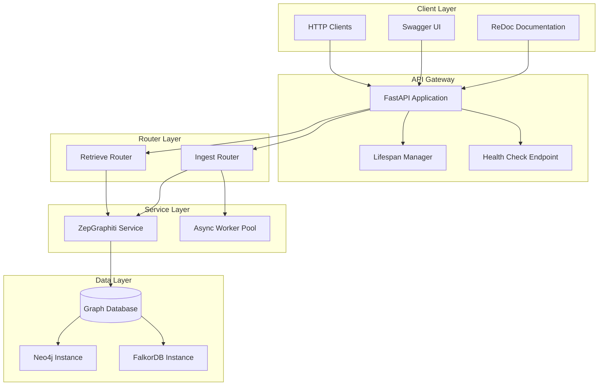
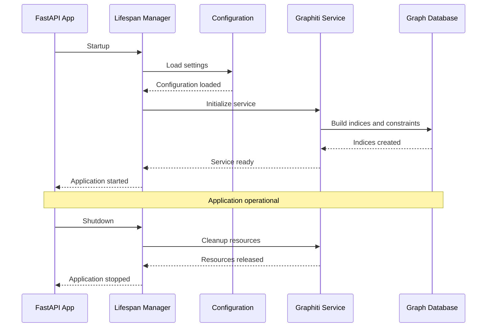
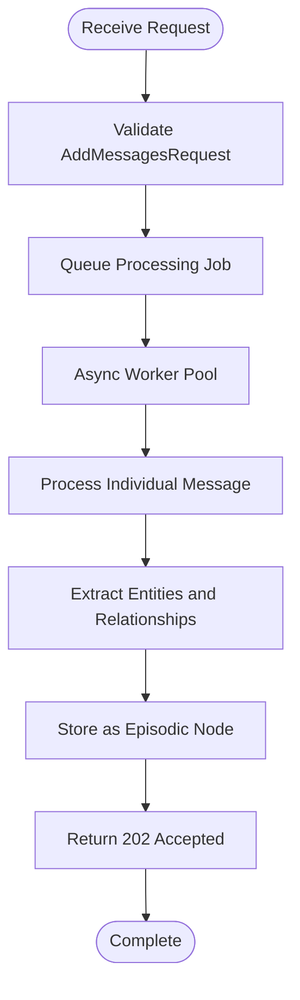
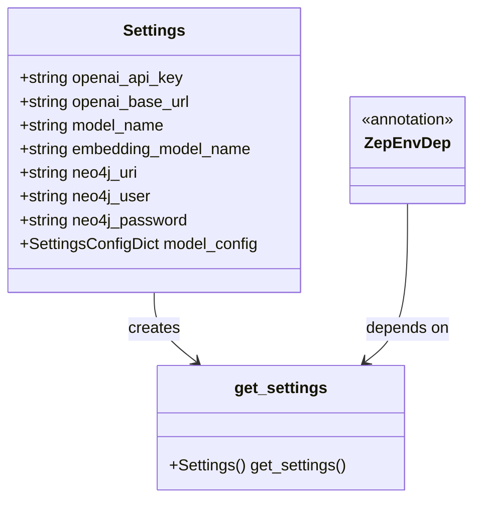
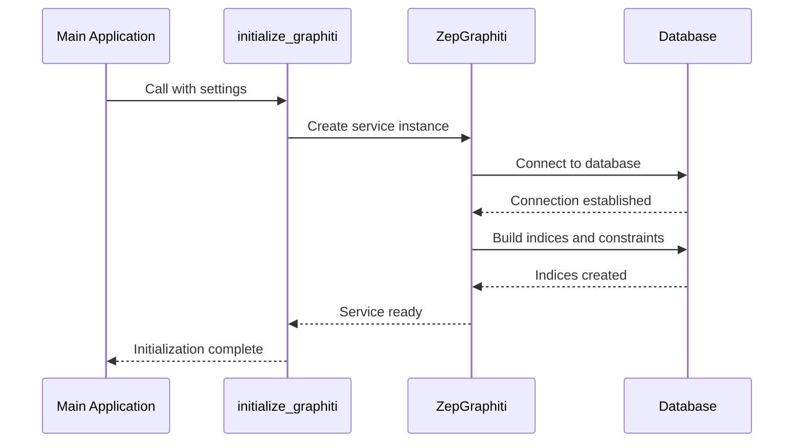
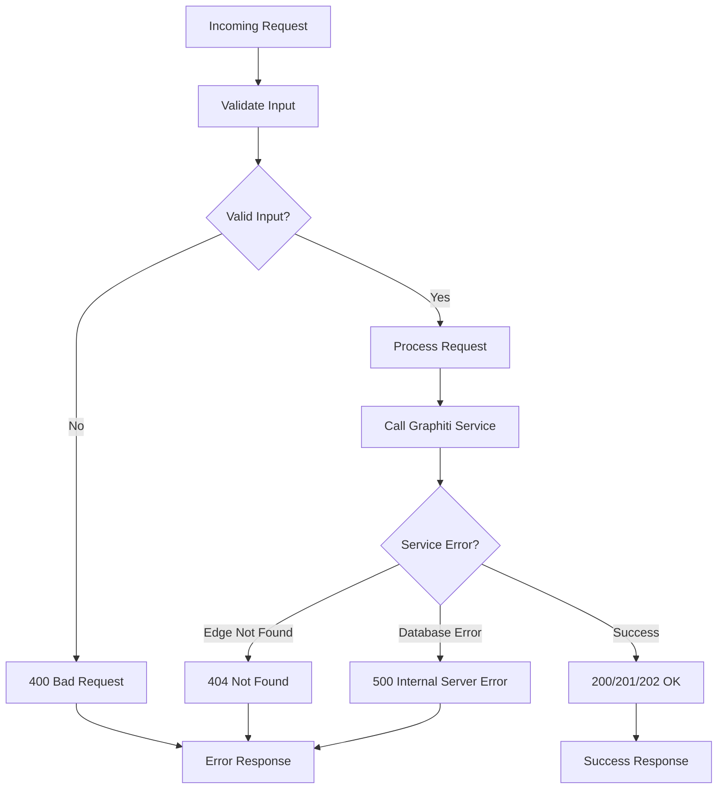

# REST API Service

<cite>
**Referenced Files in This Document**
- [main.py](file://server/graph_service/main.py)
- [ingest.py](file://server/graph_service/routers/ingest.py)
- [retrieve.py](file://server/graph_service/routers/retrieve.py)
- [ingest.py](file://server/graph_service/dto/ingest.py)
- [retrieve.py](file://server/graph_service/dto/retrieve.py)
- [common.py](file://server/graph_service/dto/common.py)
- [config.py](file://server/graph_service/config.py)
- [zep_graphiti.py](file://server/graph_service/zep_graphiti.py)
- [README.md](file://server/README.md)
- [pyproject.toml](file://server/pyproject.toml)
- [docker-compose.yml](file://docker-compose.yml)
- [podcast_runner.py](file://examples/podcast/podcast_runner.py)
- [quickstart_falkordb.py](file://examples/quickstart/quickstart_falkordb.py)
</cite>

## Table of Contents
1. [Introduction](#introduction)
2. [Architecture Overview](#architecture-overview)
3. [FastAPI Implementation](#fastapi-implementation)
4. [API Endpoints](#api-endpoints)
5. [Data Transfer Objects (DTOs)](#data-transfer-objects-dtos)
6. [Configuration System](#configuration-system)
7. [Client Implementation Examples](#client-implementation-examples)
8. [Deployment Considerations](#deployment-considerations)
9. [Error Handling and Monitoring](#error-handling-and-monitoring)
10. [Extending the API](#extending-the-api)
11. [Troubleshooting Guide](#troubleshooting-guide)

## Introduction

Graphiti's REST API service provides a comprehensive interface for managing knowledge graphs through ingestion, retrieval, and search operations. Built on FastAPI, the service offers a robust, scalable solution for processing and querying graph-based knowledge data. The API supports multiple graph database backends including Neo4j, FalkorDB, and others, making it versatile for various deployment scenarios.

The service is designed around two primary functional areas: **Ingestion** for adding and managing graph data, and **Retrieval** for searching and querying the knowledge graph. All operations are built on top of the Graphiti core library, ensuring consistency and reliability across different graph databases.

## Architecture Overview

The Graphiti REST API follows a modular architecture with clear separation of concerns:



**Diagram sources**
- [main.py](file://server/graph_service/main.py#L1-L30)
- [ingest.py](file://server/graph_service/routers/ingest.py#L1-L112)
- [retrieve.py](file://server/graph_service/routers/retrieve.py#L1-L64)
- [zep_graphiti.py](file://server/graph_service/zep_graphiti.py#L1-L115)

**Section sources**
- [main.py](file://server/graph_service/main.py#L1-L30)
- [zep_graphiti.py](file://server/graph_service/zep_graphiti.py#L1-L115)

## FastAPI Implementation

The FastAPI application is implemented in a clean, modular fashion with proper dependency injection and lifecycle management.

### Application Setup

The main application is configured with a lifespan context manager that handles initialization and cleanup:



**Diagram sources**
- [main.py](file://server/graph_service/main.py#L11-L18)
- [zep_graphiti.py](file://server/graph_service/zep_graphiti.py#L93-L101)

### Router Integration

The application integrates multiple routers for different functional areas:

| Router | Purpose | Endpoints |
|--------|---------|-----------|
| Ingest Router | Data ingestion and management | `/messages`, `/entity-node`, `/entity-edge/{uuid}`, `/group/{group_id}`, `/episode/{uuid}`, `/clear` |
| Retrieve Router | Search and retrieval operations | `/search`, `/entity-edge/{uuid}`, `/episodes/{group_id}`, `/get-memory` |

**Section sources**
- [main.py](file://server/graph_service/main.py#L23-L24)
- [ingest.py](file://server/graph_service/routers/ingest.py#L48)
- [retrieve.py](file://server/graph_service/routers/retrieve.py#L14)

## API Endpoints

### Ingestion Endpoints

#### POST /messages

Adds messages to the knowledge graph with asynchronous processing.

**HTTP Method:** POST  
**Status Code:** 202 Accepted  
**Request Schema:** [AddMessagesRequest](file://server/graph_service/dto/ingest.py#L6-L9)  
**Response Schema:** [Result](file://server/graph_service/dto/common.py#L8-L11)

**Request Body:**
```json
{
  "group_id": "string",
  "messages": [
    {
      "content": "string",
      "uuid": "string",
      "name": "string",
      "role_type": "user|assistant|system",
      "role": "string",
      "timestamp": "2024-01-01T00:00:00Z",
      "source_description": "string"
    }
  ]
}
```

**Processing Flow:**


**Diagram sources**
- [ingest.py](file://server/graph_service/routers/ingest.py#L51-L70)

#### POST /entity-node

Creates a new entity node in the knowledge graph.

**HTTP Method:** POST  
**Status Code:** 201 Created  
**Request Schema:** [AddEntityNodeRequest](file://server/graph_service/dto/ingest.py#L11-L16)  
**Response Schema:** [EntityNode](file://graphiti_core/nodes.py)

**Request Body:**
```json
{
  "uuid": "string",
  "group_id": "string",
  "name": "string",
  "summary": "string"
}
```

#### DELETE /entity-edge/{uuid}

Removes an entity edge from the graph.

**HTTP Method:** DELETE  
**Status Code:** 200 OK  
**Path Parameter:** `uuid` (string) - The UUID of the edge to delete  
**Response Schema:** [Result](file://server/graph_service/dto/common.py#L8-L11)

#### DELETE /group/{group_id}

Deletes an entire group and all associated data.

**HTTP Method:** DELETE  
**Status Code:** 200 OK  
**Path Parameter:** `group_id` (string)  
**Response Schema:** [Result](file://server/graph_service/dto/common.py#L8-L11)

#### DELETE /episode/{uuid}

Removes a specific episodic node from the graph.

**HTTP Method:** DELETE  
**Status Code:** 200 OK  
**Path Parameter:** `uuid` (string)  
**Response Schema:** [Result](file://server/graph_service/dto/common.py#L8-L11)

#### POST /clear

Clears all graph data and rebuilds indices.

**HTTP Method:** POST  
**Status Code:** 200 OK  
**Response Schema:** [Result](file://server/graph_service/dto/common.py#L8-L11)

### Retrieval Endpoints

#### POST /search

Performs hybrid search combining semantic similarity and BM25 retrieval.

**HTTP Method:** POST  
**Status Code:** 200 OK  
**Request Schema:** [SearchQuery](file://server/graph_service/dto/retrieve.py#L8-L14)  
**Response Schema:** [SearchResults](file://server/graph_service/dto/retrieve.py#L29-L31)

**Request Body:**
```json
{
  "group_ids": ["string"],
  "query": "string",
  "max_facts": 10
}
```

**Response Body:**
```json
{
  "facts": [
    {
      "uuid": "string",
      "name": "string",
      "fact": "string",
      "valid_at": "2024-01-01T00:00:00Z",
      "invalid_at": "2024-01-01T00:00:00Z",
      "created_at": "2024-01-01T00:00:00Z",
      "expired_at": "2024-01-01T00:00:00Z"
    }
  ]
}
```

#### GET /entity-edge/{uuid}

Retrieves a specific entity edge by UUID.

**HTTP Method:** GET  
**Status Code:** 200 OK  
**Path Parameter:** `uuid` (string)  
**Response Schema:** [FactResult](file://server/graph_service/dto/retrieve.py#L16-L26)

#### GET /episodes/{group_id}

Retrieves recent episodes for a group.

**HTTP Method:** GET  
**Status Code:** 200 OK  
**Path Parameter:** `group_id` (string)  
**Query Parameters:** `last_n` (integer)  
**Response Schema:** List of [EpisodicNode](file://graphiti_core/nodes.py)

#### POST /get-memory

Retrieves contextual memory based on conversation history.

**HTTP Method:** POST  
**Status Code:** 200 OK  
**Request Schema:** [GetMemoryRequest](file://server/graph_service/dto/retrieve.py#L33-L41)  
**Response Schema:** [GetMemoryResponse](file://server/graph_service/dto/retrieve.py#L44-L46)

**Request Body:**
```json
{
  "group_id": "string",
  "max_facts": 10,
  "center_node_uuid": "string",
  "messages": [
    {
      "content": "string",
      "uuid": "string",
      "name": "string",
      "role_type": "user|assistant|system",
      "role": "string",
      "timestamp": "2024-01-01T00:00:00Z",
      "source_description": "string"
    }
  ]
}
```

**Section sources**
- [ingest.py](file://server/graph_service/routers/ingest.py#L51-L112)
- [retrieve.py](file://server/graph_service/routers/retrieve.py#L17-L64)

## Data Transfer Objects (DTOs)

The API uses Pydantic models for request validation and response formatting, ensuring type safety and automatic documentation generation.

### Common DTOs

#### Message Model
Represents a conversational message with rich metadata:

| Field | Type | Description | Required |
|-------|------|-------------|----------|
| content | string | Message content | Yes |
| uuid | string \| None | Unique identifier | No |
| name | string | Episode name | No |
| role_type | "user" \| "assistant" \| "system" | Role classification | Yes |
| role | string \| None | Custom role name | No |
| timestamp | datetime | Message timestamp | No |
| source_description | string | Source description | No |

#### Result Model
Standardized response format for operations:

| Field | Type | Description |
|-------|------|-------------|
| message | string | Operation status message |
| success | boolean | Operation success flag |

### Ingestion DTOs

#### AddMessagesRequest
Batch message ingestion:

| Field | Type | Description |
|-------|------|-------------|
| group_id | string | Target group identifier |
| messages | list[Message] | Messages to process |

#### AddEntityNodeRequest
Single entity creation:

| Field | Type | Description |
|-------|------|-------------|
| uuid | string | Entity UUID |
| group_id | string | Group identifier |
| name | string | Entity name |
| summary | string | Entity description |

### Retrieval DTOs

#### SearchQuery
Search operation parameters:

| Field | Type | Default | Description |
|-------|------|---------|-------------|
| group_ids | list[string] \| None | None | Target groups |
| query | string | - | Search query |
| max_facts | int | 10 | Maximum results |

#### FactResult
Search result representation:

| Field | Type | Description |
|-------|------|-------------|
| uuid | string | Edge UUID |
| name | string | Edge name |
| fact | string | Relationship description |
| valid_at | datetime \| None | Validity start time |
| invalid_at | datetime \| None | Validity end time |
| created_at | datetime | Creation timestamp |
| expired_at | datetime \| None | Expiration timestamp |

**Section sources**
- [common.py](file://server/graph_service/dto/common.py#L1-L29)
- [ingest.py](file://server/graph_service/dto/ingest.py#L1-L16)
- [retrieve.py](file://server/graph_service/dto/retrieve.py#L1-L46)

## Configuration System

The configuration system uses Pydantic Settings with environment variable support and dependency injection.

### Environment Variables

| Variable | Type | Required | Description |
|----------|------|----------|-------------|
| OPENAI_API_KEY | string | Yes | OpenAI API authentication |
| OPENAI_BASE_URL | string | No | Custom OpenAI-compatible endpoint |
| MODEL_NAME | string | No | LLM model specification |
| EMBEDDING_MODEL_NAME | string | No | Embedding model specification |
| NEO4J_URI | string | Yes | Neo4j database connection URI |
| NEO4J_USER | string | Yes | Neo4j authentication username |
| NEO4J_PASSWORD | string | Yes | Neo4j authentication password |

### Configuration Architecture



**Diagram sources**
- [config.py](file://server/graph_service/config.py#L9-L27)

### Initialization Process

The `initialize_graphiti` function sets up the Graphiti service with proper database indices:



**Diagram sources**
- [zep_graphiti.py](file://server/graph_service/zep_graphiti.py#L93-L101)

**Section sources**
- [config.py](file://server/graph_service/config.py#L1-L27)
- [zep_graphiti.py](file://server/graph_service/zep_graphiti.py#L93-L101)

## Client Implementation Examples

### Basic Client Usage

Here are practical examples of client implementations for common operations:

#### Adding Episodes

```python
import httpx
import json
from datetime import datetime, timezone

# Add messages to the knowledge graph
async def add_messages():
    url = "http://localhost:8000/messages"
    
    messages = [
        {
            "content": "Kamala Harris served as California Attorney General from 2011-2017",
            "role_type": "user",
            "timestamp": datetime.now(timezone.utc).isoformat(),
            "source_description": "podcast transcript"
        }
    ]
    
    payload = {
        "group_id": "california_politics",
        "messages": messages
    }
    
    async with httpx.AsyncClient() as client:
        response = await client.post(url, json=payload)
        return response.json()

# Add entity nodes
async def add_entity_node():
    url = "http://localhost:8000/entity-node"
    
    payload = {
        "uuid": "kamala_harris_uuid",
        "group_id": "california_politics",
        "name": "Kamala Harris",
        "summary": "California Attorney General and later Vice President"
    }
    
    async with httpx.AsyncClient() as client:
        response = await client.post(url, json=payload)
        return response.json()
```

#### Performing Hybrid Searches

```python
# Search for relationships
async def search_relationships():
    url = "http://localhost:8000/search"
    
    payload = {
        "query": "Who was the California Attorney General?",
        "max_facts": 5
    }
    
    async with httpx.AsyncClient() as client:
        response = await client.post(url, json=payload)
        return response.json()

# Get contextual memory
async def get_memory():
    url = "http://localhost:8000/get-memory"
    
    messages = [
        {
            "content": "Who was the California Attorney General?",
            "role_type": "user",
            "timestamp": datetime.now(timezone.utc).isoformat()
        }
    ]
    
    payload = {
        "group_id": "california_politics",
        "center_node_uuid": "kamala_harris_uuid",
        "messages": messages,
        "max_facts": 5
    }
    
    async with httpx.AsyncClient() as client:
        response = await client.post(url, json=payload)
        return response.json()
```

### Advanced Client Patterns

#### Batch Processing with Async Workers

The ingestion endpoint uses an async worker pool for efficient batch processing:

```python
# Efficient batch message processing
async def batch_process_messages(messages):
    url = "http://localhost:8000/messages"
    
    # Messages are queued asynchronously for processing
    payload = {
        "group_id": "batch_processing_group",
        "messages": messages
    }
    
    async with httpx.AsyncClient() as client:
        # Returns immediately with 202 Accepted
        response = await client.post(url, json=payload)
        return response.status_code == 202
```

#### Error Handling and Retry Logic

```python
import asyncio
from httpx import HTTPStatusError

async def robust_search(query, max_retries=3):
    url = "http://localhost:8000/search"
    
    payload = {
        "query": query,
        "max_facts": 10
    }
    
    for attempt in range(max_retries):
        try:
            async with httpx.AsyncClient(timeout=30.0) as client:
                response = await client.post(url, json=payload)
                
                if response.status_code == 200:
                    return response.json()
                elif response.status_code == 503:
                    # Service unavailable, retry
                    await asyncio.sleep(2 ** attempt)
                    continue
                else:
                    response.raise_for_status()
                    
        except HTTPStatusError as e:
            if e.response.status_code >= 500:
                # Server error, retry
                await asyncio.sleep(2 ** attempt)
                continue
            else:
                # Client error, don't retry
                raise
        
        except Exception as e:
            if attempt == max_retries - 1:
                raise
            await asyncio.sleep(2 ** attempt)
    
    raise TimeoutError("Max retries exceeded")
```

**Section sources**
- [podcast_runner.py](file://examples/podcast/podcast_runner.py#L1-L130)
- [quickstart_falkordb.py](file://examples/quickstart/quickstart_falkordb.py#L1-L254)

## Deployment Considerations

### Docker Deployment

The service includes comprehensive Docker support with health checks and proper resource management:

#### Docker Compose Configuration

```yaml
services:
  graph:
    build:
      context: .
    ports:
      - "8000:8000"
    healthcheck:
      test:
        - "CMD"
        - "python"
        - "-c"
        - "import urllib.request; urllib.request.urlopen('http://localhost:8000/healthcheck')"
      interval: 10s
      timeout: 5s
      retries: 3
    depends_on:
      neo4j:
        condition: service_healthy
    environment:
      - OPENAI_API_KEY=${OPENAI_API_KEY}
      - NEO4J_URI=bolt://neo4j:${NEO4J_PORT:-7687}
      - NEO4J_USER=${NEO4J_USER}
      - NEO4J_PASSWORD=${NEO4J_PASSWORD}
      - PORT=8000
  
  neo4j:
    image: neo4j:5.26.2
    healthcheck:
      test:
        - "CMD-SHELL"
        - "wget -qO- http://localhost:${NEO4J_PORT:-7474} || exit 1"
      interval: 1s
      timeout: 10s
      retries: 10
      start_period: 3s
    ports:
      - "7474:7474"
      - "${NEO4J_PORT:-7687}:${NEO4J_PORT:-7687}"
    volumes:
      - neo4j_data:/data
    environment:
      - NEO4J_AUTH=${NEO4J_USER}/${NEO4J_PASSWORD}
```

### Production Deployment Checklist

#### Infrastructure Requirements

| Component | Requirement | Recommendation |
|-----------|-------------|----------------|
| CPU | Multi-core processor | 4+ cores for concurrent processing |
| Memory | RAM allocation | 8GB+ for large datasets |
| Storage | Persistent storage | SSD for optimal performance |
| Network | Bandwidth | 100Mbps+ for large uploads |

#### Security Considerations

1. **Environment Variables**: Use secure secret management
2. **Network Security**: Implement firewall rules and VPN access
3. **Authentication**: Consider API key authentication
4. **HTTPS**: Deploy with SSL/TLS certificates

#### Performance Tuning

```python
# Optimal uvicorn configuration for production
# gunicorn.conf.py
import multiprocessing

workers = multiprocessing.cpu_count() * 2
worker_class = 'uvicorn.workers.UvicornWorker'
worker_connections = 1000
timeout = 30
keepalive = 2
```

### Monitoring and Observability

#### Health Check Endpoint

The `/healthcheck` endpoint provides basic service health monitoring:

```python
@app.get('/healthcheck')
async def healthcheck():
    return JSONResponse(content={'status': 'healthy'}, status_code=200)
```

#### Logging Configuration

```python
import logging
from logging.handlers import RotatingFileHandler

# Production logging configuration
logging.basicConfig(
    level=logging.INFO,
    format='%(asctime)s - %(name)s - %(levelname)s - %(message)s',
    handlers=[
        RotatingFileHandler(
            'graph_service.log',
            maxBytes=10*1024*1024,  # 10MB
            backupCount=10
        ),
        logging.StreamHandler()
    ]
)
```

**Section sources**
- [docker-compose.yml](file://docker-compose.yml#L1-L49)
- [README.md](file://server/README.md#L1-L58)
- [main.py](file://server/graph_service/main.py#L27-L30)

## Error Handling and Monitoring

### Error Handling Strategies

The API implements comprehensive error handling at multiple levels:

#### HTTP Status Codes

| Status Code | Scenario | Response Format |
|-------------|----------|-----------------|
| 200 | Successful operation | Standard response |
| 202 | Accepted for processing | [Result](file://server/graph_service/dto/common.py#L8-L11) |
| 400 | Bad request | Validation error details |
| 404 | Resource not found | [Result](file://server/graph_service/dto/common.py#L8-L11) |
| 500 | Internal server error | Error details |
| 503 | Service unavailable | Error details |

#### Exception Handling Flow



**Diagram sources**
- [zep_graphiti.py](file://server/graph_service/zep_graphiti.py#L32-L71)

### Monitoring Approaches

#### Health Check Implementation

The health check endpoint provides essential service monitoring:

```python
@app.get('/healthcheck')
async def healthcheck():
    return JSONResponse(content={'status': 'healthy'}, status_code=200)
```

#### Metrics Collection

Key metrics to monitor in production:

| Metric | Description | Monitoring Method |
|--------|-------------|-------------------|
| Request Rate | Requests per second | Application logs |
| Response Time | Average response time | Application metrics |
| Error Rate | Failed requests percentage | Error logs |
| Database Connections | Active database connections | Database monitoring |
| Memory Usage | Service memory consumption | System monitoring |

#### Alerting Configuration

```yaml
# Prometheus alerting rules
groups:
- name: graph_service
  rules:
  - alert: HighErrorRate
    expr: rate(http_requests_total{status=~"5.."}[5m]) > 0.1
    for: 2m
    labels:
      severity: critical
    annotations:
      summary: "High error rate detected"
      
  - alert: SlowResponseTime
    expr: histogram_quantile(0.95, http_request_duration_seconds) > 2
    for: 5m
    labels:
      severity: warning
    annotations:
      summary: "95th percentile response time is slow"
```

**Section sources**
- [main.py](file://server/graph_service/main.py#L27-L30)
- [zep_graphiti.py](file://server/graph_service/zep_graphiti.py#L32-L71)

## Extending the API

### Adding New Routes

To add new endpoints to the API, follow these steps:

#### 1. Create Router Module

```python
# custom_router.py
from fastapi import APIRouter, Depends
from typing import Annotated
from graph_service.zep_graphiti import ZepGraphitiDep

router = APIRouter()

@router.get("/custom-endpoint")
async def custom_endpoint(graphiti: ZepGraphitiDep):
    # Implementation here
    return {"message": "Custom endpoint"}
```

#### 2. Register Router in Main Application

```python
# main.py
from graph_service.routers import ingest, retrieve, custom_router

app.include_router(custom_router.router)
```

#### 3. Add DTOs if Needed

```python
# custom_dto.py
from pydantic import BaseModel, Field

class CustomRequest(BaseModel):
    field1: str = Field(..., description="Required field")
    field2: int = Field(default=0, description="Optional field")

class CustomResponse(BaseModel):
    result: str
    timestamp: datetime
```

### Extending Data Models

#### Custom Entity Types

```python
# custom_entities.py
from pydantic import BaseModel, Field

class CustomEntityType(BaseModel):
    """Custom entity type for specialized domains"""
    specialty: str = Field(..., description="Entity specialty")
    expertise_level: Literal["beginner", "intermediate", "advanced"] = Field(
        ..., description="Expertise level"
    )
```

#### Custom Search Configurations

```python
# custom_search.py
from graphiti_core.search.search_config import SearchConfig

CUSTOM_SEARCH_CONFIG = SearchConfig(
    name="custom_search",
    semantic_weight=0.7,
    bm25_weight=0.3,
    limit=20,
    filters={"domain": "specialized_domain"}
)
```

### Best Practices for Extension

#### 1. Maintain Consistency

- Use consistent naming conventions
- Follow the existing DTO patterns
- Implement proper error handling
- Add appropriate documentation

#### 2. Performance Considerations

- Implement caching where appropriate
- Use async/await patterns consistently
- Monitor resource usage
- Consider pagination for large datasets

#### 3. Testing Strategy

```python
# test_custom_endpoint.py
import pytest
from fastapi.testclient import TestClient

@pytest.fixture
def client():
    from main import app
    return TestClient(app)

def test_custom_endpoint(client):
    response = client.get("/custom-endpoint")
    assert response.status_code == 200
    assert "message" in response.json()
```

**Section sources**
- [main.py](file://server/graph_service/main.py#L23-L24)
- [ingest.py](file://server/graph_service/routers/ingest.py#L48)

## Troubleshooting Guide

### Common Issues and Solutions

#### Connection Issues

**Problem**: Database connection failures
**Symptoms**: 500 Internal Server Error, connection timeouts
**Solution**: 
1. Verify database credentials in environment variables
2. Check network connectivity to database
3. Ensure database is running and accessible
4. Review connection pool settings

#### Authentication Problems

**Problem**: API authentication failures
**Symptoms**: 401 Unauthorized responses
**Solution**:
1. Verify OPENAI_API_KEY is correctly set
2. Check API key permissions
3. Ensure no special characters in keys
4. Validate key format and expiration

#### Performance Issues

**Problem**: Slow response times
**Symptoms**: High latency, timeouts
**Solution**:
1. Monitor database performance
2. Check index utilization
3. Optimize search queries
4. Consider scaling horizontally

#### Memory Issues

**Problem**: Out of memory errors
**Symptoms**: 500 Internal Server Error, service crashes
**Solution**:
1. Increase container memory limits
2. Optimize batch sizes
3. Implement request throttling
4. Monitor memory usage patterns

### Debugging Tools

#### Enable Debug Logging

```python
import logging

# Enable debug logging
logging.basicConfig(level=logging.DEBUG)
logger = logging.getLogger("graph_service")
```

#### Health Check Verification

```bash
# Check service health
curl -f http://localhost:8000/healthcheck

# Expected response: {"status": "healthy"}
```

#### Database Connectivity Test

```python
# Test database connection
from graph_service.zep_graphiti import get_graphiti
from graph_service.config import get_settings

settings = get_settings()
try:
    async with get_graphiti(settings) as graphiti:
        # Test basic functionality
        await graphiti.search("test query", num_results=1)
        print("Database connection successful")
except Exception as e:
    print(f"Database connection failed: {e}")
```

### Monitoring and Alerting

#### Log Analysis

Key log patterns to monitor:

```bash
# Search for error patterns
grep -i "error\|exception\|fail" graph_service.log

# Monitor health check failures
grep "healthcheck" access.log | grep "5.."

# Track slow requests
awk '$NF > 2' access.log
```

#### Performance Metrics

Monitor these key metrics:

- Request rate and distribution
- Response time percentiles
- Error rates by endpoint
- Database query times
- Memory and CPU usage

**Section sources**
- [zep_graphiti.py](file://server/graph_service/zep_graphiti.py#L32-L71)
- [main.py](file://server/graph_service/main.py#L27-L30)