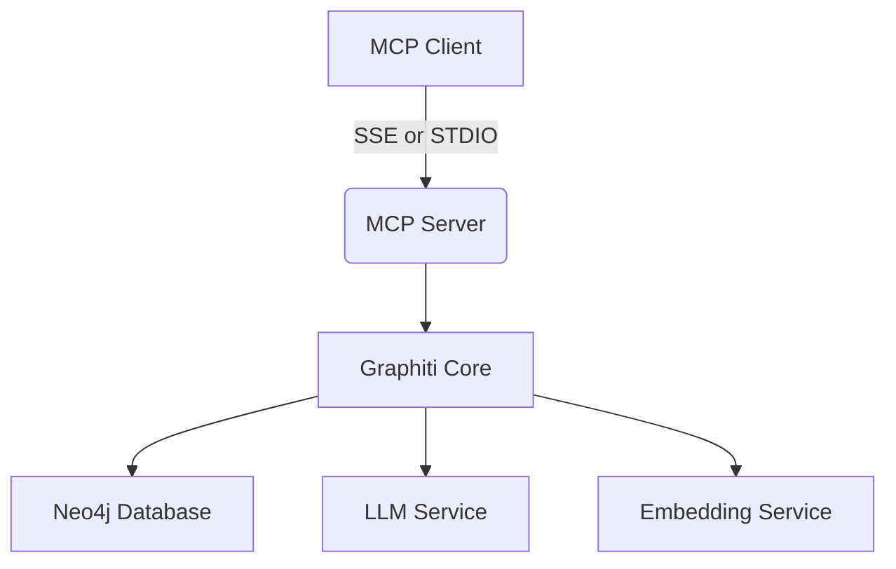
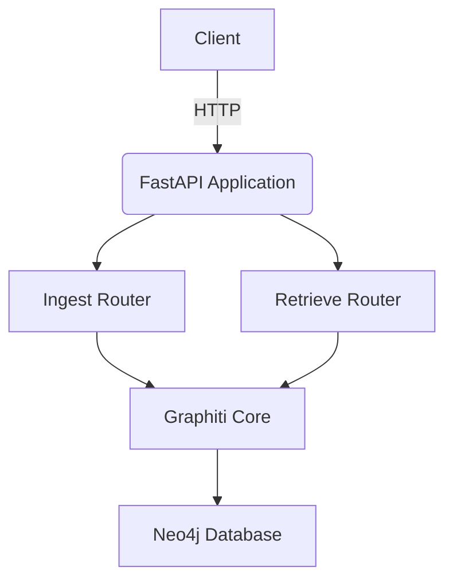

# Services

<cite>
**Referenced Files in This Document**   
- [graphiti_mcp_server.py](file://mcp_server/graphiti_mcp_server.py)
- [mcp_config_sse_example.json](file://mcp_server/mcp_config_sse_example.json)
- [mcp_config_stdio_example.json](file://mcp_server/mcp_config_stdio_example.json)
- [Dockerfile](file://mcp_server/Dockerfile)
- [docker-compose.yml](file://mcp_server/docker-compose.yml)
- [main.py](file://server/graph_service/main.py)
- [config.py](file://server/graph_service/config.py)
- [ingest.py](file://server/graph_service/routers/ingest.py)
- [retrieve.py](file://server/graph_service/routers/retrieve.py)
- [dto/ingest.py](file://server/graph_service/dto/ingest.py)
- [dto/retrieve.py](file://server/graph_service/dto/retrieve.py)
- [dto/common.py](file://server/graph_service/dto/common.py)
- [zep_graphiti.py](file://server/graph_service/zep_graphiti.py)
- [docker-compose.yml](file://docker-compose.yml)
</cite>

## Table of Contents
1. [Introduction](#introduction)
2. [MCP Server](#mcp-server)
3. [REST API Service](#rest-api-service)
4. [Deployment](#deployment)
5. [Client Integration Examples](#client-integration-examples)
6. [Security and Monitoring](#security-and-monitoring)

## Introduction
Graphiti provides two service interfaces for AI agent integration: a Model Context Protocol (MCP) server and a REST API service. The MCP server enables seamless integration with AI assistants through standardized protocol communication, while the REST API offers direct HTTP access to Graphiti's knowledge graph capabilities. Both services provide access to Graphiti's core functionality for storing, retrieving, and searching episodic memories, entities, and relationships in a knowledge graph format.

## MCP Server

The MCP (Model Context Protocol) server exposes Graphiti's functionality through the Model Context Protocol, enabling integration with AI assistants and language models. The server supports two transport methods: Server-Sent Events (SSE) and Standard Input/Output (STDIO), allowing flexible deployment options for different environments and use cases.

### Setup and Configuration
The MCP server is configured through environment variables and command-line arguments, with configuration values following a hierarchy: default values < environment variables < command-line arguments. The server connects to a Neo4j database for persistent storage and uses language models for entity extraction and processing operations.

Key configuration parameters include:
- **LLM Configuration**: Model selection (default: gpt-4.1-mini), temperature, and API endpoints
- **Embedding Configuration**: Embedding model selection (default: text-embedding-3-small)
- **Neo4j Configuration**: Database URI, username, and password
- **Group Management**: Group ID for organizing knowledge domains
- **Concurrency**: Semaphore limit for concurrent operations (default: 10)



**Diagram sources**
- [graphiti_mcp_server.py](file://mcp_server/graphiti_mcp_server.py#L1-L800)

### Transport Configuration
The MCP server supports two transport methods, each with specific configuration requirements:

#### SSE (Server-Sent Events)
For SSE transport, the client connects to an HTTP endpoint to receive events. This method is suitable for web-based applications and services that can maintain HTTP connections.

Example configuration (`mcp_config_sse_example.json`):
```json
{
    "mcpServers": {
        "graphiti": {
            "transport": "sse",
            "url": "http://localhost:8000/sse"
        }
    }
}
```

#### STDIO (Standard Input/Output)
For STDIO transport, the server runs as a subprocess and communicates through standard input and output streams. This method is suitable for local development and integration with applications that can spawn subprocesses.

Example configuration (`mcp_config_stdio_example.json`):
```json
{
  "mcpServers": {
    "graphiti": {
      "transport": "stdio",
      "command": "uv",
      "args": [
        "run",
        "/ABSOLUTE/PATH/TO/graphiti_mcp_server.py",
        "--transport",
        "stdio"
      ],
      "env": {
        "NEO4J_URI": "bolt://localhost:7687",
        "NEO4J_USER": "neo4j",
        "NEO4J_PASSWORD": "demodemo",
        "OPENAI_API_KEY": "${OPENAI_API_KEY}",
        "MODEL_NAME": "gpt-4.1-mini"
      }
    }
  }
}
```

**Section sources**
- [graphiti_mcp_server.py](file://mcp_server/graphiti_mcp_server.py#L1-L800)
- [mcp_config_sse_example.json](file://mcp_server/mcp_config_sse_example.json)
- [mcp_config_stdio_example.json](file://mcp_server/mcp_config_stdio_example.json)

### Protocol Implementation
The MCP server implements the Model Context Protocol with the following tools:

- **add_memory**: Add episodes (text, messages, or JSON) to the knowledge graph
- **search_nodes**: Search for entities in the graph using natural language queries
- **search_facts**: Find relevant relationships between entities
- **get_entity_edge**: Retrieve specific entity relationships by UUID
- **delete_episode**: Remove episodes from the graph
- **delete_entity_edge**: Remove entity relationships
- **clear_graph**: Clear all data from the graph

The server processes episodes in queues by group_id to ensure sequential processing and avoid race conditions. When adding JSON data, the server automatically extracts entities and relationships from the structured data.

**Section sources**
- [graphiti_mcp_server.py](file://mcp_server/graphiti_mcp_server.py#L691-L800)

## REST API Service

The REST API service provides HTTP endpoints for interacting with Graphiti's knowledge graph functionality. Built with FastAPI, the service offers a modern, well-documented API with automatic OpenAPI schema generation.

### Architecture and Implementation
The REST API is implemented as a FastAPI application with two main routers: ingest and retrieve. The service uses dependency injection to manage the Graphiti client lifecycle and configuration.



**Diagram sources**
- [main.py](file://server/graph_service/main.py)
- [zep_graphiti.py](file://server/graph_service/zep_graphiti.py)

### Configuration
The REST API service uses Pydantic settings for configuration, loading values from environment variables and a `.env` file. Configuration parameters include:

- **OpenAI API**: API key, base URL, and model names
- **Neo4j Database**: URI, username, and password
- **Embedding Model**: Optional embedding model name override

Configuration is managed through the `Settings` class in `config.py`, with values cached using `@lru_cache` for performance.

**Section sources**
- [config.py](file://server/graph_service/config.py)

### Ingest Endpoints
The ingest router provides endpoints for adding and managing data in the knowledge graph.

#### Add Messages
`POST /messages` - Add conversation messages to the knowledge graph.

**Request Schema**:
```json
{
  "group_id": "string",
  "messages": [
    {
      "content": "string",
      "uuid": "string",
      "name": "string",
      "role_type": "user|assistant|system",
      "role": "string",
      "timestamp": "datetime",
      "source_description": "string"
    }
  ]
}
```

**Response**: `202 Accepted` with message confirming addition to processing queue.

#### Add Entity Node
`POST /entity-node` - Add a custom entity node to the graph.

**Request Schema**:
```json
{
  "uuid": "string",
  "group_id": "string",
  "name": "string",
  "summary": "string"
}
```

**Response**: `201 Created` with the created entity node.

#### Delete Operations
- `DELETE /entity-edge/{uuid}` - Remove an entity relationship
- `DELETE /group/{group_id}` - Remove all data for a group
- `DELETE /episode/{uuid}` - Remove an episode
- `POST /clear` - Clear all data from the graph

**Section sources**
- [ingest.py](file://server/graph_service/routers/ingest.py)
- [dto/ingest.py](file://server/graph_service/dto/ingest.py)

### Retrieve Endpoints
The retrieve router provides endpoints for searching and retrieving data from the knowledge graph.

#### Search
`POST /search` - Search for relevant facts based on a query.

**Request Schema**:
```json
{
  "group_ids": ["string"],
  "query": "string",
  "max_facts": 10
}
```

**Response Schema**:
```json
{
  "facts": [
    {
      "uuid": "string",
      "name": "string",
      "fact": "string",
      "valid_at": "datetime",
      "invalid_at": "datetime",
      "created_at": "datetime",
      "expired_at": "datetime"
    }
  ]
}
```

#### Get Entity Edge
`GET /entity-edge/{uuid}` - Retrieve a specific entity relationship by UUID.

#### Get Episodes
`GET /episodes/{group_id}` - Retrieve recent episodes for a group.

**Query Parameter**: `last_n` - Number of most recent episodes to return.

#### Get Memory
`POST /get-memory` - Retrieve facts based on a conversation context.

**Request Schema**:
```json
{
  "group_id": "string",
  "max_facts": 10,
  "center_node_uuid": "string",
  "messages": [
    {
      "content": "string",
      "role_type": "user|assistant|system",
      "role": "string"
    }
  ]
}
```

**Section sources**
- [retrieve.py](file://server/graph_service/routers/retrieve.py)
- [dto/retrieve.py](file://server/graph_service/dto/retrieve.py)

## Deployment

### Docker Deployment
Both the MCP server and REST API service can be deployed using Docker and docker-compose. The repository includes Dockerfiles and docker-compose configurations for easy deployment.

#### MCP Server Dockerfile
The MCP server Dockerfile uses a slim Python base image and the uv package manager for fast dependency installation. The image exposes port 8000 and runs the server as a non-root user for security.

```dockerfile
FROM python:3.12-slim
WORKDIR /app
COPY pyproject.toml uv.lock ./
RUN --mount=type=cache,target=/root/.cache/uv \
    uv sync --frozen --no-dev
COPY graphiti_mcp_server.py ./
USER app
EXPOSE 8000
CMD ["uv", "run", "graphiti_mcp_server.py"]
```

#### docker-compose.yml
The main docker-compose.yml file defines services for the Graphiti API and Neo4j database:

```yaml
services:
  graph:
    build:
      context: .
    ports:
      - "8000:8000"
    depends_on:
      neo4j:
        condition: service_healthy
    environment:
      - OPENAI_API_KEY=${OPENAI_API_KEY}
      - NEO4J_URI=bolt://neo4j:${NEO4J_PORT:-7687}
      - NEO4J_USER=${NEO4J_USER}
      - NEO4J_PASSWORD=${NEO4J_PASSWORD}
  neo4j:
    image: neo4j:5.26.2
    ports:
      - "7474:7474"
      - "${NEO4J_PORT:-7687}:${NEO4J_PORT:-7687}"
    volumes:
      - neo4j_data:/data
    environment:
      - NEO4J_AUTH=${NEO4J_USER}/${NEO4J_PASSWORD}
```

**Section sources**
- [Dockerfile](file://mcp_server/Dockerfile)
- [docker-compose.yml](file://docker-compose.yml)

### Environment Variables
Required environment variables for deployment:

- **OPENAI_API_KEY**: API key for OpenAI or compatible service
- **NEO4J_URI**: Neo4j database URI (default: bolt://localhost:7687)
- **NEO4J_USER**: Neo4j username (default: neo4j)
- **NEO4J_PASSWORD**: Neo4j password
- **MODEL_NAME**: LLM model name (default: gpt-4.1-mini)
- **EMBEDDER_MODEL_NAME**: Embedding model name (default: text-embedding-3-small)

### Startup Commands
To start the services:

**MCP Server**:
```bash
uv run mcp_server/graphiti_mcp_server.py --transport sse
```

**REST API**:
```bash
uvicorn server.graph_service.main:app --host 0.0.0.0 --port 8000
```

**Section sources**
- [graphiti_mcp_server.py](file://mcp_server/graphiti_mcp_server.py)
- [main.py](file://server/graph_service/main.py)

## Client Integration Examples

### MCP Client Integration
The MCP server can be integrated with AI assistants that support the Model Context Protocol. Clients can use either SSE or STDIO transport based on their environment.

For SSE clients, connect to the `/sse` endpoint and send JSON-RPC messages. For STDIO clients, spawn the server as a subprocess and communicate through standard input/output streams.

### REST API Client Integration
The REST API can be accessed using any HTTP client. Here's an example using Python's requests library:

```python
import requests

# Add messages
response = requests.post(
    "http://localhost:8000/messages",
    json={
        "group_id": "user123",
        "messages": [
            {
                "content": "I need help finding running shoes",
                "role_type": "user",
                "timestamp": "2023-12-01T10:00:00Z"
            }
        ]
    }
)

# Search for facts
response = requests.post(
    "http://localhost:8000/search",
    json={
        "group_ids": ["user123"],
        "query": "running shoes"
    }
)
```

### LangGraph Agent Integration
The examples directory includes a LangGraph agent example that demonstrates integration with Graphiti. The agent uses Graphiti to:

1. Persist chat turns to the knowledge graph
2. Recall relevant facts using the most recent message
3. Query product information stored in the graph

The integration uses the REST API to add episodes with JSON source type, allowing automatic extraction of product entities and relationships.

**Section sources**
- [agent.ipynb](file://examples/langgraph-agent/agent.ipynb)

## Security and Monitoring

### Authentication
The current implementation relies on environment variable configuration for authentication. API keys and database credentials are configured through environment variables rather than being exposed in the API.

For production deployments, it's recommended to:
- Use environment variables or secret management systems for credentials
- Implement API key authentication at the reverse proxy level
- Use TLS/SSL for all communications
- Restrict database access to trusted networks

### Rate Limiting
The MCP server implements a semaphore limit (default: 10) to control concurrent operations and prevent rate limiting from LLM providers. This can be adjusted based on the rate limits of your LLM provider.

### Monitoring
The services include health check endpoints for monitoring:

- **REST API**: `GET /healthcheck` returns status information
- **Docker Health Checks**: Built-in health checks for container orchestration

For comprehensive monitoring, consider:
- Logging: The services use Python's logging module with INFO level by default
- Tracing: Integration with OpenTelemetry is available in the examples
- Metrics: Monitor API response times and error rates
- Database Monitoring: Track Neo4j performance and resource usage

**Section sources**
- [main.py](file://server/graph_service/main.py#L27-L30)
- [docker-compose.yml](file://docker-compose.yml)