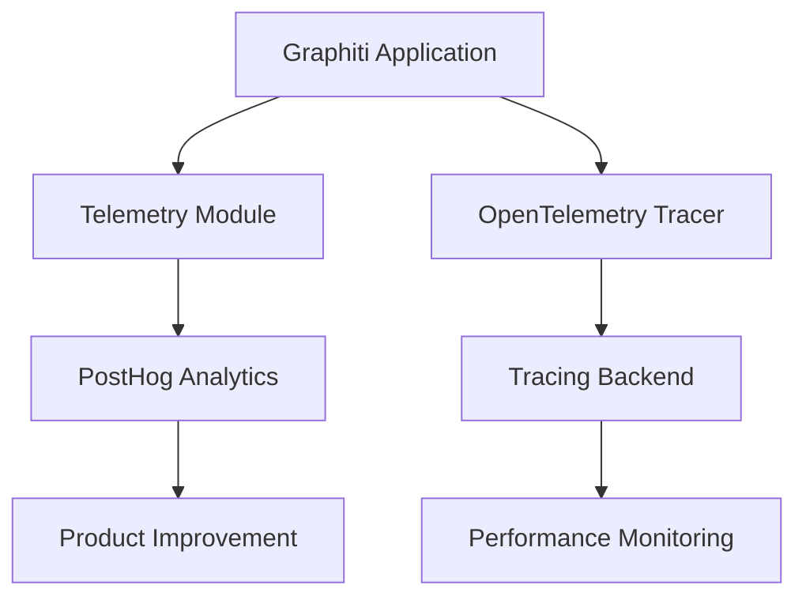
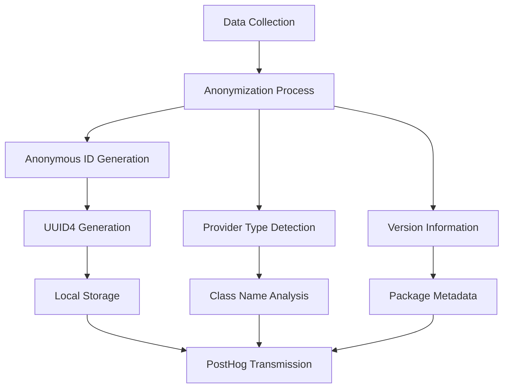
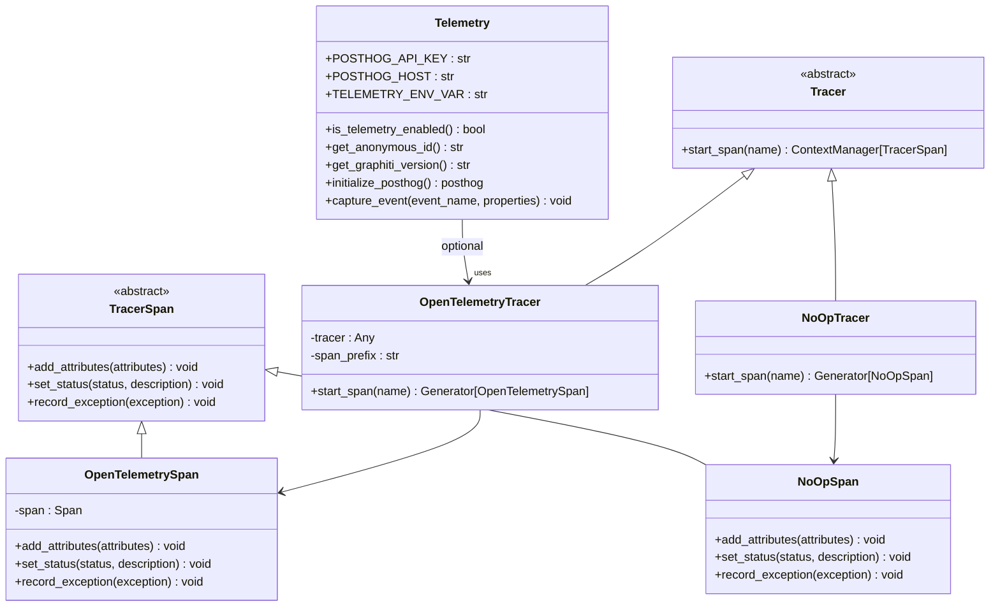
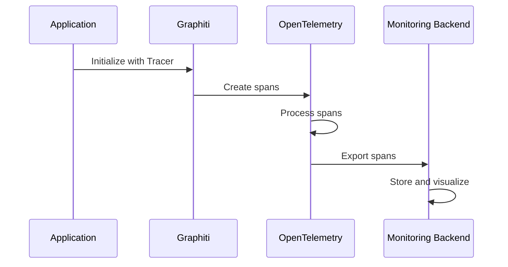

# Telemetry and Monitoring

<cite>
**Referenced Files in This Document**   
- [telemetry.py](file://graphiti_core/telemetry/telemetry.py)
- [__init__.py](file://graphiti_core/telemetry/__init__.py)
- [graphiti.py](file://graphiti_core/graphiti.py)
- [tracer.py](file://graphiti_core/tracer.py)
- [README.md](file://README.md)
- [otel_stdout_example.py](file://examples/opentelemetry/otel_stdout_example.py)
- [graphiti_mcp_server.py](file://mcp_server/graphiti_mcp_server.py)
</cite>

## Table of Contents
1. [Introduction](#introduction)
2. [Telemetry Data Collection](#telemetry-data-collection)
3. [Implementation with PostHog and OpenTelemetry](#implementation-with-posthog-and-opentelemetry)
4. [Configuration Management](#configuration-management)
5. [Privacy and Data Anonymization](#privacy-and-data-anonymization)
6. [Technical Architecture](#technical-architecture)
7. [Production Monitoring and Data Interpretation](#production-monitoring-and-data-interpretation)
8. [External Monitoring Integration](#external-monitoring-integration)
9. [Compliance and Opt-Out Mechanisms](#compliance-and-opt-out-mechanisms)
10. [Conclusion](#conclusion)

## Introduction
Graphiti's telemetry system is designed to collect anonymous usage statistics to help improve the product while maintaining user privacy and system reliability. The system employs a non-intrusive observer pattern implementation that ensures telemetry operations never disrupt the core functionality of the application. This documentation provides a comprehensive overview of the telemetry architecture, data collection practices, configuration options, privacy considerations, and integration capabilities.

**Section sources**
- [README.md](file://README.md#L580-L630)
- [telemetry.py](file://graphiti_core/telemetry/telemetry.py#L1-L10)

## Telemetry Data Collection
Graphiti's telemetry system collects three primary categories of data: usage patterns, performance metrics, and error reports. Usage patterns include information about the initialization of the Graphiti instance, including the types of LLM providers, embedder providers, reranker providers, and database providers being used. Performance metrics are captured through the OpenTelemetry integration, which provides detailed tracing of operations such as episode addition, bulk operations, and LLM generation. Error reports are collected through the telemetry system's silent error handling, which captures telemetry failures without disrupting application functionality.

The telemetry system captures events such as 'graphiti_initialized' with properties that include provider types, which helps the development team understand how users are configuring and utilizing the system. This data is essential for prioritizing feature development, optimizing performance for commonly used configurations, and ensuring compatibility with various service providers.

**Section sources**
- [graphiti.py](file://graphiti_core/graphiti.py#L236-L256)
- [telemetry.py](file://graphiti_core/telemetry/telemetry.py#L92-L117)

## Implementation with PostHog and OpenTelemetry
Graphiti's telemetry system leverages PostHog for analytics collection and OpenTelemetry for distributed tracing. The PostHog integration is implemented through the telemetry module, which uses a public API key to send anonymous usage data to PostHog's US endpoint. The implementation is designed to be resilient, with silent failure handling that ensures telemetry errors never affect the main application.



**Diagram sources**
- [telemetry.py](file://graphiti_core/telemetry/telemetry.py#L15-L20)
- [tracer.py](file://graphiti_core/tracer.py#L126-L157)

The OpenTelemetry integration provides comprehensive tracing capabilities through the tracer module, which implements an abstract base class for tracers and provides both OpenTelemetry and no-op implementations. This allows users to enable detailed distributed tracing for monitoring and debugging purposes while providing a no-op fallback when OpenTelemetry is not available or configured.

**Section sources**
- [telemetry.py](file://graphiti_core/telemetry/telemetry.py#L76-L89)
- [tracer.py](file://graphiti_core/tracer.py#L52-L194)

## Configuration Management
Telemetry collection in Graphiti can be enabled, disabled, and configured through multiple mechanisms. The primary method is through the `GRAPHITI_TELEMETRY_ENABLED` environment variable, which defaults to 'true' if not specified. Users can disable telemetry by setting this variable to 'false', '0', 'no', or 'off'.

```mermaid
flowchart TD
A[Configuration Methods] --> B[Environment Variable]
A --> C[Python Session]
A --> D[Shell Configuration]
B --> E[GRAPHITI_TELEMETRY_ENABLED=false]
C --> F[os.environ['GRAPHITI_TELEMETRY_ENABLED'] = 'false']
D --> G[Add to .bashrc or .zshrc]
```

**Diagram sources**
- [telemetry.py](file://graphiti_core/telemetry/telemetry.py#L21-L38)
- [README.md](file://README.md#L594-L614)

Telemetry can also be controlled programmatically by setting the environment variable within a Python session before initializing the Graphiti instance. Additionally, users can add the environment variable to their shell configuration files (`.bashrc` or `.zshrc`) for persistent configuration across sessions. The system automatically disables telemetry during test runs when the `pytest` module is detected, ensuring that test executions do not generate telemetry data.

**Section sources**
- [telemetry.py](file://graphiti_core/telemetry/telemetry.py#L31-L37)
- [README.md](file://README.md#L621-L622)

## Privacy and Data Anonymization
Graphiti's telemetry system prioritizes user privacy through several data anonymization techniques. The system generates a random anonymous ID using UUID4 and stores it locally in the user's cache directory (`~/.cache/graphiti/telemetry_anon_id`). This ID is used to distinguish unique users while maintaining anonymity, as it is not tied to any personally identifiable information.

The telemetry system collects only non-sensitive metadata about the usage patterns, such as the types of providers being used (e.g., 'openai', 'neo4j') and the Graphiti version. No user data, content, or application-specific information is collected. All telemetry operations are designed to fail silently, ensuring that even if there are issues with the telemetry system, they will not impact the functionality of the main application.



**Diagram sources**
- [telemetry.py](file://graphiti_core/telemetry/telemetry.py#L40-L63)
- [telemetry.py](file://graphiti_core/telemetry/telemetry.py#L65-L73)

**Section sources**
- [telemetry.py](file://graphiti_core/telemetry/telemetry.py#L40-L63)

## Technical Architecture
The telemetry module in Graphiti is implemented using a non-intrusive observer pattern that ensures telemetry operations are completely decoupled from the core functionality. The architecture consists of several key components: the telemetry module for analytics collection, the tracer module for distributed tracing, and the integration points throughout the codebase where these services are utilized.



**Diagram sources**
- [telemetry.py](file://graphiti_core/telemetry/telemetry.py#L1-L118)
- [tracer.py](file://graphiti_core/tracer.py#L42-L194)

The telemetry module provides a simple interface with the `capture_event` function that can be called from anywhere in the codebase to record usage events. The tracer module implements an abstract base class pattern that allows for pluggable tracing backends, with OpenTelemetry being the primary implementation. This architecture ensures that telemetry and tracing are optional features that do not introduce dependencies or performance overhead when not in use.

**Section sources**
- [telemetry.py](file://graphiti_core/telemetry/telemetry.py#L1-L118)
- [tracer.py](file://graphiti_core/tracer.py#L42-L194)

## Production Monitoring and Data Interpretation
For production deployments, Graphiti provides comprehensive monitoring capabilities through its OpenTelemetry integration. The system captures detailed traces of key operations, including episode addition, bulk operations, and LLM generation, which can be used to identify performance bottlenecks and optimize system configuration.

The telemetry data can be interpreted to understand usage patterns, such as which provider combinations are most popular, how frequently the system is being initialized, and which features are being used most extensively. This information is invaluable for both users who want to optimize their deployments and for the development team to prioritize improvements.

When monitoring production deployments, users should focus on the span duration, error rates, and attribute data captured in the traces. The hierarchical structure of spans (e.g., `graphiti.add_episode` containing `llm.generate` spans) provides insight into the performance characteristics of different components and their interactions.

**Section sources**
- [graphiti.py](file://graphiti_core/graphiti.py#L691-L692)
- [llm_client/openai_base_client.py](file://graphiti_core/llm_client/openai_base_client.py#L188-L189)

## External Monitoring Integration
Graphiti can be integrated with external monitoring systems through its OpenTelemetry support. The OpenTelemetry example demonstrates how to configure Graphiti to output trace spans to stdout, but the same principles apply to exporting to various monitoring backends such as Jaeger, Zipkin, Prometheus, or commercial APM solutions.



**Diagram sources**
- [otel_stdout_example.py](file://examples/opentelemetry/otel_stdout_example.py#L40-L46)
- [tracer.py](file://graphiti_core/tracer.py#L159-L193)

To integrate with external monitoring systems, users need to configure the OpenTelemetry SDK with the appropriate exporter for their chosen backend. The Graphiti instance is then initialized with the OpenTelemetry tracer, which automatically captures relevant spans for key operations. This approach provides seamless integration with existing monitoring infrastructure without requiring changes to the application logic.

**Section sources**
- [otel_stdout_example.py](file://examples/opentelemetry/otel_stdout_example.py#L1-L126)
- [tracer.py](file://graphiti_core/tracer.py#L159-L193)

## Compliance and Opt-Out Mechanisms
Graphiti provides multiple opt-out mechanisms to ensure compliance with privacy regulations and user preferences. The primary opt-out mechanism is the `GRAPHITI_TELEMETRY_ENABLED` environment variable, which gives users explicit control over telemetry collection. Users can disable telemetry at the system level, session level, or shell configuration level.

The system automatically disables telemetry during test runs to prevent the collection of data from development and testing environments. This automatic opt-out ensures that telemetry data reflects only production usage patterns.

All telemetry operations are designed with privacy compliance in mind, collecting only anonymous usage statistics that cannot be traced back to individual users or organizations. The data collection practices are transparently documented, and users have complete control over whether to participate in telemetry.

**Section sources**
- [telemetry.py](file://graphiti_core/telemetry/telemetry.py#L31-L37)
- [README.md](file://README.md#L621-L622)

## Conclusion
Graphiti's telemetry and monitoring system provides a comprehensive solution for understanding usage patterns, optimizing performance, and ensuring system reliability while maintaining user privacy. The architecture combines PostHog for anonymous usage analytics with OpenTelemetry for detailed distributed tracing, offering both high-level product insights and low-level performance monitoring.

The system is designed with non-intrusiveness as a core principle, ensuring that telemetry operations never disrupt the main application functionality. Multiple configuration options and opt-out mechanisms give users complete control over data collection, while the anonymization techniques protect user privacy.

By leveraging these telemetry and monitoring capabilities, users can gain valuable insights into their Graphiti deployments, optimize performance, and contribute to the ongoing improvement of the platform while maintaining compliance with privacy requirements.