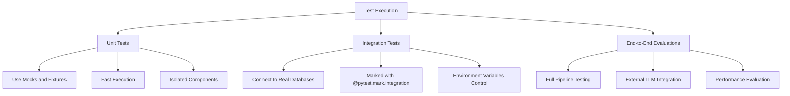
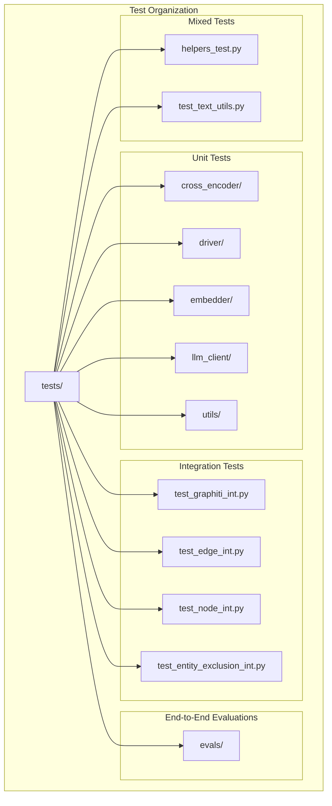
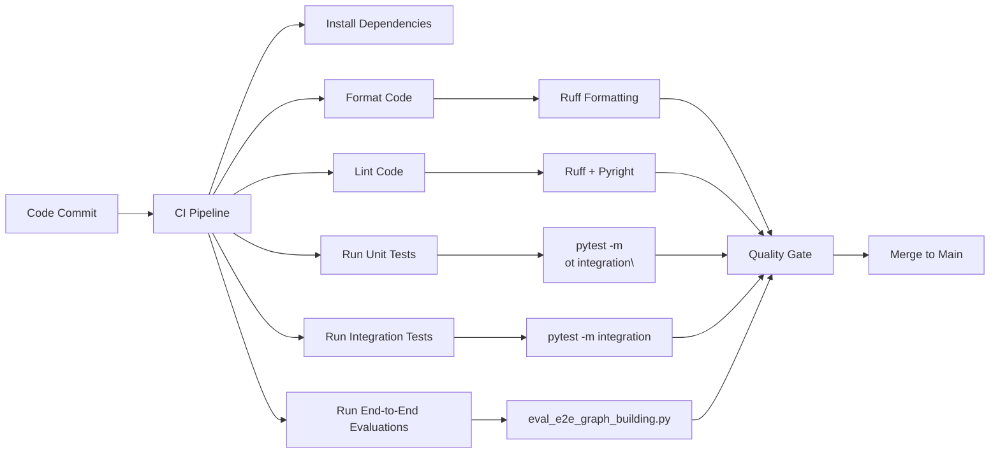

# Testing and Development

<cite>
**Referenced Files in This Document**   
- [CONTRIBUTING.md](file://CONTRIBUTING.md)
- [pytest.ini](file://pytest.ini)
- [pyproject.toml](file://pyproject.toml)
- [Makefile](file://Makefile)
- [docker-compose.test.yml](file://docker-compose.test.yml)
- [AGENTS.md](file://AGENTS.md)
- [CLAUDE.md](file://CLAUDE.md)
- [conftest.py](file://conftest.py)
- [tests/helpers_test.py](file://tests/helpers_test.py)
- [tests/test_graphiti_mock.py](file://tests/test_graphiti_mock.py)
- [tests/test_graphiti_int.py](file://tests/test_graphiti_int.py)
- [tests/evals/eval_e2e_graph_building.py](file://tests/evals/eval_e2e_graph_building.py)
- [graphiti_core/llm_client/client.py](file://graphiti_core/llm_client/client.py)
- [graphiti_core/embedder/openai.py](file://graphiti_core/embedder/openai.py)
- [graphiti_core/driver/driver.py](file://graphiti_core/driver/driver.py)
- [graphiti_core/search/search.py](file://graphiti_core/search/search.py)
</cite>

## Table of Contents
1. [Development Environment Setup](#development-environment-setup)
2. [Testing Framework and Strategies](#testing-framework-and-strategies)
3. [Test Suite Organization](#test-suite-organization)
4. [Component-Specific Testing](#component-specific-testing)
5. [End-to-End Evaluations](#end-to-end-evaluations)
6. [Contribution Guidelines](#contribution-guidelines)
7. [CI/CD Pipeline and Quality Gates](#cicd-pipeline-and-quality-gates)
8. [Best Practices for Testing and Debugging](#best-practices-for-testing-and-debugging)

## Development Environment Setup

To set up the development environment for Graphiti, follow these steps:

1. **Fork and clone the repository**:
   ```bash
   git clone https://github.com/getzep/graphiti
   cd graphiti
   ```

2. **Install dependencies** using uv (a fast Python package installer and resolver):
   ```bash
   make install
   ```
   This command runs `uv sync --extra dev` to install all development dependencies specified in `pyproject.toml`.

3. **Set up environment variables** for integration testing:
   ```bash
   export TEST_OPENAI_API_KEY=...
   export TEST_OPENAI_MODEL=...
   export TEST_ANTHROPIC_API_KEY=...
   
   # For Neo4j integration tests
   export TEST_URI=neo4j://...
   export TEST_USER=...
   export TEST_PASSWORD=...
   ```

4. **Run local services** for integration testing using Docker Compose:
   ```bash
   docker-compose -f docker-compose.test.yml up
   ```
   This command provisions Neo4j and other required services for integration testing.

The project uses Python 3.10+ and relies on several tools for code quality:
- **Ruff**: For linting and formatting
- **Pyright**: For static type checking
- **Pytest**: For testing

Code style follows PEP 8 guidelines with 4-space indentation and 100-character line length, as configured in `pyproject.toml`.

**Section sources**
- [CONTRIBUTING.md](file://CONTRIBUTING.md#L48-L75)
- [AGENTS.md](file://AGENTS.md#L6-L12)
- [CLAUDE.md](file://CLAUDE.md#L17-L35)
- [Makefile](file://Makefile#L14-L15)
- [docker-compose.test.yml](file://docker-compose.test.yml)

## Testing Framework and Strategies

Graphiti uses a comprehensive testing framework built on pytest with several specialized testing strategies. The test configuration is defined in `pytest.ini` and `pyproject.toml`, with custom configuration in `conftest.py`.

The framework supports both unit and integration testing, with integration tests marked using the `integration` marker defined in `pytest.ini`:

```ini
[pytest]
markers =
    integration: marks tests as integration tests
asyncio_default_fixture_loop_scope = function
asyncio_mode = auto
```

Testing strategies include:

- **Unit testing**: Tests individual components in isolation using mocks and fixtures
- **Integration testing**: Tests components with actual database connections
- **End-to-end evaluation**: Comprehensive testing of the entire graph building pipeline

The test suite uses pytest fixtures extensively, particularly in `conftest.py`, which defines:
- Database driver fixtures for multiple graph databases (Neo4j, FalkorDB, Kuzu, Neptune)
- Mock objects for external services (LLM clients, embedders)
- Test data and utility functions

Integration tests are selectively disabled based on environment variables (e.g., `DISABLE_NEO4J`, `DISABLE_FALKORDB`) to allow flexible test execution depending on available resources.



**Diagram sources**
- [pytest.ini](file://pytest.ini#L1-L6)
- [conftest.py](file://conftest.py#L33-L67)
- [CLAUDE.md](file://CLAUDE.md#L91-L93)

**Section sources**
- [pytest.ini](file://pytest.ini#L1-L6)
- [conftest.py](file://conftest.py#L1-L314)
- [pyproject.toml](file://pyproject.toml#L59-L61)

## Test Suite Organization

The test suite is organized in a modular structure under the `tests/` directory, with subdirectories corresponding to the main components of the system:

```
tests/
├── cross_encoder/
├── driver/
├── embedder/
├── evals/
├── llm_client/
├── utils/
├── helpers_test.py
├── test_edge_int.py
├── test_entity_exclusion_int.py
├── test_graphiti_int.py
├── test_graphiti_mock.py
├── test_node_int.py
└── test_text_utils.py
```

### Unit Tests

Unit tests are located in component-specific directories and focus on testing individual functions and classes in isolation. They use mocking to isolate the component being tested from its dependencies. Examples include:

- `tests/llm_client/test_client.py`: Tests for the LLM client base functionality
- `tests/embedder/test_openai.py`: Tests for the OpenAI embedder client
- `tests/utils/search/search_utils_test.py`: Tests for search utility functions

### Integration Tests

Integration tests are identified by the `_int` suffix in their filenames and require external services to be available. They test the interaction between components and real database connections. Examples include:

- `tests/test_graphiti_int.py`: Integration tests for the main Graphiti class
- `tests/llm_client/test_anthropic_client_int.py`: Integration tests for the Anthropic LLM client
- `tests/driver/test_falkordb_driver.py`: Integration tests for the FalkorDB driver

### End-to-End Evaluations

The `tests/evals/` directory contains comprehensive evaluation scripts that test the entire graph building pipeline:

- `eval_e2e_graph_building.py`: End-to-end evaluation of graph building performance
- `eval_cli.py`: Command-line interface for running evaluations

These evaluations use real LLM calls and database interactions to measure the quality and performance of the graph building process.



**Diagram sources**
- [tests](file://tests)
- [CONTRIBUTING.md](file://CONTRIBUTING.md#L189-L192)

**Section sources**
- [tests](file://tests)
- [CONTRIBUTING.md](file://CONTRIBUTING.md#L188-L192)

## Component-Specific Testing

### Driver Testing

Database drivers are tested in the `tests/driver/` directory, with integration tests that verify connectivity and query execution against real database instances. The test suite supports multiple graph databases:

- Neo4j
- FalkorDB
- Kuzu
- Neptune

The `conftest.py` file defines fixtures that create driver instances for each supported database, allowing tests to be run against multiple backends. Integration tests are skipped for databases that are disabled via environment variables.

```python
# Example from conftest.py
drivers: list[GraphProvider] = []
if os.getenv('DISABLE_NEO4J') is None:
    try:
        from graphiti_core.driver.neo4j_driver import Neo4jDriver
        drivers.append(GraphProvider.NEO4J)
    except ImportError:
        raise
```

**Section sources**
- [conftest.py](file://conftest.py#L33-L67)
- [tests/driver/test_falkordb_driver.py](file://tests/driver/test_falkordb_driver.py)

### LLM Client Testing

LLM clients are tested in the `tests/llm_client/` directory, with both unit and integration tests:

- **Unit tests**: Use mocking to test the client interface without making actual API calls
- **Integration tests**: Make real API calls to LLM providers (marked with `_int` suffix)

The test suite includes tests for:
- OpenAI client
- Anthropic client
- Gemini client
- Generic OpenAI-compatible clients

```python
# Example from test_client.py
class MockLLMClient(LLMClient):
    """Concrete implementation of LLMClient for testing"""
    
    async def _generate_response(self, messages, response_model=None):
        return {'content': 'test'}
```

**Section sources**
- [tests/llm_client/test_client.py](file://tests/llm_client/test_client.py#L17-L27)
- [tests/llm_client/test_anthropic_client.py](file://tests/llm_client/test_anthropic_client.py)
- [tests/llm_client/test_anthropic_client_int.py](file://tests/llm_client/test_anthropic_client_int.py)

### Embedder Testing

Embedder clients are tested in the `tests/embedder/` directory, with a focus on:
- Correct API calls to embedding providers
- Proper handling of batch requests
- Accurate processing of embedding responses

The tests use mocking to verify that the embedder clients make the correct API calls with the expected parameters:

```python
# Example from test_openai.py
@patch('openai.AsyncOpenAI')
def test_create_calls_api_correctly(mock_client, openai_embedder, mock_openai_response):
    mock_client.embeddings.create.return_value = mock_openai_response
    result = await openai_embedder.create('Test input')
    
    # Verify API is called with correct parameters
    mock_client.embeddings.create.assert_called_once()
    _, kwargs = mock_client.embeddings.create.call_args
    assert kwargs['model'] == DEFAULT_EMBEDDING_MODEL
    assert kwargs['input'] == 'Test input'
```

**Section sources**
- [tests/embedder/test_openai.py](file://tests/embedder/test_openai.py#L77-L95)
- [tests/embedder/embedder_fixtures.py](file://tests/embedder/embedder_fixtures.py)

### Search Functionality Testing

Search functionality is tested through both direct unit tests and integration tests that verify the end-to-end search pipeline. The search system combines multiple retrieval methods:

- Semantic similarity search
- Keyword (BM25) search
- Graph traversal
- Hybrid ranking and reranking

Tests verify that search results are correctly filtered, ranked, and returned in the expected format.

**Section sources**
- [tests/test_graphiti_mock.py](file://tests/test_graphiti_mock.py#L29-L48)
- [graphiti_core/search/search.py](file://graphiti_core/search/search.py)

## End-to-End Evaluations

The `tests/evals/` directory contains comprehensive evaluation scripts that test the complete graph building pipeline from raw text input to structured knowledge graph. The primary evaluation script is `eval_e2e_graph_building.py`, which:

1. Builds a baseline graph using a reference LLM (gpt-4.1-mini)
2. Builds a candidate graph using the current implementation
3. Compares the quality of both graphs using an LLM-based evaluation

The evaluation process involves:

- Loading the LongMemEval dataset from `tests/evals/data/longmemeval_data/`
- Building subgraphs for multiple users and sessions
- Comparing the baseline and candidate graphs
- Scoring the candidate graph based on its similarity to the baseline

```python
# Example from eval_e2e_graph_building.py
async def eval_graph(multi_session_count: int, session_length: int, llm_client=None) -> float:
    # Load baseline results
    with open('baseline_graph_results.json') as file:
        baseline_results_raw = json.load(file)
        baseline_results: dict[str, list[AddEpisodeResults]] = {
            key: [AddEpisodeResults(**item) for item in value]
            for key, value in baseline_results_raw.items()
        }
    
    # Build candidate graph
    add_episode_results, add_episode_context = await build_graph(
        'candidate', multi_session_count, session_length, graphiti
    )
    
    # Evaluate using LLM
    for baseline_result, add_episode_result, episodes in zip(
        baseline_results[user_id],
        add_episode_results[user_id],
        add_episode_context[user_id],
        strict=False,
    ):
        context = {
            'baseline': baseline_result,
            'candidate': add_episode_result,
            'message': episodes[0],
            'previous_messages': episodes[1:],
        }
        
        llm_response = await llm_client.generate_response(
            prompt_library.eval.eval_add_episode_results(context),
            response_model=EvalAddEpisodeResults,
        )
```

The evaluation uses a scoring system where each user's graph is scored based on the proportion of episodes where the candidate graph performs as well as or better than the baseline.

**Section sources**
- [tests/evals/eval_e2e_graph_building.py](file://tests/evals/eval_e2e_graph_building.py#L1-L181)
- [tests/evals/eval_cli.py](file://tests/evals/eval_cli.py)

## Contribution Guidelines

Contributions to Graphiti are welcome through several pathways:

1. **Pick up existing issues**: Work on issues tagged with "help wanted" or "good first issue"
2. **Create your own tickets**: Report bugs or request features through the GitHub issue tracker
3. **Share use cases**: Contribute examples of how you're using Graphiti
4. **Help others**: Participate in the Discord community to answer questions

### Pull Request Requirements

When submitting a pull request, ensure that:

- The changes are as concise as possible
- Major architectural changes (>500 LOC) are discussed in a GitHub issue first
- All tests pass and there are no linting errors
- Documentation is updated if functionality changes
- The PR includes a clear description and links to relevant issues

### Branching Strategy

The recommended workflow is:

1. Fork the repository
2. Create a new branch for your changes:
   ```bash
   git checkout -b your-branch-name
   ```
3. Make your changes and write/update tests
4. Run all checks:
   ```bash
   make check
   ```
5. Commit with a clear message and push to your fork
6. Submit a pull request to the main repository

### Code Review Process

The code review process emphasizes:

- **Technical design**: Ensuring changes align with the overall architecture
- **Code quality**: Checking for adherence to style guidelines and best practices
- **Test coverage**: Verifying that new functionality is properly tested
- **Documentation**: Confirming that changes are documented appropriately

Large changes require an RFC (Request for Comments) issue to discuss the technical design before implementation.

**Section sources**
- [CONTRIBUTING.md](file://CONTRIBUTING.md#L9-L116)
- [AGENTS.md](file://AGENTS.md#L20-L22)

## CI/CD Pipeline and Quality Gates

The CI/CD pipeline for Graphiti enforces several quality gates to maintain code quality:

### Build and Test Commands

The Makefile defines several commands for development and CI:

```makefile
.PHONY: install format lint test all check

# Install dependencies
install:
	$(UV) sync --extra dev

# Format code
format:
	$(RUFF) check --select I --fix
	$(RUFF) format

# Lint code
lint:
	$(RUFF) check
	$(PYRIGHT) ./graphiti_core 

# Run tests
test:
	DISABLE_FALKORDB=1 DISABLE_KUZU=1 DISABLE_NEPTUNE=1 $(PYTEST) -m "not integration"

# Run format, lint, and test
check: format lint test
```

The `make check` command is the primary quality gate, running formatting, linting, and testing in sequence.

### Quality Gates

The CI pipeline enforces the following quality gates:

1. **Formatting**: Code must conform to the Ruff formatting rules
2. **Linting**: Code must pass Ruff and Pyright checks
3. **Testing**: All unit tests must pass
4. **Integration testing**: Integration tests are run in a separate CI job with database services available

### Parallel Test Execution

The test suite supports parallel execution using pytest-xdist, which can significantly reduce test execution time:

```bash
# Run tests in parallel
pytest -n auto
```

This is particularly beneficial for the integration test suite, which can be time-consuming due to database interactions.



**Diagram sources**
- [Makefile](file://Makefile#L1-L33)
- [pyproject.toml](file://pyproject.toml#L59-L61)

**Section sources**
- [Makefile](file://Makefile#L1-L33)
- [pyproject.toml](file://pyproject.toml#L39-L64)

## Best Practices for Testing and Debugging

### Writing Effective Tests

When writing tests for Graphiti, follow these best practices:

1. **Test one thing at a time**: Each test should verify a single behavior
2. **Use descriptive test names**: Follow the pattern `test_<behavior>`
3. **Use fixtures for setup**: Leverage pytest fixtures to reduce code duplication
4. **Mock external dependencies**: Isolate the component being tested
5. **Test edge cases**: Include tests for error conditions and boundary cases

### Debugging Common Issues

Common issues and their debugging strategies:

- **Database connection failures**: Verify environment variables and ensure database services are running
- **LLM API errors**: Check API keys and rate limits
- **Test failures in specific databases**: Some tests are skipped for certain databases (e.g., FalkorDB) due to known issues
- **Type checking errors**: Run `make lint` to identify and fix type issues

### Tips for Effective Development

1. **Run tests frequently**: Use `make test` to run the test suite regularly
2. **Use selective testing**: Run specific tests during development:
   ```bash
   # Run a specific test file
   pytest tests/test_graphiti_mock.py
   
   # Run a specific test function
   pytest tests/test_graphiti_mock.py::test_add_bulk
   ```
3. **Enable logging**: Use the logging setup in integration tests to debug issues:
   ```python
   def setup_logging():
       logger = logging.getLogger()
       logger.setLevel(logging.INFO)
       console_handler = logging.StreamHandler(sys.stdout)
       console_handler.setLevel(logging.INFO)
       formatter = logging.Formatter('%(asctime)s - %(name)s - %(levelname)s - %(message)s')
       console_handler.setFormatter(formatter)
       logger.addHandler(console_handler)
       return logger
   ```

4. **Use the mock testing pattern**: For complex components, use the mock pattern demonstrated in `test_graphiti_mock.py` with mock LLM clients, embedders, and cross-encoder clients.

**Section sources**
- [tests/test_graphiti_mock.py](file://tests/test_graphiti_mock.py#L72-L116)
- [tests/test_graphiti_int.py](file://tests/test_graphiti_int.py#L32-L50)
- [AGENTS.md](file://AGENTS.md#L17-L18)